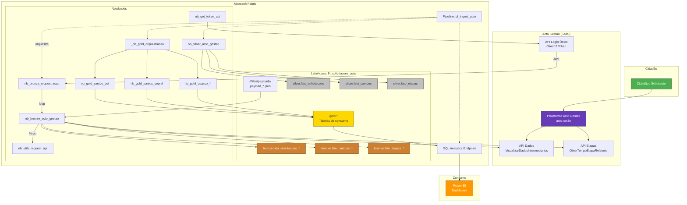
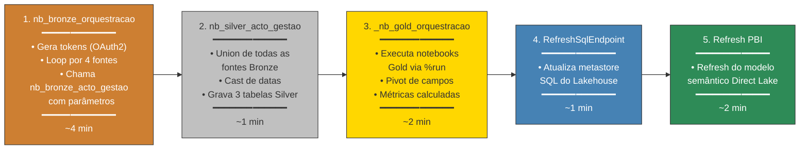
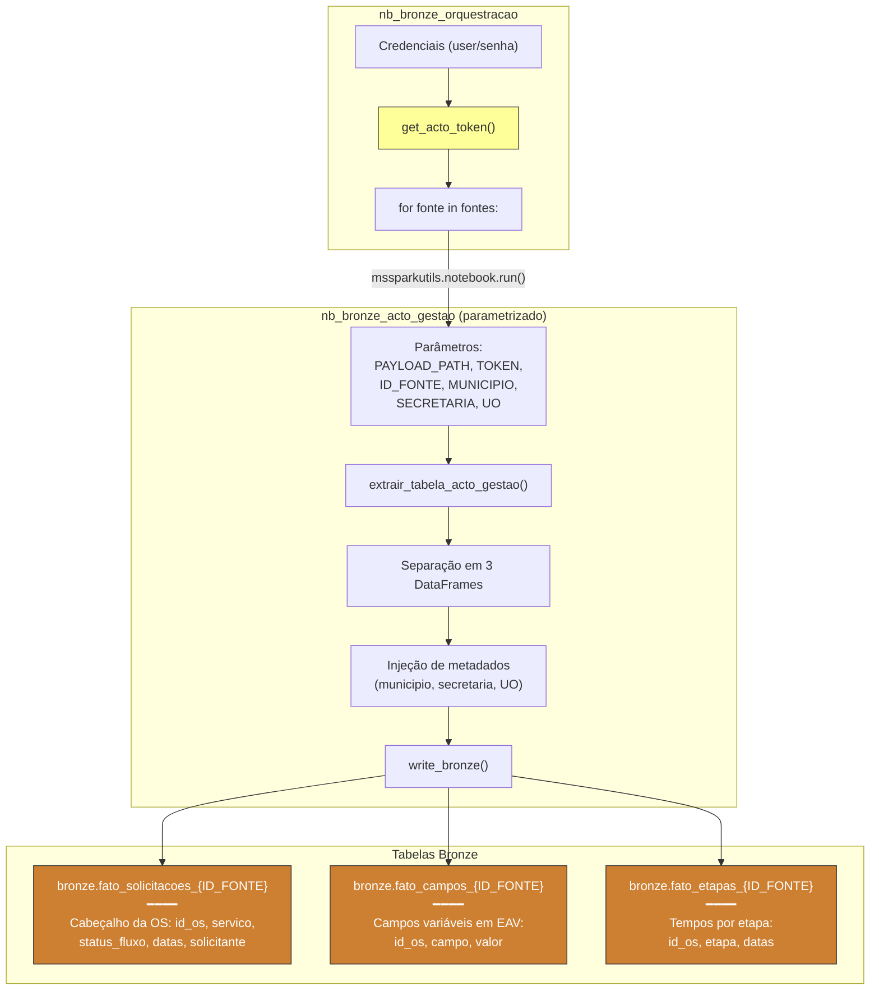
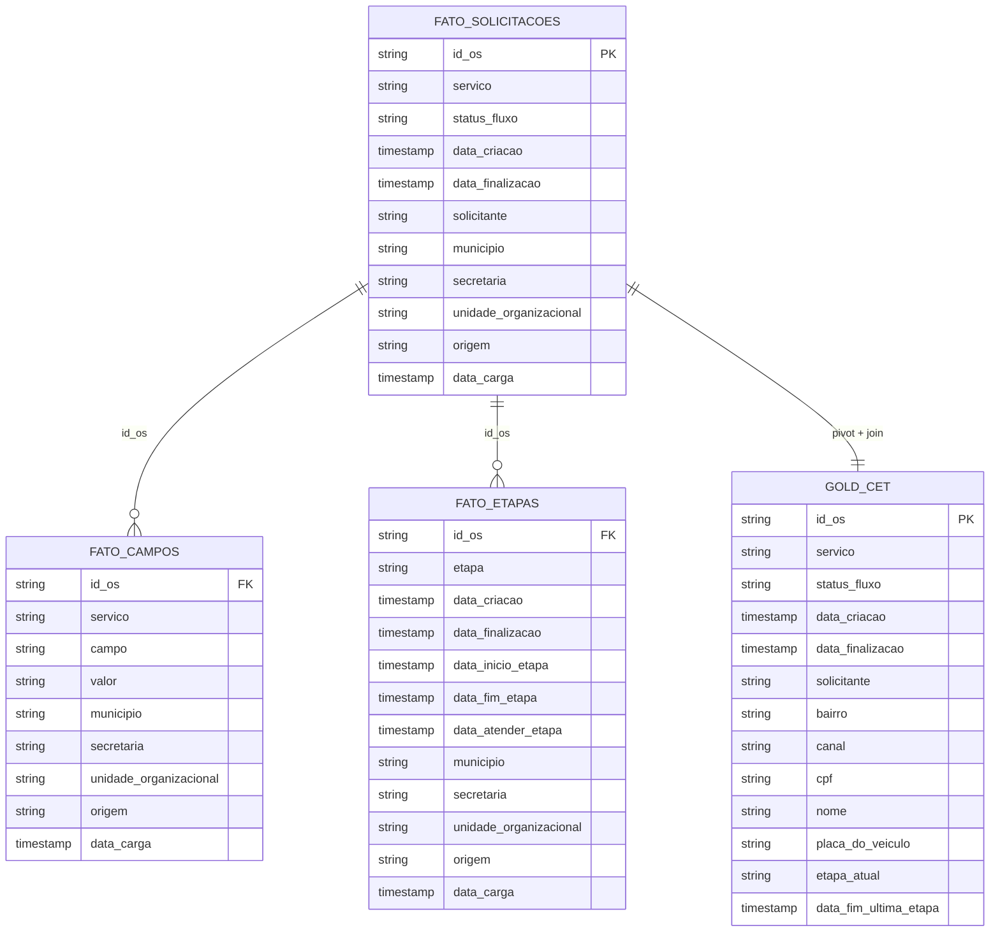
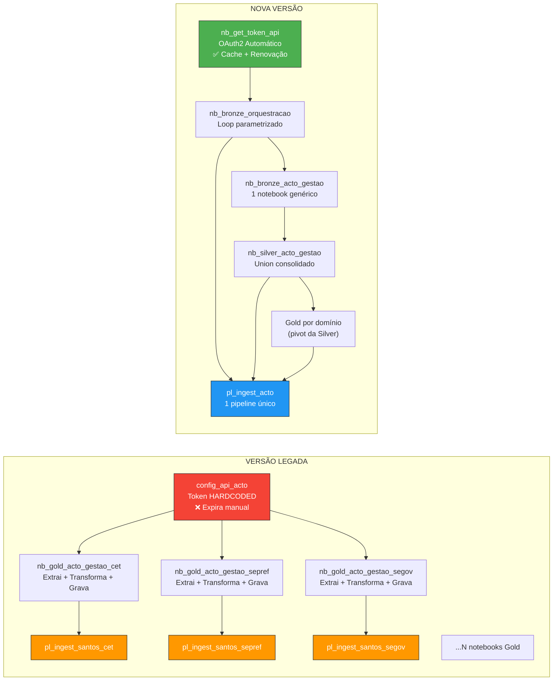
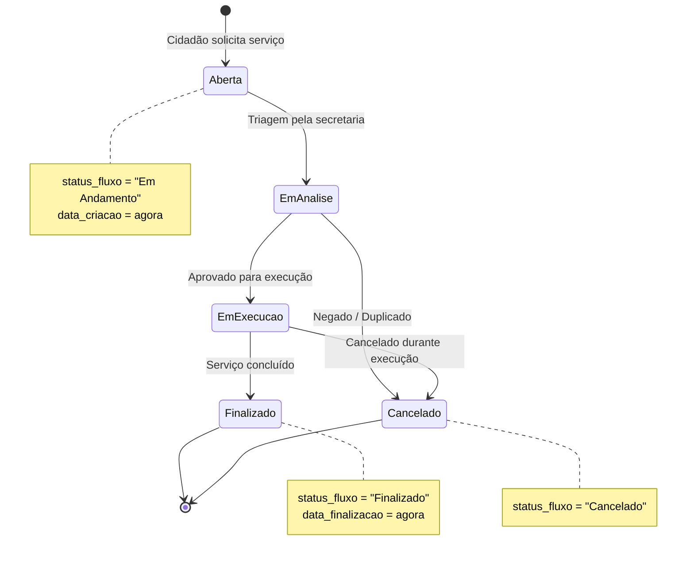
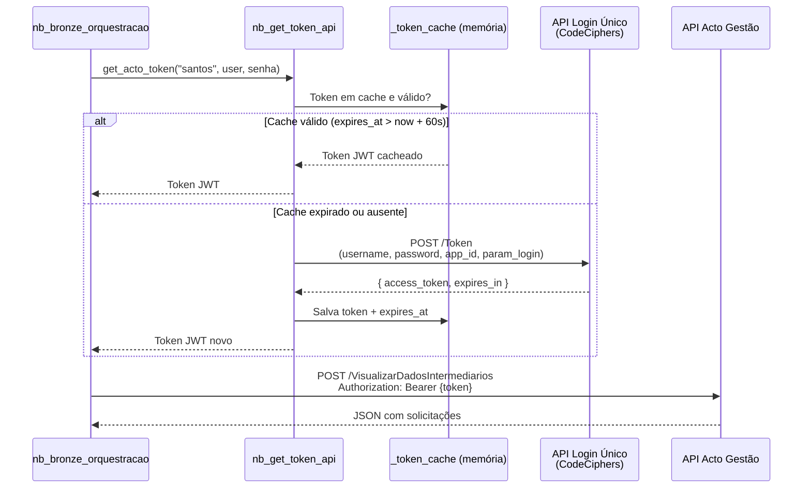
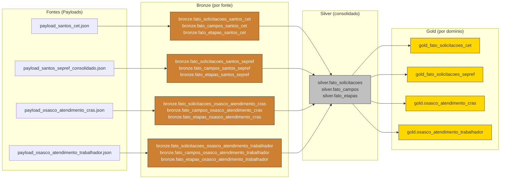
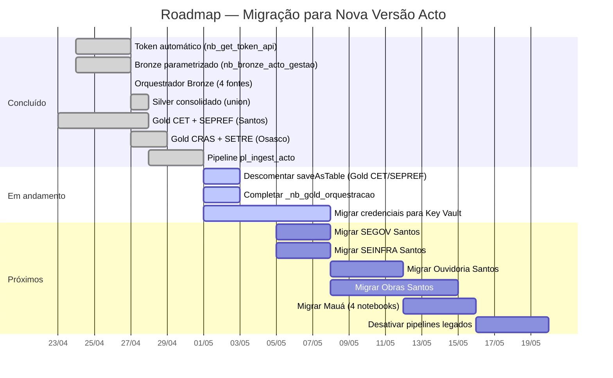
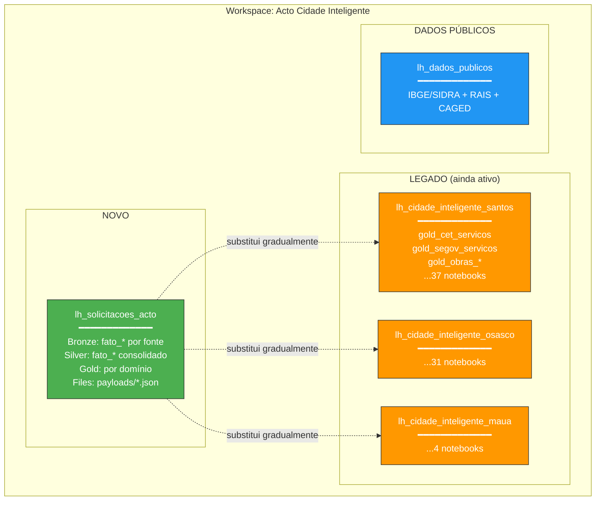

# Diagramas — Módulo Acto (Nova Versão)

> Todos os diagramas em formato Mermaid para uso em Obsidian, GitHub ou qualquer renderer Mermaid.  
> **Atualizado:** 2026-05-01

---

## 1. Arquitetura Geral — Visão Completa

---

## 2. Pipeline `pl_ingest_acto` — Fluxo de Execução

---

## 3. Fluxo de Dados Bronze — Detalhamento

---

## 4. Modelo de Dados (Estrela) — Silver & Gold

---

## 5. Comparativo: Versão Legada vs. Nova Versão

---

## 6. Ciclo de Vida da Solicitação (Business Flow)

---

## 7. Fluxo de Autenticação OAuth2

---

## 8. Mapa de Fontes e Tabelas

---

## 9. Roadmap de Migração (Legado → Nova Versão)

---

## 10. Topologia de Lakehouses

