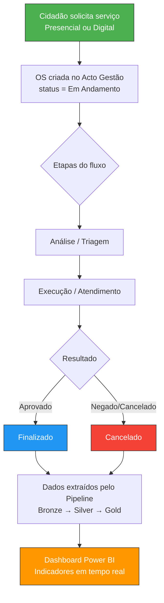

# Documentação de Negócio — Módulo Acto (Nova Versão)

> **Documento canônico atual:** [DOCUMENTACAO_UNICA_ACTO.md](DOCUMENTACAO_UNICA_ACTO.md)
>
> Esta página segue útil para contexto de negócio, mas a consolidação de arquitetura, estado validado e migração de Santos foi reunida na documentação única.

> **Projeto:** Acto Cidade Inteligente  
> **Módulo:** Solicitações de Gestão Municipal  
> **Municípios Ativos:** Santos, Osasco  
> **Atualizado:** 2026-05-01  

---

## 1. Contexto de Negócio

O módulo **Acto** é o coração do sistema de gestão municipal do projeto Cidade Inteligente. Ele coleta, organiza e disponibiliza para análise todas as **solicitações de serviço** feitas pelos cidadãos e processadas pelas secretarias municipais.

### O que é uma "Solicitação"?

Uma solicitação é qualquer pedido feito por um cidadão (ou agente interno) a uma secretaria municipal. Exemplos:

- Pedido de **credencial de estacionamento para idoso** (CET Santos)
- **Licenciamento de veículo** ou autorização de carga/descarga (CET Santos)
- **Fiscalização de imóvel** ou licença de construção (SEPREF Santos)
- **Atendimento social no CRAS** (Osasco)
- **Encaminhamento ao mercado de trabalho** (SETRE Osasco)

Cada solicitação passa por **etapas** (análise → execução → finalização) e tem campos específicos do domínio (bairro, CPF, placa de veículo, etc.).

---

## 2. Secretarias e Domínios Ativos

### 2.1 Santos

| Secretaria | Sigla | Domínio | Exemplos de Serviços |
| :--- | :--- | :--- | :--- |
| **Companhia de Engenharia de Tráfego** | CET | Trânsito e Mobilidade | Credencial para Idoso, Credencial para PcD, Carga e Descarga, Estudo de Tráfego |
| **Secretaria de Planejamento e Regulação da Edificação e Fiscalização** | SEPREF | Urbanismo e Fiscalização | Licença de Construção, Fiscalização de Obra, Alvará, Agendamento |

### 2.2 Osasco

| Secretaria | Sigla | Domínio | Exemplos de Serviços |
| :--- | :--- | :--- | :--- |
| **Secretaria de Assistência Social** | SAS | Assistência Social | Atendimento CRAS, Acolhimento, CadÚnico, Encaminhamento |
| **Secretaria de Trabalho e Renda** | SETRE | Emprego e Renda | Atendimento ao Trabalhador, Encaminhamento para Vagas, Qualificação |

---

## 3. Indicadores de Negócio

### 3.1 Indicadores por Secretaria

#### CET (Santos) — Trânsito e Mobilidade

| Indicador | Definição | Uso no Dashboard |
| :--- | :--- | :--- |
| **Volume de atendimentos** | Total de OS abertas no período | Cartão KPI principal — volumetria do serviço |
| **Distribuição por serviço** | % de OS por tipo (credencial idoso, carga/descarga, etc.) | Gráfico de rosca — perfil de demanda |
| **Distribuição por canal** | Presencial vs. Digital | Barras — digitalização do atendimento |
| **Tempo de atendimento** | Diferença entre `data_criacao` e `data_finalizacao` | Histograma — eficiência do processo |
| **Distribuição por bairro** | Contagem de OS por bairro | Mapa de calor — demanda geográfica |
| **Status do backlog** | OS abertas vs. finalizadas vs. canceladas | Funil — saúde do processo |
| **Etapa atual** | Última etapa registrada por OS | Tabela de acompanhamento — onde cada OS está |

#### SEPREF (Santos) — Urbanismo e Fiscalização

| Indicador | Definição | Uso no Dashboard |
| :--- | :--- | :--- |
| **Volume de licenças** | Total de solicitações de licença/alvará | KPI — carga da secretaria |
| **Distribuição geográfica** | OS por `bairro_ocorrencia` e `bairro_interessado` | Mapa — concentração de obras/fiscalizações |
| **Canal de entrada** | Presencial vs. Digital | Barras — nível de digitalização |
| **Tempo de tramitação** | Abertura → Finalização | Indicador de agilidade regulatória |

#### CRAS (Osasco) — Assistência Social

| Indicador | Definição | Uso no Dashboard |
| :--- | :--- | :--- |
| **Volume de atendimentos** | Total de OS processadas | KPI — demanda social |
| **Perfil do serviço** | Distribuição por tipo de atendimento | Rosca — composição da demanda |
| **Status de resolução** | Finalizado / Em andamento / Cancelado | Funil de atendimento |

#### SETRE (Osasco) — Emprego e Renda

| Indicador | Definição | Uso no Dashboard |
| :--- | :--- | :--- |
| **Volume de atendimentos** | Total de trabalhadores atendidos | KPI — escala do programa |
| **Demanda por tipo** | Campos `demanda_*` (encaminhamento, qualificação, etc.) | Barras empilhadas — perfil de necessidades |
| **Tempo de atendimento** | `tempo_atendimento_minutos` calculado | Box plot — eficiência |

---

## 4. Perguntas de Negócio que o Dashboard Deve Responder

### Nível Executivo (Prefeito / Secretário)

| Pergunta | Tabela Gold | Campo(s) |
| :--- | :--- | :--- |
| Quantos atendimentos foram realizados este mês? | Todas as Gold | `COUNT(id_os)` filtrado por período |
| Qual secretaria tem maior demanda? | `silver.fato_solicitacoes` | `COUNT` por `secretaria` |
| A prefeitura está ficando mais digital? | Todas as Gold | `canal` = Presencial vs. Digital (%) ao longo do tempo |
| Há backlog crescendo em algum setor? | Todas as Gold | `status_fluxo` = "Em andamento" por período |
| Qual o tempo médio de atendimento? | Gold com `data_criacao`/`data_finalizacao` | AVG(`data_finalizacao - data_criacao`) |

### Nível Operacional (Coordenador da Secretaria)

| Pergunta | Tabela Gold | Campo(s) |
| :--- | :--- | :--- |
| Quais serviços têm maior volume de OS? | Gold filtrada | `servico` × `COUNT(id_os)` |
| Quais bairros geram mais demanda? | Gold com `bairro` | `bairro` × `COUNT(id_os)` |
| Quais OS estão paradas em etapa? | Gold com `etapa_atual` | `etapa_atual` × `COUNT` onde `status_fluxo` ≠ Finalizado |
| Qual é o perfil dos solicitantes? | Gold com `canal`, `cpf` | Análise de recorrência (mesmo CPF com N solicitações) |

### Nível Analítico (Equipe de Dados)

| Pergunta | Tabela | Campo(s) |
| :--- | :--- | :--- |
| Quais campos cada secretaria usa? | `silver.fato_campos` | `DISTINCT campo` por `secretaria` |
| Como o SLA por etapa varia entre secretarias? | `silver.fato_etapas` | `data_fim_etapa - data_inicio_etapa` por `etapa` e `secretaria` |
| Há diferença de padrão entre Santos e Osasco? | `silver.fato_solicitacoes` | Comparativo cross-município |

---

## 5. Regras de Negócio

### 5.1 Status de Solicitação

| Status | Significado | Ação no Dashboard |
| :--- | :--- | :--- |
| `Finalizado` | OS concluída com sucesso | Incluir em métricas de throughput |
| `Em Andamento` | OS em processamento por alguma etapa | Backlog ativo — monitorar envelhecimento |
| `Cancelado` | OS cancelada pelo solicitante ou pela secretaria | Excluir de KPIs de produtividade; manter para análise de taxa de cancelamento |

### 5.2 Canal de Atendimento

| Canal | Descrição |
| :--- | :--- |
| `Presencial` | Cidadão foi ao posto de atendimento |
| `Digital` | Solicitação feita via portal ou app |

> [!TIP] Meta de digitalização
> O acompanhamento do % digital ao longo do tempo é um indicador estratégico. O objetivo é reduzir atendimentos presenciais e aumentar os digitais.

### 5.3 Cálculo de Tempo de Atendimento

```
tempo_atendimento = data_finalizacao - data_criacao
```

- Unidade: minutos (para SETRE/Osasco), horas ou dias (para CET/SEPREF)
- **Apenas para OS finalizadas** — OS em andamento não devem entrar na média
- `null` quando `data_finalizacao` é nulo (OS ainda aberta)

### 5.4 Campos Variáveis (EAV)

Cada secretaria tem campos específicos. A tabela `fato_campos` armazena no formato genérico `campo/valor`. Os notebooks Gold fazem o **pivot** para colunas reais, selecionando apenas os campos relevantes para cada domínio.

> [!IMPORTANT] Novos campos
> Quando a API adiciona novos campos a um serviço, eles aparecem automaticamente na Silver (EAV). Para que apareçam no dashboard, basta adicioná-los à lista `CAMPOS_*` no notebook Gold correspondente.

---

## 6. Fluxo de Negócio — Ciclo de Vida de uma Solicitação



---

## 7. Hierarquia Analítica do Dashboard

O painel deve guiar o usuário do macro ao micro:

```
Visão Geral (todas as secretarias)
    ↓ filtro por secretaria
Perfil da Secretaria (KPIs: volume, backlog, tempo médio)
    ↓ filtro por serviço
Detalhe do Serviço (distribuição por bairro, canal, etapa)
    ↓ drill para OS
Lista de OS (tabela com id_os, solicitante, status, etapa atual)
```

### Abas Sugeridas para o Dashboard

| Aba | Filtro | Indicadores |
| :--- | :--- | :--- |
| **Visão Geral** | Todos os municípios | Volume total · % por município · backlog · canal |
| **Santos — CET** | `fonte = santos_cet` | Credenciais emitidas · Carga/descarga · Bairros · Tempo |
| **Santos — SEPREF** | `fonte = santos_sepref` | Licenças · Fiscalizações · Agendamentos · Bairros |
| **Osasco — CRAS** | `municipio = Osasco, servico = ...` | Atendimentos · Perfil · Encaminhamentos |
| **Osasco — SETRE** | `municipio = Osasco, servico = Atendimento ao trabalhador` | Trabalhadores atendidos · Demandas · Tempo |
| **Comparativo** | Cross-município | Ranking de volume · Tempo médio · Digitalização |

---

## 8. Glossário de Negócio

| Termo | Definição |
| :--- | :--- |
| **OS** | Ordem de Serviço — registro individual de uma solicitação no Acto Gestão |
| **Etapa** | Fase do fluxo de trabalho (ex: Triagem, Análise, Execução, Finalização) |
| **Canal** | Meio pelo qual o cidadão fez a solicitação (Presencial / Digital) |
| **Backlog** | Conjunto de OS com status "Em Andamento" que ainda não foram finalizadas |
| **SLA** | Service Level Agreement — tempo máximo aceitável entre abertura e finalização |
| **EAV** | Entity-Attribute-Value — modelo de dados flexível para campos variáveis |
| **Pivot** | Transformação que converte linhas EAV em colunas (ex: campo "bairro" vira coluna `bairro`) |
| **codCatalogo** | Código interno do Acto Gestão que identifica um tipo de serviço |
| **Throughput** | Volume de OS finalizadas por período — indicador de produtividade |
| **Fonte** | Identificador composto `{municipio}_{secretaria}` (ex: `santos_cet`) |

---

## 9. Relação com a Documentação Consolidada (Legado)

A documentação consolidada (`DOCUMENTACAO_CONSOLIDADA_FABRIC.pdf`) mapeia o modelo **legado**, onde:

- Cada secretaria tinha seu próprio notebook Gold (ex: `nb_gold_acto_gestao_cet`, `nb_gold_acto_gestao_sepref`)
- Os tokens eram hardcoded e expiravam manualmente
- Não havia separação Bronze/Silver/Gold normalizada
- Cada notebook fazia extração + transformação + carga em um único fluxo

O **módulo Acto (nova versão)** substitui esse modelo por uma arquitetura **parametrizada e escalável**, onde adicionar novas secretarias ou municípios não requer novos notebooks Bronze/Silver.

### O que a documentação consolidada NÃO cobre (e este documento SIM):

| Tópico | Doc Consolidada | Este Documento |
| :--- | :--- | :--- |
| Token automático OAuth2 | ❌ | ✅ Seção 3 da Doc Técnica |
| Modelo EAV (fato_campos) | ❌ | ✅ Seção 5.4 acima |
| Pipeline unificado `pl_ingest_acto` | ❌ | ✅ Seção 7 da Doc Técnica |
| Lakehouse `lh_solicitacoes_acto` | ❌ | ✅ Todas as seções |
| Orquestração parametrizada | ❌ | ✅ Seção 5 da Doc Técnica |
| Schema Bronze normalizado (3 fatos) | ❌ | ✅ Seção 6 da Doc Técnica |
| Indicadores por secretaria (CRAS, SETRE) | ❌ | ✅ Seção 3 acima |
| Checklist de nova fonte | ❌ | ✅ Seção 13 da Doc Técnica |
