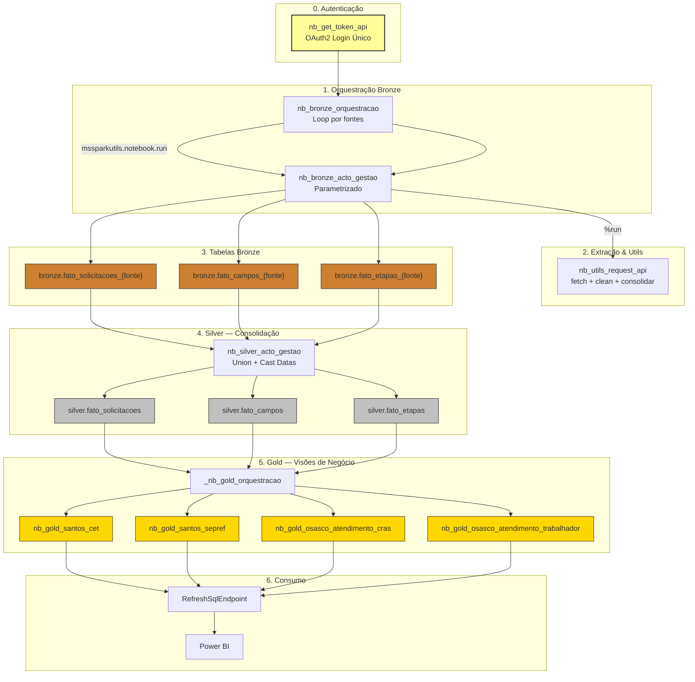
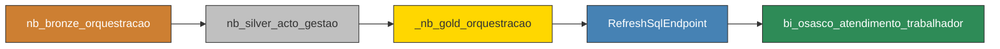
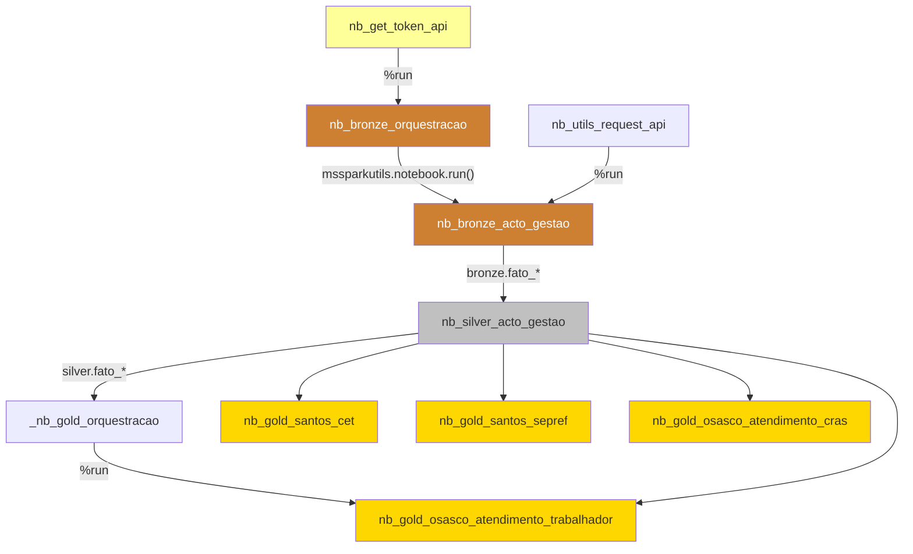

# Documentação Técnica — Módulo Acto (Nova Versão)

> **Documento canônico atual:** [DOCUMENTACAO_UNICA_ACTO.md](DOCUMENTACAO_UNICA_ACTO.md)
>
> Esta página permanece como referência técnica detalhada, mas o estado validado, as divergências com o acervo e o plano de migração ficaram consolidados na documentação única.

> **Lakehouse:** `lh_solicitacoes_acto`  
> **Workspace ID:** `96fe5a53-3a22-4443-8d0a-e2f6d61a2690`  
> **SQL Endpoint:** `lh_solicitacoes_acto`  
> **Pipeline:** `pl_ingest_acto`  
> **Status:** ✅ Em produção (Santos CET, Santos SEPREF, Osasco CRAS, Osasco SETRE)  
> **Atualizado:** 2026-05-01  

---

## 1. Visão Geral — O que Mudou

A pasta **Acto** contém a **nova versão refatorada** do pipeline de solicitações do Acto Gestão. Ela substitui o modelo legado (disperso em `Santos/nbs`, `Osasco/nbs`, etc.) com as seguintes melhorias:

| Aspecto | Versão Legada (Santos/Osasco individuais) | Nova Versão (Acto) |
| :--- | :--- | :--- |
| **Token** | Manual — string hardcoded em `config_api_acto.ipynb`, expirava ~20h | **Automático** — `nb_get_token_api` faz login OAuth2 e cache em memória |
| **Lakehouse** | `lh_cidade_inteligente_santos` (um por município) | `lh_solicitacoes_acto` (unificado) |
| **Modelo de tabelas** | 1 notebook Gold por domínio, cada um com lógica duplicada | **Normalizado em 3 fatos** (solicitações, campos, etapas) reutilizáveis |
| **Nomenclatura** | `nb_gold_acto_gestao_{secretaria}` | `nb_bronze_acto_gestao` (genérico, parametrizado) |
| **Orquestração** | Pipeline individual por secretaria/município | 1 pipeline `pl_ingest_acto` com orquestrador Bronze |
| **Schemas** | `bronze.*` / `silver.*` / `gold.*` com separação via nomes | `bronze.fato_{tipo}_{fonte}` → `silver.fato_{tipo}` → `gold.{municipio}_{dominio}` |
| **Escalabilidade** | Adicionar fonte = novo notebook + pipeline | Adicionar fonte = nova entrada no array `fontes` do orquestrador |

---

## 2. Arquitetura Medallion — Nova Versão



---

## 3. Autenticação Automática de Token

### 3.1 Problema Resolvido

Na versão legada, o `config_api_acto.ipynb` continha tokens JWT **hardcoded** que expiravam em ~20 horas. Quando o token expirava, **todas as pipelines dependentes falhavam silenciosamente** até que alguém atualizasse o token manualmente no notebook.

### 3.2 Nova Solução: `nb_get_token_api`

O notebook `nb_get_token_api` implementa um **cliente OAuth2** que:

1. **Login programático** via endpoint `https://app-shared-prd-apiloginunico-002.codeciphers.com/ccloginunico/v2/Token`
2. **Cache em memória** com TTL baseado no `expires_in` retornado pela API (tipicamente 20h)
3. **Renovação automática** — o cache renova o token 60 segundos antes de expirar

### 3.3 Tenants Configurados

| Tenant | Base URL | `param_login` | Uso |
| :--- | :--- | :--- | :--- |
| `santos` | `gestaosantosdigital.acto.net.br` | `5103` | Solicitações Santos (CET, SEPREF, SEGOV, etc.) |
| `santos_obras` | `gestaoaprovasantos.acto.net.br` | `3997` | Obras e PDR Santos |
| `osasco` | `gestaoosascodigital.acto.net.br` | `4861` | Solicitações Osasco (CRAS, SETRE, etc.) |
| `maua` | `gestaomaua.acto.net.br` | `3736` | Solicitações Mauá |

### 3.4 API de Autenticação — Referência Técnica

```
POST /ccloginunico/v2/Token
Content-Type: application/x-www-form-urlencoded
app_id: 86BF9FC6-78AD-4A65-89E8-8C91F8EAC43D
param_login: {param_login do tenant}
param_user: CodCliente
authorization: Bearer null

Body:
  username=<user>&password=<senha>&grant_type=password&tipoLogin=0

Response (200):
  { "access_token": "eyJ...", "expires_in": 72000 }
```

> [!WARNING] Credenciais
> As credenciais (`ACTO_USER`, `ACTO_SENHA`) são passadas como parâmetros no `nb_bronze_orquestracao`. **Não devem ser commitadas**. O ideal futuro é migrar para Azure Key Vault via `mssparkutils.credentials.getSecret()`.

### 3.5 Função `get_acto_token()`

```python
def get_acto_token(tenant: str, env_user: str, env_senha: str) -> str:
    """
    Retorna token JWT válido para o tenant especificado.
    - Usa cache em memória (_token_cache) com renovação automática.
    - Renova 60 segundos antes de expirar.
    - Lança EnvironmentError se credenciais ausentes.
    - Lança HTTPError se login falhar (401/403).
    """
```

---

## 4. Inventário de Notebooks

### 4.1 Utils

| # | Notebook | Localização | Função |
| :--- | :--- | :--- | :--- |
| 1 | `nb_get_token_api` | `Acto/` | Autenticação automática OAuth2 — exporta `get_acto_token()` e dicionário `TENANTS` |
| 2 | `nb_utils_request_api` | `Acto/nbs/utils/` | Funções de extração da API Acto Gestão: `extrair_tabela_acto_gestao()`, `clean_col_name()`, `consolidar_colunas_duplicadas()`, `fetch_dados_etapa()`, `fetch_dados_solicitacoes()` |
| 3 | `nb_utils_teste_token` | `Acto/nbs/utils/` | Validação de saúde — testa todos os tokens contra endpoint `ObterListaRelatoriosGestao` |

### 4.2 Bronze

| # | Notebook | Localização | Saída | Modo |
| :--- | :--- | :--- | :--- | :--- |
| 4 | `nb_bronze_orquestracao` | `Acto/nbs/nbs_bronze/` | Executa `nb_bronze_acto_gestao` N vezes com parâmetros diferentes | — |
| 5 | `nb_bronze_acto_gestao` | `Acto/nbs/nbs_bronze/` | `bronze.fato_solicitacoes_{ID_FONTE}`, `bronze.fato_campos_{ID_FONTE}`, `bronze.fato_etapas_{ID_FONTE}` | overwrite |

### 4.3 Silver

| # | Notebook | Localização | Saída | Modo |
| :--- | :--- | :--- | :--- | :--- |
| 6 | `nb_silver_acto_gestao` | `Acto/nbs/nbs_silver/` | `silver.fato_solicitacoes`, `silver.fato_campos`, `silver.fato_etapas` | overwrite |

### 4.4 Gold

| # | Notebook | Localização | Saída | Modo |
| :--- | :--- | :--- | :--- | :--- |
| 7 | `_nb_gold_orquestracao` | `Acto/nbs/nbs_gold/` | Encadeador — executa os Gold individuais via `%run` | — |
| 8 | `nb_gold_santos_cet` | `Acto/nbs/nbs_gold/` | `gold_fato_solicitacoes_cet` | overwrite |
| 9 | `nb_gold_santos_sepref` | `Acto/nbs/nbs_gold/` | `gold_fato_solicitacoes_sepref` | overwrite |
| 10 | `nb_gold_osasco_atendimento_cras` | `Acto/nbs/nbs_gold/` | `gold.osasco_atendimento_cras` | overwrite |
| 11 | `nb_gold_osasco_atendimento_trabalhador` | `Acto/nbs/nbs_gold/` | `gold.osasco_atendimento_trabalhador` | overwrite |

---

## 5. Fontes de Dados Ativas

O orquestrador Bronze (`nb_bronze_orquestracao`) itera sobre o array `fontes`:

| `id_fonte` | Município | Secretaria | Payload JSON | Token |
| :--- | :--- | :--- | :--- | :--- |
| `santos_cet` | Santos | CET | `payload_santos_cet.json` | `TOKEN_SANTOS` |
| `santos_sepref` | Santos | SEPREF | `payload_santos_sepref_consolidado.json` | `TOKEN_SANTOS` |
| `osasco_atendimento_cras` | Osasco | SAS | `payload_osasco_atendimento_cras.json` | `TOKEN_OSASCO` |
| `osasco_atendimento_trabalhador` | Osasco | SETRE | `payload_osasco_atendimento_trabalhador.json` | `TOKEN_OSASCO` |

> [!NOTE] Escalabilidade
> Para adicionar uma nova fonte (ex: Santos SEGOV, Mauá Meio Ambiente), basta:
> 1. Colocar o payload JSON em `/lakehouse/default/Files/payloads/`
> 2. Adicionar uma entrada no array `fontes` do orquestrador
> 3. Criar o notebook Gold correspondente (se necessário)
> Nenhum novo notebook Bronze ou Silver é necessário.

---

## 6. Schema das Tabelas

### 6.1 Bronze — `bronze.fato_solicitacoes_{fonte}`

| Coluna | Tipo | Descrição |
| :--- | :--- | :--- |
| `id_os` | string | Número da solicitação (chave natural) |
| `servico` | string | Nome do serviço (ex: "Credencial de Estacionamento para Idoso") |
| `status_fluxo` | string | Status atual: Finalizado, Em Andamento, Cancelado |
| `data_criacao` | string | Data/hora de abertura da OS (ISO 8601) |
| `data_finalizacao` | string | Data/hora de finalização (null se aberta) |
| `solicitante` | string | Nome do solicitante |
| `origem` | string | Caminho do payload JSON de origem |
| `data_carga` | timestamp | Data/hora da extração (UTC) |
| `municipio` | string | Nome do município (metadado injetado) |
| `secretaria` | string | Sigla da secretaria (metadado injetado) |
| `unidade_organizacional` | string | Unidade organizacional (metadado injetado) |

### 6.2 Bronze — `bronze.fato_campos_{fonte}`

Modelo **EAV** (Entity-Attribute-Value) que normaliza todos os campos variáveis da solicitação.

| Coluna | Tipo | Descrição |
| :--- | :--- | :--- |
| `id_os` | string | FK para fato_solicitacoes |
| `servico` | string | Nome do serviço |
| `campo` | string | Nome do campo normalizado (snake_case, sem acentos) |
| `valor` | string | Valor do campo (texto livre) |
| `origem` | string | Caminho do payload JSON |
| `data_carga` | timestamp | Data/hora da extração |
| `municipio` | string | Município (metadado) |
| `secretaria` | string | Secretaria (metadado) |
| `unidade_organizacional` | string | Unidade (metadado) |

### 6.3 Bronze — `bronze.fato_etapas_{fonte}`

| Coluna | Tipo | Descrição |
| :--- | :--- | :--- |
| `id_os` | string | FK para fato_solicitacoes |
| `etapa` | string | Nome da etapa no fluxo |
| `data_criacao` | string | Data de criação da OS |
| `data_finalizacao` | string | Data de finalização da OS |
| `data_inicio_etapa` | string | Data de início da etapa específica |
| `data_fim_etapa` | string | Data de fim da etapa |
| `data_atender_etapa` | string | Data em que a etapa foi atendida |
| `origem` | string | Payload de origem |
| `data_carga` | timestamp | Data da extração |
| `municipio` | string | Município (metadado) |
| `secretaria` | string | Secretaria (metadado) |
| `unidade_organizacional` | string | Unidade (metadado) |

### 6.4 Silver — Tabelas Consolidadas

A camada Silver faz `UNION BY NAME` de todas as tabelas Bronze do mesmo tipo e aplica `to_timestamp()` nas colunas de data.

| Tabela Silver | Fonte Bronze | Transformações |
| :--- | :--- | :--- |
| `silver.fato_solicitacoes` | `bronze.fato_solicitacoes_*` (4 fontes) | Union + cast `data_criacao`, `data_finalizacao`, `data_carga` para timestamp |
| `silver.fato_campos` | `bronze.fato_campos_*` (4 fontes) | Union + cast datas |
| `silver.fato_etapas` | `bronze.fato_etapas_*` (4 fontes) | Union + cast datas |

> [!IMPORTANT] `allowMissingColumns=True`
> O `unionByName` usa `allowMissingColumns=True` porque diferentes fontes podem ter colunas extras. Colunas ausentes são preenchidas com `null`.

### 6.5 Gold — Tabelas de Consumo

Cada Gold **filtra** a Silver pelo `fonte` (ou `municipio`/`servico`) e **pivota** os campos EAV em colunas reais.

#### `gold_fato_solicitacoes_cet` (Santos CET)

Junção: `silver.fato_solicitacoes` ⟕ `silver.fato_campos` (pivot) ⟕ `silver.fato_etapas` (max etapa)

| Coluna | Origem | Descrição |
| :--- | :--- | :--- |
| `id_os` | solicitações | Identificador da OS |
| `servico` | solicitações | Nome do serviço |
| `status_fluxo` | solicitações | Status da OS |
| `data_criacao` | solicitações | Data de abertura |
| `data_finalizacao` | solicitações | Data de finalização |
| `solicitante` | solicitações | Quem abriu |
| `bairro` | campos (pivot) | Bairro da ocorrência |
| `canal` | campos (pivot) | Canal de atendimento (Presencial, Digital) |
| `cpf` | campos (pivot) | CPF do solicitante |
| `nome` | campos (pivot) | Nome completo |
| `placa_do_veiculo` | campos (pivot) | Placa (para credenciais) |
| `encaminhamento_da_analise` | campos (pivot) | Decisão tomada |
| `etapa_atual` | etapas (max) | Última etapa registrada |
| `data_fim_ultima_etapa` | etapas (max) | Data de conclusão da última etapa |
| *(+ 16 campos de domínio CET)* | campos (pivot) | Logradouro, zona, horários, etc. |

#### `gold.osasco_atendimento_trabalhador` (Osasco SETRE)

| Coluna adicional | Descrição |
| :--- | :--- |
| `demanda_*` (N colunas) | Campos de demanda pivotados, cast para `int`, nulos → 0 |
| `tempo_atendimento_minutos` | Calculado: `(data_finalizacao - data_criacao) / 60` |

---

## 7. Pipeline `pl_ingest_acto`

O pipeline no Data Factory do Fabric segue o fluxo linear:



| Atividade | Tipo | Notebook/Ação | Timeout |
| :--- | :--- | :--- | :--- |
| 1. Bronze Orquestração | Caderno | `nb_bronze_orquestracao` (loop 4 fontes) | ~4 min total |
| 2. Silver Consolidação | Caderno | `nb_silver_acto_gestao` | ~1 min |
| 3. Gold Orquestração | Caderno | `_nb_gold_orquestracao` | ~2 min |
| 4. Refresh SQL Endpoint | Atualizar ponto de extremidade | `RefreshSqlEndpoint1` | ~1 min |
| 5. Refresh PBI | Atualização de modelo semântico | `bi_osasco_atendimento_trabalhador` | ~2 min |

**Tempo total estimado:** ~10 minutos

---

## 8. API Acto Gestão — Referência Técnica

### 8.1 Endpoints Utilizados

| Endpoint | Método | Uso |
| :--- | :--- | :--- |
| `/api/Tabela/VisualizarDadosIntermediarios` | POST | Extrai solicitações de uma tabela configurada via payload JSON |
| `/api/RelatoriosEtapa/ObterTempoEtapaRelatorio` | POST | Extrai dados de tempo por etapa para uma lista de `codCatalogo` |
| `/api/Relatorio/ObterListaRelatoriosGestao` | GET | Healthcheck — valida se o token é válido |

### 8.2 Payload JSON — Estrutura

Os arquivos `payload_*.json` em `/lakehouse/default/Files/payloads/` definem quais dados extrair:

```json
{
  "solicitacoes": [
    [
      { "codCatalogo": 123, ... }
    ]
  ],
  "filtros": { ... },
  "colunas": [ ... ]
}
```

- `codCatalogo` identifica o serviço dentro do Acto Gestão
- O payload é enviado diretamente ao endpoint `VisualizarDadosIntermediarios`
- Os `codCatalogo` são extraídos automaticamente pela função `get_codCatalogo_from_payload()` para consultar etapas

### 8.3 Normalização de Colunas

A API retorna colunas com sufixo `|N` (ex: `Nº Solicitação|1`, `Nome do Solicitante|3`). O `nb_utils_request_api` aplica:

1. **`clean_col_name()`** — Remove `|N`, acentos, caracteres especiais → snake_case
2. **`consolidar_colunas_duplicadas()`** — Coalesce de colunas com mesmo nome semântico (ex: `nome|1` e `nome|3` → `nome`)

---

## 9. Grafo de Dependências



---

## 10. Diferenças Técnicas: Versão Legada vs. Nova

### 10.1 Bronze — Modelo Normalizado de 3 Fatos

Na versão legada, cada notebook Gold extraía os dados brutos da API, transformava e gravava tudo em um único passo. Na nova versão, o **Bronze separa em 3 tabelas normalizadas**:

| Tabela | Conteúdo | Propósito |
| :--- | :--- | :--- |
| `fato_solicitacoes` | Cabeçalho da OS (id, serviço, status, datas, solicitante) | Fatos estruturados — colunas fixas |
| `fato_campos` | Campos variáveis em formato EAV (campo/valor) | Flexibilidade — novos campos não quebram o schema |
| `fato_etapas` | Tempo por etapa de cada OS | Análise de SLA e throughput |

### 10.2 Silver — Union Multi-Fonte

A Silver faz um `UNION BY NAME` de todas as fontes Bronze, criando uma **visão unificada** que pode ser consultada cross-município e cross-secretaria.

### 10.3 Gold — Pivot por Domínio

Cada Gold **pivota** os campos EAV relevantes para o domínio e adiciona métricas calculadas (ex: `tempo_atendimento_minutos`).

---

## 11. Riscos e Alertas

> [!CAUTION] Credenciais no código
> O `nb_bronze_orquestracao` contém `ACTO_USER` e `ACTO_SENHA` em texto claro dentro do notebook. Migrar para Azure Key Vault ou Environment Variables do Fabric.

> [!WARNING] Gold CET e SEPREF — saveAsTable comentado
> Os notebooks `nb_gold_santos_cet` e `nb_gold_santos_sepref` têm a linha `df_gold.write.mode("overwrite")...saveAsTable(...)` **comentada**. As tabelas Gold não estão sendo gravadas até que seja descomentado.

> [!WARNING] Gold Orquestração incompleta
> O `_nb_gold_orquestracao` atualmente só executa `nb_gold_osasco_atendimento_trabalhador` via `%run`. Os demais Gold (CET, SEPREF, CRAS) precisam ser adicionados.

> [!NOTE] Token cache é por sessão
> O cache `_token_cache` é um dicionário Python em memória — válido apenas durante a sessão Spark. Se o pipeline falhar e reiniciar, o token é re-gerado automaticamente.

---

## 12. Guia de Troubleshooting

| Erro | Causa | Solução |
| :--- | :--- | :--- |
| `HTTP 401 Unauthorized` na extração | Token expirado ou credenciais incorretas | Verificar se `ACTO_USER`/`ACTO_SENHA` estão corretos no orquestrador |
| `TooManyRequestsForCapacity` (HTTP 430) | Capacidade Spark esgotada no Fabric | Cancelar jobs no Monitoring Hub ou aguardar liberação de capacidade |
| `KeyError: 'n_solicitacao'` | Payload retorna colunas com sufixo `\|N` diferente do esperado | Verificar se `consolidar_colunas_duplicadas()` está sendo chamado antes do rename |
| `bronze.fato_solicitacoes_{fonte}` não existe | Orquestrador não rodou ou falhou para aquela fonte | Executar `nb_bronze_orquestracao` manualmente ou verificar logs |
| Dados ausentes na Silver | Nova fonte não adicionada ao array `FONTES` do Silver | Adicionar o `id_fonte` à lista `FONTES` em `nb_silver_acto_gestao` |

---

## 13. Checklist para Adicionar Nova Fonte

```
1. [ ] Criar payload JSON em /lakehouse/default/Files/payloads/payload_{municipio}_{secretaria}.json
2. [ ] Adicionar entrada no array `fontes` em nb_bronze_orquestracao
3. [ ] Garantir que o tenant e token correto estão no nb_get_token_api
4. [ ] Adicionar o id_fonte ao array FONTES em nb_silver_acto_gestao
5. [ ] Criar notebook Gold (nb_gold_{municipio}_{dominio}) filtrando a Silver
6. [ ] Adicionar %run do Gold no _nb_gold_orquestracao
7. [ ] Testar pipeline end-to-end
8. [ ] Adicionar refresh PBI ao pipeline (se aplicável)
```
