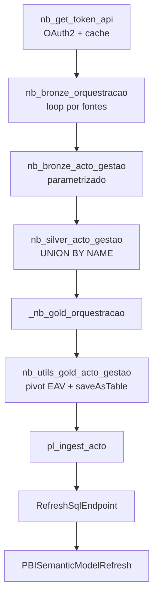

# Documentação Única — Módulo Acto e Migração Santos

> **Objetivo:** ser a fonte canônica para o módulo Acto novo, o estado validado do acervo e o plano de migração dos painéis/tabelas de Santos para `lh_solicitacoes_acto`.
>
> **Escopo:** arquitetura EAV, notebooks/pipeline, divergências entre documentação e realidade, validações mínimas e ordem recomendada de migração.
>
> **Última revisão:** 2026-08-05

---

## 1. Resumo executivo

O módulo Acto novo já existe e é o caminho certo para a migração: ele usa o lakehouse unificado `lh_solicitacoes_acto`, o modelo EAV no Bronze/Silver e projeções Gold por domínio. A parte que ainda exige cuidado não é a base técnica, e sim a coexistência entre documentação antiga e estado real do código.

O diagnóstico consolidado desta leitura é:

1. O padrão EAV do Acto está implementado e é o desenho oficial do módulo novo.
2. O utilitário Gold compartilhado já grava Delta via `saveAsTable()` e valida volume mínimo antes da escrita.
3. A pipeline `pl_ingest_acto` já existe com retry, refresh do SQL Endpoint e refresh semântico.
4. A documentação anterior ainda mistura estado antigo com estado novo em alguns trechos, então não pode ser usada sozinha como verdade operacional.
5. A migração de Santos precisa preservar regra de negócio, janela temporal e equivalência funcional dos Golds, não apenas contagem bruta.

---

## 2. Estado validado do módulo Acto

### 2.1 Componentes principais

| Componente | Estado validado | Observação |
|---|---|---|
| `nb_get_token_api` | Ativo | Token OAuth2 com cache e renovação automática |
| `nb_bronze_orquestracao` | Ativo | Loop por fontes |
| `nb_bronze_acto_gestao` | Ativo | Notebook parametrizado por payload/fonte |
| `nb_silver_acto_gestao` | Ativo | Consolidação via `UNION BY NAME` |
| `nb_utils_gold_acto_gestao` | Ativo | Centraliza pivot EAV + write Delta |
| `_nb_gold_orquestracao` | Ativo | Encadeia vários Golds por `%run` |
| `pl_ingest_acto` | Ativo | Bronze → Silver → Gold → RefreshSqlEndpoint → PBISemanticModelRefresh |

### 2.2 Mapa dos Golds lidos nesta revisão

| Notebook | Fonte(s) principal(is) | Saída Gold | Observação |
|---|---|---|---|
| `Santos/nbs/cet/nb_gold_acto_gestao_cet.ipynb` | `payload` único de CET, com lista de `codCatalogo` e etapas | `gold_cet_servicos` | Padrão legado; já grava Delta com `saveAsTable()` |
| `Santos/nbs/sepref/nb_gold_acto_gestao_sepref.ipynb` | `payload_sepref1.json`, `payload_sepref2.json`, `payload_sepref3.json` | `gold_sepref_servicos` | Padrão legado; consolida 3 payloads e grava Delta |
| `Acto/nbs/utils/nb_utils_gold_acto_gestao.ipynb` | `silver.fato_solicitacoes`, `silver.fato_campos`, `silver.fato_etapas` | Gold por domínio (`gold.*`) | Helper canônico do módulo novo; aplica pivot EAV, coalesce de bairro e assert de volume antes da escrita |

### 2.3 O que o modelo novo faz

- Bronze grava três fatos normalizados por fonte: solicitações, campos EAV e etapas.
- Silver consolida as fontes com `UNION BY NAME` e colunas ausentes permitidas.
- Gold converte o EAV em tabelas por domínio/município e grava em Delta.
- O consumo final ocorre via SQL Endpoint e refresh do modelo semântico.

### 2.4 Evidências da implementação

- O utilitário Gold grava com `saveAsTable(tabela)` e bloqueia volumes abaixo do mínimo esperado.
- O orquestrador Gold do Acto já chama múltiplos notebooks de Santos, Osasco e Mauá.
- A pipeline real do módulo já tem retry e um refresh semântico configurado.

---

## 3. O que ainda está diferente da realidade

### 3.1 Documentação técnica antiga ou parcial

Parte da documentação ainda descreve um estado anterior da migração, com frases que já não batem com o código atual. Os pontos mais importantes são:

- Trechos que ainda falam como se CET e SEPREF estivessem com gravação comentada.
- Trechos que ainda tratam o orquestrador Gold como incompleto.
- Trechos que ainda descrevem o pipeline como se o refresh e a publicação estivessem em fase pendente.

### 3.2 Mistura de legado com o novo modelo

Em Santos ainda existem notebooks legados e híbridos, por exemplo:

- lógica com credencial hardcoded em notebooks antigos;
- notebooks de avaliação com comportamento incremental/híbrido;
- ativos de obras e painéis específicos que seguem regras próprias e precisam de paridade cuidadosa.

### 3.3 Consequência prática

Não basta confiar em um único documento antigo para decidir corte de migração. O acervo precisa ser lido assim:

1. Código e pipeline são a verdade operacional imediata.
2. Documentação nova é a verdade de intenção.
3. Documentação antiga serve como histórico e ainda contém insumos úteis, mas pode estar desatualizada.

---

## 4. Arquitetura canônica do módulo Acto

### 4.1 Leitura operacional da arquitetura

- O EAV existe para evitar explosão de colunas e permitir novas fontes sem novo Bronze/Silver.
- O Gold existe para reestabelecer regras de negócio e formatos de consumo.
- A migração de Santos deve respeitar essa divisão: o novo lakehouse recebe os dados e o Gold novo replica as regras de negócio do legado.

---

## 5. Plano de migração de Santos

### 5.1 Escopo imediato

Em ordem de prioridade, o corte de migração deve começar por:

1. Santos CET.
2. Santos SEPREF.
3. Demais domínios de Santos apenas após a equivalência dos primeiros dois.

### 5.2 Princípio de migração

O objetivo não é reproduzir a física antiga; o objetivo é reproduzir a regra de negócio antiga sobre a física nova.

Isto significa:

- gravar as tabelas finais no `lh_solicitacoes_acto`;
- manter o mesmo significado de colunas e métricas;
- validar paridade por janela temporal;
- só depois trocar as conexões dos painéis e desativar o legado.

### 5.3 Ordem recomendada

1. Ativar e validar os Gold de Santos CET e SEPREF no lakehouse novo.
2. Incluir esses Golds no orquestrador final e no refresh semântico correto.
3. Executar a primeira publicação do SQL Endpoint com `recreateTables = true`.
4. Voltar `recreateTables` para `false` após a criação das tabelas.
5. Comparar outputs com o legado antes de redirecionar PBI.
6. Trocar as conexões dos painéis só quando a equivalência estiver fechada.

### 5.4 Sequência prática para a migração CET/SEPREF

1. Inventariar quais campos do legado ainda são consumidos pelos painéis CET e SEPREF.
2. Mapear esses campos para o EAV do Silver novo e para os pivots do Gold novo.
3. Escrever as tabelas novas em `lh_solicitacoes_acto` com o mesmo nome lógico esperado pelo consumo.
4. Comparar uma janela idêntica de dados entre legado e novo, começando por rowcount, depois por colunas críticas e por fim por KPI.
5. Manter legado e novo em paralelo até a validação fechar sem divergência material.
6. Só então redirecionar as conexões e encerrar o uso do lakehouse legado para esse domínio.

---

## 6. Critérios mínimos de validação

### 6.1 Validação técnica

- O Bronze novo precisa carregar sem erro para as fontes de Santos escolhidas.
- O Silver precisa manter as fontes em union sem perda inesperada.
- O Gold precisa escrever Delta e manter as colunas de negócio esperadas.
- A pipeline precisa concluir Bronze → Silver → Gold → SQL → refresh semântico.

### 6.2 Matriz de validação por camada

| Camada | Validação | Critério de aceite |
|---|---|---|
| Bronze | Fonte/etapas carregadas por payload | Rowcount por fonte compatível com o legado ou com a extração esperada da fonte nova |
| Silver | União das fontes e colunas EAV | Sem perda de linhas, sem colunas críticas ausentes, `campo` e `valor` consistentes |
| Gold | Projeção das regras de negócio | Campos críticos presentes, `rowcount_min` respeitado, tabelas Delta escritas com sucesso |
| Power BI | Consumo final | KPI, filtros e visuais com equivalência material ao legado na mesma janela |

### 6.3 Validação de qualidade de dados

- Comparar rowcount por fonte e por período contra o legado.
- Comparar colunas obrigatórias e colunas derivadas críticas.
- Conferir nulos em campos de negócio essenciais.
- Validar duplicidade de chave e cardinalidade por OS.
- Conferir a regra de etapa atual e as regras especiais de Obras, quando aplicável.

### 6.4 Validação funcional

- Os KPIs principais do painel devem bater com o legado na mesma janela.
- Os filtros de secretaria, serviço, bairro e status devem responder de forma equivalente.
- As tabelas Gold novas devem ser consumíveis sem ajuste de semântica no Power BI, salvo troca de origem.

---

## 7. Riscos que ainda precisam de atenção

| Risco | Impacto | Situação |
|---|---|---|
| Credenciais hardcoded em notebooks legados | Alto | Ainda precisa ser eliminado |
| Documentação desatualizada | Alto | Já constatado |
| Troca de conexão sem paridade validada | Alto | Não fazer |
| Comparação por rowcount isolado | Médio/alto | Insuficiente |
| Legado e novo modelo coexistindo sem corte claro | Médio/alto | Esperado no curto prazo |
| Refresh semântico apontando para dataset errado | Alto | Validar manualmente |

---

## 8. Decisão operacional

### Manter

- A arquitetura EAV do módulo Acto.
- O lakehouse unificado `lh_solicitacoes_acto`.
- O utilitário Gold compartilhado.
- A pipeline `pl_ingest_acto` como espinha dorsal.

### Atualizar

- A documentação técnica que ainda descreve o estado antigo.
- O roadmap de migração, para refletir o estado real das tabelas e da pipeline.
- Os roteiros de validação para serem por domínio e por janela temporal.

### Ignorar como verdade operacional

- Trechos antigos que dizem que o Gold não grava ainda, quando o código já grava.
- Trechos que tratam CET/SEPREF como se ainda estivessem só em planejamento, quando já há base operacional nova.

---

## 9. Próximos passos

1. Usar este documento como referência única para o corte Santos.
2. Atualizar os docs antigos para apontar para esta página como canônica.
3. Executar a validação de paridade de CET e SEPREF antes de trocar conexões.
4. Após a validação, preparar a remoção gradual do legado de Santos.
5. Converter esta sequência em checklist executável por domínio, começando por CET e SEPREF.

---

## 10. Fontes de leitura relacionadas

- [Acto/CLAUDE.md](../CLAUDE.md)
- [DOCUMENTACAO_TECNICA_ACTO.md](DOCUMENTACAO_TECNICA_ACTO.md)
- [DOCUMENTACAO_NEGOCIO_ACTO.md](DOCUMENTACAO_NEGOCIO_ACTO.md)
- [DIAGRAMAS_ACTO.md](DIAGRAMAS_ACTO.md)
- [SPEC_DRIVE_ROADMAP_MIGRACAO.md](../specs/SPEC_DRIVE_ROADMAP_MIGRACAO.md)
- [MAPEAMENTO_WORKSPACE_FABRIC.md](MAPEAMENTO_WORKSPACE_FABRIC.md)
