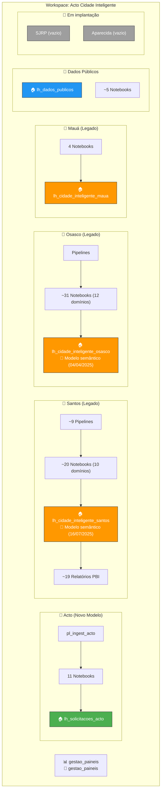

# Mapeamento do Workspace — Acto Cidade Inteligente

> **Workspace:** Acto Cidade Inteligente  
> **ID:** `96fe5a53-3a22-4443-8d0a-e2f6d61a2690`  
> **Capacidade:** Diamante · Brazil South  
> **Auditado em:** 2026-05-01 via navegação direta no Fabric  

---

## 1. Estrutura Raiz do Workspace

| Nome | Tipo | Proprietário | Atualizado |
| :--- | :--- | :--- | :--- |
| 📁 **Acto** | Pasta | — | — |
| 📁 **Aparecida de Goiânia** | Pasta | — | — |
| 📁 **Dados Públicos** | Pasta | — | — |
| 📁 **Mauá** | Pasta | — | — |
| 📁 **Osasco** | Pasta | — | — |
| 📁 **Santos** | Pasta | — | — |
| 📁 **SJRP** | Pasta | — | — |
| 📁 **utils** | Pasta | — | — |
| 📊 `gestao_paineis` | Relatório | Acto Cidade I… | 27/04/2026, 15:2… |
| 🔷 `gestao_paineis` | Modelo semântico | Yuri Lucatelli … | 27/04/2026, 15:… |

**Total na raiz:** 8 pastas + 1 Relatório + 1 Modelo semântico = **10 itens**

---

## 2. Inventário por Pasta

### 2.1 📁 Acto (Novo Modelo)

| Caminho | Nome | Tipo |
| :--- | :--- | :--- |
| `/Acto/` | `nbs/` | Pasta |
| `/Acto/` | `pipelines/` | Pasta |
| `/Acto/` | `lh_solicitacoes_acto` | Lakehouse |
| `/Acto/` | `lh_solicitacoes_acto` | Ponto de extremidade SQL |
| `/Acto/` | `nb_get_token_api` | Notebook |
| `/Acto/nbs/utils/` | `nb_utils_request_api` | Notebook |
| `/Acto/nbs/utils/` | `nb_utils_teste_token` | Notebook |
| `/Acto/nbs/nbs_bronze/` | `nb_bronze_orquestracao` | Notebook |
| `/Acto/nbs/nbs_bronze/` | `nb_bronze_acto_gestao` | Notebook |
| `/Acto/nbs/nbs_silver/` | `nb_silver_acto_gestao` | Notebook |
| `/Acto/nbs/nbs_gold/` | `_nb_gold_orquestracao` | Notebook |
| `/Acto/nbs/nbs_gold/` | `nb_gold_santos_cet` | Notebook |
| `/Acto/nbs/nbs_gold/` | `nb_gold_santos_sepref` | Notebook |
| `/Acto/nbs/nbs_gold/` | `nb_gold_osasco_atendimento_cras` | Notebook |
| `/Acto/nbs/nbs_gold/` | `nb_gold_osasco_atendimento_trabalhador` | Notebook |
| `/Acto/pipelines/` | `pl_ingest_acto` | Pipeline |

**Subtotal Acto:** 11 Notebooks + 1 Pipeline + 1 Lakehouse + 1 SQL Endpoint = **14 itens**

---

### 2.2 📁 Santos (Legado)

| Caminho | Nome | Tipo | Proprietário | Atualizado |
| :--- | :--- | :--- | :--- | :--- |
| `/Santos/` | `bis/` | Pasta | — | — |
| `/Santos/` | `modelos_semanticos/` | Pasta | — | — |
| `/Santos/` | `nbs/` | Pasta | — | — |
| `/Santos/` | `nbs_analise/` | Pasta | — | — |
| `/Santos/` | `pipelines/` | Pasta | — | — |
| `/Santos/` | `lh_cidade_inteligente_santos` | Modelo semântico | Yuri Lucatelli | 16/07/2025 |
| `/Santos/` | `lh_cidade_inteligente_santos` | Lakehouse | Yuri Lucatelli | — |
| `/Santos/` | `lh_cidade_inteligente_santos` | Ponto de extremidade SQL | Yuri Lucatelli | — |

#### Santos > bis

| Caminho | Nome | Tipo |
| :--- | :--- | :--- |
| `/Santos/bis/` | `bis_cidade_inteligente_producao/` | Pasta (contém ~19 relatórios PBI) |
| `/Santos/bis/` | `bis_obras_producao/` | Pasta (contém relatórios de Obras) |

#### Santos > nbs (Notebooks de produção)

| Subpasta | Notebooks | Domínio |
| :--- | :--- | :--- |
| `nbs/` (raiz) | `nb_ingest_acto_santos`, `nb_ingest_dim_date`, `nb_ingest_tb_aux_servicos`, `nb_utils_api_acto_gestao`, `nb_utils_api_acto_gestao_obras` | Utilitários e auxiliares |
| `nbs/cet/` | `nb_gold_acto_gestao_cet`, `nb_gold_acto_gestao_cet_carga_descarga`, `nb_ingest_estrutura_cet`, `nb_ingest_silver_cet_carga_descarga` | CET — Trânsito |
| `nbs/cet/curso_motoristas/` | `nb_ingest_santos_curso_motoristas`, `nb_silver_santos_curso_motoristas` | Curso Motorista |
| `nbs/sepref/` | `nb_gold_acto_gestao_sepref` | SEPREF — Urbanismo |
| `nbs/segov/` | `nb_gold_acto_gestao_segov` | SEGOV |
| `nbs/seinfra/` | `nb_gold_acto_gestao_seinfra` | SEINFRA |
| `nbs/avaliacao_servicos/` | `nb_silver_santos_avaliacao`, `nb_gold_santos_avaliacao`, `nb_gold_santos_avaliacao_sentimento` | Avaliação + Sentimento |
| `nbs/manifestação_ouvidoria/` | `nb_gold_acto_gestao_manifestacoes_ouvidoria`, `nb_gold_acto_gestao_ouvidoria_servicos` | Ouvidoria |
| `nbs/obras/` | `nb_ingest_silver_acto_gestao_obras_santos`, `nb_gold_acto_gestao_obras`, `nb_gold_acto_gestao_obras_etapas` | Obras / PDR |
| `nbs/obras/SEONT/` | `nb_gold_acto_gestao_obras_seont_os` | SEONT — Ordens de Serviço |
| `nbs/carta_servicos/` | `nb_ingest_carta_servicos_santos` | Carta de Serviços |

**Subtotal Santos nbs:** ~20 notebooks

#### Santos > pipelines

> Contém as pipelines legadas de Santos (detalhes nos documentos existentes — `pipelines_santos_tecnicos`). Foram identificados ~9 pipelines na documentação consolidada.

#### Santos > modelos_semanticos

> Contém modelos semânticos DirectLake vinculados ao `lh_cidade_inteligente_santos`.

#### Santos > nbs_analise

> Contém notebooks de análise ad-hoc (não fazem parte do pipeline de produção).

---

### 2.3 📁 Osasco (Legado)

| Caminho | Nome | Tipo | Proprietário | Atualizado |
| :--- | :--- | :--- | :--- | :--- |
| `/Osasco/` | `bis/` | Pasta | — | — |
| `/Osasco/` | `nbs/` | Pasta | — | — |
| `/Osasco/` | `nbs_analises/` | Pasta | — | — |
| `/Osasco/` | `pipelines/` | Pasta | — | — |
| `/Osasco/` | `lh_cidade_inteligente_osasco` | Modelo semântico | Yuri Lucatelli | 04/04/2025 |
| `/Osasco/` | `lh_cidade_inteligente_osasco` | Lakehouse | Yuri Lucatelli | — |
| `/Osasco/` | `lh_cidade_inteligente_osasco` | Ponto de extremidade SQL | Yuri Lucatelli | — |

#### Osasco > nbs (12 domínios)

| Subpasta | Notebooks | Domínio |
| :--- | :--- | :--- |
| `assistencia_social/atendimento_cras/` | `nb_ingest_atendimento_cras` | CRAS |
| `assistencia_social/bolsa_familia/` | *(notebooks internos)* | Bolsa Família |
| `assistencia_social/cad_unico/` | *(notebooks internos)* | CadÚnico |
| `assistencia_social/rma/` | *(notebooks internos)* | RMA |
| `atividades_aquaticas/` | *(notebooks internos)* | Atividades Aquáticas |
| `bolsa_trabalho/` | `nb_ingest_osasco_bolsa_trabalho`, `nb_gold_bolsa_trabalho` | Bolsa Trabalho |
| `bpc/` | `nb_ingest_osasco_bpc`, `nb_gold_osasco_bpc` | BPC ⚠️ Gold comentado |
| `caged/` | *(notebooks internos)* | CAGED |
| `carta_servicos/` | *(notebooks internos)* | Carta de Serviços |
| `censo/` | *(notebooks internos)* | Censo |
| `comex/` | *(notebooks internos)* | Comércio Exterior |
| `obras/` | `nb_ingest_grid_obras` | Obras |
| `rais/` | *(notebooks internos)* | RAIS |
| `seguraca_viaria/` | `nb_ingest_infosiga_seg_viaria`, `nb_gold_seguranca_viaria` | Segurança Viária |
| `seguranca_publica/` | *(notebooks internos)* | Segurança Pública |

**Subtotal Osasco nbs:** ~31 notebooks em 12 domínios

---

### 2.4 📁 Mauá (Legado)

| Caminho | Nome | Tipo | Proprietário |
| :--- | :--- | :--- | :--- |
| `/Mauá/` | `bis_producao/` | Pasta | — |
| `/Mauá/` | `nb/` | Pasta | — |
| `/Mauá/` | `pipelines/` | Pasta | — |
| `/Mauá/` | `lh_cidade_inteligente_maua` | Lakehouse | Yuri Lucatelli |
| `/Mauá/` | `lh_cidade_inteligente_maua` | Ponto de extremidade SQL | Yuri Lucatelli |

#### Mauá > nb

| Notebook | Domínio |
| :--- | :--- |
| `nb_ingest_maua_acto_gestao_ambiente` | Meio Ambiente |
| `nb_ingest_maua_acto_gestao_plan_urbano` | Planejamento Urbano |
| `nb_silver_maua_etapas_tempo_plan_urbano` | Silver — Etapas PU |
| `nb_silver_maua_plan_urbano` | Silver — PU consolidado |

**Subtotal Mauá:** 4 notebooks + 1 Lakehouse

---

### 2.5 📁 Dados Públicos

| Caminho | Nome | Tipo | Proprietário |
| :--- | :--- | :--- | :--- |
| `/Dados Públicos/` | `nbs/` | Pasta | — |
| `/Dados Públicos/` | `pipelines/` | Pasta | — |
| `/Dados Públicos/` | `lh_dados_publicos` | Lakehouse | Yuri Lucatelli |
| `/Dados Públicos/` | `lh_dados_publicos` | Ponto de extremidade SQL | Yuri Lucatelli |

> Contém notebooks de IBGE/SIDRA, RAIS (BigQuery), CAGED para ~15 municípios.

---

### 2.6 📁 Aparecida de Goiânia

> **Status: VAZIO** — Em implantação. Nenhum item encontrado.

### 2.7 📁 SJRP

> **Status: VAZIO** — Em implantação. Nenhum item encontrado.

### 2.8 📁 utils

> Contém notebooks utilitários compartilhados, incluindo `config_api_acto` (legado — tokens hardcoded).

---

## 3. Inventário de Lakehouses

| # | Lakehouse | Pasta | Modelo Semântico | SQL Endpoint | Status |
| :--- | :--- | :--- | :--- | :--- | :--- |
| 1 | `lh_solicitacoes_acto` | Acto | ❌ | ✅ | 🟢 **Novo modelo** — ativo |
| 2 | `lh_cidade_inteligente_santos` | Santos | ✅ (atualizado 16/07/2025) | ✅ | 🟡 Legado — em uso |
| 3 | `lh_cidade_inteligente_osasco` | Osasco | ✅ (atualizado 04/04/2025) | ✅ | 🟡 Legado — em uso |
| 4 | `lh_cidade_inteligente_maua` | Mauá | ❌ | ✅ | 🟡 Legado — em uso |
| 5 | `lh_dados_publicos` | Dados Públicos | ❌ | ✅ | 🟢 Ativo |

> [!WARNING] `lh_solicitacoes_acto` não tem Modelo Semântico
> O Lakehouse novo não possui um Modelo semântico associado (diferente de Santos e Osasco que possuem). Isso pode indicar que o DirectLake ainda não foi configurado para o novo modelo.

> [!WARNING] Modelo semântico de Osasco desatualizado
> `lh_cidade_inteligente_osasco` — último update em **04/04/2025** (mais de 1 ano atrás). Verificar se os pipelines de refresh estão funcionando.

---

## 4. Inventário de Relatórios PBI

| # | Relatório | Pasta | Modelo Semântico | Atualizado |
| :--- | :--- | :--- | :--- | :--- |
| 1 | `gestao_paineis` | Raiz | `gestao_paineis` | 27/04/2026 |
| 2–20 | ~19 painéis de Santos | `Santos/bis/bis_cidade_inteligente_producao/` | `lh_cidade_inteligente_santos` | Variável |
| 21+ | Painéis de Obras Santos | `Santos/bis/bis_obras_producao/` | `lh_cidade_inteligente_santos` | Variável |

> [!IMPORTANT] `gestao_paineis` na raiz — item novo
> Este relatório e modelo semântico na raiz do workspace **não aparece em nenhuma documentação prévia**. Criado em 27/04/2026, proprietário "Acto Cidade I…". Parece ser um painel de gestão cross-município.

---

## 5. Gap Analysis — O que Falta Documentar

### 5.1 Itens NÃO documentados em nenhum doc existente

| Item | Localização | Tipo | Observação |
| :--- | :--- | :--- | :--- |
| ⚠️ `gestao_paineis` (Relatório) | Raiz | Relatório PBI | **Novo** — sem documentação técnica ou de negócio |
| ⚠️ `gestao_paineis` (Modelo) | Raiz | Modelo semântico | **Novo** — sem documentação de schema ou lineage |
| ⚠️ `lh_solicitacoes_acto` | Acto/ | Lakehouse | Documentado nesta sessão (DOCUMENTACAO_TECNICA_ACTO.md) |
| ⚠️ `pl_ingest_acto` | Acto/pipelines/ | Pipeline | Documentado nesta sessão |
| ⚠️ Todos os 11 notebooks em `Acto/` | Acto/nbs/ | Notebooks | Documentados nesta sessão |
| ⚠️ `Santos/nbs_analise/` | Santos/ | Pasta | Conteúdo não catalogado — notebooks de análise ad-hoc |
| ⚠️ `Santos/modelos_semanticos/` | Santos/ | Pasta | Conteúdo não catalogado |
| ⚠️ `Osasco/nbs_analises/` | Osasco/ | Pasta | Conteúdo não catalogado |
| ⚠️ `Mauá/bis_producao/` | Mauá/ | Pasta | Relatórios PBI de Mauá não documentados |
| ⚠️ Pipelines de Mauá | Mauá/pipelines/ | Pipeline | Não documentados em nenhum arquivo |
| ⚠️ Pipelines de Osasco | Osasco/pipelines/ | Pipeline | Não documentados em nenhum arquivo |

### 5.2 Itens parcialmente documentados

| Item | Doc existente | O que falta |
| :--- | :--- | :--- |
| Guia de início do Acto | `GUIA_POR_ONDE_COMECAR_ACTO` | Novo ponto de entrada para leitura inicial e migração |
| Notebooks Osasco (31) | `Mapeamento Técnico — Osasco` | Faltam BIS, pipelines e detalhes de schemas Gold |
| Notebooks Santos (~37) | `Mapeamento Técnico — Santos` + `DOCUMENTACAO_CONSOLIDADA_FABRIC` | Notebooks em `nbs_analise` não catalogados |
| Notebooks Mauá (4) | `DOCUMENTACAO_CONSOLIDADA_FABRIC §14` | Apenas menção superficial — sem schema, sem pipeline |
| Dados Públicos | `GUIA_MESTRE_DADOS_PUBLICOS` | OK para IBGE/SIDRA, falta RAIS BigQuery atualizado |

### 5.3 Itens já completamente documentados

| Item | Documentação |
| :--- | :--- |
| ✅ Guia canônico de início | `GUIA_POR_ONDE_COMECAR_ACTO` + `DOCUMENTACAO_UNICA_ACTO` |
| ✅ Santos notebooks de produção | `Mapeamento Técnico — Santos` + `DOCUMENTACAO_CONSOLIDADA` |
| ✅ Santos pipelines (9) | `pipelines_santos_tecnicos` |
| ✅ Santos PBI (19 painéis) | `mapeamento_paineis_powerbi` + `diagnostico_padronizacao` |
| ✅ Santos riscos R1–R9 | `fabric_santos_nbs_analise` |
| ✅ Osasco notebooks | `Mapeamento Técnico — Osasco` |
| ✅ Dados Públicos (IBGE/SIDRA) | `GUIA_MESTRE_DADOS_PUBLICOS` |
| ✅ Acto novo modelo | `DOCUMENTACAO_TECNICA_ACTO` + `DOCUMENTACAO_NEGOCIO_ACTO` + `DIAGRAMAS_ACTO` *(criados nesta sessão)* |

---

## 6. Alertas e Anomalias Encontradas

> [!CAUTION] Modelo semântico Osasco — última atualização 04/04/2025
> O modelo semântico de Osasco não é atualizado há mais de 1 ano. Possíveis causas: pipeline desativado, ou dados sendo consumidos diretamente via SQL Endpoint.

> [!WARNING] Sem Modelo Semântico para o Lakehouse Acto
> O `lh_solicitacoes_acto` (novo modelo) não possui Modelo Semântico associado. Os dashboards existentes (como `bi_osasco_atendimento_trabalhador` no pipeline) podem estar consumindo via DirectQuery ao SQL Endpoint em vez de DirectLake.

> [!WARNING] Aparecida de Goiânia e SJRP — completamente vazios
> Ambas as pastas existem mas estão 100% vazias. Status: "Em implantação" conforme `00_MAPA.md`, mas sem nenhum artefato criado.

> [!NOTE] `gestao_paineis` — novo relatório na raiz não documentado
> Criado em 27/04/2026. Pode ser um painel de gestão global que consolida métricas de múltiplos municípios. Precisa ser documentado.

> [!NOTE] Inconsistência de nomenclatura: `nbs_analise` vs `nbs_analises`
> Santos usa `nbs_analise` (singular), Osasco usa `nbs_analises` (plural). Padronizar.

---

## 7. Topologia Final — Mapa Visual

---

## 8. Resumo Quantitativo

| Métrica | Valor |
| :--- | :--- |
| **Total de Pastas (1º nível)** | 8 |
| **Lakehouses** | 5 |
| **Modelos Semânticos** | 3 (Santos, Osasco, gestao_paineis) |
| **SQL Endpoints** | 5 |
| **Relatórios PBI** | ~21+ (19 Santos + gestao_paineis + Obras) |
| **Notebooks (estimativa)** | ~72 (20 Santos + 31 Osasco + 4 Mauá + 11 Acto + ~5 Dados Públicos + utils) |
| **Pipelines** | ~11+ (9 Santos + 1 Acto + Osasco + Mauá) |
| **Pastas vazias** | 2 (Aparecida, SJRP) |
