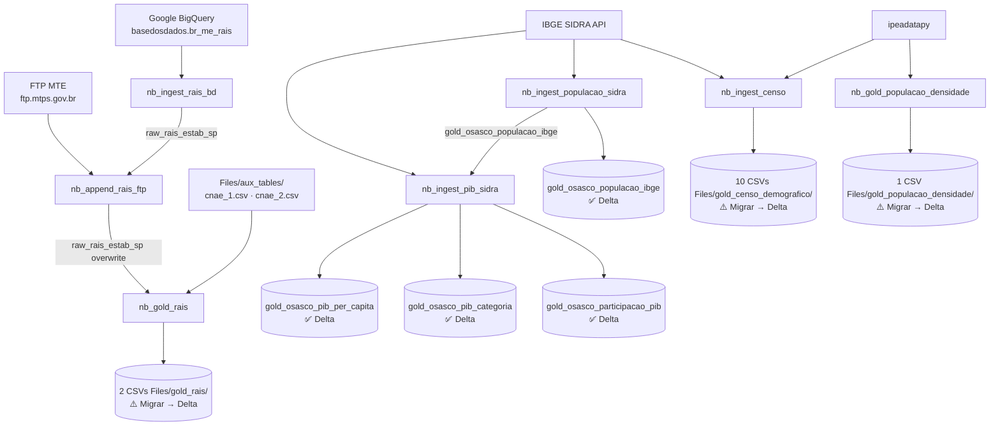

# Demográfico & RAIS — Documentação Técnica

**Lakehouse:** `lh_cidade_inteligente_osasco`
**Pasta Fabric:** `nbs/censo/` · `nbs/rais/`
**Total de notebooks:** 7 (4 censo · 3 rais)
**Revisão:** Abril 2026

---

## Visão Geral do Domínio

O domínio cobre duas grandes frentes de análise socioeconômica de Osasco, sempre comparando com 5 municípios de referência da Grande SP:

| Município | Código IBGE |
|---|---|
| **Osasco** | `3534401` |
| São Bernardo do Campo | `3548708` |
| Sorocaba | `3552205` |
| Ribeirão Preto | `3543402` |
| Santo André | `3547809` |
| São José dos Campos | `3549904` |

**Frente 1 — Censo / Demográfico:** indicadores populacionais extraídos da API IBGE SIDRA e da biblioteca `ipeadatapy`. Cobre pirâmide etária, urbanização, envelhecimento, dependência demográfica, gênero, escolaridade, domicílios, renda, fecundidade, densidade e PIB.

**Frente 2 — RAIS (Relação Anual de Informações Sociais):** série histórica de vínculos empregatícios formais em Osasco, com duas fontes complementares (BigQuery histórico + FTP MTE anual).

---

## Fluxo de Dependências



**Ordem de execução obrigatória:**
1. `nb_ingest_populacao_sidra` — deve rodar antes do PIB
2. `nb_ingest_pib_sidra` — depende de `gold_osasco_populacao_ibge`
3. `nb_ingest_rais_bd` — carga histórica inicial (execução única)
4. `nb_append_rais_ftp` — atualização anual (após RAIS publicado no FTP)
5. `nb_gold_rais` — depende de `raw_rais_estab_sp` atualizado

Os notebooks `nb_ingest_censo` e `nb_gold_populacao_densidade` são independentes e podem rodar em qualquer ordem.

---

## Notebooks — Censo / Demográfico

---

### `nb_ingest_censo`

**Caminho:** `nbs/censo/nb_ingest_censo.ipynb`
**Dependências externas:** IBGE SIDRA API (HTTP direto), `ipeadatapy`
**Dependências do lakehouse:** nenhuma
**Biblioteca extra:** `!pip install ipeadatapy`

#### O que faz

Este notebook é o mais abrangente do domínio. Ele extrai **10 indicadores demográficos distintos** do Censo IBGE (2000, 2010, 2022) e de séries históricas do Ipeadata para Osasco e 5 municípios comparadores. Cada indicador é extraído por uma função Python independente, sem reutilização de dados entre elas — cada função abre sua própria requisição à API.

> [!info] Escopo especial — Renda
> As funções de renda domiciliar (`extrair_renda_domicilio_api_2010` e `extrair_renda_domicilio_api_2022`) operam sobre uma lista de **37 municípios da RMSP** (`municipios_rmsp`), diferente dos outros indicadores que usam apenas os 6 municípios de comparação. Isso porque o painel de renda tem enfoque regional mais amplo.

#### Funções e Tabelas SIDRA

| Função | Tabela SIDRA | Período | Indicador extraído |
|---|---|---|---|
| `extrair_pop_censo_api()` | `9514` | 2022 | Pirâmide etária por faixa e sexo — somente Osasco |
| `extrair_pop_urbana_rural_ipedatapy()` | Ipeadata: `POPUR` + `POPRU` | > 1960 | Pop. urbana e rural histórica — 6 municípios |
| `extrair_pop_envelhecimento_api()` | `9756` | 2010, 2022 | Índice de envelhecimento (idosos ≥ 60 anos) — 6 municípios |
| `extrair_dependencia_demografica_api()` | `9514` (2022) + `1552` (2000, 2010) | 2000, 2010, 2022 | Razão de dependência: pop. inativa / pop. ativa — 6 municípios |
| `extrair_pop_genero_api()` | `9514` + `1552` (reutiliza lógica de dependência) | 2000, 2010, 2022 | Distribuição por sexo e proporção — 6 municípios |
| `extrair_6_17_frequenta_escola_api()` | `10058` | 2022 | Freq. escolar por nível de ensino — 6 municípios |
| `extrair_moradores_domicilio_api()` | `6893` | 2022 | Domicílios por tipo (casa, apt., etc.) — 6 municípios |
| `extrair_renda_domicilio_api_2010()` | `3578` | 2010 | Renda domiciliar per capita por faixa — 37 municípios RMSP |
| `extrair_renda_domicilio_api_2022()` | `10296` | 2022 | Renda domiciliar per capita por faixa — 37 municípios RMSP |
| `extrair_fecundidade_api()` | `10076` | 2010, 2022 | Taxa de fecundidade por faixa etária das mulheres — 6 municípios |
| `extrair_moradores_domicilio_cor_raca_api()` | `6893` | 2022 | Domicílios por raça/cor — 6 municípios |

#### Lógica de dependência demográfica

A **razão de dependência** classifica cada faixa etária como `ativa` (15–64 anos) ou `inativa` (0–14 e ≥65 anos):

```python
# Mapeamento para Censo 2022 (tabela 9514)
"0 a 4 anos" → "inativa"
"5 a 9 anos" → "inativa"
"10 a 14 anos" → "inativa"
"15 a 19 anos" → "ativa"
...
"60 a 64 anos" → "ativa"   ← nota: 60–64 é ATIVA no Censo 2022
"65 a 69 anos" → "inativa"
...

# Cálculo final
prop_inativa = pop_inativa / pop_ativa
```

> [!warning] Diferença entre Censo 2000/2010 e 2022
> A tabela SIDRA 1552 (2000, 2010) tem a faixa `"80 a 89 anos"` como uma única faixa. A tabela 9514 (2022) desdobra em `"80 a 84"`, `"85 a 89"`, etc. O código trata isso com dois `map_populacao_inativa_ativa` distintos.

#### Saídas — 10 arquivos CSV

Todos salvos em `/lakehouse/default/Files/gold_censo_demografico/`, `sep=";"`, sem índice.

| Arquivo CSV | Colunas principais | Fonte |
|---|---|---|
| `gold_censo_piramide_populacao.csv` | `ano`, `municipio`, `sexo`, `idade`, `valor` | SIDRA 9514 — Censo 2022 |
| `gold_censo_populacao_urbana_rural.csv` | `tercodigo`, `year`, `municipio`, `pop_urbana`, `pop_rural`, `pop_total`, `prop_urbana`, `prop_rural` | Ipeadata POPUR + POPRU |
| `gold_censo_envelhecimento_populacional.csv` | `ano`, `municipio`, `variavel`, `valor` | SIDRA 9756 |
| `gold_censo_populacao_ativa_inativa.csv` | `ano`, `municipio`, `ativa`, `inativa`, `prop_inativa` | SIDRA 9514 + 1552 |
| `gold_censo_populacao_genero.csv` | `ano`, `municipio`, `sexo`, `valor`, `total_pop`, `prop_genero` | SIDRA 9514 + 1552 |
| `gold_censo_frequenta_escola.csv` | `municipio`, `nivel_de_ensino_ou_curso_que_frequentavam`, `valor` | SIDRA 10058 — Censo 2022 |
| `gold_censo_domicilios.csv` | `municipio`, `tipo_de_domicilio`, `valor`, `prop_moradores` | SIDRA 6893 — Censo 2022 |
| `gold_censo_renda.csv` | `municipio`, `classes_de_rendimento_nominal_mensal_domiciliar_per_capita`, `valor`, `ano` | SIDRA 3578 (2010) + 10296 (2022) |
| `gold_censo_fecundidade.csv` | `ano`, `municipio`, `grupos_de_idade_das_mulheres`, `valor` | SIDRA 10076 |
| `gold_censo_domicilios_cor_raca.csv` | `ano`, `municipio`, `tipo_de_domicilio`, `cor_ou_raca`, `prop` | SIDRA 6893 — Censo 2022 |

> [!warning] Migração pendente
> Todos os 10 `to_csv()` devem ser substituídos por `spark.createDataFrame(df).write.mode("overwrite").format("delta").saveAsTable("gold_censo_{nome}")`.

---

### `nb_ingest_populacao_sidra`

**Caminho:** `nbs/censo/nb_ingest_populacao_sidra.ipynb`
**Dependências externas:** IBGE SIDRA via `sidrapy`
**Dependências do lakehouse:** nenhuma
**Biblioteca extra:** `%pip install sidrapy`

#### O que faz

Constrói a **série histórica de população total** de Osasco e 5 municípios comparadores, de 2000 a 2024 (sem gaps), consolidando 3 tabelas SIDRA diferentes para cobrir todos os anos:

| Tabela SIDRA | Período coberto | Observação |
|---|---|---|
| `6579` | 2000–2024 (exceto 2007 e 2010) | Estimativas populacionais anuais do IBGE |
| `793` | 2007 | Contagem populacional intercensitária |
| `608` | 2010 | Censo Demográfico |

O código faz um `pd.concat` das três fontes e converte para Spark, salvando como tabela Delta. A função `tratar_nomes_colunas()` usa `unidecode` para remover acentos e converte para snake_case.

#### Saída — tabela Delta

**`gold_osasco_populacao_ibge`** — modo `overwrite`

| Coluna | Tipo | Descrição |
|---|---|---|
| `municipio_codigo` | string | Código IBGE 7 dígitos |
| `municipio` | string | Nome do município |
| `ano` | int | Ano de referência |
| `variavel` | string | Nome da variável IBGE |
| `variavel_codigo` | string | Código da variável |
| `nivel_territorial` | string | Nível (Município) |
| `valor` | int | População total |

> [!tip] Dependência crítica
> Esta tabela é **pré-requisito direto** de `nb_ingest_pib_sidra`. O PIB per capita só pode ser calculado após a população estar disponível no lakehouse. Certifique-se de rodar este notebook **antes** do PIB.

---

### `nb_ingest_pib_sidra`

**Caminho:** `nbs/censo/nb_ingest_pib_sidra.ipynb`
**Dependências externas:** IBGE SIDRA via `sidrapy`
**Dependências do lakehouse:** `gold_osasco_populacao_ibge`
**Biblioteca extra:** `%pip install sidrapy`
**Constante:** `MES_REF_IPCA = 12` (deflacionamento sempre pelo IPCA de dezembro)

#### O que faz

Calcula três visões do PIB municipal para Osasco e os 5 municípios comparadores, com valores **deflacionados para base 2023** usando o IPCA acumulado (tabela SIDRA 1737).

#### Lógica de deflacionamento (`deflacionar_pib`)

```python
# 1. Obtém IPCA mensal (SIDRA 1737, variável 69)
# 2. Filtra apenas dezembro de cada ano (MES_REF_IPCA = 12)
# 3. Calcula IPCA acumulado em produto: (1 + taxa/100).cumprod()
# 4. Normaliza pelo índice do ano-base (2023)
# 5. pib_deflacionado = pib_corrente / ipca_normalizado
```

#### Funções e saídas

**`calcular_pib_per_capita(municipio, pop_data)`**
- Fonte: SIDRA 5938 (PIB municipal — Contas Regionais), variável `37` (PIB a preços correntes)
- Usa `pop_data` (lido de `gold_osasco_populacao_ibge` com `ffill` para anos sem dado)
- Fórmula: `pib_per_capita = (pib_deflacionado × 1.000) / populacao`
  - O `× 1.000` converte de R$ mil (unidade do IBGE) para R$
- Saída: **`gold_osasco_pib_per_capita`** — Delta, overwrite

**`calcular_pib_por_categoria(municipio)`**
- Fonte: SIDRA 5938, todas as variáveis
- Filtra 6 categorias: Total (37), Impostos (543), Agropecuária (513), Indústria (517), Serviços (6575), Administração Pública (525)
- Saída: **`gold_osasco_pib_categoria`** — Delta, overwrite

**`calcular_participacao_pib_estadual(municipio)`**
- Compara PIB do município com o PIB do estado de SP (SIDRA 5938, nível territorial `3`, código `35`)
- Fórmula: `participacao_pib_sp = pib_deflacionado_municipio / pib_deflacionado_sp`
- Saída: **`gold_osasco_participacao_pib`** — Delta, overwrite

#### Schemas das saídas

**`gold_osasco_pib_per_capita`**

| Coluna | Descrição |
|---|---|
| `ano` | Ano de referência |
| `municipio_codigo` | Código IBGE 7 dígitos |
| `municipio` | Nome do município |
| `variavel` | Nome da variável IBGE |
| `variavel_codigo` | Código da variável |
| `pib_corrente` | PIB em R$ mil correntes (original IBGE) |
| `ipca_normalizado` | Fator de deflacionamento base 2023 |
| `pib_deflacionado` | PIB em R$ mil deflacionados (base 2023) |
| `populacao` | População (de `gold_osasco_populacao_ibge`, com forward fill) |
| `pib_per_capita` | PIB per capita em R$ (deflacionado) |

**`gold_osasco_pib_categoria`**

| Coluna | Descrição |
|---|---|
| `ano` | Ano |
| `municipio_codigo` | Código IBGE |
| `municipio` | Nome |
| `variavel` | Nome completo da variável IBGE |
| `variavel_codigo` | Código |
| `pib_corrente` | Valor corrente |
| `pib_deflacionado` | Valor deflacionado base 2023 |
| `variavel_dash` | Rótulo simplificado: Total / Impostos / Agropecuária / Indústria / Serviços / Administração |

**`gold_osasco_participacao_pib`**

| Coluna | Descrição |
|---|---|
| `ano` | Ano |
| `municipio_codigo` | Código do município |
| `municipio` | Nome |
| `pib_deflacionado_osasco` | PIB deflacionado do município |
| `pib_deflacionado_sp` | PIB deflacionado do estado de SP |
| `participacao_pib_sp` | Proporção: PIB município / PIB SP |

---

### `nb_gold_populacao_densidade`

**Caminho:** `nbs/censo/nb_gold_populacao_densidade.ipynb`
**Dependências externas:** `ipeadatapy`
**Dependências do lakehouse:** nenhuma
**Biblioteca extra:** `!pip install ipeadatapy`

#### O que faz

Calcula a **densidade demográfica histórica** (habitantes/km²) de Osasco e os 5 municípios comparadores, de 1970 em diante, cruzando duas séries do Ipeadata:

| Série Ipeadata | Descrição |
|---|---|
| `POPTOT` | População total por município e ano |
| `AREA` | Área territorial em km² por município e ano |

Fórmula: `densidade_demografica = value_habitante / value_km2`

#### Saída — 1 arquivo CSV

**`Files/gold_populacao_densidade/densidade_pop_munic_selecionados.csv`**
`sep=";"`, `encoding="latin1"`, sem índice

| Coluna | Descrição |
|---|---|
| `tercodigo` | Código IBGE do município |
| `year` | Ano |
| `value_habitante` | População total |
| `municipio` | Nome (mapeado manualmente) |
| `value_km2` | Área em km² |
| `densidade_demografica` | Habitantes por km² |

> [!warning] Migração pendente
> Substituir o `to_csv()` por:
> ```python
> spark.createDataFrame(pop_munic_selecionados) \
>     .write.mode("overwrite").format("delta") \
>     .saveAsTable("gold_populacao_densidade")
> ```
> Remover também o `encoding="latin1"` que não tem efeito no Delta.

---

## Notebooks — RAIS

A pipeline RAIS tem uma arquitetura de **3 estágios em sequência**: carga histórica (única) → atualização anual → geração de Gold.

---

### `nb_ingest_rais_bd`

**Caminho:** `nbs/rais/nb_ingest_rais_bd.ipynb`
**Dependências externas:** Google BigQuery — `basedosdados.br_me_rais.microdados_estabelecimentos`
**Dependências do lakehouse:** nenhuma
**Credencial:** `Files/bd2024-444413-1084f2b9d765.json` ← arquivo único, ponto de falha
**Biblioteca extra:** `%pip install google-cloud-bigquery pyarrow db-dtypes`
**Execução:** **Única** — carga histórica inicial (série 1993 em diante)

#### O que faz

Extrai o histórico completo de estabelecimentos e vínculos empregatícios do **estado de SP inteiro** (não apenas Osasco) da plataforma Base dos Dados no Google BigQuery. O filtro por município só ocorre mais adiante, no `nb_gold_rais`.

#### Query BigQuery

```sql
SELECT
    dados.ano,
    dados.sigla_uf,
    dados.id_municipio,
    dados.quantidade_vinculos_ativos,
    dados.quantidade_vinculos_clt,
    dados.quantidade_vinculos_estatutarios,
    dados.tamanho_estabelecimento,
    dados.cnae_1,
    dados.cnae_2,
    dados.cnae_2_subclasse
FROM `basedosdados.br_me_rais.microdados_estabelecimentos`
WHERE sigla_uf = 'SP'
AND ano >= 1993
```

Após a query, o DataFrame é **agrupado** por `ano × sigla_uf × id_municipio × tamanho_estabelecimento × cnae_1 × cnae_2 × cnae_2_subclasse` (soma de vínculos) antes de salvar, reduzindo o volume.

#### Saída — tabela Delta

**`raw_rais_estab_sp`** — modo `overwrite`

| Coluna | Tipo | Descrição |
|---|---|---|
| `ano` | int | Ano da RAIS |
| `sigla_uf` | string | `'SP'` (fixo) |
| `id_municipio` | string | Código IBGE 7 dígitos |
| `tamanho_estabelecimento` | string | Código 1-10 (detalhado no gold) |
| `cnae_1` | string | Código CNAE versão 1 |
| `cnae_2` | string | Código CNAE versão 2 (classe) |
| `cnae_2_subclasse` | string | Código CNAE 2 subclasse (7 dígitos) |
| `quantidade_vinculos_ativos` | int | Vínculos ativos no ano |
| `quantidade_vinculos_clt` | int | Vínculos CLT |
| `quantidade_vinculos_estatutarios` | int | Vínculos estatutários |

> [!danger] Credencial única
> O arquivo `Files/bd2024-444413-1084f2b9d765.json` é a credencial de serviço do Google Cloud. Se movido ou expirado, este notebook falha silenciosamente na autenticação. Não há fallback.

---

### `nb_append_rais_ftp`

**Caminho:** `nbs/rais/nb_append_rais_ftp.ipynb`
**Dependências externas:** FTP `ftp.mtps.gov.br` (MTE), anônimo
**Dependências do lakehouse:** `raw_rais_estab_sp`
**Biblioteca extra:** `py7zr` (descompressão .7z)
**Execução:** **Anual** — após publicação do RAIS do ano corrente no FTP

#### O que faz

Complementa o dump histórico do BigQuery (que cobre até ~2023) com o **ano mais recente** disponível no FTP do Ministério do Trabalho. A função de download está **comentada** no notebook — deve ser descomentada manualmente antes de executar.

#### Pipeline interna

```
FTP ftp.mtps.gov.br
  └─ pdet/microdados/RAIS/2024/RAIS_ESTAB_PUB.7z
        ↓  download_rais_data()  [COMENTADO — execução manual]
  Files/rais_ftp/RAIS_ESTAB_PUB.COMT   (CSV sem separador explícito, encoding latin1)
        ↓  processar_rais_ftp()
  DataFrame raw
        ↓  tratar_nome_colunas_ftp()   (unidecode + snake_case)
        ↓  ajustar_base_ftp_padrao()   (filtra SP, renomeia para padrão BigQuery)
  DataFrame padronizado (ano=2024, sigla_uf='SP', cnae_1=NaN)
        ↓  consolidar_rais()
  pd.concat([raw_rais_estab_sp do lakehouse, rais_ftp])
        ↓
  raw_rais_estab_sp   ← sobrescreve tudo com overwrite + overwriteSchema
```

#### Diferenças entre fonte BigQuery e FTP

| Aspecto | BigQuery (`nb_ingest_rais_bd`) | FTP MTE (`nb_append_rais_ftp`) |
|---|---|---|
| Cobertura temporal | 1993 – ~2023 | Ano mais recente (ex.: 2024) |
| `cnae_1` | Preenchido | `NaN` (não disponível no arquivo FTP) |
| `cnae_2` | Código de classe | Código de classe (renomeado) |
| `tamanho_estabelecimento` | Código string | Código numérico (renomeado) |

> [!warning] Download manual necessário
> A função `download_rais_data()` está comentada. Para atualizar com um novo ano:
> 1. Descomenta `# download_rais_data()` no notebook
> 2. Confirma que o arquivo existe no FTP (o notebook inclui `ftp.nlst()` para listar)
> 3. Executa o notebook completo
> 4. Comenta novamente após a carga

---

### `nb_gold_rais`

**Caminho:** `nbs/rais/nb_gold_rais.ipynb`
**Dependências do lakehouse:** `raw_rais_estab_sp`
**Arquivos auxiliares:**
- `Files/aux_tables/br_bd_diretorios_brasil_cnae_1.csv` (colunas: `cnae_1`, `descricao_secao`)
- `Files/aux_tables/br_bd_diretorios_brasil_cnae_2.csv` (colunas: `subclasse`, `descricao_secao`)

#### O que faz

Transforma os dados raw de vínculos em duas tabelas analíticas Gold, filtrando apenas Osasco e enriquecendo com a **descrição textual das seções CNAE**.

#### Filtro de município

```python
rais = spark.sql("""
    SELECT * FROM lh_cidade_inteligente_osasco.raw_rais_estab_sp 
    WHERE id_municipio IN ('3534401', '353440')
""").toPandas()
```

> [!bug] Código IBGE duplicado no filtro
> O filtro inclui `'353440'` (6 dígitos) além de `'3534401'` (7 dígitos, correto). O código de 6 dígitos é o formato antigo do IBGE para Osasco. Registros históricos mais antigos podem ter sido gravados neste formato — o filtro duplo é intencional para garantir que nenhum registro de Osasco fique de fora.

#### Enriquecimento CNAE

O notebook faz dois JOINs para obter a **descrição da seção CNAE** (nível mais agregado, ex.: "Comércio; reparação de veículos automotores"):

```python
# JOIN 1: CNAE 1 → descrição da seção
cnae1 = pd.read_csv("Files/aux_tables/br_bd_diretorios_brasil_cnae_1.csv", dtype={"cnae_1": str})
# JOIN 2: CNAE 2 subclasse → descrição da seção
cnae2 = pd.read_csv("Files/aux_tables/br_bd_diretorios_brasil_cnae_2.csv", dtype={"subclasse": str})

# Coalesce: se CNAE 2 não tem descrição (registros BigQuery com cnae_1 preenchido), usa CNAE 1
rais_cnae["descricao_secao_cnae"] = np.where(
    rais_cnae["descricao_secao_cnae_2"].isnull(),
    rais_cnae["descricao_secao_cnae_1"],
    rais_cnae["descricao_secao_cnae_2"]
)
```

#### Tabela de tamanho de estabelecimento

```python
tamanho_dict = {
    "1": "Zero",       # 0 vínculos
    "2": "Ate 4",
    "3": "De 5 a 9",
    "4": "De 10 a 19",
    "5": "De 20 a 49",
    "6": "De 50 a 99",
    "7": "De 100 a 249",
    "8": "De 250 a 499",
    "9": "De 500 a 999",
    "10": "1000 ou mais",
    "-1": "Ignorado"
}
```

#### Saídas — 2 arquivos CSV

**`Files/gold_rais/rais_anual.csv`**

| Coluna | Descrição |
|---|---|
| `ano` | Ano de referência |
| `descricao_secao_cnae` | Seção CNAE (ex.: "Comércio; reparação de veículos...") |
| `quantidade_vinculos_ativos` | Total de vínculos ativos em Osasco no ano |

**`Files/gold_rais/gold_rais_tamanho_estabelecimento.csv`**

| Coluna | Descrição |
|---|---|
| `ano` | Ano de referência |
| `tamanho_estabelecimento` | Faixa de tamanho (ex.: "De 100 a 249") |
| `descricao_secao_cnae` | Seção CNAE |
| `size` | **Contagem de estabelecimentos** (não vínculos — usa `.size()`) |

> [!info] Atenção: `size` conta estabelecimentos, não vínculos
> `rais_tamanho_estabelecimento` usa `.size()` ao agrupar, que conta o número de linhas (estabelecimentos com aquele perfil), não a soma de vínculos. Isso é diferente de `rais_anual` que usa `.agg({"quantidade_vinculos_ativos": "sum"})`.

> [!bug] Bug histórico — IsADirectoryError
> Na versão anterior do notebook, os CSVs eram salvos em `Files/rais_ftp/` (mesma pasta usada pelo download do FTP). Como `rais_ftp/` era um diretório, o `to_csv()` lançava `IsADirectoryError`. Corrigido na versão atual com o path `Files/gold_rais/`.

> [!warning] Migração pendente
> Substituir os dois `to_csv()` por:
> ```python
> spark.createDataFrame(rais_anual) \
>     .write.mode("overwrite").format("delta") \
>     .saveAsTable("gold_rais_anual")
>
> spark.createDataFrame(rais_tamanho_estabelecimento) \
>     .write.mode("overwrite").format("delta") \
>     .saveAsTable("gold_rais_tamanho_estabelecimento")
> ```

---

## Resumo de Saídas do Domínio

### Tabelas Delta — prontas para Power BI

| Tabela | Notebook gerador | Conteúdo |
|---|---|---|
| `gold_osasco_populacao_ibge` | `nb_ingest_populacao_sidra` | Série histórica de população total IBGE 2000–2024 |
| `gold_osasco_pib_per_capita` | `nb_ingest_pib_sidra` | PIB per capita deflacionado (base 2023) por ano |
| `gold_osasco_pib_categoria` | `nb_ingest_pib_sidra` | PIB por categoria econômica deflacionado |
| `gold_osasco_participacao_pib` | `nb_ingest_pib_sidra` | Participação % no PIB do estado de SP |
| `raw_rais_estab_sp` | `nb_ingest_rais_bd` + `nb_append_rais_ftp` | Vínculos empregatícios SP 1993+ (tabela raw, não consumida diretamente pelo PBI) |

### Arquivos CSV — pendentes de migração para Delta

| Arquivo | Notebook gerador | Tabela Delta proposta |
|---|---|---|
| `gold_censo_piramide_populacao.csv` | `nb_ingest_censo` | `gold_censo_piramide_populacao` |
| `gold_censo_populacao_urbana_rural.csv` | `nb_ingest_censo` | `gold_censo_populacao_urbana_rural` |
| `gold_censo_envelhecimento_populacional.csv` | `nb_ingest_censo` | `gold_censo_envelhecimento_populacional` |
| `gold_censo_populacao_ativa_inativa.csv` | `nb_ingest_censo` | `gold_censo_populacao_ativa_inativa` |
| `gold_censo_populacao_genero.csv` | `nb_ingest_censo` | `gold_censo_populacao_genero` |
| `gold_censo_frequenta_escola.csv` | `nb_ingest_censo` | `gold_censo_frequenta_escola` |
| `gold_censo_domicilios.csv` | `nb_ingest_censo` | `gold_censo_domicilios` |
| `gold_censo_renda.csv` | `nb_ingest_censo` | `gold_censo_renda` |
| `gold_censo_fecundidade.csv` | `nb_ingest_censo` | `gold_censo_fecundidade` |
| `gold_censo_domicilios_cor_raca.csv` | `nb_ingest_censo` | `gold_censo_domicilios_cor_raca` |
| `densidade_pop_munic_selecionados.csv` | `nb_gold_populacao_densidade` | `gold_populacao_densidade` |
| `rais_anual.csv` | `nb_gold_rais` | `gold_rais_anual` |
| `gold_rais_tamanho_estabelecimento.csv` | `nb_gold_rais` | `gold_rais_tamanho_estabelecimento` |

---

## Pontos de Atenção

> [!danger] Credencial BigQuery — arquivo único
> `Files/bd2024-444413-1084f2b9d765.json` é a única cópia das credenciais do Google Cloud para acesso à Base dos Dados. Se este arquivo for movido, renomeado ou expirar, a pipeline RAIS histórica para completamente. Considerar backup ou armazenamento em Key Vault do Azure.

> [!warning] `nb_append_rais_ftp` — download comentado
> A função de download do FTP está comentada propositalmente (execução pesada, pode demorar). Antes de rodar o notebook para atualização anual, verificar se o arquivo do ano corrente já está em `Files/rais_ftp/` — se sim, basta descomentada e reexecutar.

> [!warning] `nb_ingest_pib_sidra` depende de `nb_ingest_populacao_sidra`
> O PIB per capita usa `gold_osasco_populacao_ibge` via `spark.sql()`. Se rodar o PIB sem a tabela de população atualizada, o cálculo usará dados desatualizados silenciosamente (sem erro).

> [!info] Scope de comparação
> Todos os notebooks do domínio trabalham com os mesmos 6 municípios de comparação. Qualquer expansão do scope (adicionar outro município) exige atualização nas listas `municipios_rmsp` (censo) e `codigo_municipios` (populacao, pib, densidade).
