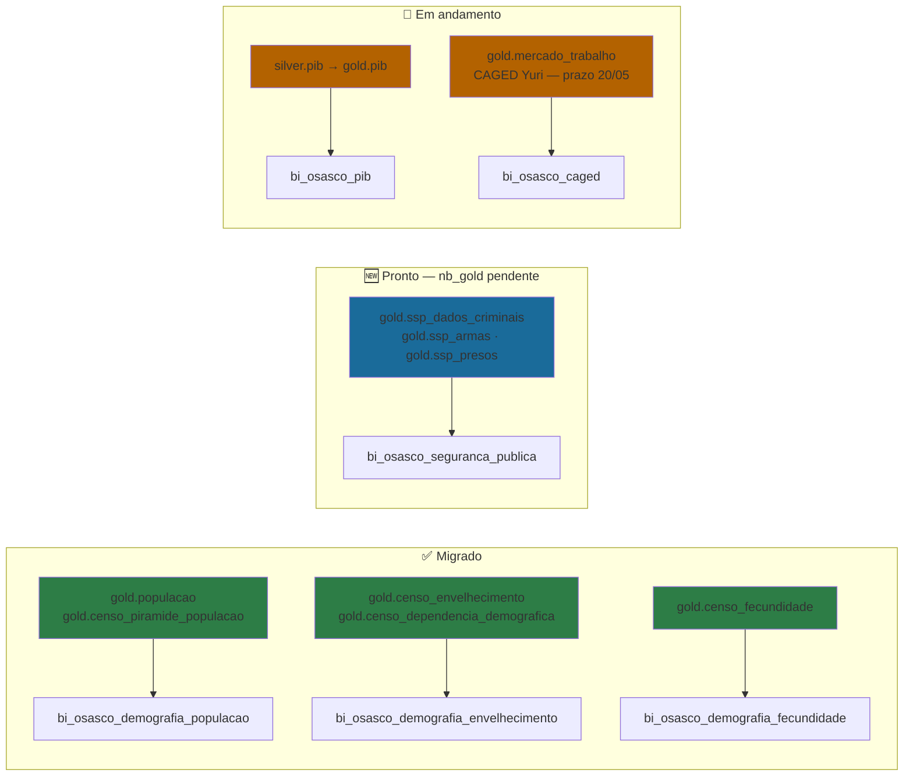

# Painéis Power BI — Osasco

> **24 painéis · 9 eixos · Arquitetura Medallion**  
> Fonte: Extração PyMuPDF de `pdf_paineis_osasco/` em 11/05/2026  
> Referência técnica completa: [[Documentação_Fabric/GUIA_COMPLETO_FABRIC_MEGA#9.10 Power BI — Catálogo Osasco|§9.10 do Mega Guide]]

---

## Navegação Rápida

| Eixo | Painéis | Notebooks |
| --- | --- | --- |
| [[#Assistência Social]] | 8 ativos + 1 predecessor | [[Documentação_Fabric/Osasco/00_INDEX_OSASCO#Assistência Social\|NB Assistência Social]] |
| [[#Desenvolvimento Econômico]] | 3 | [[Documentação_Fabric/Osasco/00_INDEX_OSASCO#CAGED\|NB CAGED]] · [[Documentação_Fabric/Osasco/00_INDEX_OSASCO#RAIS\|NB RAIS]] |
| [[#Relações Internacionais / Comex]] | 1 | [[Documentação_Fabric/Osasco/00_INDEX_OSASCO#Comércio Exterior (COMEX)\|NB COMEX]] |
| [[#Censo / Demográfico]] | 3 | [[Documentação_Fabric/Osasco/00_INDEX_OSASCO#Censo / Dados Demográficos\|NB Censo]] |
| [[#Segurança Pública e Viária]] | 3 | [[Documentação_Fabric/Osasco/00_INDEX_OSASCO#Segurança Pública\|NB Segurança]] |
| [[#Desenvolvimento Urbano]] | 2 | [[Documentação_Fabric/Osasco/00_INDEX_OSASCO#Obras\|NB Obras]] |
| [[#Saúde]] | 1 | — (CadOZ local) |
| [[#Esporte e Lazer]] | 1 | — (pendente mapeamento) |
| [[#Governo e Cidadania]] | 1 | [[Documentação_Fabric/Osasco/00_INDEX_OSASCO#Carta de Serviços\|NB Carta Serviços]] |

---

## Assistência Social

### bi_osasco_cad_unico
**PDF:** `bi_osasco_cad_unico.pdf`  
**KPIs:** 106.416 famílias cadastradas · R$907 renda per capita média · 2,66 pessoas/família  
**Dimensões:** Renda per capita · Ano de Cadastro  
**Fonte:** SEADS (arquivo TXT CadÚnico — carga manual)  
**Linhagem Medallion:**
```
SEADS TXT → Bronze (bronze_cad_unico_reg01…reg18)
          → Silver (silver_cad_unico_reg01, reg04)
          → Gold (gold_cad_unico_* — 12 tabelas)
          → Power BI
```
**Notebooks:** [[Documentação_Fabric/Osasco/nbs/assistencia_social/cad_unico/nb_ingest_bronze_cad_unico.ipynb|nb_ingest_bronze_cad_unico]] → [[Documentação_Fabric/Osasco/nbs/assistencia_social/cad_unico/nb_silver_cad_unico.ipynb|nb_silver_cad_unico]] → [[Documentação_Fabric/Osasco/nbs/assistencia_social/cad_unico/nb_gold_cad_unico_pg.ipynb|nb_gold_cad_unico_pg]]  
**⚠️ Arquivo auxiliar crítico:** `Files/cadastro_unico/cep_bairros.csv` — JOIN CEP→bairro

---

### bi_osasco_rma_cras
**PDF:** `bi_osasco_rma_cras.pdf` (3 páginas)  
**Relatório:** RMA/CRAS — Indicadores PAIF  
**KPIs:** A.1 Total famílias PAIF · C.1 Atendimentos individualizados · D.1 Famílias em grupos  
**Dimensões:** Mês · Unidade CRAS (10 unidades) · Bairro  
**Unidades CRAS:** Rochdale · Bonança · Padroeira · Km 18 · Santo Antônio · Munhoz Jr. · 1° de Maio · Veloso · Piratininga · Jardim D'Abril  
**Fonte:** API Acto Gestão (`TOKEN_OSASCO`)  
**Linhagem Medallion:**
```
API Acto → Bronze → Silver → Gold (gold_rma_cras_* — 4 tabelas) → Power BI
```
**Notebook:** [[Documentação_Fabric/Osasco/nbs/assistencia_social/rma/nb_ingest_acto_rma.ipynb|nb_ingest_acto_rma]]  
**❌ Problema de Canvas:** Página 1 é 1920×2715pt (~4× maior que páginas 2–3 em 960×728pt) — causa percepção de "tamanho diferente" ao trocar de página. **Corrigir no PBI Desktop: Página 1 → Formato → Tamanho da Página → 960×728pt**  
**Predecessora:** `rma_cras.pdf` (versão de fev/2026, 6 páginas) — manter para histórico

---

### bi_osasco_rma_creas
**PDF:** `bi_osasco_rma_creas.pdf` (7 páginas — ✅ Canvas uniforme)  
**Relatório:** RMA/CREAS — Indicadores PAEFI  
**Indicadores cobertos:** A.1 PAEFI · B.1 PBF · C.1 Violência intrafamiliar · J.1 Adolescentes MSE · K.1 Abordagem Social · M.1 Atendimentos individualizados · P.1 Relatórios PAEFI  
**Dimensões:** Mês · Sigla da Unidade (CREAS Sul / CREAS Norte) · Indicador  
**Notebook:** [[Documentação_Fabric/Osasco/nbs/assistencia_social/rma/nb_ingest_acto_rma_creas.ipynb|nb_ingest_acto_rma_creas]]  
**Gold:** `gold_rma_creas_indicadores`

---

### bi_osasco_atendimento_cras
**PDF:** `bi_osasco_atendimento_cras.pdf` (3 páginas: Visão Geral · Performance · Base Detalhada)  
**KPIs:** Atendimentos por dia/status/tipo/assunto · Tempo médio por atendente  
**Dimensões:** Data · Unidade CRAS · Atendente · Status · Tipo de Comparecimento  
**Fonte:** API Acto Gestão — [[Documentação_Fabric/GUIA_COMPLETO_FABRIC_MEGA#8.8 Nova Arquitetura|Nova Arquitetura §8.8]]  
**Linhagem:** Bronze EAV → Silver unificado → Gold (`gold_atendimento_cras`, `gold_atendimento_cras_etapas`)  
**Notebook Gold:** `nb_gold_osasco_atendimento_cras` (via Acto nbs/)

---

### bi_osasco_atendimento_trabalhador
**PDF:** `bi_osasco_atendimento_trabalhador.pdf` (3 páginas: Visão Geral · Performance · Base Detalhada)  
**Assuntos principais:** CadOZ Cadastro Novo · Programas de Trabalho e Renda · CadÚNICO Atualização · Intermediação de mão-de-obra  
**Dimensões:** Data · Unidade (Portal do Trabalhador: Centro, Sul) · Atendente  
**Notebook Gold:** `nb_gold_osasco_atendimento_trabalhador`  
**Gold:** `gold_osasco_atendimento_trabalhador`

---

### bi_osasco_programa_bolsa_familia
**PDF:** `bi_osasco_programa_bolsa_familia.pdf`  
**KPIs:** 32.154 famílias beneficiadas em jan/2026 · R$21,6 Mi em repasses · Média R$~680/família  
**Dimensões:** Mês · Município (cluster: Osasco + Ribeirão Preto + Santo André + SBC + SJC + Sorocaba)  
**Fonte:** Portal da Transparência CGU  
**Notebooks:** [[Documentação_Fabric/Osasco/nbs/assistencia_social/bolsa_familia/nb_ingest_dump_pbf.ipynb|nb_ingest_dump_pbf]] → [[Documentação_Fabric/Osasco/nbs/assistencia_social/bolsa_familia/nb_append_pbf.ipynb|nb_append_pbf]] → [[Documentação_Fabric/Osasco/nbs/assistencia_social/bolsa_familia/nb_gold_pbf.ipynb|nb_gold_pbf]]  
**Gold:** `gold_pbf_municipios_selecionados`  
**Conexão Escalável:** → [[Documentação_Fabric/Dados Públicos/GUIA_MESTRE_DADOS_PUBLICOS|lh_dados_publicos]] (Índice de Vulnerabilidade Regional)

---

### bi_osasco_programa_bolsa_trabalho
**PDF:** `bi_osasco_programa_bolsa_trabalho.pdf`  
**Perfil:** Inscrições por bairro · Identidade de gênero · Moradia precária · Pirâmide etária por sexo  
**Dimensões:** Bairro · Identidade de Gênero · Nome do Curso  
**Fonte:** Acto Administrativo (Bolsa Trabalho)  
**Notebooks:** [[Documentação_Fabric/Osasco/nbs/bolsa_trabalho/nb_ingest_osasco_bolsa_trabalho.ipynb|nb_ingest_osasco_bolsa_trabalho]] → [[Documentação_Fabric/Osasco/nbs/bolsa_trabalho/nb_gold_bolsa_trabalho.ipynb|nb_gold_bolsa_trabalho]]  
**Gold:** `gold_bolsa_trabalho`

---

### bi_osasco_mapas_vulnerabilidade
**PDF:** `bi_osasco_mapas_vulnerabilidade.pdf` (5 páginas — ✅ Canvas uniforme 1920×1890pt)  
**Abas:** CadÚnico-Pessoas · CadÚnico-Pobreza · Beneficiários PBF · Índice Vulnerabilidade-Distritos · Índice Vulnerabilidade-CRAS  
**Fonte cross-domain:** `gold_cad_unico_*` + `gold_pbf_municipios_selecionados` + `gold_osasco_populacao_ibge`  
**Nota:** Visuals de mapa sem suporte para exportação em PDF

---

## Desenvolvimento Econômico

### bi_osasco_pib
**PDF:** `bi_osasco_pib.pdf`  
**KPIs:** PIB 2023 = R$119 Bi · PIB per capita · % participação PIB-SP  
**Série:** 2002–2023 (deflacionado)  
**Dimensões:** Ano · Categoria VAB (Impostos/Agropecuária/Indústria/Serviços/Administração) · Município (cluster)  
**Fonte:** API SIDRA IBGE (pública)  
**Notebook:** [[Documentação_Fabric/Osasco/nbs/censo/nb_ingest_pib_sidra.ipynb|nb_ingest_pib_sidra]]  
**Gold:** `gold_osasco_pib_per_capita` · `gold_osasco_pib_categoria` · `gold_osasco_participacao_pib`  
**Migração escalável:** → [[Documentação_Fabric/Dados Públicos/GUIA_MESTRE_DADOS_PUBLICOS|lh_dados_publicos.gold.pib]] ✅ Integrado

---

### bi_osasco_caged
**PDF:** `bi_osasco_caged.pdf`  
**KPIs:** Saldo total de empregos · Top setor positivo (Transporte+7.636) · Top setor negativo (Comércio-627)  
**Dimensões:** Mês/Ano · Seção CNAE (17 seções) · Faixa Etária · Tipo (Admissão/Demissão)  
**Fonte:** FTP MTE (CAGED mensal)  
**Notebooks:** [[Documentação_Fabric/Osasco/nbs/caged/nb_ingest_caged_dump.ipynb|nb_ingest_caged_dump]] → [[Documentação_Fabric/Osasco/nbs/caged/nb_append_caged.ipynb|nb_append_caged]] → [[Documentação_Fabric/Osasco/nbs/caged/nb_gold_sql_caged.ipynb|nb_gold_sql_caged]]  
**Gold:** `gold_caged_*` (5 tabelas)  
**Migração escalável:** → [[Documentação_Fabric/Dados Públicos/GUIA_MESTRE_DADOS_PUBLICOS|lh_dados_publicos.gold.mercado_trabalho]] 🔄 Refatoração Yuri

---

### bi_osasco_empresas
**PDF:** `bi_osasco_empresas.pdf`  
**KPIs:** Empresas abertas/encerradas por ano (2021–2026) · Saldo mensal 2026  
**Fontes:** SIGT Cadastro Mobiliário (semanal) + RAIS Estabelecimentos MTE (anual, até 2024)  
**Notebooks:** [[Documentação_Fabric/Osasco/nbs/rais/nb_ingest_rais_bd.ipynb|nb_ingest_rais_bd]] / [[Documentação_Fabric/Osasco/nbs/rais/nb_append_rais_ftp.ipynb|nb_append_rais_ftp]] → [[Documentação_Fabric/Osasco/nbs/rais/nb_gold_rais.ipynb|nb_gold_rais]]  
**⚠️ Gold em CSV:** `Files/gold_rais/rais_anual.csv` + `gold_rais_tamanho_estabelecimento.csv` — migração para Delta pendente  
**Doc:** [[Documentação_Fabric/Osasco/Demografico_RAIS — Documentação Técnica|Demográfico RAIS]]

---

## Relações Internacionais / Comex

### bi_osasco_ri_comercio_exterior
**PDF:** `bi_osasco_ri_comercio_exterior.pdf`  
**Série:** 1997–2026 (Valor FOB USD)  
**KPIs:** Total EXP · Total IMP · Saldo balança comercial  
**Dimensões:** Ano · Fluxo (EXP/IMP) · Categoria SH2  
**Fonte:** COMEXSTAT MDIC (pública)  
**Notebook:** [[Documentação_Fabric/Osasco/nbs/comex/nb_ingest_osasco_comexstat.ipynb|nb_ingest_osasco_comexstat]]  
**Gold:** `gold_osasco_comexstat`  
**Nota:** Domínio exclusivo local — sem equivalente no `lh_dados_publicos`

---

## Censo / Demográfico

### bi_osasco_demografia_populacao
**PDF:** `bi_osasco_demografia_populacao.pdf`  
**Tópicos:** Pirâmide etária 2022 · Evolução populacional · Proporção por gênero · Densidade · % Urbana  
**Dimensões:** Faixa Etária · Ano · Gênero  
**Notebook:** [[Documentação_Fabric/Osasco/nbs/censo/nb_ingest_populacao_sidra.ipynb|nb_ingest_populacao_sidra]] + [[Documentação_Fabric/Osasco/nbs/censo/nb_gold_populacao_densidade.ipynb|nb_gold_populacao_densidade]]  
**Gold:** `gold_osasco_populacao_ibge`  
**Migração escalável:** → [[Documentação_Fabric/Dados Públicos/GUIA_MESTRE_DADOS_PUBLICOS|lh_dados_publicos.gold.populacao]] + `gold.censo_piramide_populacao` ✅

---

### bi_osasco_demografia_envelhecimento
**PDF:** `bi_osasco_demografia_envelhecimento.pdf`  
**Tópicos:** Índice de envelhecimento · Razão de dependência demográfica — 2010 vs 2022  
**Dimensões:** Ano (2010/2022) · Cor/Raça · Município (cluster: Osasco, Ribeirão Preto, Santo André, SBC, SJC)  
**Migração escalável:** → `lh_dados_publicos.gold.censo_envelhecimento` ✅

---

### bi_osasco_demografia_fecundidade
**PDF:** `bi_osasco_demografia_fecundidade.pdf`  
**Tópicos:** Taxa de fecundidade por faixa etária das mulheres — 2010 vs 2022  
**Dimensões:** Faixa etária (12a–40a+) · Censo (2010/2022)  
**Notebook:** [[Documentação_Fabric/Osasco/nbs/censo/nb_ingest_censo.ipynb|nb_ingest_censo]]  
**⚠️ Gold em CSV:** `Files/gold_censo_demografico/` — 10 CSVs, migração para Delta pendente  
**Migração escalável:** → `lh_dados_publicos.gold.censo_fecundidade` ✅

---

## Segurança Pública e Viária

### bi_osasco_seguranca_publica
**PDF:** `bi_osasco_seguranca_publica.pdf`  
**KPIs:** Total prisões 2026 = 527 · Via Pública (local com mais prisões)  
**Tópicos:** Ocorrências/mês por natureza do delito · Ranking Top 20 bairros · Entorpecentes (Kg) · Armas apreendidas  
**Dimensões:** Ano · Tipo de Local · Natureza do Delito · Bairro  
**Fonte:** Monitora OZ (sistema municipal) + SSP-SP (dados criminais estaduais)  
**Notebooks:** [[Documentação_Fabric/Osasco/nbs/seguranca_publica/nb_ingest_monitora_oz.ipynb|nb_ingest_monitora_oz]] → [[Documentação_Fabric/Osasco/nbs/seguranca_publica/nb_gold_osasco_seguranca_publica.ipynb|nb_gold_osasco_seguranca_publica]]  
**Gold atual (local):** `gold_seg_publica_*` (4 tabelas — lh_cidade_inteligente_osasco)  
**🆕 Migração disponível:** `lh_dados_publicos.gold.ssp_dados_criminais` · `gold.ssp_armas` · `gold.ssp_presos` — tabelas Gold já existem no lakehouse escalável (confirmado 12/05/2026)  
**Pendente:** `nb_gold_osasco_seguranca_publica` apontando para `lh_dados_publicos` + geolocalização via `abairramento_osasco.json` (Shape Map)  
**Spec:** [[Documentação_Fabric/Dados Públicos/spec_drive_migracao_osasco_lh_dados_publicos|Spec Migração Osasco → lh_dados_publicos]]  
**⚠️ Canvas:** 1920×6015pt — canvas extremamente alto, dificulta navegação

---

### bi_osasco_seguranca_viaria
**PDF:** `bi_osasco_seguranca_viaria.pdf`  
**Tópicos:** Ocorrências por tipo de registro (Notificação/Sinistro Fatal/Não Fatal) · Por tipo de via · Por dia da semana × turno (matriz 7×4)  
**Série:** 2019–2026  
**Dimensões:** Ano/Mês · Tipo Registro · Tipo de Via · Dia da Semana · Turno  
**Fonte:** InfoSiga DETRAN-SP (pública, mensal)  
**Notebooks:** [[Documentação_Fabric/Osasco/nbs/seguraca_viaria/nb_ingest_infosiga_seg_viaria.ipynb|nb_ingest_infosiga_seg_viaria]] → [[Documentação_Fabric/Osasco/nbs/seguraca_viaria/nb_gold_seguranca_viaria.ipynb|nb_gold_seguranca_viaria]]  
**Gold:** 4 tabelas Delta + 3 Parquet redundante (pendente remoção)

---

### bi_osasco_inscricoes_monitora_oz
**PDF:** `bi_osasco_inscricoes_monitora_oz.pdf` (3 páginas: Câmeras · Totens · Base Detalhada)  
**Tópicos:** Inscrições de câmeras particulares e totens de videomonitoramento · Status e etapa atual · Encaminhamento da chefia · PJ/PF  
**Dimensões:** Data · Status · Etapa Atual (Atualização/Análise Documentação/Aprovação Chefia/Fornecimento Imagens/Análise COI/Encerramento)  
**Notebook:** [[Documentação_Fabric/Osasco/nbs/seguranca_publica/nb_ingest_monitora_oz.ipynb|nb_ingest_monitora_oz]]  
**Gold:** `gold_monitora_oz`

---

## Desenvolvimento Urbano

### acompanhamento_alvara_obras_osasco
**PDF:** `acompanhamento_alvara_obras_osasco.pdf` (3 páginas: Visão Geral · Por Serviço · Base Detalhada)  
**KPIs:** 1.793 serviços acompanhados · 3.872 expedidos · 5.665 em trâmite  
**Serviços (20 tipos):** Alvará de Construção · Regularização · Demolição · Reforma · Certidão de Uso do Solo · Certidão de Desdobro · Habite-se · Inscrição Profissional · etc.  
**Dimensões:** Mês · Nome do Serviço · Status Alvará · Responsável Técnico  
**Fonte:** Grid/API Acto (Licenciamento de Obras — SEGOV)  
**Notebook:** [[Documentação_Fabric/Osasco/nbs/obras/nb_ingest_grid_obras.ipynb|nb_ingest_grid_obras]]  
**Gold:** `gold_alvaras_obras`  
**❌ Canvas:** 3 alturas distintas (P1=1920×1890 / P2=1919×1349 / P3=1920×1595) — corrigir

---

### bi_osasco_mapas_loteamento_zoneamento
**Páginas:** 2 (Loteamento · Zoneamento) · **6 sub-abas via bookmarks**
**Fonte:** Shapefiles municipais (OzMundi/prefeitura) — processados localmente
**Visual:** Azure Maps — Reference Layer (migrado do Shape Map)
**Guia completo:** [[Documentação_Fabric/Osasco/guia_pbi_mapas_completo|Guia PBI — Mapas Urbanos (6 sub-abas)]]
**Spec:** [[Documentação_Fabric/Osasco/mapas_loteamento_zoneamento|Painel Loteamento / Zoneamento — spec]]

**Sub-abas e arquivos (EPSG:4326):**

| Sub-aba | GeoJSON | Tabela PBI | Chave | Layer ID |
| --- | --- | --- | --- | --- |
| Loteamento | `loteamento_osasco.json` | `tb_loteamento.csv` | `NOME_LOTEAMENTO` | #90 |
| Máscara de Bairros | `bairros_osasco.json` | `tb_loteamento` (agrupado) | `NOME_NORM` | #89 |
| Quadras 2019 | `quadras_osasco.json` | `tb_quadras.csv` | `chave_qd` | #4 |
| Zoneamento 2024 | `mancha_zoneamento_osasco.json` | `tb_mancha_zoneamento.csv` | `ZONA_2024` | #117 |
| Zoneamento 1978 | `zoneamento_1978_osasco.json` | `tb_zoneamento_1978.csv` | `zona` | #111 |
| Macrozonas | `macrozoneamento_osasco.json` | `tb_macrozoneamento.csv` | `SIGLA` | — |

**Overlay fixo em todos os mapas:** `limite_municipal_osasco.json` (#1 — stroke preto embutido)

**Status:** ✅ Publicado em 2026-06-18 · ajustes pós-publicação documentados em [[guia_pbi_mapas_completo]]

---

## Saúde

### bi_osasco_cadoz_h1n1
**PDF:** `bi_osasco_cadoz_h1n1.pdf`  
**KPIs:** Público Alvo H1N1 = 270.108 pessoas (60+ anos: 209.292 · 0-6 anos: 60.816)  
**Dimensões:** Faixa Etária · UBS de Referência · Bairro  
**Fonte:** CadOZ (Cadastro Único Municipal de Osasco) — atualização diária  
**⚠️ Dados sensíveis:** Base nominativa com CPF + Nome + Endereço — não publicar externamente  
**Notebook:** Não identificado no inventário — pendente mapeamento

---

## Esporte e Lazer

### atividades_aquaticas
**PDF:** `atividades_aquaticas.pdf`  
**KPIs:** 893 Natação adulto · 841 Natação Infantil · 737 Hidroginástica adulto  
**Dimensões:** Atividade · Turma · Sequência · Mês  
**Fonte:** Acto Administrativo (módulo Esporte)  
**Notebook:** Não identificado no inventário — pendente mapeamento

---

## Governo e Cidadania

### carta_servicos_osasco
**PDF:** `carta_servicos_osasco.pdf` (3 páginas: Resumo · Validade · Base Dados)  
**KPIs:** 414 serviços publicados · 95,92% público externo  
**Top secretarias:** SS(74) · SETRAN(58) · SF(56) · SECONTRU(39) · SSO(34) · SEGOV(28)  
**Top categorias:** Saúde(66) · Trânsito(62) · Impostos(57) · Licenças(49) · Espaço Público(29)  
**Dimensões:** Secretaria · Categoria · Dias desde última atualização · Período de validade  
**Notebooks:** [[Documentação_Fabric/Osasco/nbs/carta_servicos/nb_ingest_carta_servicos_osasco.ipynb|nb_ingest_carta_servicos_osasco]] + [[Documentação_Fabric/Osasco/nbs/carta_servicos/nb_ingest_acto_gestao_tempo_etapa_carta_servicos.ipynb|nb_ingest_acto_gestao_tempo_etapa_carta_servicos]]  
**Gold:** `gold_carta_servicos` · `gold_carta_servicos_atualizacoes` · `gold_carta_servicos_tempo_etapa`

---

## Problemas de Canvas — Resumo de Ação

> Ver auditoria completa: [[Documentação_Fabric/doc/diagnostico_padronizacao_paineis_pbi_santos|Diagnóstico Padronização Santos]] (referência de padrão)

| PDF | Problema | Correção PBI Desktop |
|---|---|---|
| `bi_osasco_rma_cras.pdf` | Página 1 = 1920×2715pt (4× maior) | P1: Formato → Tamanho → 960×728pt |
| `acompanhamento_alvara_obras_osasco.pdf` | 3 alturas: 1890/1349/1595pt | Padronizar: Formato → Personalizado → 1920×{altura_ref} |
| `bi_osasco_seguranca_publica.pdf` | 1 página de 6015pt de altura | Quebrar em abas ou reduzir canvas |
| `bi_osasco_cadoz_h1n1.pdf` | P1=2415pt / P2=1095pt | Padronizar altura |
| `bi_osasco_inscricoes_monitora_oz.pdf` | P1=1920×2265 / P2-3=960×(840/690) | Padronizar largura+altura |

---

## Conexão com Dados Públicos Escaláveis

> Spec completo: [[Documentação_Fabric/Dados Públicos/spec_drive_migracao_osasco_lh_dados_publicos|Spec Migração Osasco → lh_dados_publicos]]



| Painel | Status Migração | Tabelas lh_dados_publicos |
|---|---|---|
| `bi_osasco_demografia_populacao` | ✅ Gold pronto | `gold.populacao` · `gold.censo_piramide_populacao` |
| `bi_osasco_demografia_envelhecimento` | ✅ Gold pronto | `gold.censo_envelhecimento` · `gold.censo_dependencia_demografica` |
| `bi_osasco_demografia_fecundidade` | ✅ Gold pronto (resolve CSV local!) | `gold.censo_fecundidade` |
| `bi_osasco_seguranca_publica` | 🆕 Gold pronto — nb pendente | `gold.ssp_dados_criminais` · `gold.ssp_armas` · `gold.ssp_presos` |
| `bi_osasco_pib` | 🔄 silver.pib existe, gold pendente | `gold.pib` (a criar) |
| `bi_osasco_caged` / empresas | 🔄 Yuri — prazo 20/05 | `gold.mercado_trabalho` |

**Planejado:** Índice de Vulnerabilidade Regional unificando `gold_cad_unico_*` + `gold_pbf_municipios_selecionados` + `gold.populacao` para benchmark entre Santos e Osasco.

---

*Gerado por extração PyMuPDF de 24 PDFs em `Acto Cidade Inteligente/Osasco/bis/pdf_paineis_osasco/`*
