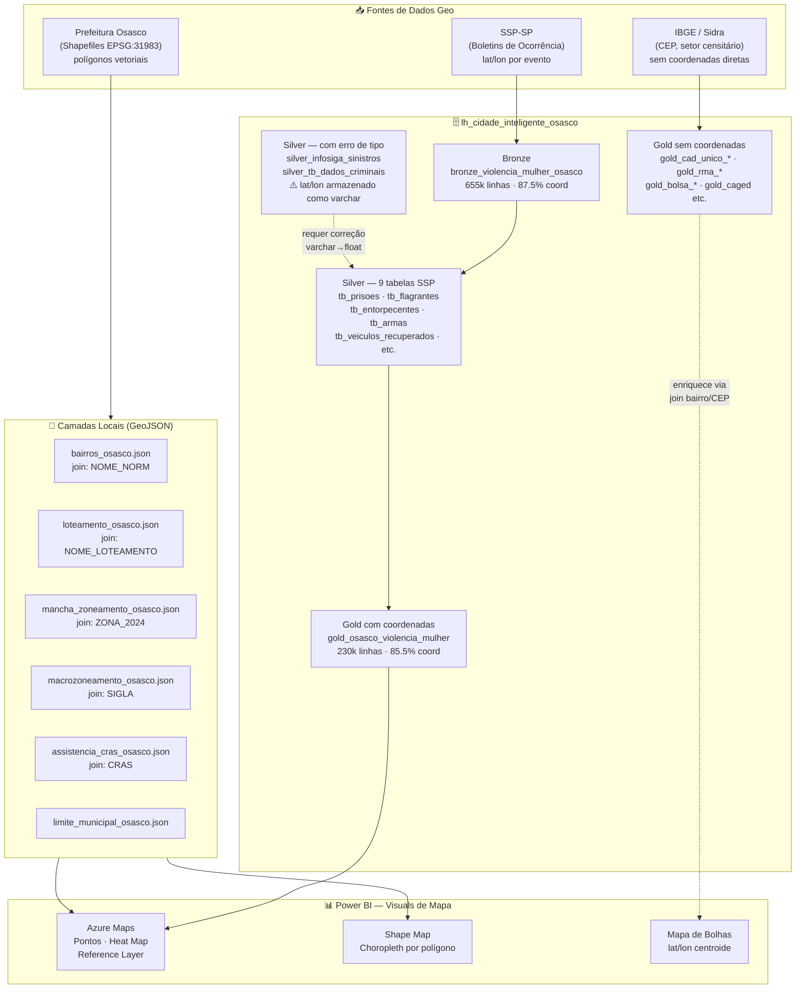
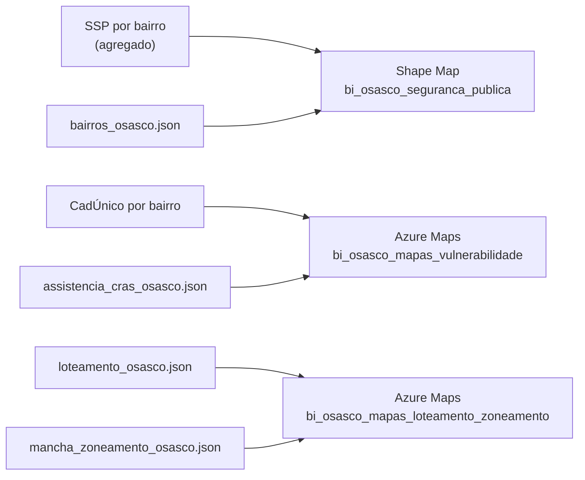
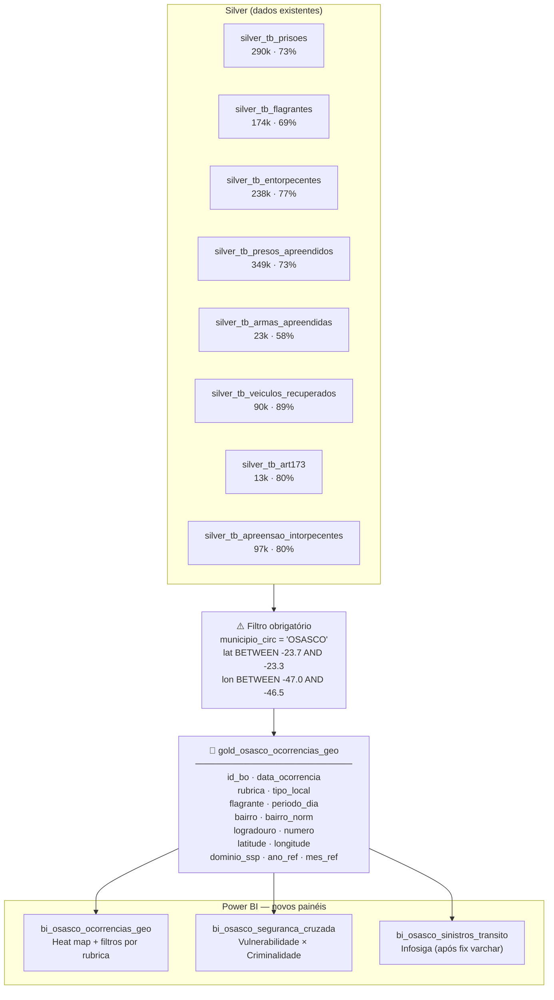
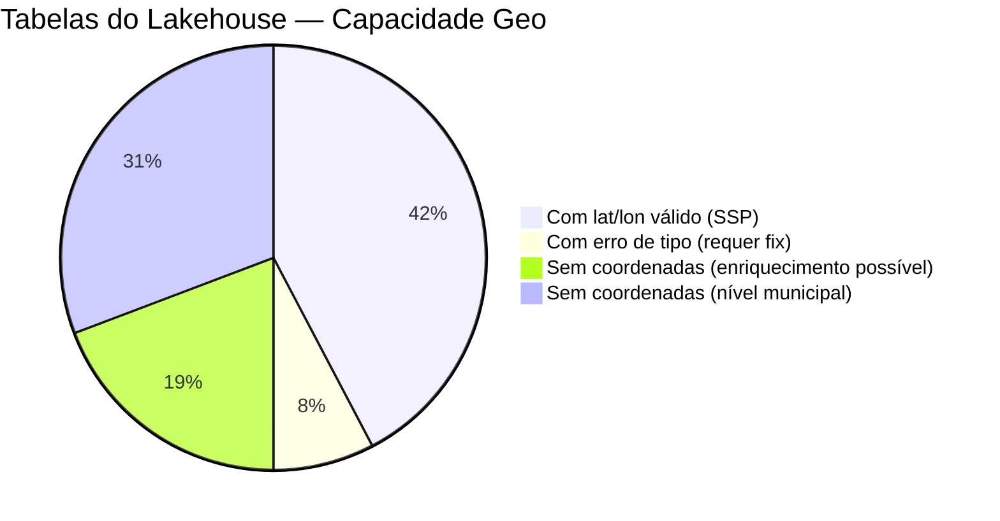

# Possibilidades de Geolocalização — Osasco (VMC)

> Diagnóstico completo das capacidades geoespaciais do **`lh_dados_publicos`** (lakehouse de produção dos dados SSP).  
> Fonte: `geo_osasco/levantamento_geo_lakehouse.py` · executado em 2026-06-30.  
> Objetivo: mapear o que existe, o que falta e o que pode ser construído.

> [!success] Levantamento concluído em 30/06/2026 — lh_dados_publicos
> Migração confirmada: os dados SSP estão em **`lh_dados_publicos.silver`**, não em `lh_cidade_inteligente_osasco`.  
> Consulte a [[Documentação_Fabric/Dados Públicos/spec_drive_semana_30_06_2026|Spec Semana 30/06]] para o plano de criação dos Gold de mapa.

---

## 1. Visão Geral do Ecossistema Geo



---

## 2. Inventário — Tabelas com Lat/Lon no lh_dados_publicos

> [!info] Todas as tabelas com coordenadas diretas são do domínio **Segurança Pública (SSP)**
> Levantamento de 30/06/2026 identificou **10 tabelas** em `lh_dados_publicos.silver` com lat/lon. **CRS: EPSG:4326 WGS84** (dados do estado inteiro de SP — filtro por município obrigatório).

### 2.1 Tabelas Confirmadas em lh_dados_publicos.silver

| Tabela Silver | Linhas | Col. Município | Domínio | Gold de Mapa |
|---------------|-------:|----------------|---------|-------------|
| `ssp_criminais` | 5.168.102 | `nome_municipio_circunscricao` | Ocorrências gerais | `osasco_ssp_criminais_geo` |
| `ssp_dados_criminais` | 1.197.973 | `nome_municipio_circunscricao` | Criminais detalhado | `osasco_ssp_dados_criminais_geo` |
| `ssp_prisoes` | 416.639 | `nome_municipio_circ` | Prisões | `osasco_ssp_prisoes_geo` |
| `ssp_presos_apreendidos` | 495.039 | `nome_municipio_circ` | Presos/Apreendidos | `osasco_ssp_presos_geo` |
| `ssp_entorpecentes` | 348.199 | `nome_municipio_circ` | Entorpecentes | `osasco_ssp_entorpecentes_geo` |
| `ssp_flagrantes` | 254.656 | `nome_municipio_circ` | Flagrantes | `osasco_ssp_flagrantes_geo` |
| `ssp_apreensao_entorpecentes` | 140.964 | `nome_municipio_circ` | Apreensão drogas | `osasco_ssp_apreensao_entorpecentes_geo` |
| `ssp_veiculos_recuperados` | 121.558 | `nome_municipio_circ` | Veículos | `osasco_ssp_veiculos_geo` |
| `ssp_armas_apreendidas` | 32.442 | `nome_municipio_circ` | Armas | `osasco_ssp_armas_geo` |
| `ssp_art173` | 19.888 | `nome_municipio_circ` | Art. 173 CP | `osasco_ssp_art173_geo` |

> [!warning] NaN/Infinity nos Parquet — não bloqueia os Gold notebooks
> O SQL Analytics Endpoint (T-SQL) não consegue ler essas tabelas por NaN em colunas numéricas.  
> O **Spark no Fabric lê NaN sem erro** — os Gold notebooks rodam normalmente com `spark.table()`.  
> Fix nos Silver notebooks: `.replace([float('inf'), float('-inf')], None)` antes de gravar.

### 2.2 Tabelas com lat/lon inutilizável (fora do escopo)

| Tabela | Problema | Situação |
|--------|----------|----------|
| `silver.osasco_seg_viaria_sinistros` | lat/lon armazenado como varchar não-numérico | ❌ Requer fix no Silver |
| `bronze.osasco_seg_viaria_sinistros` | Idem, 1.39M linhas | ❌ Requer fix no Silver |

---

## 3. Camadas GeoJSON Disponíveis (Polígonos)

> [!success] 6 camadas prontas em EPSG:4326 — sem necessidade de conversão
> Arquivos locais em `Mapas_SSP_Osasco/geojson/`, produzidos por `scripts/converter_shapefiles_osasco.py`.

```
📁 Mapas_SSP_Osasco/geojson/
│
├── 🗺️  bairros_osasco.json            ← 89 bairros · join: NOME_NORM
├── 🏘️  loteamento_osasco.json          ← loteamentos com status · join: NOME_LOTEAMENTO  
├── 🎨  mancha_zoneamento_osasco.json   ← zoneamento 2024 por categoria · join: ZONA_2024
├── 🗾  macrozoneamento_osasco.json     ← 12 macrozonas · join: SIGLA
├── 🏥  assistencia_cras_osasco.json   ← territórios CRAS · join: CRAS
└── 🔲  limite_municipal_osasco.json   ← contorno do município
```

| Camada | Geometria | Atributos-chave | Visual PBI recomendado |
|--------|-----------|-----------------|------------------------|
| Bairros | Polígono | `NOME_NORM`, `area_m2`, `totpopcens` | Shape Map · Azure Maps Reference Layer |
| Loteamento | Polígono | `NOME_LOTEAMENTO`, `situacao`, `ano_aprovacao`, `area_m2` | Azure Maps Reference Layer |
| Zoneamento 2024 | Polígono | `ZONA_2024`, `usos`, `to_perc`, `tp_perc`, `lote_min_m2` | Azure Maps Reference Layer |
| Macrozoneamento | Polígono | `SIGLA`, `descricao`, `ca_max`, `densidade_hab_ha` | Azure Maps Reference Layer |
| CRAS | Polígono | `CRAS` | Azure Maps Reference Layer |
| Limite municipal | Polígono | — | Contorno decorativo |

---

## 4. Domínios Sem Coordenadas Diretas

> [!note] Estes domínios **podem ter mapas** mas precisam de estratégia indireta (join por bairro/CEP ou geocodificação)

| Domínio | Tabelas Gold | Dado Geo Disponível | Estratégia para Mapa |
|---------|-------------|---------------------|----------------------|
| CadÚnico | `gold_cad_unico_*` (12 tabelas) | CEP → bairro via `Files/cadastro_unico/cep_bairros.csv` | Join CEP → bairro → centroide |
| RMA/CRAS | `gold_rma_cras_*` | Unidade CRAS (10 unidades) | Join `CRAS` → `assistencia_cras_osasco.json` |
| RAIS / CAGED | `gold_rais`, `gold_sql_caged` | Município apenas | Nível municipal — mapa único |
| BPC | `gold_osasco_bpc` | Município apenas | Nível municipal |
| Bolsa Família | `gold_pbf` | Município apenas | Nível municipal |
| Bolsa Trabalho | `gold_bolsa_trabalho` | Município apenas | Nível municipal |
| Obras/Alvarás | `gold_obras_*` | Endereço textual (sem lat/lon) | Geocodificação via Azure Maps API |
| Segurança Viária | `gold_seguranca_viaria` | ⚠️ `silver_infosiga_sinistros` tem lat/lon como varchar | Corrigir tipo → habilita mapa de sinistros |
| Carta de Serviços | `gold_carta_servicos` | Endereço textual | Geocodificação ou agregação por bairro |

---

## 5. Possibilidades de Visualização

### 5.1 Mapa já existente ✅



### 5.2 Possibilidades Novas — Mapa de Pontos (Alta Prioridade)

> [!tip] Os dados SSP têm **lat/lon por evento** — nível de rua, não só por bairro. Isso habilita visuais muito mais ricos do que o Shape Map atual.

#### 🔴 Mapa de Calor — Ocorrências por Localização

```
Fonte:  gold_osasco_violencia_mulher  (230k pontos)
        silver_tb_prisoes             (290k pontos)
        silver_tb_entorpecentes       (238k pontos)
        ↓ filtrar MunicipioCircunscricao = 'OSASCO'

Visual: Azure Maps → Heat Map Layer
Filtros: Ano/Mês, Rubrica, Tipo Local, Flagrante
```

**Campos disponíveis para filtros:**
- `Rubrica` — tipo de crime (ex: "Furto", "Roubo", "Homicídio")
- `Tipo Local` — "Via Pública", "Residência", "Comércio"
- `Flagrante` — Sim/Não
- `Periodo Estimado` — Manhã / Tarde / Noite / Madrugada
- `Dia Semana` — padrão temporal
- `Bairro` + `Logradouro` — granularidade fina

#### 🟡 Mapa de Veículos Recuperados

```
Fonte:  silver_tb_veiculos_recuperados  (90k linhas · 88.9% coord)
        ↓ filtrar municipio = OSASCO

Visual: Azure Maps → Pontos com ícone de veículo
Filtros: Tipo de veículo, Ano, Bairro
```

#### 🟠 Mapa de Apreensão de Drogas / Armas

```
Fonte:  silver_tb_entorpecentes         (238k · 77.2% coord)
        silver_tb_apreensao_intorpecentes (97k · 79.9%)
        silver_tb_armas_apreendidas      (23k · 58% coord)

Visual: Azure Maps → Pontos ou Cluster por tipo
```

#### 🔵 Mapa de Sinistros de Trânsito (requer fix)

```
Fonte:  silver_infosiga_sinistros  ← lat/lon armazenado como VARCHAR
                                     ⚠️ requer TRY_CAST no notebook Silver

Visual: Azure Maps → Heat Map
Filtros: Tipo de sinistro, Gravidade, Ano/Mês
```

### 5.3 Possibilidades Novas — Enriquecimento Espacial (Cruzamentos)

> [!example] Spatial Join — cruzar pontos de evento com polígonos de zona

#### Cruzamento: Ocorrências × Zoneamento

```
gold_osasco_violencia_mulher  (lat/lon por evento)
    ↓ spatial join (Python geopandas) com
mancha_zoneamento_osasco.json  (polígono de zona 2024)
    ↓
→ Novas colunas: ZONA_2024, usos, to_perc
→ Pergunta: "Quais zonas concentram mais ocorrências de violência doméstica?"
```

#### Cruzamento: Vulnerabilidade × Segurança por Bairro

```
gold_cad_unico_* (indicadores por bairro via CEP join)
    +
silver_tb_prisoes filtrado (contagem por bairro)
    ↓ join por NOME_NORM / bairro_norm
→ Painel: Índice de Vulnerabilidade vs. Índice de Criminalidade por bairro
→ Visual: Shape Map com gradiente duplo (scatter choropleth)
```

#### Cruzamento: Prisões × Macrozoneamento

```
silver_tb_flagrantes (lat/lon por evento)
    ↓ spatial join com
macrozoneamento_osasco.json
→ Pergunta: "Qual macrozona tem maior concentração de flagrantes?"
→ Visual: Bar chart + mapa de referência
```

### 5.4 Possibilidades Futuras — Geocodificação

> [!question]- Obras e Carta de Serviços (sem lat/lon hoje)
> Tabelas de **obras** e **carta de serviços** têm endereço textual mas não coordenadas.  
> Para habilitar mapas desses domínios, seria necessário:
> 1. **Geocodificação via Azure Maps API** — POST `/geocode` com endereço → retorna lat/lon  
> 2. Armazenar resultado em coluna `latitude` / `longitude` no Gold  
> 3. Execução única + atualização incremental (só novos registros sem coord)
> 
> Custo estimado: ~R$0,05 / 1.000 chamadas na tier gratuita Azure Maps.

---

## 6. Arquitetura Recomendada — Gold Unificada Geo



> [!abstract] Decisão de arquitetura
> Recomendada **Gold unificada** (`gold_osasco_ocorrencias_geo`) em vez de múltiplos Golds individuais por domínio SSP. Motivo: os 8 Silver têm schema homogêneo (mesmas colunas lat/lon, municipio, bairro, data). Uma Gold unificada com coluna `dominio_ssp` (ex: `'prisoes'`, `'flagrantes'`, `'entorpecentes'`) permite filtro dinâmico no Power BI sem multiplicar modelos.

---

## 7. Diagnóstico de Cobertura por Domínio



| Status | Domínios | Caminho para mapa |
|--------|----------|------------------|
| ✅ **Pronto** | SSP (violência, prisões, flagrantes, drogas, armas, veículos) | Filtrar municipio + usar lat/lon existente |
| ⚠️ **Fix menor** | Infosiga sinistros, tb_dados_criminais | Corrigir varchar→float no Silver |
| 🔶 **Join possível** | CadÚnico (CEP→bairro), RMA (CRAS→polígono) | Join auxiliar já existe parcialmente |
| 🔷 **Geocodificação** | Obras, Carta de Serviços | Azure Maps API — esforço médio |
| ⬜ **Apenas municipal** | RAIS, CAGED, BPC, Bolsa Família/Trabalho, Censo | Dados sem granularidade geográfica útil |

---

## 8. Resumo de Prioridades

> [!todo] Roadmap Geo — Osasco

- [ ] **P1 — Criar `gold_osasco_ocorrencias_geo`** — notebook Silver→Gold unificando 8 tabelas SSP com filtro Osasco e validação de range lat/lon
- [ ] **P2 — Painel `bi_osasco_ocorrencias_geo`** — Azure Maps heat map com filtros por rubrica, período, bairro, tipo local
- [ ] **P3 — Fix varchar** em `silver_infosiga_sinistros` → habilita mapa de sinistros de trânsito
- [ ] **P4 — Painel Sinistros** — `bi_osasco_sinistros_transito` com Infosiga após fix
- [ ] **P5 — Cruzamento espacial** CadÚnico × SSP por bairro → painel de vulnerabilidade × segurança

---

## 9. Links Relacionados

- [[Documentação_Fabric/Osasco/mapas-ssp-osasco|Pipeline Mapas SSP Osasco]] — pipeline existente: normalização + Shape Map
- [[Documentação_Fabric/Osasco/mapas_loteamento_zoneamento|Painel Loteamento / Zoneamento]] — Azure Maps Reference Layer (próximo a publicar)
- [[Documentação_Fabric/Osasco/guia_pbi_mapas_completo|Guia PBI — Mapas Urbanos (6 sub-abas)]] — guia completo de configuração
- [[Documentação_Fabric/Osasco/MAPEAMENTO_PAINEIS_PBI_OSASCO|Mapeamento Painéis PBI Osasco]] — catálogo de 24 painéis

%%
Script de levantamento: geo_osasco/levantamento_geo_lakehouse.py
Outputs: geo_osasco/output/levantamento_geo.csv · levantamento_geo.xlsx · amostra_*.csv
%%
