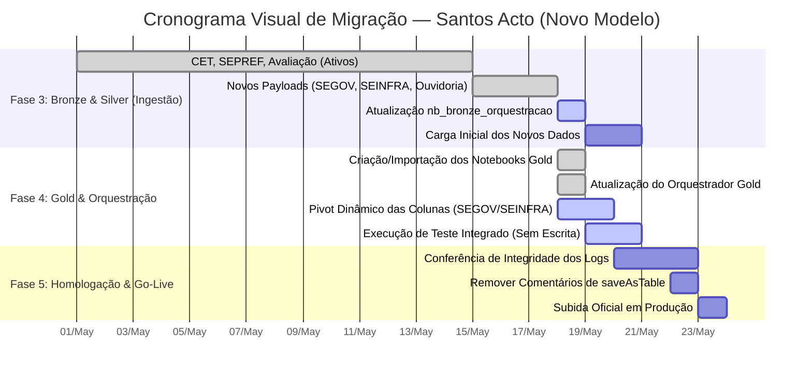

# 🗺️ Roadmap e Passo a Passo: Migração de Serviços Acto (Santos)

Este documento serve como o **check-list executivo** e o **Roadmap Visual** para a replicação dos pipelines de Santos (baseados em API Acto com Payload) no ambiente do **Microsoft Fabric** (`lh_solicitacoes_acto`).

---

## 🧭 1. Roadmap Gráfico da Migração



### 📍 Mapeamento de Status
- **Fase 3 (Bronze & Silver):** CET, SEPREF, Avaliação e os Payloads locais das novas fontes já estão concluídos. O orquestrador bronze está sendo atualizado no Fabric neste momento (`active`).
- **Fase 4 (Gold & Orquestração):** Os notebooks com estrutura de Pivot dinâmico e o orquestrador geral já foram criados (`done`). Próxima etapa é rodar o teste integrado (`active`) sem gravação física para validar as colunas na camada Gold.
- **Fase 5 (Homologação & Go-Live):** Planejado para ocorrer após as validações da Fase 4.

---

## 📦 2. Mapeamento e Inclusão dos 6 Payloads no OneLake

Para garantir a máxima integridade e evitar falhas de versão, mapeamos abaixo a localização exata de cada um dos **6 arquivos JSON** (seja na pasta do Lakehouse legado ou nos novos arquivos gerados localmente):

### 📥 Grupo A: Payloads Existentes no Lakehouse Legado (`lh_cidade_inteligente_santos`)
Estes arquivos já estavam operando e podem ser copiados/baixados diretamente do OneLake:
*   **Onde estão no Fabric antigo:** `lh_cidade_inteligente_santos` > `Files` > `acto_gestao_api_payload`
*   **Para onde devem ir no Novo LH:** `lh_solicitacoes_acto` > `Files` > `payloads`
    - [ ] **`payload_obras.json`** (Cópia direta da pasta antiga no Fabric)
    - [ ] **`payload_santos_avaliacao.json`** (Cópia direta da pasta antiga no Fabric)
    - [ ] **`payload_santos_curso_motorista.json`** (Cópia direta da pasta antiga no Fabric)

---

### 💻 Grupo B: Novos Payloads (Extraídos dos Notebooks Gold Legados)
Estes payloads **não existiam como arquivos estáticos** na pasta antiga do Fabric, pois estavam "hardcoded" (embutidos) dentro do código dos antigos notebooks Gold. Nós os extraímos e estruturamos como novos JSONs.
*   **Onde estão localmente (Origem):** `Mapeamento_fabric/Acto Cidade Inteligente/Acto/payloads/`
*   **Para onde devem ir no Novo LH (Destino):** `lh_solicitacoes_acto` > `Files` > `payloads/`
    - [ ] **`payload_santos_segov.json`** (Subir da sua máquina local)
    - [ ] **`payload_santos_seinfra.json`** (Subir da sua máquina local)
    - [ ] **`payload_santos_ouvidoria_manifestacao.json`** (Subir da sua máquina local)

---

## ⚙️ 3. Atualização do Orquestrador Bronze (`nb_bronze_orquestracao`)

- [ ] Abra o notebook **`nb_bronze_orquestracao`** no Fabric.
- [ ] Localize a célula com a definição da lista `fontes = [...]`.
- [ ] Substitua o conteúdo da célula inteira pelo código a seguir (que unifica todas as fontes do Roadmap):

```python
fontes = [
    {
        "payload_path": "/lakehouse/default/Files/payloads/payload_santos_cet.json",
        "token": TOKEN_SANTOS,
        "id_fonte": "santos_cet",
        "municipio": "Santos",
        "secretaria": "CET",
        "unidade_organizacional": "CET",
    },
    {
        "payload_path": "/lakehouse/default/Files/payloads/payload_santos_sepref_consolidado.json",
        "token": TOKEN_SANTOS,
        "id_fonte": "santos_sepref",
        "municipio": "Santos",
        "secretaria": "SEPREF",
        "unidade_organizacional": "SEPREF",
    },
    {
        "payload_path": "/lakehouse/default/Files/payloads/payload_osasco_atendimento_cras.json",
        "token": TOKEN_OSASCO,
        "id_fonte": "osasco_atendimento_cras",
        "municipio": "Osasco",
        "secretaria": "SAS",
        "unidade_organizacional": "CRAS",
    },
    {
        "payload_path": "/lakehouse/default/Files/payloads/payload_osasco_atendimento_trabalhador.json",
        "token": TOKEN_OSASCO,
        "id_fonte": "osasco_atendimento_trabalhador",
        "municipio": "Osasco",
        "secretaria": "SETRE",
        "unidade_organizacional": "SETRE",
    },
    {
        "payload_path": "/lakehouse/default/Files/payloads/payload_santos_segov.json",
        "token": TOKEN_SANTOS,
        "id_fonte": "santos_segov",
        "municipio": "Santos",
        "secretaria": "SEGOV",
        "unidade_organizacional": "SEGOV",
    },
    {
        "payload_path": "/lakehouse/default/Files/payloads/payload_santos_seinfra.json",
        "token": TOKEN_SANTOS,
        "id_fonte": "santos_seinfra",
        "municipio": "Santos",
        "secretaria": "SEINFRA",
        "unidade_organizacional": "SEINFRA",
    },
    {
        "payload_path": "/lakehouse/default/Files/payloads/payload_santos_ouvidoria_manifestacao.json",
        "token": TOKEN_SANTOS,
        "id_fonte": "santos_ouvidoria_manifestacao",
        "municipio": "Santos",
        "secretaria": "OUVIDORIA",
        "unidade_organizacional": "OUVIDORIA",
    },
    {
        "payload_path": "/lakehouse/default/Files/payloads/payload_santos_avaliacao.json",
        "token": TOKEN_SANTOS,
        "id_fonte": "santos_avaliacao",
        "municipio": "Santos",
        "secretaria": "OUVIDORIA",
        "unidade_organizacional": "AVALIACAO",
    },
    {
        "payload_path": "/lakehouse/default/Files/payloads/payload_santos_curso_motorista.json",
        "token": TOKEN_SANTOS,
        "id_fonte": "santos_curso_motorista",
        "municipio": "Santos",
        "secretaria": "CET",
        "unidade_organizacional": "CURSO_MOTORISTA",
    },
    {
        "payload_path": "/lakehouse/default/Files/payloads/payload_obras.json",
        "token": TOKEN_SANTOS,
        "id_fonte": "santos_obras",
        "municipio": "Santos",
        "secretaria": "OBRAS",
        "unidade_organizacional": "OBRAS",
    },
]
```

- [ ] Execute a célula para verificar erros de sintaxe.

---

## 🥇 4. Implantação dos Notebooks Gold

Os notebooks Gold lêem a tabela genérica empilhada (`silver_fato_campos`), filtram pela fonte correspondente e aplicam um pivoteamento dinâmico baseado na lista de colunas específicas.

- [ ] Importe no workspace do Fabric (ou crie manualmente) os seguintes notebooks Gold gerados localmente (caminho local: `Acto/nbs/nbs_gold/`):
  - [ ] **`nb_gold_santos_segov`**
  - [ ] **`nb_gold_santos_seinfra`**
  - [ ] **`nb_gold_santos_ouvidoria_manifestacao`**
  - [ ] **`nb_gold_santos_avaliacao`**
  - [ ] **`nb_gold_santos_curso_motorista`**
  - [ ] **`nb_gold_santos_obras`**

> ⚠️ **Salvaguarda Importante:** As escritas Delta (`df_gold.write...saveAsTable()`) estão intencionalmente comentadas em todos esses notebooks novos para evitar escritas não validadas em produção.

---

## 🔗 5. Atualização do Orquestrador Gold (`_nb_gold_orquestracao`)

- [ ] Abra o notebook **`_nb_gold_orquestracao`** no Fabric.
- [ ] Atualize a célula de execução incluindo os `%run` dos novos notebooks:

```python
%run ./nb_gold_santos_cet
%run ./nb_gold_santos_sepref
%run ./nb_gold_santos_segov
%run ./nb_gold_santos_seinfra
%run ./nb_gold_santos_ouvidoria_manifestacao
%run ./nb_gold_santos_avaliacao
%run ./nb_gold_santos_curso_motorista
%run ./nb_gold_santos_obras
```

---

## ✅ 6. Validação e Ativação em Produção

- [ ] Execute o orquestrador Bronze por completo e confirme se as 10 fontes são carregadas na camada Silver sem erros.
- [ ] Execute o orquestrador Gold e valide através do `display()` se os dataframes pivotados estão com os campos corretos.
- [ ] Após a homologação e conferência visual com a equipe de negócios, remova o comentário `#` da linha de gravação `.saveAsTable(...)` em cada notebook Gold para persistir as tabelas de forma oficial na camada Gold física do OneLake.

## Relacionados

- [[Documentação_Fabric/Acto/00_INDEX_ACTO|Índice Acto]]
- [[Documentação_Fabric/specs/SPEC_DRIVE_ROADMAP_MIGRACAO|Spec — Roadmap da Migração]]
- [[Documentação_Fabric/Santos/00_INDEX_SANTOS|Índice Santos]]
