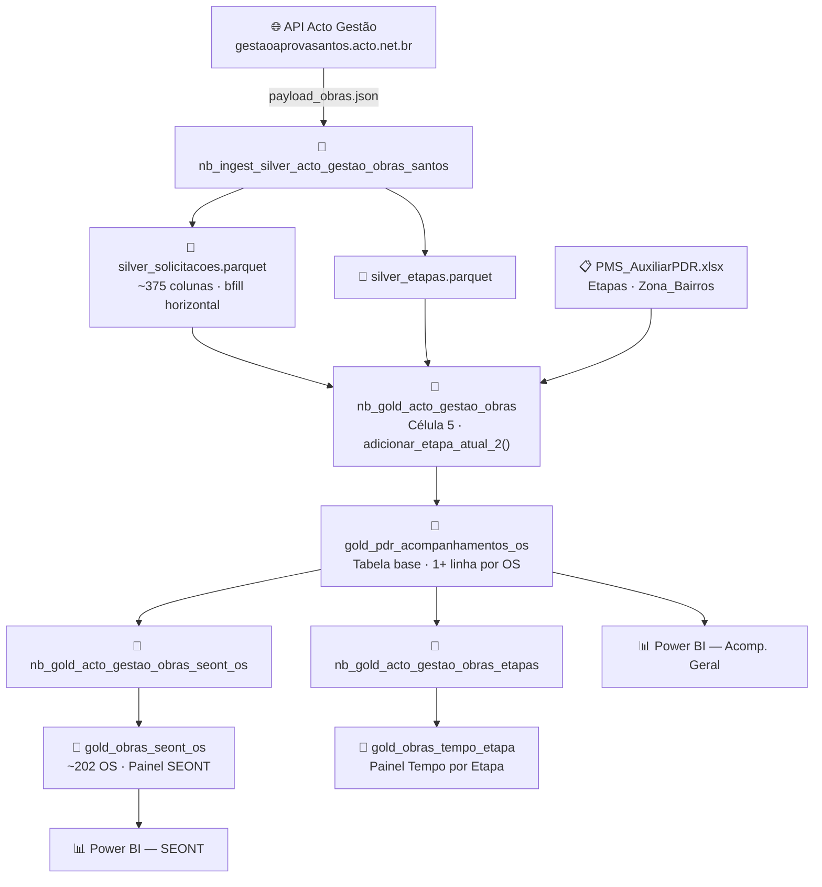

# Processo Obras Santos

Pipeline de dados que ingere solicitações de obras da API do [[Projetos/acto-santos-pipeline|Acto Gestão]], transforma em tabelas Gold no [[Conhecimento/Fabric/fabric-workspace-acto-cidade-inteligente|Microsoft Fabric]] e alimenta painéis no [[Conhecimento/PowerBI/dashboard-gestao-prazos-santos|Power BI]].

Cobre todos os serviços gerenciados pela SEONT (Seção de Obras Novas e Tecnologia): alvarás, reformas, habite-se, demolições, cadastros profissionais e serviços correlatos.

> [!info] Contexto no Vault
> Este projeto faz parte de [[Projetos/acto-santos-pipeline|Pipeline ACTO Santos]] (subdomínio `obras`). Workspace Fabric: [[Conhecimento/Fabric/fabric-workspace-acto-cidade-inteligente|Acto Cidade Inteligente]]. Erros e soluções: [[Monitoramento/erros-e-solucoes]].

---

## Arquitetura



> [!warning] Ordem obrigatória de execução
> `nb_ingest_silver` → `nb_gold_acto_gestao_obras` → `nb_gold_acto_gestao_obras_seont_os`
> Nunca execute o notebook SEONT antes do Gold base terminar com sucesso.

---

## Notebooks

| Notebook | Entrada | Saída |
|---|---|---|
| `nb_ingest_silver_acto_gestao_obras_santos` | API + `payload_obras.json` | 2 Parquets Silver |
| `nb_gold_acto_gestao_obras` | Silver + `AuxiliarPDR.xlsx` | `gold_pdr_acompanhamentos_os` |
| `SEONT/nb_gold_acto_gestao_obras_seont_os` | Gold base + Silver solicitações | `gold_obras_seont_os` |
| `nb_gold_acto_gestao_obras_etapas` | Silver + API por OS | `gold_obras_tempo_etapa` |
| `explorar_gold_fabric.ipynb` | SQL Analytics Endpoint (pyodbc) | — exploração local |

### Células-chave: `nb_gold_acto_gestao_obras`

| Célula | O que faz |
|---|---|
| **5** | `adicionar_etapa_atual_2()` — determina etapas vigentes; preserva todas as etapas abertas |
| **9** | Normalização de bairro: NFC unicode + uppercase + strip + correções de grafia |
| **10** | Join `bairro_pad → zona` via `AuxiliarPDR.xlsx` (aba `Zona_Bairros`) |
| **11** | Save: `str.strip()` em `etapa_atual`, remove colunas artefato, cria `zona_aplicavel` |

### Células-chave: `nb_gold_acto_gestao_obras_seont_os`

| Célula | O que faz |
|---|---|
| **8** | Calcula `flag_seont`; zera `analista_responsavel` para etapas não-SEONT |
| **10** | Calcula `executor_responsavel` com regra por tipo de etapa |
| **13** | `COLUNAS_FINAIS`: inclui `flag_multiplas_etapas` e `zona_aplicavel` |

---

## Decisões de Design

### Múltiplas Etapas Abertas por OS

> [!bug] Problema original (corrigido em 2026-04-08)
> O Acto Gestão pode abrir N etapas com `dataEtapaFim = NULL` simultaneamente para a mesma OS. O pipeline antigo usava `drop_duplicates`, mantendo apenas uma — se a etapa mantida não fosse SEONT, a OS desaparecia do painel.
>
> **Exemplo confirmado:** OS 325698 tinha 3 etapas abertas (COMUNICAR INICIO DE OBRAS + SEONT - ANÁLISE TÉCNICA + ETAPA RESUMO). O `drop_duplicates` mantinha "ETAPA RESUMO" → `flag_seont = 0` → OS ausente do painel SEONT.

> [!success] Solução implementada — `adicionar_etapa_atual_2()`
> A função **preserva todas as etapas abertas** (pode haver N linhas por OS).
> OS sem nenhuma etapa aberta recebem fallback da última etapa fechada (1 linha).
> A flag `flag_multiplas_etapas = 1` sinaliza OS nessa condição.

### `analista_responsavel` e `executor_responsavel`

- `analista_responsavel` é extraído do Silver via `bfill` horizontal nas colunas "Esta solicitação deverá ser analisada por Z1/Z2/Z3"
- Preenchido apenas após distribuição pela chefia SEONT (~3,5% das OS — comportamento esperado)
- **Zerado** explicitamente para `flag_seont = 0` (conceito exclusivo da SEONT)

Regra do `executor_responsavel`:

| Condição | `executor_responsavel` |
|---|---|
| Etapa SEONT + executor atribuído | `executor_atual` |
| Etapa SEONT + sem executor | `analista_responsavel` (analista por zona) |
| Etapa não-SEONT | `executor_atual` (sem fallback para analista) |

### `zona_aplicavel`

Campo `int` (0/1). Serviços sem relevância geográfica recebem `zona_aplicavel = 0` — `zona = NULL` é ==comportamento esperado==, não gap de qualidade.

Serviços com `zona_aplicavel = 0`: `INSCRIÇÃO DE PROFISSIONAL (PF/PJ)`, `RENOVAÇÃO DE CADASTRO (PF/PJ)`, `PROVIDÊNCIA`.

### Join bairro → zona

O join usa `bairro_pad` (bairro normalizado: NFC + upper + strip). Se `bairro_consolidado = NULL` na gold, o `Bairro` veio nulo da API — ==re-executar o Silver resolve==, sem alterar o `AuxiliarPDR.xlsx`.

### Campo Bairro no Payload — dois tipos

| Campo API | Serviços |
|---|---|
| `TXT_IMOB_LOGRBAIRRO` | NOVAS EDIFICAÇÕES, HABITE-SE, DEMOLIÇÃO, ACOMPANHAMENTO DE OBRAS, etc. |
| `COB_IMOB_LOGRBAIRRO` | MANUTENÇÃO DE FACHADAS, ASSUNÇÃO DE RESP. TÉCNICA, REFORMA E/OU LEGALIZAÇÃO |

Ambos com `"tit": "Bairro"` — o Gold lê via `df.filter(like="Bairro")`. Nenhuma distinção necessária no Gold.

---

## Campos das Tabelas Gold

### `gold_pdr_acompanhamentos_os`

| Campo | Origem | Descrição |
|---|---|---|
| `seqFluxo` | Silver etapas | ID da OS no Acto Gestão |
| `n_da_solicitacao` | Silver solicitações | Número visível da OS |
| `servico` | Silver solicitações | Tipo de serviço |
| `etapa_atual` | Silver etapas | Etapa vigente (pode haver N linhas por OS) |
| `executor_atual` | Silver etapas | Executor da etapa |
| `bairro_raw` | Silver solicitações | Bairro original (sem normalização) |
| `bairro_pad` | Derivado | Bairro normalizado (NFC + upper + strip + correções) |
| `bairro_consolidado` | `bairro_pad` após correções | Chave usada no join zona |
| `zona` | Join `bairro_pad → AuxiliarPDR` | Z1 / Z2 / Z3 |
| `zona_aplicavel` | Derivado por serviço | 1 = esperado ter zona; 0 = serviço sem endereço |
| `aux_setor_responsavel` | Join `etapa → AuxiliarPDR` | Setor responsável pela etapa |
| `flag_multiplas_etapas` | Derivado | 1 = OS tem N etapas abertas simultâneas |

### `gold_obras_seont_os`

| Campo | Origem | Descrição |
|---|---|---|
| `flag_seont` | `aux_setor_responsavel` | 1 = etapa pertence à SEONT |
| `analista_responsavel` | Silver via bfill (Z1/Z2/Z3) | Analista por zona; NULL fora da SEONT |
| `executor_responsavel` | Regra SEONT/não-SEONT | Responsável final pela etapa |
| `flag_etapa_aprov` | Derivado | 1 = etapa de aprovação/deliberação |
| `flag_multiplas_etapas` | Propagado do gold base | Idem |
| `zona_aplicavel` | Propagado do gold base | Idem |

---

## Estado Atual das Tabelas (2026-04-08)

### `gold_pdr_acompanhamentos_os` — ~10.954 linhas

| Status | Linhas |
|---|---|
| Finalizado | 6.964 |
| Em atendimento | 2.604 |
| Cancelado | 1.112 |
| Pendente atendimento | 274 |

Nulos relevantes: `zona` 56,5% · `bairro_consolidado` 54,6% · `titulo_profissional` 82,5%

### `gold_obras_seont_os` — ~202 OS

| Etapa | OS |
|---|---|
| REGISTRO DA PUBLICIDADE DO DIARIO OFICIAL | 67 |
| SEONT - ANÁLISE TECNICA - CONFERÊNCIA DOS DADOS | 60 |
| DELIBERAÇÃO SEONT | 37 |
| SEONT CHEFIA - DISTRIBUIÇÃO | 11 |
| Demais | 27 |

`executor_responsavel` nulo em 60/202 (30%) · `zona` nula em 24/202 (12%)

---

## Variáveis e Caminhos no Fabric

| Recurso | Valor |
|---|---|
| Token API | `TOKEN_SANTOS_OBRAS` — em `config_api_acto` |
| Payload API | `/lakehouse/default/Files/acto_gestao_api_payload/payload_obras.json` |
| Silver Parquets | `/lakehouse/default/Files/acto_obras/silver/` |
| AuxiliarPDR | `/lakehouse/default/Files/acto/PMS_AuxiliarPDR.xlsx` |
| SQL Endpoint | `ena6obg6j2cevcppw7dn7yu57a-knnp5frchjbujdik4l3nmgrgsa.datawarehouse.fabric.microsoft.com` |
| Database | `lh_cidade_inteligente_santos` |
| Workspace | **Acto Cidade Inteligente** |

---

## Queries de Validação Pós-Deploy

```sql
-- 1. OS com múltiplas etapas abertas (deve retornar linhas após fix)
SELECT n_da_solicitacao, COUNT(*) AS linhas, MAX(flag_multiplas_etapas) AS flag
FROM gold_pdr_acompanhamentos_os
GROUP BY n_da_solicitacao HAVING COUNT(*) > 1 ORDER BY linhas DESC;

-- 2. Caso de teste principal — OS 325698 (esperado: flag_seont=1, analista=ZANIA MEIRELES)
SELECT n_da_solicitacao, etapa_atual, analista_responsavel,
       executor_responsavel, flag_seont, flag_multiplas_etapas
FROM gold_obras_seont_os WHERE n_da_solicitacao = 325698;

-- 3. Colunas artefato ausentes (esperado: 0 linhas)
SELECT COLUMN_NAME FROM INFORMATION_SCHEMA.COLUMNS
WHERE TABLE_NAME = 'gold_pdr_acompanhamentos_os'
  AND COLUMN_NAME IN ('Executor', 'Etapa');

-- 4. etapa_atual sem variantes por espaço extra
SELECT etapa_atual, COUNT(*) AS total FROM gold_pdr_acompanhamentos_os
WHERE etapa_atual LIKE '%PRÉ ANÁLISE%' GROUP BY etapa_atual;
-- esperado: 1 única variante

-- 5. Gaps reais de zona (zona_aplicavel=1 mas zona NULL)
SELECT servico, bairro_consolidado, COUNT(*) AS total
FROM gold_obras_seont_os WHERE zona IS NULL AND zona_aplicavel = 1
GROUP BY servico, bairro_consolidado ORDER BY total DESC;

-- 6. Distribuição zona_aplicavel
SELECT zona_aplicavel, zona IS NULL AS sem_zona, COUNT(*) AS total
FROM gold_obras_seont_os GROUP BY zona_aplicavel, zona IS NULL ORDER BY zona_aplicavel, sem_zona;
```

---

## Riscos

> [!warning] Power BI — duplicação com `flag_multiplas_etapas`
> Medidas DAX que usam `COUNTROWS` duplicam OS com `flag_multiplas_etapas = 1`.
> Substituir por `DISTINCTCOUNT(gold_pdr_acompanhamentos_os[n_da_solicitacao])` nas medidas de contagem de OS.

| Risco | Mitigação |
|---|---|
| DAX `COUNTROWS` duplica OS com múltiplas etapas | Substituir por `DISTINCTCOUNT(n_da_solicitacao)` |
| Bairros novos não mapeados no `AuxiliarPDR.xlsx` | Query 5 acima identifica gaps; adicionar bairros faltantes na aba `Zona_Bairros` |
| Novas etapas paralelas no Acto Gestão | `flag_multiplas_etapas` monitora automaticamente |
| `analista_responsavel` em apenas ~3,5% das OS | Comportamento esperado — preenchido apenas pós-distribuição pela chefia SEONT |

---

## Pendências (2026-04-13)

- [ ] Upload do `payload_obras_v1.json` no Fabric → `/lakehouse/default/Files/acto_gestao_api_payload/payload_obras.json`
- [ ] Re-executar `nb_ingest_silver_acto_gestao_obras_santos` após novo payload
- [ ] Re-executar `nb_gold_acto_gestao_obras` → `nb_gold_acto_gestao_obras_seont_os`
- [ ] Verificar 16 OS de REFORMA E/OU LEGALIZAÇÃO com `zona` preenchida após re-ingestão
- [ ] Revisar medidas DAX no Power BI — substituir `COUNTROWS` por `DISTINCTCOUNT(n_da_solicitacao)`
- [ ] Validar notebooks atualizados no Fabric (upload `.ipynb`)

---

## Referências

- [[Documentação_Fabric/Santos/obras/ESP_DRIVE_OS_MULTIPLAS_ETAPAS|ESP_DRIVE_OS_MULTIPLAS_ETAPAS]] — especificação técnica dos bugs e soluções (código completo das correções)
- [[GUIA_APLICACAO_FABRIC]] — passo a passo para aplicar mudanças no Fabric (célula a célula)
- ![[pipeline_obras.png]]

## Ver Também

- [[Projetos/acto-santos-pipeline]] — visão geral do projeto ACTO Santos e todos os subdomínios
- [[Conhecimento/Fabric/fabric-workspace-acto-cidade-inteligente]] — workspace completo Acto Cidade Inteligente
- [[Conhecimento/Fabric/pipeline-acto-santos-fabric]] — fluxo de execução Data Factory + notebooks
- [[Conhecimento/PowerBI/dashboard-gestao-prazos-santos]] — dashboard de gestão de prazos Santos
- [[Monitoramento/erros-e-solucoes]] — registro de erros e soluções do pipeline
