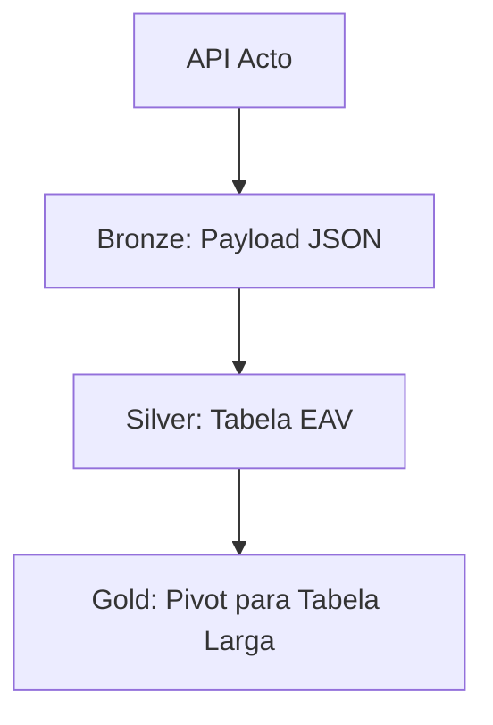

# Arquitetura e Padrões Técnicos

## 1. Modelo Medallion EAV
A arquitetura Acto no Fabric utiliza o padrão **Entity-Attribute-Value** para gerenciar a flexibilidade dos formulários dinâmicos.

## 2. SCD Type 2 (Histórico de Prazos)
Para garantir que o SLA histórico não seja corrompido por mudanças de prazo atuais, utilizamos tabelas de vigência.

| Campo | Tipo | Descrição |
|---|---|---|
| `dt_inicio_vigencia` | DATE | Início do prazo |
| `dt_fim_vigencia` | DATE | Fim do prazo (9999-12-31 se ativo) |

## 3. Padrão Power BI (InMov)
### 3.1 Identidade Visual
- **Títulos:** Segoe UI Bold, 25pt.
- **Gráficos:** Cores harmoniosas (evitar azul/vermelho padrão).
- **Watermark:** "Desenvolvido por InMov" no rodapé.

### 3.2 Estrutura de Abas
1. **Visão Geral:** KPIs de alto nível e Mapa.
2. **Gestão de Prazos:** Análise de SLA e Ordens Vencidas.
3. **Análise de Finalizadas:** Tempo médio de resposta.
4. **Base de Dados:** Tabela detalhada para exportação.

## 4. IA e Sentimento
Uso de **Groq API (Llama 3)** para classificação de manifestações.
- **Tabela:** `gold_avaliacoes_servicos_sentimento` (Append Only).
