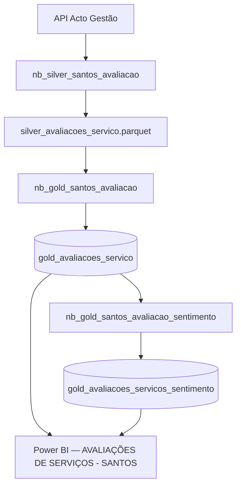

# Avaliação de Serviços Santos — Como a IA Funciona

## Pipeline completo



---

## O que é avaliado

Quando uma Ordem de Serviço é encerrada, o sistema Acto envia ao cidadão um formulário com dois blocos de perguntas:

| Campo                                   | O que captura                                            |
| --------------------------------------- | -------------------------------------------------------- |
| `classificacao_servico_prestado`        | Nota de **1 a 5 estrelas** para o serviço                |
| `obs_classificacao_de_servico_prestado` | Comentário livre do cidadão sobre o serviço              |
| `classificacao_atendimento`             | Nota de 1 a 5 para o **atendimento** recebido            |
| `obs_classificacao_atendimento`         | Comentário sobre o atendimento                           |
| `expectativas`                          | Resultado percebido: **Atendida / Frustrada / Superada** |
| `questao_resolvida`                     | Sim / Não                                                |

---

## Como a IA classifica os comentários

O notebook [[nb_gold_santos_avaliacao_sentimento]] aplica uma **abordagem híbrida em duas camadas**: primeiro regras determinísticas, depois IA para os casos ambíguos.

### Camada 1 — Classificação por regras

Rápida e gratuita. Cobre a maioria dos casos:

| Situação                                   | Resultado                                                             |
| ------------------------------------------ | --------------------------------------------------------------------- |
| Sem comentário ou texto < 5 chars          | Classifica **só pela nota**: ≥4 = positivo, ≤2 = negativo, 3 = neutro |
| Nota ≥ 4 + palavra de elogio detectada     | `positivo / elogio_geral` — método `regra_palavra`                    |
| Nota ≤ 2 + palavra de reclamação detectada | `negativo / reclamacao_grave` — método `regra_palavra`                |

Exemplos de palavras monitoradas:

- **Elogio:** "otimo", "excelente", "parabens", "obrigado", "rapidez", "eficiente"
- **Reclamação:** "pessimo", "horrivel", "nao foi feito", "nao resolvido", "absurdo"

### Camada 2 — IA via Groq API (casos ambíguos)

Quando as regras não chegam a uma conclusão certa (nota 3, ou texto contradiz a nota), o comentário vai para o modelo **LLaMA 3.1 8B** hospedado na Groq.

O prompt enviado é:

```
Analise o seguinte feedback de serviço público e classifique-o.
Nota do Usuário: X/5
Comentário: "..."
Pré-classificação por regras: sentimento=Y, categoria=Z.
Confirme ou ajuste. Responda APENAS um JSON válido com:
"sentimento", "categoria", "tema", "requer_atencao".
```

> [!info] Por que duas camadas?
> A IA só é chamada quando as regras são incertas. Isso reduz custo de API e latência, mantendo precisão nos casos claros (que são a maioria).

---

## Campos gerados pela classificação

Cada OS classificada ganha as seguintes colunas na tabela `gold_avaliacoes_servicos_sentimento`:

| Campo | Valores possíveis |
|---|---|
| `analise_sentimento` | `positivo` / `negativo` / `neutro` |
| `analise_categoria` | `elogio_geral`, `reclamacao_grave`, `sugestao`, `duvida`, `outro`, `sem_comentario` |
| `analise_tema` | tema específico identificado pelo modelo |
| `analise_requer_atencao` | `true` / `false` — flag para casos críticos |
| `analise_metodo` | `regra_nota`, `regra_palavra`, `regra_incerta`, `groq_api` — rastreabilidade do método usado |
| `analise_sentimento_regras` | sentimento que as regras sugeriram antes da IA |
| `palavra_foco` | palavra mais frequente no corpus para aquele comentário |

---

## Processamento incremental

> [!tip] O notebook não reclassifica tudo a cada execução

Fluxo incremental:

1. Lê `gold_avaliacoes_servico` (todos os registros)
2. Lê `gold_avaliacoes_servicos_sentimento` (já processados)
3. Identifica os `seqFluxo` (número da OS) **ainda não classificados**
4. Classifica apenas os novos — com cache em memória para comentários repetidos
5. Grava em modo `append` na tabela de sentimento

---

## Números atuais

| Status | Quantidade |
|---|---|
| Classificadas (com comentário) | **1.340 OS** |
| Sem texto (classificadas só pela nota) | **12.745 OS** |
| **Total** | **~14.085 OS** |

---

## O que o Power BI entrega

O painel **"AVALIAÇÕES DE SERVIÇOS - SANTOS"** tem 4 abas. Ver documentação completa em [[f3_avaliacao_servicos]].

| Aba | Conteúdo |
|---|---|
| Visão Geral | Total enviadas, % respondidas, gráfico Atendida/Frustrada/Superada, ranking de serviços |
| Avaliação do Serviço | Nota média por serviço (0–5 ★), satisfação por mês, tabela OS+nota+comentário |
| Avaliação do Atendimento | Nota de atendimento por OS, satisfação média |
| Base Detalhada | Tabela completa com todos os campos, incluindo classificação de sentimento da IA |

---

## Segurança e conformidade

> [!warning] Dado de cidadão enviado para API externa (Groq / Meta)
> Os comentários são enviados para servidores da Groq nos EUA para processamento pelo LLaMA 3.1. Verificar base legal LGPD para esse fluxo — comentários podem conter dados pessoais implícitos. Texto é truncado em 500 caracteres antes do envio.

| Aspecto | Status |
|---|---|
| API Key exposta no código | Não — usa variável de ambiente `GROQ_API_KEY` |
| Dado pessoal saindo do Brasil | **Verificar base legal LGPD** |
| Autenticação no Fabric | AAD (`ActiveDirectoryInteractive`) — OK para uso manual |
| Integridade dos IDs | Risco [[Referencia_Tecnica_Fabric_Santos_v2_0#R3\|R3]] ativo — `overwrite` na origem + `append` no sentimento |

---

## Riscos ativos relacionados

- **R3** — `gold_avaliacoes_servico` usa `overwrite`; `gold_avaliacoes_servicos_sentimento` usa `append`. Se a base for reescrita e o sentimento falhar, os IDs ficam desalinhados silenciosamente.
- **R7** — `nb_utils_ingest_acto_gestao` chama `raise_for_status()` sem `try/except`. Falha na API propaga para a cadeia de avaliação.

---

## Notebooks relacionados

- [[nb_silver_santos_avaliacao]] — extração e normalização Silver
- [[nb_gold_santos_avaliacao]] — construção da Gold principal
- [[nb_gold_santos_avaliacao_sentimento]] — classificação IA (este pipeline)
