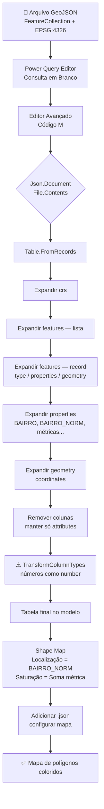

# Guia — Importar GeoJSON (Shapefile) no Power BI com Power Query

> [!tip] Canvas visual disponível
> Veja o fluxo completo em [[CANVAS_GEOJSON_POWERBI|Canvas — Fluxo GeoJSON → Power BI]]

---

## Pré-requisitos

| Item | Detalhe |
|---|---|
| Arquivo GeoJSON | Estrutura `FeatureCollection` (ex: `assistencia_cras_osasco.json`) |
| Power BI Desktop | Instalado e atualizado |
| Caminho do arquivo | Completo, sem abreviações (`C:\pasta\arquivo.json`) |

> [!warning] Caminho sem abreviação
> O Power Query rejeita caminhos com `...` truncados. Use sempre o caminho absoluto completo.

---

## Estrutura esperada do GeoJSON

O Power BI Shape Map exige exatamente este formato:

```json
{
  "type": "FeatureCollection",
  "crs": {
    "type": "name",
    "properties": { "name": "EPSG:4326" }
  },
  "features": [
    {
      "type": "Feature",
      "properties": {
        "BAIRRO": "Centro",
        "BAIRRO_NORM": "CENTRO"
      },
      "geometry": {
        "type": "Polygon",
        "coordinates": [[[lng, lat], ...]]
      }
    }
  ]
}
```

> [!danger] Erros fatais de formato
> - **`GeometryCollection`** no lugar de `FeatureCollection` → polígonos não renderizam
> - **Coordenadas em EPSG:3857** (metros) → mapa não renderiza (exige EPSG:4326 em graus)
> - **Sem `properties`** → campo de Localização fica vazio, join falha

---

## Parte 1 — Query Principal (com propriedades + geometria)

### Passo 1: Abrir o Power Query Editor

`Power BI Desktop` → `Página Inicial` → `Transformar dados`

### Passo 2: Criar consulta em branco

`Nova Fonte` → `Consulta em Branco` → renomear (ex: `Vulnerabilidade_Bairros`)

### Passo 3: Abrir o Editor Avançado

`Página Inicial` → `Editor Avançado` → colar o código M abaixo

```powerquery
let
    Fonte = Json.Document(File.Contents("C:\caminho\completo\para\arquivo.json")),
    #"Convertido para Tabela" = Table.FromRecords({Fonte}),
    #"crs Expandido" = Table.ExpandRecordColumn(
        #"Convertido para Tabela", "crs", {"type", "properties"}, {"crs.type", "crs.properties"}),
    #"crs.properties Expandido" = Table.ExpandRecordColumn(
        #"crs Expandido", "crs.properties", {"name"}, {"crs.properties.name"}),
    #"features Expandido" = Table.ExpandListColumn(
        #"crs.properties Expandido", "features"),
    #"features Expandido1" = Table.ExpandRecordColumn(
        #"features Expandido", "features", {"type", "properties", "geometry"},
        {"features.type", "features.properties", "features.geometry"}),
    #"features.properties Expandido" = Table.ExpandRecordColumn(
        #"features Expandido1", "features.properties",
        {"BAIRRO", "BAIRRO_NORM", "CRAS", "cadunico", "pobreza", "bolsa_familia",
         "vulnerabilidade", "cras_vulnerabilidade"},
        {"features.properties.BAIRRO", "features.properties.BAIRRO_NORM",
         "features.properties.CRAS", "features.properties.cadunico",
         "features.properties.pobreza", "features.properties.bolsa_familia",
         "features.properties.vulnerabilidade", "features.properties.cras_vulnerabilidade"}),
    #"features.geometry Expandido" = Table.ExpandRecordColumn(
        #"features.properties Expandido", "features.geometry", {"type", "coordinates"},
        {"features.geometry.type", "features.geometry.coordinates"}),
    #"features.geometry.coordinates Expandido" = Table.ExpandListColumn(
        #"features.geometry Expandido", "features.geometry.coordinates"),
    #"Outras Colunas Removidas" = Table.SelectColumns(
        #"features.geometry.coordinates Expandido",
        {"features.properties.BAIRRO", "features.properties.BAIRRO_NORM",
         "features.properties.CRAS", "features.properties.cadunico",
         "features.properties.pobreza", "features.properties.bolsa_familia",
         "features.properties.vulnerabilidade", "features.properties.cras_vulnerabilidade"}),
    // CRÍTICO: converter colunas numéricas que o JSON carrega como texto
    #"Tipo Alterado" = Table.TransformColumnTypes(
        #"Outras Colunas Removidas",
        {{"features.properties.cras_vulnerabilidade", type number},
         {"features.properties.vulnerabilidade", type number},
         {"features.properties.bolsa_familia", type number},
         {"features.properties.cadunico", type number},
         {"features.properties.pobreza", type number}})
in
    #"Tipo Alterado"
```

> [!danger] Armadilha crítica — tipo texto vs número
> O JSON importa **todos** os valores como texto (`ABC/123`) por padrão.
> Sem o passo `Table.TransformColumnTypes`, as métricas aparecem como **"Contagem = 1"** no Shape Map em vez do valor real.
> **O último passo do código é obrigatório.**

### Passo 4: Verificar o resultado

Após clicar em **Concluído**, a tabela deve mostrar:

| Ícone | Tipo | Colunas esperadas |
|---|---|---|
| `ABC` | Texto | `BAIRRO`, `BAIRRO_NORM`, `CRAS` |
| `1.2` | Decimal | `cadunico`, `pobreza`, `bolsa_familia`, `vulnerabilidade`, `cras_vulnerabilidade` |

O perfil das colunas numéricas deve exibir histograma de distribuição (não só "1" repetido).

---

## Parte 2 — Query Secundária (só atributos, sem geometria)

Use quando o GeoJSON tiver dados tabulares que você quer como tabela separada (ex: territórios por CRAS):

```powerquery
let
    Fonte = Json.Document(File.Contents("C:\caminho\completo\para\territorios.json")),
    #"Convertido para Tabela" = Table.FromRecords({Fonte}),
    #"crs Expandido" = Table.ExpandRecordColumn(
        #"Convertido para Tabela", "crs", {"type", "properties"}, {"crs.type", "crs.properties"}),
    #"crs.properties Expandido" = Table.ExpandRecordColumn(
        #"crs Expandido", "crs.properties", {"name"}, {"crs.properties.name"}),
    #"features Expandido" = Table.ExpandListColumn(
        #"crs.properties Expandido", "features"),
    #"features Expandido1" = Table.ExpandRecordColumn(
        #"features Expandido", "features", {"type", "properties", "geometry"},
        {"features.type", "features.properties", "features.geometry"}),
    #"features.properties Expandido" = Table.ExpandRecordColumn(
        #"features Expandido1", "features.properties",
        {"cras", "CRAS_NORM", "indice_vulnerabilidade_cras"},
        {"cras", "CRAS_NORM", "indice_vulnerabilidade_cras"}),
    #"features.geometry Expandido" = Table.ExpandRecordColumn(
        #"features.properties Expandido", "features.geometry", {"type", "coordinates"},
        {"features.geometry.type", "features.geometry.coordinates"}),
    #"features.geometry.coordinates Expandido" = Table.ExpandListColumn(
        #"features.geometry Expandido", "features.geometry.coordinates"),
    #"Outras Colunas Removidas" = Table.SelectColumns(
        #"features.geometry.coordinates Expandido",
        {"cras", "CRAS_NORM", "indice_vulnerabilidade_cras"}),
    #"Tipo Alterado" = Table.TransformColumnTypes(
        #"Outras Colunas Removidas",
        {{"indice_vulnerabilidade_cras", type number}})
in
    #"Tipo Alterado"
```

---

## Parte 3 — Configurar o Visual Shape Map

### Passo 5: Fechar e Aplicar

`Arquivo` → `Fechar e Aplicar` → aguardar carregamento das tabelas

### Passo 6: Verificar símbolo Σ no painel de Dados

No painel **Dados** (direita), as colunas numéricas devem aparecer com **Σ** (soma).
Se aparecer o ícone de campo simples sem Σ, o tipo ainda está como texto — voltar ao Power Query.

### Passo 7: Configurar o Shape Map

```
Inserir → Mapa de Formas (Shape Map)
  ↓
Localização   → arrastar BAIRRO_NORM  (campo normalizado — join com o GeoJSON)
Saturação     → arrastar campo numérico (ex: cadunico)
  ↓
⚠️  Mudar agregação: clique na seta do campo → selecionar "Soma"
    (padrão é "Contagem" → mostrará "1" para todos os polígonos)
```

### Passo 8: Adicionar o arquivo de mapa

```
Shape Map selecionado → Formatar visual → Configurações do mapa
  → Adicionar mapa → selecionar arquivo .json local
```

---

## Estrutura de Etapas no Power Query (Árvore)

```
Fonte
  └─ Convertido para Tabela
      └─ crs Expandido
          └─ crs.properties Expandido
              └─ features Expandido           ← ExpandListColumn (lista de features)
                  └─ features Expandido1      ← ExpandRecordColumn (type/properties/geometry)
                      └─ features.properties Expandido   ← colunas desejadas
                          └─ features.geometry Expandido
                              └─ features.geometry.coordinates Expandido
                                  └─ Outras Colunas Removidas   ← só colunas finais
                                      └─ Tipo Alterado   ← ⚠️ OBRIGATÓRIO numéricos
```

---

## Diagrama de Fluxo Completo



---

## Checklist de Erros Comuns

| Sintoma | Causa | Solução |
|---|---|---|
| "Contagem = 1" no tooltip | Coluna numérica importada como texto | Adicionar `Table.TransformColumnTypes` no Power Query |
| "Contagem = 1" no tooltip (tipo correto) | Agregação do campo no visual está em "Contagem" | Campo do visual → dropdown → **Soma** |
| `DataSource.NotFound` | Caminho do arquivo com abreviação (`...`) | Usar caminho completo e exato, sem truncamento |
| Polígonos não mapeiam | Campo de Localização errado | Usar campo normalizado (`BAIRRO_NORM` em maiúsculas, sem acentos) |
| 59 linhas em vez de 60 | Passo acidental "Usar Primeira Linha como Cabeçalho" | Excluir passos corrompidos no Power Query (clique direito → "Excluir até o fim") |
| Mapa em branco | GeoJSON com `GeometryCollection` ou EPSG:3857 | Regenerar o GeoJSON como `FeatureCollection` em WGS84 (ver [[geo_mapa_bairros_osasco]]) |
| Join não funciona | Case sensitivity — `"centro"` ≠ `"Centro"` | Normalizar ambos os lados para uppercase sem acento (`BAIRRO_NORM`) |

---

## Boas Práticas

> [!tip] Campo de join sempre normalizado
> Sempre criar `BAIRRO_NORM` (uppercase, sem acento, sem caracteres especiais) no GeoJSON e normalizar a coluna de dados também. Evita 90% dos problemas de join.

> [!tip] Nunca usar `NOME` diretamente como join
> Nomes de bairros têm acentos, hifens, apóstrofes e variações de case entre fontes distintas. `BAIRRO_NORM` é a chave confiável.

> [!info] Shapefile ≠ GeoJSON diretamente
> Se você tem `.shp + .dbf`, precisa converter primeiro. Use:
> - **QGIS**: Exportar camada → Salvar como → GeoJSON, EPSG:4326
> - **Python (geopandas)**: `gdf.to_crs(4326).to_file("output.json", driver="GeoJSON")`
> - **mapshaper.org**: ferramenta online, arrastar shapefile → exportar GeoJSON

---

## Referências

- [[geo_mapa_bairros_osasco|Geo — Mapa Bairros Osasco]] — geração do GeoJSON compatível a partir de shapefile
- [[diagnostico_paineis_osasco_publicos|Diagnóstico Painéis Osasco Públicos]]
- [[Mapeamento_Tecnico_Dados_Publicos|Mapeamento Técnico Dados Públicos]]
- [[CANVAS_GEOJSON_POWERBI|Canvas — Fluxo GeoJSON → Power BI]]
