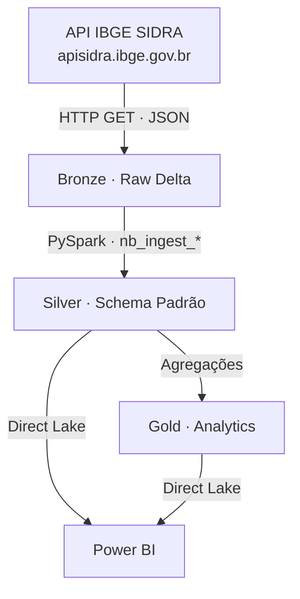

# Mapeamento Técnico — Dados Públicos IBGE/SIDRA

> [!tip] Para Claude
> Leia [[Documentação_Fabric/Dados Públicos/00_INDEX_DADOS_PUBLICOS|Índice Dados Públicos]] primeiro para a visão soberana do projeto.
> Este documento detalha cada notebook, tabela e domínio do framework de dados públicos.

---

## 1. Visão Geral da Arquitetura



**Schema padrão Silver:** `id_municipio · nome_municipio · ano · indicador · valor`

**Fluxo de dependência:**
`nb_ingest_populacao_ibge` → `nb_ingest_pib_ibge` → `nb_ingest_cempre_ibge` → `nb_ingest_caged`

---

## 2. Inventário de Notebooks

| # | Notebook | Domínio | Camada | Saída (Tabela Delta) | Modo |
|---|---|---|---|---|---|
| 1 | `nb_utils_ibge` | Utilitário compartilhado | — | — (funções: `fetch_sidra_fabric`, `save_delta`) | — |
| 2 | `nb_ingest_populacao_ibge` | Demografia | Bronze → Silver | `bronze_ibge_populacao_raw` · `silver_populacao` | overwrite |
| 3 | `nb_ingest_pib_ibge` | Economia | Bronze → Silver | `bronze_ibge_pib_total_raw` · `bronze_ibge_pib_componentes_raw` · `silver_pib` · `silver_pib_componentes` | overwrite |
| 4 | `nb_ingest_cempre_ibge` | Mercado de Trabalho | Bronze → Silver → Gold | `bronze_ibge_cempre_raw` · `silver_cempre` · `gold_empregos_municipais` | overwrite |
| 5 | `nb_ingest_caged` *(Yuri — apenas no Fabric)* | Mercado de Trabalho | Silver | `silver_nova_caged_sp` ⚠️ SP amplo · sem filtro de municípios | append |
| 6 | `nb_ingest_rais_bigquery` | Mercado de Trabalho (RAIS) | Bronze → Silver | `bronze_me_rais_microdados` · `silver_rais` | ✅ Concluído |

---

## 3. Detalhamento por Notebook

### 3.1. `nb_utils_ibge`

**Camada:** Utilitário (`%run ./nb_utils_ibge` nos demais notebooks)

**Funções exportadas:**

| Função | Parâmetros | Retorno |
|---|---|---|
| `fetch_sidra_fabric(table_code, variable, cluster_name, classifications)` | tabela SIDRA, variável, cluster ou `None` (todos), dict de classificações | Spark DataFrame ou `None` |
| `save_delta(df, table_name, mode)` | DataFrame Spark, nome da tabela, modo (`overwrite`) | — |
| `get_all_municipios()` | — | lista de 15 códigos IBGE |
| `get_municipios_by_cluster(cluster_name)` | `"SANTOS"`, `"OSASCO"`, `"MAUA"` ou `"ALL"` | lista de códigos do cluster |

**Clusters configurados:**

```python
CLUSTERS = {
    "SANTOS": [3548500, 3551009, 3541000, 3518701, 3513504],
    "OSASCO": [3534401, 3548708, 3552205, 3543402, 3547809, 3549904],
    "MAUA":   [3529401, 3510609, 3538709, 3549805]
}
```

> [!note] Layout de colunas da API SIDRA
> O SIDRA retorna nomes de colunas abreviados que variam conforme a query:
> - **Sem classificação** (`p/all`, `v/X`): `D1C`/`D1N` = Município · `D2C`/`D2N` = Variável · `D3C`/`D3N` = Ano · `V` = Valor
> - **Com classificação** (`c12762/allxt`): `NC`/`NN` = nível geo · `MC`/`MN` = unidade de medida · `D1C`/`D1N` = Município · `D2C`/`D2N` = Variável · `D3C`/`D3N` = Ano · `D4C`/`D4N` = Classificação · `V` = Valor

---

### 3.2. `nb_ingest_populacao_ibge`

**Camada:** Bronze → Silver
**Dependência:** `%run ./nb_utils_ibge`

**Fonte SIDRA:**
| Parâmetro | Valor | Descrição |
|---|---|---|
| Tabela | `6579` | Estimativas de população / Censo |
| Variável | `9324` | População residente |
| Classificação | — | Nenhuma |

**Saídas:**

| Tabela | Registros aprox. | Schema |
|---|---|---|
| `bronze_ibge_populacao_raw` | ~300 | Raw da API (varchar) |
| `silver_populacao` | ~300 | `id_municipio · nome_municipio · ano · indicador · valor` |

**Silver — colunas mapeadas:**
`D1C` → `id_municipio` (int) · `D1N` → `nome_municipio` · `D2C` → variável · `D3C` → `ano` (int) · `V` → `valor` (double)

**Indicadores produzidos:** `populacao_residente`

> [!note] Executar primeiro
> `silver_populacao` é dependência de `nb_ingest_pib_ibge` para cálculo do per capita.

---

### 3.3. `nb_ingest_pib_ibge`

**Camada:** Bronze → Silver
**Dependência:** `%run ./nb_utils_ibge` · `silver_populacao` (para per capita)

**Fonte SIDRA:**
| Parâmetro | Valor | Descrição |
|---|---|---|
| Tabela | `5938` | PIB dos Municípios |
| Variável Total | `37` | PIB a preços correntes (R$ mil) |
| Variáveis VAB | `513,517,6575,525,543` | Componentes do Valor Adicionado Bruto |
| Classificação | — | Nenhuma |

**Saídas:**

| Tabela | Registros aprox. | Schema |
|---|---|---|
| `bronze_ibge_pib_total_raw` | ~315 | Raw da API (varchar) |
| `bronze_ibge_pib_componentes_raw` | ~1.500 | Raw da API com dimensão de variável |
| `silver_pib` | ~330 | `id_municipio · nome_municipio · ano · indicador · valor` |
| `silver_pib_componentes` | ~1.500 | `id_municipio · nome_municipio · ano · indicador · valor` |

**Silver PIB — colunas mapeadas:**
`D1C` → `id_municipio` · `D1N` → `nome_municipio` · `D3C` → `ano` · `V` → `valor`

**Silver PIB Componentes — colunas mapeadas:**
`D1C` → `id_municipio` · `D1N` → `nome_municipio` · `D2C` → código variável (filtro) · `D3C` → `ano` · `V` → `valor`

**Indicadores produzidos:**

| Indicador | Tabela | Fórmula |
|---|---|---|
| `pib_total_r_mil` | `silver_pib` | direto da API |
| `pib_per_capita_r` | `silver_pib` | `(pib_total * 1000) / populacao` — join com `silver_populacao` |
| `vab_agropecuaria_r_mil` | `silver_pib_componentes` | variável `513` |
| `vab_industria_r_mil` | `silver_pib_componentes` | variável `517` |
| `vab_servicos_r_mil` | `silver_pib_componentes` | variável `6575` |
| `vab_adm_publica_r_mil` | `silver_pib_componentes` | variável `525` |
| `impostos_liquidos_r_mil` | `silver_pib_componentes` | variável `543` |

> [!warning] Per capita com fallback
> Se `silver_populacao` não estiver disponível, o notebook omite o per capita e salva apenas `pib_total_r_mil`. Mensagem: `[AVISO] silver_populacao indisponivel`.

---

### 3.4. `nb_ingest_cempre_ibge`

**Camada:** Bronze → Silver → Gold
**Dependência:** `%run ./nb_utils_ibge`

**Fonte SIDRA:**
| Parâmetro | Valor | Descrição |
|---|---|---|
| Tabela | `3421` | Cadastro Central de Empresas (CEMPRE) |
| Variável | `708` | Pessoal ocupado assalariado |
| Classificação | `c12762/allxt` | CNAE 2.0 — todas as seções e divisões, exceto total |

**Saídas:**

| Tabela | Registros aprox. | Schema |
|---|---|---|
| `bronze_ibge_cempre_raw` | ~19.440 | Raw da API (13 colunas varchar) |
| `silver_cempre` | ~3.154 | `id_municipio · nome_municipio · ano · secao_cnae_cod · secao_cnae · indicador · valor` |
| `gold_empregos_municipais` | ~180 | `id_municipio · nome_municipio · ano · pessoal_assalariado_total` |

**Silver — colunas mapeadas** (layout com classificação):
`D1C` → `id_municipio` · `D1N` → `nome_municipio` · `D3C` → `ano` · `D4N.substr(1,1)` → `secao_cnae_cod` · `D4N` → `secao_cnae` · `V` → `valor`

**Filtro Silver:** `D4N.rlike("^[A-U]\\s")` — mantém apenas seções (ex: `"A Agricultura..."`) e descarta divisões numéricas (ex: `"01 Agricultura..."`)

**Gold — lógica:**
```python
df_silver.groupBy("id_municipio", "nome_municipio", "ano").sum("valor")
```

> [!warning] Layout de colunas diferente
> Com `c12762/allxt` na URL, o SIDRA adiciona colunas `NC`/`NN` (nível geo) e `MC`/`MN` (unidade = "Pessoas"). O município vai para `D1C` e o ano para `D3C` — diferente das queries sem classificação.

---

### 3.5. `nb_ingest_caged`

**Responsável:** Yuri
**Camada:** Silver
**Saída:** `silver_nova_caged_sp`
**Escopo:** Todo o estado de SP (sem filtro de municípios) — staging intermediária antes de filtrar para os 15 municípios
**Fonte:** FTP MTE `ftp.mtps.gov.br/pdet/microdados/NOVO CAGED/{ANO}/{ANO_MES}/` (arquivos `.7z`)
**Notebook local:** Não existe cópia baixada — reside apenas no Fabric workspace (Osasco/Dados Públicos)

> [!warning] Candidata a limpeza
> `silver_nova_caged_sp` não tem uso confirmado no Gold. Schema idêntico ao `nb_append_caged.ipynb` mas sem filtro de município — cobre todo o SP. Nome "nova" vem de "NOVO CAGED" (diretório FTP). Confirmar com Yuri se ainda é usada antes de dropar.

> [!danger] Não modificar sem alinhamento com Yuri
> Qualquer alteração deve ser validada antes.

---

### 3.6. `nb_ingest_rais_bigquery`

**Camada:** Bronze → Silver
**Dependências:** `%run ./nb_utils_ibge` · `silver_populacao` (para `nome_municipio`)
**Pré-requisito:** credencial BigQuery em `/lakehouse/default/Files/bd2024-444413-1084f2b9d765.json`

**Fonte:**
| Parâmetro | Valor |
|---|---|
| Dataset BigQuery | `basedosdados.br_me_rais.microdados_estabelecimentos` |
| Filtro geográfico | `sigla_uf = 'SP'` + 15 municípios dos clusters |
| Filtro temporal | `ano >= 2006` |
| Agregação | `GROUP BY ano, id_municipio, cnae_2, cnae_2_subclasse, tamanho_estabelecimento` |

**Saídas:**
| Tabela | Registros aprox. | Schema |
|---|---|---|
| `bronze_me_rais_microdados` | ~500k–1M | Raw do BigQuery (9 colunas, strings) |
| `silver_rais` | ~500k–1M | `id_municipio · cluster · ano · cnae_2 · cnae_2_subclasse · tamanho_estabelecimento · vinculos_ativos · vinculos_clt · vinculos_estatutarios` |

> [!warning] `id_municipio` muda de tipo entre camadas
> No Bronze vem como `string` (padrão BigQuery). Na Silver é convertido para `int` com `.cast("int")`. Nas queries Silver/Gold, usar sem aspas.

> [!note] `nome_municipio` não está na Silver RAIS
> Diferente das outras Silver (populacao, pib, cempre), a `silver_rais` não tem `nome_municipio`. Para exibir o nome no painel, faça join com `silver_populacao` ou `gold_populacao_municipios` via `id_municipio`.

> [!note] Referência completa
> Ver [[Documentação_Fabric/Dados Públicos/00_INDEX_DADOS_PUBLICOS|Índice Dados Públicos]] para query completa, schema detalhado, tabela de tamanhos e regras de negócio.

---

## 4. Pipeline

**Nome:** `pl_ingest_caged`
**Ordem de execução:**

```
nb_ingest_caged → nb_ingest_populacao_ibge → nb_ingest_pib_ibge → nb_ingest_cempre_ibge
```

> [!note] Dependência de ordem
> `nb_ingest_pib_ibge` depende de `silver_populacao` para calcular o per capita. A ordem no pipeline garante isso.

---

## 5. Schema Padrão Silver

Todos os indicadores Silver seguem o schema canônico:

| Coluna | Tipo | Descrição |
|---|---|---|
| `id_municipio` | `int` | Código IBGE de 7 dígitos |
| `nome_municipio` | `string` | Nome sem sufixo de UF (ex: `"Santos"`, não `"Santos (SP)"`) |
| `ano` | `int` | Ano de referência |
| `indicador` | `string` | Nome do indicador (ex: `pib_total_r_mil`, `pessoal_assalariado`) |
| `valor` | `double` | Valor numérico; `null` para `"-"` (zero/sigiloso) e `"X"` (confidencial) da API |

**Exceção:** `silver_cempre` adiciona `secao_cnae_cod` (string, letra A–U) e `secao_cnae` (string, nome completo).

---

## 6. Referência SIDRA — Tabelas e Variáveis

| Domínio | Tabela SIDRA | Variável | Classificação | Periodicidade |
|---|---|---|---|---|
| **População** | `6579` | `9324` — Pop. residente | — | Anual (estimativas) |
| **PIB Total** | `5938` | `37` — PIB a preços correntes | — | Anual |
| **VAB Agropecuária** | `5938` | `513` | — | Anual |
| **VAB Indústria** | `5938` | `517` | — | Anual |
| **VAB Serviços** | `5938` | `6575` | — | Anual |
| **VAB Adm. Pública** | `5938` | `525` | — | Anual |
| **Impostos Líquidos** | `5938` | `543` | — | Anual |
| **Pessoal Assalariado** | `3421` | `708` | `c12762/allxt` (CNAE 2.0) | Anual |

> [!warning] Variáveis incorretas (já corrigidas)
> `37728`/`37729` não existem na tabela 5938. Variável `666` não existe na tabela 3421. Classificação `693` é incompatível com tabela 3421.
