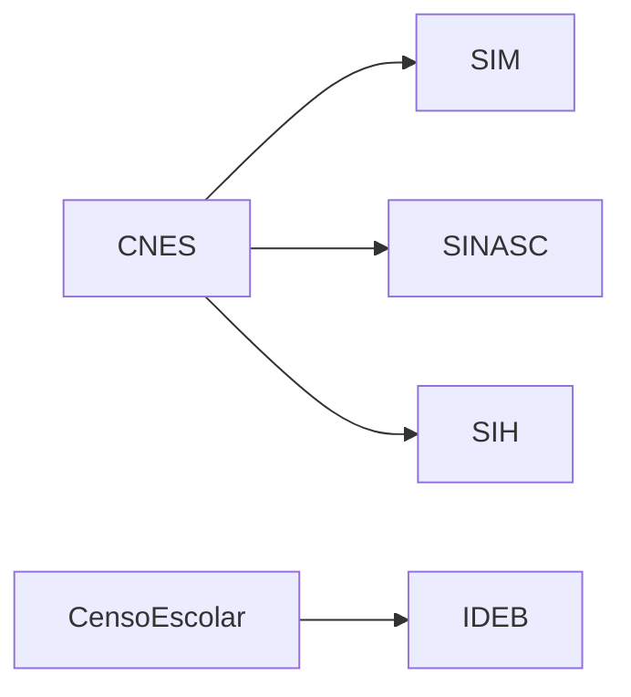

# 🗂️ Índice — Mapeamento Dados de Saúde e Educação (DATASUS + Censo Escolar/IDEB)

> [[Documentação_Fabric/Dados Públicos/00_INDEX_DADOS_PUBLICOS|← Índice Dados Públicos]] · [[Documentação_Fabric/specs/spec_drive_datasus_censo_ideb|Spec Drive (resumo executivo)]]

**Solicitante:** Yuri Lucatelli Taba (Teams, 02/07/2026)
**Objetivo:** Mapear as fontes CNES, SIM/SINASC, SIH (DATASUS) e Censo Escolar + IDEB (INEP) para ingestão no `lh_dados_publicos`, definindo a rota de acesso mais profissional e um padrão de monitoramento/detecção de atualização — **fase de pesquisa/documentação, sem ingestão ainda**.

> [!info] Origem no repositório local
> Este é o espelho no vault. A pasta de trabalho local é `dados_saude_educacao/` (paralela a `geo_osasco/`) no repositório `Mapeamento_fabric`.

---

## 📚 Referências técnicas por fonte

| Fonte | Documento | Rota recomendada | Periodicidade | Prioridade sugerida |
|---|---|---|---|---|
| CNES | [[Documentação_Fabric/Dados Públicos/Saude_Educacao/DATASUS_CNES_Referencia\|DATASUS_CNES_Referencia]] | BigQuery (`basedosdados.br_ms_cnes`) — cobertura validada até 2026-05 | Mensal na fonte | 🔴 1ª — pré-requisito das demais (lookup de estabelecimento) |
| SIM / SINASC | [[Documentação_Fabric/Dados Públicos/Saude_Educacao/DATASUS_SIM_SINASC_Referencia\|DATASUS_SIM_SINASC_Referencia]] | BigQuery (`basedosdados.br_ms_sim` / `br_ms_sinasc`) | Anual, com defasagem de fechamento (1–2 anos) | 🟡 2ª |
| SIH | [[Documentação_Fabric/Dados Públicos/Saude_Educacao/DATASUS_SIH_Referencia\|DATASUS_SIH_Referencia]] | BigQuery (`basedosdados.br_ms_sih`, ETL PCDaS) — cobertura validada até 2026-04 | Mensal (~2 meses de defasagem) | 🟡 2ª |
| Censo Escolar | [[Documentação_Fabric/Dados Públicos/Saude_Educacao/Censo_Escolar_Referencia\|Censo_Escolar_Referencia]] | BigQuery (`basedosdados.br_inep_censo_escolar`) | Anual | 🔴 1ª — pré-requisito do IDEB |
| IDEB | [[Documentação_Fabric/Dados Públicos/Saude_Educacao/IDEB_Referencia\|IDEB_Referencia]] | BigQuery (`basedosdados.br_inep_ideb`) | **Bienal** (anos ímpares) | 🟢 3ª — depende do Censo Escolar |

**Resumo da decisão de rota:** todas as 6 bases têm réplica tratada no BigQuery via **basedosdados.org**, a mesma infraestrutura já usada para o RAIS no pipeline atual. Recomendação é priorizar essa rota para todas — evita lidar com parser DBC (DATASUS) ou CSV/XLSX brutos do INEP, que mudam de schema entre edições. As fontes oficiais (API CNES, FTP+PySUS, microdados INEP) ficam documentadas como alternativa/fallback caso o dataset do BigQuery esteja desatualizado demais no momento da ingestão real.

**📄 Mapeamento consolidado (todas as 6 bases, com subconjuntos completos, canais de acesso e URLs validadas):** [[Documentação_Fabric/Dados Públicos/Saude_Educacao/MAPEAMENTO_FONTES_COMPLETO|MAPEAMENTO_FONTES_COMPLETO]] — pesquisa web em fontes primárias realizada em 2026-07-02.

---

## 🔗 Ordem de dependência recomendada (fase 2 — fora de escopo aqui)

- CNES antes de SIM/SINASC/SIH (lookup de estabelecimento via `codCnes`)
- Censo Escolar antes de IDEB (IDEB usa taxa de aprovação do Censo como insumo)

---

## ⚠️ Riscos e pontos de atenção transversais

1. **Defasagem variável entre fontes** — CNES é quase tempo real, SIH tem ~2 meses, SIM/SINASC têm 1–2 anos até "fechar", IDEB é bienal. O painel final não pode assumir uma cadência única de atualização.
2. **Município de residência vs. município de ocorrência** — SIM, SINASC e SIH podem divergir entre esses dois campos (ex.: Santos concentra atendimentos regionais). Decidir e documentar qual usar por indicador antes de construir o Gold.
3. ~~Validar cobertura temporal real do BigQuery~~ — ✅ **resolvido em 2026-07-02** via pesquisa web em fontes primárias: `br_ms_cnes` cobre 2005-08 → 2026-05 e `br_ms_sih` cobre 2008-01 → 2026-04 (não há defasagem relevante). Ver detalhes em [[Documentação_Fabric/Dados Públicos/Saude_Educacao/MAPEAMENTO_FONTES_COMPLETO|MAPEAMENTO_FONTES_COMPLETO]]. Ainda falta apenas confirmar **acesso real** ao dataset com a credencial GCP do projeto.
4. **IDEB não deve ser interpolado** entre edições bienais — tratar anos sem divulgação como ausência de dado, não como zero/repetição do último valor.
5. **OpenDataSUS foi descontinuado/migrado** para `dadosabertos.saude.gov.br` — atualizar qualquer referência antiga a `opendatasus.saude.gov.br` (redireciona, mas usar a URL nova).

---

## 🎯 Próximos passos (fase 2, fora deste escopo)

1. Validar acesso real ao dataset `basedosdados.*` no BigQuery (mesmo projeto GCP do RAIS) para as 6 fontes.
2. Desenhar notebooks `nb_ingest_*` seguindo o padrão `nb_ingest_populacao_ibge` / `nb_ingest_cempre_ibge` já existentes.
3. Definir estratégia de monitoramento automatizado (comparação de competência/edição mais recente vs. última carregada) por fonte, conforme descrito em cada referência técnica.
4. Levar a recomendação de rota + riscos para validação com Yuri antes de iniciar os notebooks.

---

## 📞 Contexto

- **Lakehouse:** `lh_dados_publicos` (Workspace `96fe5a53-3a22-4443-8d0a-e2f6d61a2690`)
- **Precedente de estrutura:** mapeamento geo SSP (`geo_osasco/` no repositório local)
- **Repositório local (fonte da verdade):** `dados_saude_educacao/` (00_INDEX.md, STATUS_2026-07-02.md, ref/*.md)
- **Solicitante:** Yuri Lucatelli Taba

---

**Criado em:** 2026-07-02
**Última atualização:** 2026-07-02
**Status:** 🔄 Pesquisa concluída — aguardando validação com Yuri para iniciar fase 2 (ingestão)
**Mantido por:** Victor Silva
