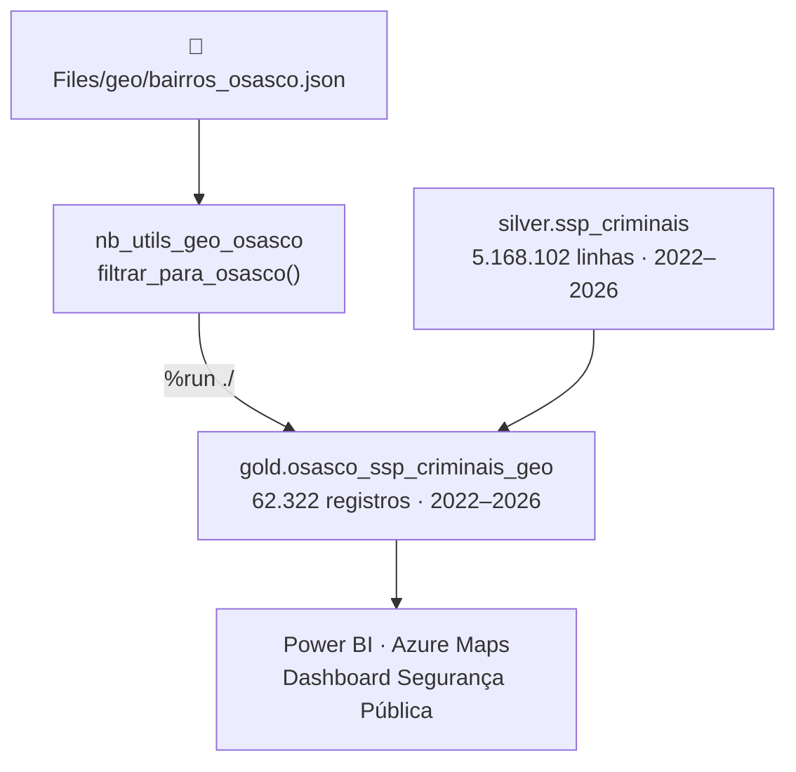

# Spec Semana 30/06 — Mapas Geo SSP · lh_dados_publicos

> **Objetivo:** criar os notebooks Gold de mapa SSP em `lh_dados_publicos`, subir ao Fabric, executar e conectar ao Power BI com Azure Maps.

---

## Decisão de Arquitetura — Revisada em 01/07/2026

> [!important] Tabela de produção: apenas ssp_criminais_geo
> `nb_gold_osasco_ssp_dados_criminais_geo` e `gold.osasco_ssp_dados_criminais_geo` **descartados** — sem utilidade prática no estado atual.

### Motivo do descarte — ssp_dados_criminais

| Critério | ssp_criminais_geo | ssp_dados_criminais_geo |
|----------|:-----------------:|:-----------------------:|
| Período | 2022–2026 ✅ | 2022 apenas ❌ |
| Lat/lon | ✅ | ✅ |
| Campo tipo crime | `descr_conduta` | `natureza_apurada` |
| Precisão do campo | Genérico (verbo) | Penal formal (específico) |
| Valor no PBI | ✅ Dashboard | ❌ Descartado |

`descr_conduta` (ex: "FURTAR", "ROUBAR") é menos preciso que `natureza_apurada` (ex: "FURTO DE VEÍCULO", "ROUBO DE CARGA"), mas `ssp_dados_criminais` só tem 2022 — o ganho de precisão não compensa a perda de 4 anos de série histórica. Como `ssp_criminais_geo` já cobre tudo com lat/lon de 2022 a 2026, a segunda tabela é redundante.

> [!note] Quando revisar essa decisão
> Se `silver.ssp_dados_criminais` for atualizada com dados 2023+, o notebook existe localmente e pode ser reativado para adicionar `natureza_apurada` ao modelo. Por ora: notebook e tabela Gold descartados do escopo.

---

## Resultados Confirmados — 30/06/2026

### Gold de produção: osasco_ssp_criminais_geo

**Funil de filtragem:**
```
5.168.102  Silver total (SP inteiro)
   84.477  → pré-filtro nome_municipio_circunscricao = 'OSASCO'  (1.6%)
   63.205  → após descarte coords inválidas (-21.428)
   62.322  → ponto-em-polígono exato (98.8% retido)              ✅
   62.322  → bairro_geo 100% preenchido (60/60 bairros)          ✅
```

**Série temporal:**

| Ano | Registros |
|-----|----------:|
| 2022 | 14.579 |
| 2023 | 15.642 |
| 2024 | 13.749 |
| 2025 | 13.690 |
| 2026 | 4.662 |

**Top 10 bairros:**

| # | Bairro | Ocorrências |
|---|--------|------------:|
| 1 | CENTRO | 8.891 |
| 2 | ROCHDALE | 2.317 |
| 3 | VELOSO | 2.128 |
| 4 | SANTA MARIA | 2.100 |
| 5 | KM 18 | 2.096 |
| 6 | INDL. AUTONOMO | 1.620 |
| 7 | PRESIDENTE ALTINO | 1.598 |
| 8 | PADROEIRA | 1.525 |
| 9 | SANTO ANTONIO | 1.484 |
| 10 | AYROSA | 1.438 |

**Schema Gold (14 colunas confirmadas):**
```
ano_bo · data_ocorrencia_bo · hora_ocorrencia_bo · descr_conduta
nome_municipio_circunscricao · descr_tipolocal · descr_subtipolocal
logradouro · numero_logradouro · bairro · latitude · longitude
ano_estatistica · mes_estatistica · bairro_geo
```

**Bbox:** `lat [-23.6045, -23.4648] / lon [-46.8208, -46.7481]` ✅

---

## Notebooks em Produção (Fabric)

**Workspace:** `Acto Cidade Inteligente > Dados Públicos > nbs > nbs_geo`

| Notebook | Status | Observação |
|----------|--------|------------|
| `nb_utils_geo_osasco` | ✅ Ativo | carrega GeoJSON + `filtrar_para_osasco()` |
| `nb_gold_osasco_ssp_criminais_geo` | ✅ Produção | única tabela geo do dashboard |
| `nb_gold_osasco_ssp_dados_criminais_geo` | ~~Descartado~~ | `ssp_dados_criminais` só tem 2022 — sem valor para dashboard. Notebook existe localmente como backup. |

**Lakehouse padrão:** `lh_dados_publicos`
**GeoJSON:** `Files/geo/bairros_osasco.json` (11 arquivos geo subidos em 30/06/2026)
**`%run` path:** `./nb_utils_geo_osasco` (mesma pasta `nbs_geo/`)

---

## Arquitetura Final



---

## Checklist Consolidado

### Pré-requisito
- [x] Upload GeoJSON → `lh_dados_publicos/Files/geo/` ✅ (11 arquivos em 30/06)

### Notebooks
- [x] `nb_utils_geo_osasco` ✅ criado e subido ao Fabric
- [x] `nb_levantamento_geo_dados_publicos` ✅ levantamento concluído
- [x] `nb_gold_osasco_ssp_criminais_geo` ✅ executado e validado — **62.322 registros**
- [x] `nb_gold_osasco_ssp_dados_criminais_geo` ✅ executado — 14.579 registros (fora do PBI)
- [x] `nb_analise_comparativa_gold_geo` ✅ análise comparativa executada

### Fabric — Execução
- [x] `gold.osasco_ssp_criminais_geo` gravada e validada ✅
- [x] `gold.osasco_ssp_dados_criminais_geo` gravada (aguardando Silver 2023+) ✅

### Verificação
- [x] Bbox dentro de Osasco ✅
- [x] `bairro_geo` 100% preenchido em ambas ✅
- [x] 60/60 bairros presentes ✅
- [x] Análise comparativa: tabela de produção definida ✅

### Power BI — PENDENTE
- [x] Conectar `gold.osasco_ssp_criminais_geo` ao modelo PBI ✅ (01/07/2026 — `bi_osasco_seguranca_publica`, via MCP de modelagem)
- [x] Criar medida de contagem por ponto ✅ `Contagem_Ocorrencias_Ponto_Geo` (tabela `Medidas`, pasta "Mapa Geo") — usa `ALLSELECTED`+`FILTER` por lat/long exatos, não `COUNTROWS` simples, para funcionar corretamente como campo de tamanho da bolha no mapa
- [ ] Visual Azure Maps — lat/lon · legenda `descr_conduta` · tooltip `bairro_geo`
- [ ] Segmentações: `ano_estatistica` · `mes_estatistica` · `bairro_geo` · `descr_conduta`
- [ ] KPI card: Total · Bairro mais crítico
- [ ] Página 2: gráfico de barras por bairro_geo
- [ ] Publicar no workspace

> [!warning] Demanda de troca de fonte — NÃO viável sem ressalvas
> Surgiu pedido para trocar a fonte dos gráficos da Visão Geral (hoje `gold_seg_publica_dados_criminais`) por `ssp_criminais_geo`. Análise mostrou incompatibilidade: volume 22% menor (5.960 vs 7.671 em jan-mai/2026) e taxonomia de bairro incompatível (60/215 vs 240 bairros distintos). Justificativa completa em [[Documentação_Fabric/Osasco/analise_incompatibilidade_ssp_criminais_geo_bi_seguranca]].

---

## Próximos Notebooks P2 (semana seguinte)

> Template: copiar `nb_gold_osasco_ssp_criminais_geo`.
> Atenção: P2 usa `COL_MUNICIPIO = "nome_municipio_circ"` (sem `circunscricao`) — diferente dos P1.

| Notebook | Silver | Linhas | Col município |
|----------|--------|-------:|--------------|
| `nb_gold_osasco_ssp_prisoes_geo` | `silver.ssp_prisoes` | 416.639 | `nome_municipio_circ` |
| `nb_gold_osasco_ssp_presos_geo` | `silver.ssp_presos_apreendidos` | 495.039 | `nome_municipio_circ` |
| `nb_gold_osasco_ssp_entorpecentes_geo` | `silver.ssp_entorpecentes` | 348.199 | `nome_municipio_circ` |
| `nb_gold_osasco_ssp_flagrantes_geo` | `silver.ssp_flagrantes` | 254.656 | `nome_municipio_circ` |

---

## Fix Futuro — NaN nos Silver SSP

> [!note]- Detalhe técnico
> NaN/Infinity nos Parquet SSP impede leitura via SQL Endpoint (T-SQL).
> Spark lê NaN sem erro — Gold notebooks não são afetados.
> Fix nos Silver notebooks (antes do `saveAsTable()`):
> ```python
> from pyspark.sql.functions import when, isnan, col
> from pyspark.sql.types import FloatType, DoubleType
> for field in df_spark.schema.fields:
>     if isinstance(field.dataType, (FloatType, DoubleType)):
>         df_spark = df_spark.withColumn(
>             field.name,
>             when(isnan(col(field.name)), None).otherwise(col(field.name))
>         )
> ```

---

## Links

- [[Documentação_Fabric/Osasco/Possibilidades_Geolocalizacao_VMC_O|Possibilidades Geo — diagnóstico completo]]
- [[Documentação_Fabric/Dados Públicos/geo_mapa_bairros_osasco|Geo — Mapa Bairros Osasco]]
- [[Documentação_Fabric/Dados Públicos/pendencias_projeto_dados_publicos|Pendências]]
