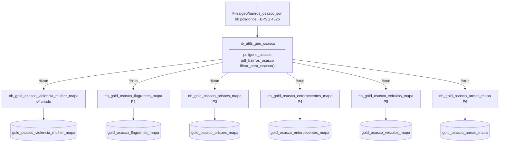

# Planejamento — Mapas Geográficos · Osasco · SSP

> Planejamento completo para expor dados geoespaciais das tabelas SSP do `lh_cidade_inteligente_osasco` no Power BI via Azure Maps. Baseado no levantamento executado em 29/06/2026.

---

## Contexto

O lakehouse `lh_cidade_inteligente_osasco` contém **11 tabelas Silver de dados da SSP-SP** com colunas de `latitude`/`longitude`. Todas são **datasets estaduais** — cobrem todo o estado de São Paulo, não apenas Osasco. Para uso no PBI municipal, é obrigatório filtrar apenas os pontos dentro do perímetro de Osasco.

A solução validada: **ponto-em-polígono** usando o shapefile de bairros de Osasco (`bairros_osasco.json`, 60 polígonos, EPSG:4326). Testado com sucesso na tabela de Violência Contra a Mulher: **99.2% de retenção** após filtro (15.938 / 16.074 pontos dentro de Osasco).

---

## Levantamento das tabelas com lat/long (29/06/2026)

Script: `geo_osasco/levantamento_geo_lakehouse.py`  
Lakehouse: `lh_cidade_inteligente_osasco` · 108 tabelas · 1.797 colunas

| #   | Tabela Silver                       | Linhas totais | Cob. lat/lon | Tipo dado                             |
| --- | ----------------------------------- | ------------- | ------------ | ------------------------------------- |
| 1   | `silver_tb_presos_apreendidos`      | **349k**      | 73%          | SSP estadual                          |
| 2   | `silver_tb_prisoes`                 | **291k**      | 73%          | SSP estadual                          |
| 3   | `silver_tb_entorpecentes`           | **239k**      | 77%          | SSP estadual                          |
| 4   | `silver_tb_flagrantes`              | **174k**      | 69%          | SSP estadual                          |
| 5   | `silver_tb_apreensao_intorpecentes` | **98k**       | 80%          | SSP estadual                          |
| 6   | `silver_tb_veiculos_recuperados`    | **90k**       | 89%          | SSP estadual                          |
| 7   | `silver_tb_armas_apreendidas`       | **24k**       | 58%          | SSP estadual                          |
| 8   | `silver_tb_art173`                  | **14k**       | 80%          | SSP estadual                          |
| 9   | `silver_infosiga_sinistros`         | —             | ⚠️ varchar   | lat/lon como texto — requer conversão |
| 10  | `silver_tb_dados_criminais`         | —             | ⚠️ varchar   | lat/lon como texto — requer conversão |
| —   | `gold_osasco_violencia_mulher`      | 230k          | 85%          | ✅ já filtrado (referência)            |

> [!info] Por que lat_max está longe de Osasco?
> O levantamento mostrou `lat_max` entre -3.7 e -20.0 para as tabelas SSP. Isso confirma que são dados **estaduais ou nacionais** (SENASP/SSP-SP), não pré-filtrados ao município. O CRS é correto (EPSG:4326) — o problema é de escopo geográfico, não de projeção.

---

## Arquitetura escolhida

### Decisão: Gold individuais por domínio + utilitário geo compartilhado



### Por que NÃO Gold unificada

> [!warning] Gold unificada foi descartada
> Esquemas incompatíveis entre tabelas SSP: `flagrantes` tem `natureza_apurada` e `flag_status`; `prisoes` tem regime de cumprimento e artigo penal; `veiculos_recuperados` tem modelo, placa e marca. UNION criaria dezenas de colunas nulas e misturaria contextos analíticos distintos no mesmo visual.

### Por que NÃO filtrar no Silver

A Silver reflete o dado estadual bruto — um filtro geográfico ali quebraria a rastreabilidade e causaria perguntas de auditoria ("por que faltam registros de outras cidades?"). **O recorte municipal pertence ao Gold.**

---

## Peça central: `nb_utils_geo_osasco`

**Arquivo local:** `geo_osasco/nb_utils_geo_osasco.ipynb`  
**Destino Fabric:** `utils/nb_utils_geo_osasco`

Após `%run ../utils/nb_utils_geo_osasco`, o notebook chamador tem acesso a:

```python
# Polígono do município (Shapely MultiPolygon)
poligono_osasco

# GeoDataFrame com 60 bairros (coluna NOME_NORM)
gdf_bairros_osasco

# Função principal: filtra df para Osasco + adiciona bairro_geo
df_mapa = filtrar_para_osasco(df, col_lat="latitude", col_lon="longitude")
```

A função internamente:
1. Descarta lat/lon nulos e zeros (`0.0, 0.0` = bad geocoding SSP)
2. `Point(lon, lat).within(poligono_osasco)` — ordem correta Shapely: X=lon, Y=lat
3. `gpd.sjoin()` → `bairro_geo` pelo polígono (mais confiável que campo textual `bairro`)
4. Imprime resumo: `dentro=N  fora=M  (X% retido)`

---

## Template padrão — notebook Gold de mapa

Todo `nb_gold_osasco_<dominio>_mapa` segue o mesmo padrão de 4 células:

```python
# Célula 1 — injeta utilitário geo (carrega GeoJSON + cria poligono_osasco)
%run ../utils/nb_utils_geo_osasco

# Célula 2 — ler Silver estadual
COLUNAS = ["col_relevante_1", "col_relevante_2", "latitude", "longitude"]
df = spark.table("silver_tb_<dominio>").select(*COLUNAS).toPandas()
print(f"Silver: {len(df):,} linhas (statewide)")

# Célula 3 — filtrar para Osasco + bairro_geo
df_mapa = filtrar_para_osasco(df, col_lat="latitude", col_lon="longitude")

# Célula 4 — validar e gravar Gold de mapa
assert len(df_mapa) > 0, "Mapa vazio — verificar filtro geo"
print(f"Registros Osasco: {len(df_mapa):,} | Bairros: {df_mapa['bairro_geo'].nunique()}")
df_spark = spark.createDataFrame(df_mapa)
df_spark.write.mode("overwrite").format("delta").saveAsTable("gold_osasco_<dominio>_mapa")
```

> [!tip] Tabelas com lat/lon varchar (infosiga, dados_criminais)
> Adicionar antes da Célula 3:
> ```python
> df["latitude"]  = pd.to_numeric(df["latitude"],  errors="coerce")
> df["longitude"] = pd.to_numeric(df["longitude"], errors="coerce")
> ```

---

## Roadmap de implementação

### Pré-requisito único (bloqueia tudo)

- [ ] **GEO-0** Upload de `bairros_osasco.json` → `Files/geo/` em `lh_cidade_inteligente_osasco` (Fabric UI)
- [ ] **GEO-1** Criar `nb_utils_geo_osasco` no Fabric (pasta `utils/`) · executar · validar print de 60 bairros

---

### P1 — Violência Contra a Mulher ✅ validado localmente

- [x] Script local `gerar_mapa_vcm.py` — 15.938 BOs dentro de Osasco (99.2%)
- [x] PBI Azure Maps testado com CSV — mapa e `bairro_geo` corretos
- [x] `nb_gold_osasco_violencia_mulher_mapa.ipynb` criado localmente
- [x] Pipeline `pl_violencia_mulher_osasco.json` atualizado localmente
- [ ] **P1-A** Criar notebook no Fabric e executar
- [ ] **P1-B** Preencher `notebookId` no pipeline + publicar
- [ ] **P1-C** Criar aba de mapa no PBI VCM · publicar

---

### P2 — Flagrantes

- [x] `nb_gold_osasco_flagrantes_mapa.ipynb` criado localmente (template)
- [ ] **P2-A** Inspecionar `amostra_silver_tb_flagrantes.csv` — listar colunas relevantes para PBI
- [ ] **P2-B** Criar notebook no Fabric · executar · verificar volume Osasco
- [ ] **P2-C** Adicionar ao pipeline SSP (ou criar pipeline se não existir)
- [ ] **P2-D** Criar visual PBI Azure Maps · publicar

---

### P3 — Prisões

- [ ] **P3-A** Inspecionar `amostra_silver_tb_prisoes.csv`
- [ ] **P3-B** Verificar overlap com `silver_tb_presos_apreendidos` (podem ser o mesmo fenômeno)
- [ ] **P3-C** Criar `nb_gold_osasco_prisoes_mapa` no Fabric · executar
- [ ] **P3-D** PBI

---

### P4 — Entorpecentes

- [ ] **P4-A** Inspecionar `amostra_silver_tb_entorpecentes.csv`
- [ ] **P4-B** Verificar overlap com `silver_tb_apreensao_intorpecentes`
- [ ] **P4-C** Criar `nb_gold_osasco_entorpecentes_mapa` · executar
- [ ] **P4-D** PBI

---

### P5 — Veículos Recuperados (melhor cobertura: 89%)

- [ ] **P5-A** Inspecionar `amostra_silver_tb_veiculos_recuperados.csv`
- [ ] **P5-B** Criar `nb_gold_osasco_veiculos_mapa` · executar
- [ ] **P5-C** PBI

---

### P6 — Armas Apreendidas

- [ ] **P6-A** Inspecionar `amostra_silver_tb_armas_apreendidas.csv`
- [ ] **P6-B** Criar `nb_gold_osasco_armas_mapa` · executar (cobertura 58% — avaliar viabilidade do mapa)
- [ ] **P6-C** PBI se cobertura for aceitável

---

### P7 — Infosiga Sinistros (baixa prioridade — requer conversão varchar)

- [ ] **P7-A** Investigar schema de `silver_infosiga_sinistros` — entender se lat/lon são geocodificados ou endereços
- [ ] **P7-B** Aplicar `pd.to_numeric(..., errors='coerce')` antes do filtro geo
- [ ] **P7-C** Criar `nb_gold_osasco_infosiga_mapa` · executar

---

### A avaliar (overlap provável)

| Tabela | Decisão |
|---|---|
| `silver_tb_presos_apreendidos` | Verificar se é subconjunto de `prisoes` — unificar ou separar |
| `silver_tb_apreensao_intorpecentes` | Verificar se é subconjunto de `entorpecentes` |
| `silver_tb_art173` | 14k linhas — avaliar demanda analítica antes de priorizar |
| `silver_tb_dados_criminais` | lat/lon varchar + schema a investigar |

---

## Integração com pipelines Fabric

Cada Gold de mapa entra no pipeline do domínio após a Gold principal:

```
nb_silver_<dominio>
    ↓
nb_gold_<dominio>          ← Gold principal (não modificar)
    ↓
nb_gold_osasco_<dominio>_mapa   ← nova atividade (dependsOn: gold principal)
    ↓
RefreshSqlEndpoint
    ↓
RefreshPBI (se aplicável)
```

Se o domínio SSP ainda não tem pipeline no Fabric, criar pipeline mínimo:
`nb_gold_osasco_<dominio>_mapa → RefreshSqlEndpoint → RefreshPBI`

---

## Arquivos locais criados

| Arquivo | Função |
|---|---|
| `geo_osasco/levantamento_geo_lakehouse.py` | Script de descoberta — lista todas as tabelas com lat/long |
| `geo_osasco/output/levantamento_geo.xlsx` | Resultado do levantamento (29/06/2026) |
| `geo_osasco/output/amostra_<tabela>.csv` | 20 linhas de amostra por tabela para inspeção |
| `geo_osasco/nb_utils_geo_osasco.ipynb` | Utilitário geo — deploy em `utils/` no Fabric |
| `geo_osasco/nb_gold_osasco_flagrantes_mapa.ipynb` | Template P2 — copiar para outros domínios |
| `violencias_mulher_osasc/gold/nb_gold_osasco_violencia_mulher_mapa.ipynb` | Notebook P1 — pronto para deploy |
| `violencias_mulher_osasc/pipelines/pl_violencia_mulher_osasco.json` | Pipeline atualizado (falta notebookId do mapa) |

---

## Atualização (10/07/2026) — SSP Criminais: pontos fora do mapa no tooltip + saúde dos dados

Retomada do plano que ficou pausado em 08/07 (relatório de qualidade lat/long + inclusão dos pontos excluídos na Gold para uso no tooltip).

### 1. Relatório de qualidade lat/long — completude x precisão

O levantamento local (`geo_osasco/levantamento_fora_mapa/`) foi ampliado para responder "a saúde dos dados vem melhorando?" separando dois problemas que evoluem de formas diferentes:

| Métrica | O que mede | Tendência 2022→2025 |
|---|---|---|
| **Completude** (`pct_sem_geo`) | % de ocorrências sem coordenada nenhuma na origem (`COORD_NULA`/`COORD_ZERO`) | Estável ~25-26% — **sem melhora**, problema estrutural da fonte SSP |
| **Precisão** (`pct_precisao_ruim`) | Entre quem TEM coordenada, % que ainda cai fora do perímetro/escala errada | **2.1% → 0.7-1.1%** — melhora real, erro de escala (decimal perdido) praticamente eliminado após 2022 |

Conclusão para a cliente: a geocodificação (quando existe coordenada) melhorou de fato; a causa dominante de pontos sumidos (~97% dos excluídos) é ausência total de coordenada na origem, não recuperável por ajuste de filtro. Relatório regenerado com gráfico de evolução (`output/evolucao_qualidade_geo.png`) e nova aba `Tendencia Completude x Precisao` no `.xlsx`.

### 2. `nb_gold_osasco_ssp_criminais_geo` — flag `dentro_mapa` para tooltip

Ajustado para gravar **todos** os registros marcados OSASCO (dentro **e** fora do shape), com `dentro_mapa` (1/0) e `motivo_fora_mapa` (`SEM_COORDENADA` / `FORA_DO_PERIMETRO`). Objetivo: permitir mostrar no tooltip do mapa quantos registros existem mas não são plotáveis, sem alterar a função compartilhada `filtrar_para_osasco()` (usada por VCM, flagrantes, prisões).

> [!warning] Ação necessária antes de publicar
> Qualquer visual PBI que já consome `gold.osasco_ssp_criminais_geo` precisa adicionar o filtro **`dentro_mapa = 1`** antes do próximo refresh, senão a contagem infla com pontos não plotáveis. Notebook ainda não executado no Fabric — pendente de rodar e validar (`n_dentro/n_total` esperado ~73-78%, ver tabela acima) antes de publicar.

- [x] Executar `nb_gold_osasco_ssp_criminais_geo` no Fabric e validar a célula 6 — **feito 10/07**: 85.986 registros gravados · 63.620 dentro (74,0%, dentro da faixa esperada) · 22.366 fora (21.622 `SEM_COORDENADA` + 744 `FORA_DO_PERIMETRO`) · bbox ok · `bairro_geo` 100% · números batem exatamente com o levantamento local
- [x] **Re-executar** o notebook no Fabric com `natureza_apurada` + `rubrica` no `COLUNAS_SELECT` — **feito 10/07**: 28 naturezas distintas, 100% preenchida, totais inalterados (85.986 / 63.620 dentro / 22.366 fora). A coluna sempre existiu na Silver mas não era selecionada; `descr_conduta` NÃO serve como natureza (é modalidade/texto livre). Sem necessidade de categoria "(sem natureza)" no filtro.
- [ ] Adicionar filtro `dentro_mapa = 1` no visual Azure Maps existente (se já publicado)
- [ ] Adicionar `dentro_mapa`/`motivo_fora_mapa` ao tooltip do visual
- [ ] Reexecutar `nb_analise_comparativa_gold_geo.ipynb` local (compara as duas Golds SSP) com o filtro `dentro_mapa=1` — senão a contagem de 62.322 registros muda

---

*Planejamento · Acto Cidade Inteligente · Osasco · 29/06/2026 · Atualizado 10/07/2026*
