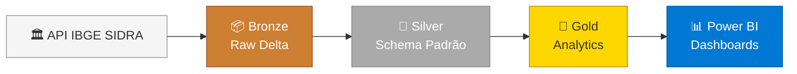
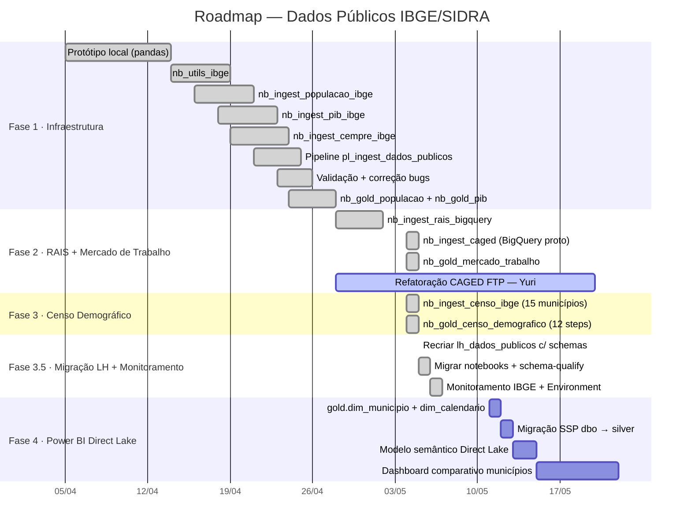

# Spec Drive — Dados Públicos IBGE/SIDRA

> [!tip] Para Claude
> Este documento registra o andamento, decisões tomadas e próximos passos do projeto de dados públicos.
> Para detalhes técnicos de notebooks e tabelas, leia [[Documentação_Fabric/Dados Públicos/Mapeamento_Tecnico_Dados_Publicos|Mapeamento Técnico]].

**Última atualização:** 2026-05-07
**Status geral:** ==Fases 1–3.5 ✅ completas · Monitoramento automático operacional · Semana 09/05: modelo semântico Direct Lake==

---

## Visão Geral

O projeto de Dados Públicos cria um framework de ingestão de indicadores socioeconômicos do IBGE/SIDRA no Microsoft Fabric, cobrindo **15 municípios** em 3 clusters (Santos, Osasco, Mauá). Os dados alimentam painéis comparativos de mercado de trabalho, economia e demografia.



---

## Status por Fase



---

## Fase 1 — Infraestrutura e Ingestão ✅

> [!success] Fase 1 concluída — 4 bugs de código IBGE corrigidos · pipeline renomeada e expandida com Gold
> Pipeline `pl_ingest_dados_publicos` roda 5 notebooks em sequência. 16 municípios confirmados. Gold PIB e Gold Populacao integrados ao pipeline em 29/04/2026.

### Checklist

- [x] Protótipo local (`Prototipo_santos_dados_publicos`) — pandas + matplotlib
- [x] `nb_utils_ibge` — funções `fetch_sidra_fabric`, `save_delta`, clusters SANTOS/OSASCO/MAUA (16 municípios)
- [x] `nb_ingest_populacao_ibge` — `silver_populacao`
- [x] `nb_ingest_pib_ibge` — `silver_pib` + `silver_pib_componentes` (incl. `pib_per_capita_r`)
- [x] `nb_ingest_cempre_ibge` — `silver_cempre` + `gold_empregos_municipais`
- [x] `nb_ingest_caged` (Yuri) — `silver_novo_caged_sp`
- [x] `nb_gold_populacao` — `gold_populacao_municipios` (variação YoY)
- [x] `nb_gold_pib` — `gold_pib_municipios` (ranking + VAB%)
- [x] Pipeline `pl_ingest_dados_publicos` — 5 notebooks em sequência
- [x] `nb_validacao_dados` criado (pyodbc local) — validação via SQL Endpoint
- [x] Documentação Obsidian
- [x] Upload notebooks corrigidos para Fabric (`nb_utils_ibge` · `nb_ingest_populacao_ibge` · `nb_ingest_pib_ibge`)
- [x] Re-executar pipeline com códigos IBGE corretos (29/04/2026)
- [x] Validar Silver: 16 municípios · per capita presente · 0 nulos em todas as tabelas ✅ — 29/04/2026
- [x] `gold_populacao_municipios` gravada (315 registros · variação YoY calculada) ✅ — 29/04/2026
- [x] `gold_pib_municipios` gravada (330 registros · ranking · % VAB) ✅ — 29/04/2026
- [x] Corrigir 5 códigos IBGE errados (Taboão · São Caetano · Suzano · Várzea Paulista · Itapevi) — 29/04/2026
- [x] Decisão: 15 municípios definitivos (Santo André removido) — 29/04/2026
- [x] Pipeline re-executada · Silver validada: 15 municípios · 0 nulos · per capita presente ✅

### Tabelas entregues

| Camada | Tabela | Registros | Status |
|---|---|---|---|
| 🟤 Bronze | `bronze_ibge_populacao_raw` | ~320 | ✅ |
| 🟤 Bronze | `bronze_ibge_pib_total_raw` | ~320 | ✅ |
| 🟤 Bronze | `bronze_ibge_pib_componentes_raw` | ~1.600 | ✅ |
| 🟤 Bronze | `bronze_ibge_cempre_raw` | ~20.000 | ✅ |
| 🥈 Silver | `silver_populacao` | ~320 | ✅ |
| 🥈 Silver | `silver_pib` | ~640 | ✅ (incl. `pib_per_capita_r`) |
| 🥈 Silver | `silver_pib_componentes` | ~1.600 | ✅ |
| 🥈 Silver | `silver_cempre` | ~3.200 | ✅ |
| 🥈 Silver | `silver_novo_caged_sp` | — | ✅ |
| 🥇 Gold | `gold_empregos_municipais` | ~180 | ✅ |
| 🥇 Gold | `gold_populacao_municipios` | 315 | ✅ 15 municípios corretos · variação YoY calculada |
| 🥇 Gold | `gold_pib_municipios` | 315 | ✅ 15 municípios corretos · ranking + % VAB |

### Problemas encontrados e resolvidos

| Problema | Causa | Solução |
|---|---|---|
| `400` na ingestão PIB | Variável `37728` não existe na tabela 5938 | Corrigido para `v/37` |
| `400` na ingestão CEMPRE | Classificação `c693` incompatível com tabela 3421 | Corrigido para `c12762` |
| `400` na ingestão CEMPRE | Variável `666` não existe na tabela 3421 | Corrigido para `v/708` |
| Silver CEMPRE → 0 registros | Mapeamento errado de colunas (`D1C` ≠ município quando há classificação) | Identificado layout real: `MC`/`MN` = unidade · `D1C` = município · `D3C` = ano · `D4N` = CNAE |
| Silver PIB → não criada | `D2C` mapeado como ano, mas é código da variável (`37`) | Corrigido: `D3C` = ano |
| PIB per capita ausente | SIDRA não fornece per capita diretamente | Calculado via join com `silver_populacao` |
| Código IBGE Cubatão errado | `3513801` (Diadema) em vez de `3513504` | Corrigido em `nb_utils_ibge` |
| `silver_populacao.ano` = 9324 | `D2C` (código variável) mapeado como ano em vez de `D3C` | Corrigido: `D3C` = ano · `nb_ingest_populacao_ibge` |
| `silver_populacao.indicador` = `'populacao'` | Literal errado | Corrigido para `'populacao_residente'` |
| `silver_pib` sem `pib_per_capita_r` | Join com `silver_populacao` falhou porque anos eram `9324` | Será calculado após re-execução com `silver_populacao` corrigida |
| OSASCO: `3543402` = Ribeirão Preto | Código IBGE errado para Mogi das Cruzes | Corrigido para `3530607` em `nb_utils_ibge` |
| MAUÁ: `3549805` = São José do Rio Preto | Código IBGE errado para Ribeirão Pires | Corrigido para `3543303` em `nb_utils_ibge` |
| OSASCO: `3552205` = Sorocaba | Código IBGE errado para Suzano | Corrigido para `3552403` — mas 3552403 = Sumaré (ainda errado!) |
| `%run` misto com imports | Fabric: MagicUsageError — `%run` não pode compartilhar célula | Separado em célula própria — `nb_gold_populacao` e `nb_gold_pib` |
| `silver_novo_caged_sp` timeout no `SELECT *` | Tabela muito grande (cobre todo SP) | `nb_validacao_dados` usa `COUNT(*)` + `TOP 5` para tabelas grandes |

> [!success] 5 códigos IBGE corrigidos — validado contra `municipio_names.csv` (BigQuery) · 30/04/2026
>
> | Município | Código errado | Código correto |
> |---|---|---|
> | Taboão da Serra (OSASCO) | `3548708` | `3552809` |
> | São Caetano do Sul (OSASCO) | `3549904` | `3548807` |
> | Suzano (OSASCO) | `3552403` | `3552502` |
> | Várzea Paulista (OSASCO) | `3556206` | `3556503` |
> | Itapevi (MAUÁ) | `3538709` | `3522505` |
>
> Corrigidos em `nb_utils_ibge`. Pipeline re-executada com 15 municípios corretos. Gold validado.

---

## Fase 2 — Ingestão RAIS/BigQuery + Refatoração CAGED ✅

> [!success] Fase 2 concluída — `silver.rais` (571.904 registros) · `gold.mercado_trabalho` (371.728) · CAGED FTP com Yuri (prazo 20/05)
> Decisão consolidada: usar **RAIS via BigQuery** (Base dos Dados) para dados analíticos de emprego. CEMPRE mantido para série histórica longa. CAGED para fluxo mensal.

### Por que RAIS via BigQuery?

| Critério | CEMPRE (atual) | RAIS BigQuery |
|---|---|---|
| **Granularidade CNAE** | Seção (A–U) | Subclasse (centenas de categorias) |
| **Dados mais recentes** | 2021 | 2024 |
| **Análise "WOW"** | ❌ | ✅ Ex: farmácias vs supermercados |
| **Custo/execução** | Gratuito · 2 min | BigQuery · ~1h15 |
| **Pipeline existente** | `nb_ingest_cempre_ibge` | Notebook Osasco adaptável |

> [!info] Estratégia das 3 fontes de emprego
> ```
> RAIS BigQuery  →  estoque analítico (subcategoria CNAE · até 2024)
> CEMPRE SIDRA   →  série histórica longa (seção CNAE · 2006–2021)
> CAGED          →  fluxo mensal (admissões − demissões)
>                        ↓ juntos formam gold_mercado_trabalho
> ```

### Checklist

- [x] `nb_ingest_rais_bigquery` — `bronze.rais` + `silver.rais` (571.904 registros) ✅ 06/05
- [x] `silver.rais` — `secao_cnae` corrigida (19 DESCONHECIDO de 571k = esperado) ✅ 06/05
- [x] `nb_ingest_caged` (BigQuery proto) — `bronze.caged` + `silver.caged` ✅ 04/05
- [x] `nb_gold_mercado_trabalho` — 371.728 registros ✅ 06/05
- [ ] Refatoração CAGED FTP (Yuri) — prazo 2026-05-20

> [!note] Fix secao_cnae RAIS
> `cnae_2` no BigQuery é código de CLASSE (5 dígitos, ex: 10937). Fix: `lpad(col("cnae_2"), 5, "0").substr(1, 2).cast("int")` extrai os 2 primeiros dígitos como divisão → seção CNAE correta.

## Fase 3 — Censo Demográfico ✅

> [!success] Fase 3 concluída — 8 tabelas silver.censo_* + 12 steps gold.censo_demografico · todos os 15 municípios (06/05)

### Checklist

- [x] `nb_ingest_censo_ibge` — 8 silver.censo_* com colunas semânticas ✅ 06/05
- [x] `nb_gold_censo_demografico` — 12 steps passando ✅ 06/05
- [x] `gold.populacao` (336) · `gold.pib` (352) validados ✅

### Tabelas Gold entregues

| Tabela | Conteúdo |
|---|---|
| `gold.populacao` | Pop. residente + variação YoY + cluster · 336 registros |
| `gold.pib` | PIB total · per capita · ranking · % VAB por setor · 352 registros |
| `gold.mercado_trabalho` | RAIS (estoque) + CAGED (fluxo) · 371.728 registros |
| `gold.censo_piramide_populacao` | Pirâmide etária + flag ativa/inativa |
| `gold.censo_envelhecimento` | Por cor/raça — 2010 + 2022 |
| `gold.censo_genero` | Proporção por sexo |
| `gold.censo_dependencia_demografica` | Razão ativa/inativa |
| `gold.censo_frequenta_escola` | Agrupado por nível de ensino |
| `gold.censo_domicilios` | Por tipo e raça |
| `gold.censo_renda` | Distribuição por faixa — 2010 vs 2022 |
| `gold.censo_fecundidade` | Total (filtro Total) |
| `gold.censo_populacao_urbana_rural` | Evolução urbana/rural histórica |

---

## Fase 3.5 — Migração Lakehouse + Monitoramento IBGE ✅

> [!success] Fase 3.5 concluída — `lh_dados_publicos` recriado com schemas · monitoramento automático operacional (07/05)

### Contexto

O LH original foi criado sem suporte a schemas (feature do Fabric que só pode ser habilitada na criação). Recriado com schemas `bronze · silver · gold · monitoramento`. Notebooks migrados para nomenclatura schema-qualified (`silver.populacao` em vez de `silver_populacao`).

### Checklist

- [x] Recriar `lh_dados_publicos` com schemas habilitados ✅ 05/05
- [x] Upload JSON BigQuery + `municipio_names.csv` em `Files/` ✅ 05/05
- [x] Migrar 12 notebooks para schema-qualified (`silver.X`, `gold.X`, `bronze.X`) ✅ 05–06/05
- [x] Estender `pl_monitoramento_ingest` — branches IBGE/RAIS ✅ 06/05
- [x] Implementar `checar_fonte_bigquery` com query BQ real ✅ 06/05
- [x] Criar Fabric Environment `env_dados_publicos` (google-cloud-bigquery, pyarrow, db-dtypes, ipeadatapy) ✅ 06/05
- [x] Checklist completo notebooks 0–9 ✅ 06/05
- [x] Pipeline agendada — confirmado 18 → 24 linhas em `log_consulta_fonte` ✅ 07/05
- [x] Limpar colunas residuais `0,1,2,3,4,5` de `log_consulta_fonte` (CTAS + RENAME) ✅ 07/05

### Sistema de Monitoramento — Arquitetura

```
pl_monitoramento_ingest (diário)
    │
    ├── nb_checar_fontes
    │       ├── CAGED      → tipo = "calendario" (FTP MTE)
    │       ├── SSP        → tipo = "http_head" (Last-Modified)
    │       ├── IBGE_*     → tipo = "sidra_api" (max ano vs silver)
    │       └── RAIS       → tipo = "bigquery_check" (MAX ano BQ)
    │
    └── [branches If paralelos por fonte]
            → True: nb_ingest_X → nb_gold_X
            → False: skip
```

> [!note] `ultima_modificacao_http` vazio para IBGE
> A API SIDRA não retorna header `Last-Modified`. Campo NULL para IBGE é comportamento esperado — o checador usa comparação de período, não o header HTTP.

---

## Fase 4 — Power BI Direct Lake 🔵

> [!info] Iniciando semana 11/05 — `gold.mercado_trabalho` bloqueado até `silver.caged` do Yuri (prazo 20/05)
> Construir modelo semântico com tabelas disponíveis. `mercado_trabalho` entra quando Yuri entregar.

### Checklist

- [x] `gold.dim_municipio` — 16 municípios · nomes via SIDRA t/6579 · `cluster` + `papel` ✅ 07/05
- [x] `gold.dim_calendario` — 732 linhas · granularidade mensal (1970–2030) · `ano_mes · trimestre · semestre · decada` ✅ 07/05
- [x] Migração SSP: `dbo.silver_ssp_*` → `silver.ssp_*` — 9 tabelas · 491.004 linhas · `criar_sdf` com `.lower()` ✅ 07/05
- [ ] Modelo semântico Direct Lake — criar no Fabric com tabelas gold disponíveis (próximo)
- [ ] Adicionar `gold.mercado_trabalho` ao modelo quando Yuri entregar `silver.caged`
- [ ] `nb_gold_osasco_seguranca_publica` — consumir `silver.ssp_*`
- [ ] Dashboard comparativo municípios
- [ ] Publicar no workspace `96fe5a53-3a22-4443-8d0a-e2f6d61a2690`

### Painéis planejados

| Painel | Domínio | Tabelas Gold | Visuals |
|---|---|---|---|
| **Economia** | PIB e VAB | `gold_pib_municipios` | Ranking barras · Série histórica · Composição VAB (rosca) |
| **Emprego** | Mercado de trabalho | `gold_mercado_trabalho` | Heatmap CNAE · Saldo CAGED linha · Comparativo cluster |
| **Demografia** | População | `gold_populacao_municipios` | Pirâmide crescimento · Mapa choropleth · Tendência |

---

## Decisões Técnicas Registradas

| Data | Decisão | Justificativa |
|---|---|---|
| Abr/2026 | Usar CEMPRE (t/3421) em vez de RAIS (inicialmente) | RAIS não tem API pública · download CSV de vários GB por UF |
| Abr/2026 | Migrar para RAIS via BigQuery (Base dos Dados) | Granularidade CNAE subclasse · dados até 2024 · automatizável |
| Abr/2026 | Schema Silver com coluna `indicador` como string | Permite union de diferentes métricas · facilita pivô no Power BI |
| Abr/2026 | Calcular per capita no notebook, não no PBI | Evita DAX complexo · garante consistência entre relatórios |
| Abr/2026 | `allxt` na classificação CNAE | Retorna todas as categorias exceto o total, evitando soma duplicada |
| Mai/2026 | Recriar LH com schemas habilitados | Fabric só permite habilitar schemas na criação — namespace flat prejudica governança |
| Mai/2026 | CLUSTERS dict em `nb_utils_ibge` como única fonte de verdade | Elimina hardcode de municípios em outros notebooks |
| Mai/2026 | `gold.dim_municipio` + `gold.dim_calendario` | Dimensões compartilhadas para o modelo Direct Lake — chave de join entre facts |

---

## Riscos e Pendências

> [!warning] Sazonalidade dos dados SIDRA
> A API IBGE pode ficar fora do ar durante atualizações anuais (geralmente novembro/dezembro). O pipeline deve ter tratamento de fallback ou ser pausado nesse período.

> [!warning] CAGED — validar cobertura de anos
> `silver_novo_caged_sp` não tem schema documentado ainda. Antes da Fase 2, mapear colunas e cobertura temporal.

> [!question] Escopo geográfico
> Adicionar mais municípios ao `nb_utils_ibge` requer apenas incluir o código IBGE no cluster correspondente. A decisão de expandir (ex: incluir municípios de Aparecida de Goiânia) é de negócio.

---

## Referências Rápidas

| O que precisar | Onde encontrar |
|---|---|
| Coordenadas do Lakehouse / SQL Endpoint | [[Documentação_Fabric/Dados Públicos/00_INDEX_DADOS_PUBLICOS\|Índice Dados Públicos]] |
| Schema de cada tabela e mapeamento de colunas | [[Documentação_Fabric/Dados Públicos/Mapeamento_Tecnico_Dados_Publicos\|Mapeamento Técnico]] |
| Notebooks do protótipo local (pandas) | `Prototipo_santos_dados_publicos/` no repositório |
| Notebook de validação local | `migracao_fabric/nb_validacao_dados.ipynb` |
| Estrutura de outros clientes (Santos, Osasco) | [[00_MAPA]] |
