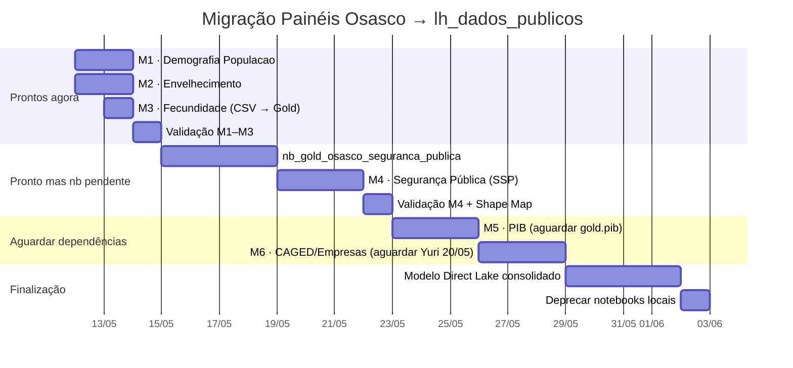

# Spec Drive — Migração Painéis Osasco → `lh_dados_publicos`

> **Regra fundamental:** Apenas a fonte de dados muda. Todos os visuais, medidas DAX, relações e filtros permanecem intactos.

**Contexto:** O `lh_dados_publicos` já possui tabelas Gold para dados de censo, população e SSP que antes eram ingeridos e mantidos localmente no `lh_cidade_inteligente_osasco`. A migração elimina duplicação de pipelines, garante que múltiplos municípios (Osasco, Santos, Mauá) leiam a mesma fonte autoritativa, e resolve o problema de CSVs locais em domínios críticos.

---

## Visão Geral — O Que Muda e o Que NÃO Muda

### ✅ O que muda
- Conexão de lakehouse no modelo Power BI (endpoint SQL Analytics)
- Tabelas referenciadas no modelo semântico (nomes podem diferir)
- Notebooks Gold locais que se tornam redundantes → **deprecar após validação**

### 🚫 O que NÃO muda
- Nenhum visual, gráfico, filtro, slicer ou página do painel
- Nenhuma medida DAX
- Nenhuma relação entre tabelas (desde que colunas-chave sejam compatíveis)
- Nomes de colunas visíveis ao usuário (pré-condição de cada migração)

---

## Matriz de Migração — 6 Painéis

| # | Painel | Tabela atual (local) | Tabela nova (lh_dados_publicos) | Status | Prioridade |
|---|---|---|---|---|---|
| 1 | `bi_osasco_demografia_populacao` | `gold_osasco_populacao_ibge` | `gold.populacao` · `gold.censo_piramide_populacao` | ✅ Gold pronto | 🔴 Alta |
| 2 | `bi_osasco_demografia_envelhecimento` | `gold_osasco_populacao_ibge` | `gold.censo_envelhecimento` · `gold.censo_dependencia_demografica` | ✅ Gold pronto | 🔴 Alta |
| 3 | `bi_osasco_demografia_fecundidade` | CSV `Files/gold_censo_demografico/` (10 arquivos) | `gold.censo_fecundidade` | ✅ Gold pronto — resolve CSV! | 🔴 Alta |
| 4 | `bi_osasco_seguranca_publica` (SSP) | `gold_seg_publica_*` (4 tabelas) | `gold.ssp_dados_criminais` · `gold.ssp_armas` · `gold.ssp_presos` | 🆕 Gold pronto — nb_gold pendente | 🟡 Média |
| 5 | `bi_osasco_pib` | `gold_osasco_pib_*` (3 tabelas) | `gold.pib` | 🔄 silver.pib existe — gold a criar | 🟡 Média |
| 6 | `bi_osasco_caged` / `bi_osasco_empresas` | `gold_caged_*` (5 tabelas) | `gold.mercado_trabalho` | 🔄 Yuri — prazo 20/05 | 🟢 Baixa (aguardar) |

---

## Spec por Painel

### [M1] bi_osasco_demografia_populacao

**Escopo:** Pirâmide etária · Evolução populacional · Proporção gênero · Densidade · % Urbana

**Mapeamento de tabelas:**

| Tabela atual | Tabela nova | Colunas-chave a verificar |
|---|---|---|
| `gold_osasco_populacao_ibge` | `lh_dados_publicos.gold.populacao` | `municipio`, `ano`, `populacao_total` |
| `gold_osasco_populacao_ibge` | `lh_dados_publicos.gold.censo_piramide_populacao` | `municipio`, `faixa_etaria`, `sexo`, `populacao`, `ordem_idade` |

**Mudanças no PBI Desktop:**
1. Transform data → Source da tabela `gold_osasco_populacao_ibge` → trocar endpoint para `lh_dados_publicos`
2. Renomear a query de `gold_osasco_populacao_ibge` para `populacao` (ou manter alias)
3. Adicionar query para `censo_piramide_populacao` do novo lakehouse
4. Verificar que `ordem_idade` (1–21) existe — se não, recriar via Power Query (já documentado no [[spec_drive_semana_11_05_2026]])
5. Atualizar relações que apontavam para a tabela renomeada

**Notebook a deprecar:** `nb_gold_populacao_densidade` → remover após validação (dados agora vêm do lh_dados_publicos)

**Critério de aceite:**
- [ ] Pirâmide exibe faixas ordenadas corretamente (0–4 anos na base, 100+ no topo)
- [ ] Filtro por município funciona (Osasco como default)
- [ ] Evolução 2000–2022 visível sem gaps
- [ ] KPI `populacao_total` igual ao valor anterior ±0,1%

---

### [M2] bi_osasco_demografia_envelhecimento

**Escopo:** Índice de envelhecimento · Razão de dependência demográfica · 2010 vs 2022 · Cluster municípios

**Mapeamento de tabelas:**

| Tabela atual | Tabela nova | Colunas-chave a verificar |
|---|---|---|
| `gold_osasco_populacao_ibge` | `lh_dados_publicos.gold.censo_envelhecimento` | `municipio`, `ano`, `indice_envelhecimento` |
| — | `lh_dados_publicos.gold.censo_dependencia_demografica` | `municipio`, `ano`, `razao_dependencia_total` |

**Mudanças no PBI Desktop:**
1. Substituir source `gold_osasco_populacao_ibge` → `censo_envelhecimento`
2. Adicionar tabela `censo_dependencia_demografica` para o visual de razão de dependência
3. Verificar cluster de municípios: Osasco · Ribeirão Preto · Santo André · SBC · SJC — confirmar que todos aparecem no novo lakehouse
4. Validar comparativo 2010 vs 2022 (ambos os anos presentes)

**Critério de aceite:**
- [ ] 5 municípios no cluster visíveis no comparativo
- [ ] Índice de envelhecimento 2022 Osasco bate com valor anterior
- [ ] Gráfico 2010 vs 2022 sem gaps

---

### [M3] bi_osasco_demografia_fecundidade

**Escopo:** Taxa de fecundidade por faixa etária (12a–40a+) · 2010 vs 2022

> **Benefício extra:** Esta migração elimina os 10 CSVs em `Files/gold_censo_demografico/`, que são um ponto de falha silencioso (caminhos relativos, sem schema enforcement).

**Mapeamento de tabelas:**

| Tabela atual | Tabela nova | Colunas-chave a verificar |
|---|---|---|
| CSV `Files/gold_censo_demografico/censo_fecundidade*.csv` | `lh_dados_publicos.gold.censo_fecundidade` | `municipio`, `ano`, `faixa_etaria`, `taxa_fecundidade` |

**Mudanças no PBI Desktop:**
1. Transform data → remover source CSV
2. Adicionar nova connection ao `lh_dados_publicos` SQL endpoint
3. Importar tabela `gold.censo_fecundidade`
4. Validar tipos: `taxa_fecundidade` deve ser decimal, `faixa_etaria` string ordenável
5. Recriar `ordem_faixa` (coluna auxiliar de sort) se não existir na tabela Gold

**Notebook a deprecar:** `nb_ingest_censo` (escrita de CSV) → substituir por leitura direta de `lh_dados_publicos`

**Critério de aceite:**
- [ ] Faixas etárias 12–14 / 15–17 / ... / 40+ presentes
- [ ] Comparativo 2010 vs 2022 sem gaps
- [ ] Taxa fecundidade Osasco 2022 bate com valor dos CSVs anteriores

---

### [M4] bi_osasco_seguranca_publica — Migração SSP

**Escopo:** Ocorrências criminais · Armas apreendidas · Prisões por delito/bairro

> **Atenção arquitetural:** Este painel tem **duas fontes independentes**:
> - **Monitora OZ** (sistema municipal Osasco) → permanece em `lh_cidade_inteligente_osasco.gold_monitora_oz` — NÃO migra
> - **SSP-SP** (dados estaduais criminais) → migra para `lh_dados_publicos.gold.ssp_dados_criminais`

**Mapeamento de tabelas:**

| Tabela atual (local) | Tabela nova (lh_dados_publicos) | Colunas-chave |
|---|---|---|
| `gold_seg_publica_ocorrencias` | `gold.ssp_dados_criminais` | `municipio`, `ano`, `mes`, `natureza_delito`, `bairro`, `latitude`, `longitude` |
| `gold_seg_publica_armas` | `gold.ssp_armas` | `municipio`, `ano`, `tipo_arma`, `quantidade` |
| `gold_seg_publica_presos` | `gold.ssp_presos` | `municipio`, `ano`, `mes`, `tipo_prisao`, `bairro` |
| `gold_monitora_oz` | **sem mudança** — permanece local | — |

**Mudanças no PBI Desktop:**
1. Adicionar conexão ao `lh_dados_publicos` (segunda fonte no modelo)
2. Importar `gold.ssp_dados_criminais`, `gold.ssp_armas`, `gold.ssp_presos`
3. Substituir as 3 tabelas locais nas relações do modelo
4. Manter `gold_monitora_oz` do `lh_cidade_inteligente_osasco` — modelo passa a ter **duas fontes**
5. Adicionar coluna `bairro_norm` via Power Query (uppercase para join com Shape Map `NOME_NORM`)
6. ⚠️ Verificar filtro `municipio = 'Osasco'` nas tabelas SSP (base estadual contém todos municípios SP)

**Notebook a criar:** `nb_gold_osasco_seguranca_publica` (lh_dados_publicos) — lê `silver.ssp_*`, escreve nas tabelas Gold com filtro `municipio_codigo = 353440`

**Notebook a deprecar:** `nb_gold_osasco_seguranca_publica` atual (lh_cidade_inteligente_osasco)

**Dependência:** Shape Map `abairramento_osasco.json` finalizado (join `NOME_NORM`) — ver [[Documentação_Fabric/Dados Públicos/geo_mapa_bairros_osasco|geo_mapa_bairros_osasco]]

**Critério de aceite:**
- [ ] KPI "Total prisões 2026 = 527" bate (ou diferença explicada por refresh mais recente)
- [ ] Top 20 bairros presença sem bairros nulos/inválidos (-/CEP/AREA RURAL filtrados)
- [ ] Visual de mapa geográfico funcional com polígonos coloridos
- [ ] Monitora OZ (câmeras/totens) sem regressão

---

### [M5] bi_osasco_pib — Aguardar gold.pib

**Status:** `silver.pib` + `silver.pib_componentes` existem no `lh_dados_publicos`. Gold não confirmado na screenshot de 12/05. **Não migrar ainda.**

**Ação:** Confirmar com responsável quando `gold.pib` estará disponível. Quando estiver:

| Tabela atual | Tabela nova |
|---|---|
| `gold_osasco_pib_per_capita` | `lh_dados_publicos.gold.pib` (coluna `tipo = 'per_capita'`) |
| `gold_osasco_pib_categoria` | `lh_dados_publicos.gold.pib` (coluna `categoria_vab`) |
| `gold_osasco_participacao_pib` | `lh_dados_publicos.gold.pib` (coluna `participacao_pib_sp`) |

**Critério de desbloqueio:** `gold.pib` visível no Fabric lakehouse explorer

---

### [M6] bi_osasco_caged / bi_osasco_empresas — Aguardar Yuri

**Status:** Refatoração CAGED FTP por Yuri em andamento. Prazo 20/05/2026. **Não iniciar migração.**

**Quando disponível:**
- `gold.mercado_trabalho` → substitui `gold_caged_*` (5 tabelas)
- `silver.rais` já existe — confirmar se há `gold.rais` ou se permanece local

---

## Procedimento Padrão de Migração no Power BI Desktop

Para cada painel (M1–M4):

```
1. Abrir o .pbix no Power BI Desktop

2. Adicionar conexão lh_dados_publicos:
   Home → Get data → Microsoft Fabric → Lakehouse
   → Selecionar workspace → lh_dados_publicos
   → Selecionar tabelas Gold correspondentes

3. Para cada tabela antiga (lh_cidade_inteligente_osasco):
   Transform data → Selecionar a query → Advanced Editor
   → Verificar o Source step → trocar para a nova tabela

4. OU se preferir preservar a query existente:
   Transform data → Source step da query antiga
   → Change source → aponta para lh_dados_publicos SQL endpoint
   → Ajustar nome da tabela (schema.tabela)

5. Verificar relações:
   Model view → confirmar que todas as relações
   ainda apontam para as colunas corretas

6. Verificar medidas DAX que referenciam tabela pelo nome:
   View → DAX queries → buscar nome da tabela antiga
   → Atualizar se necessário

7. Atualizar dados (Refresh) e validar KPIs contra baseline
```

> **SQL Endpoint do lh_dados_publicos:** Disponível em Fabric Workspace → lh_dados_publicos → SQL Analytics Endpoint (copiar string de conexão)

---

## Tabelas Gold Disponíveis Não Utilizadas Ainda

Estas tabelas existem em `lh_dados_publicos.gold` e **nenhum painel Osasco as usa ainda** — oportunidades para painéis futuros:

| Tabela Gold | Potencial uso em Osasco |
|---|---|
| `gold.censo_genero` | `bi_osasco_programa_bolsa_trabalho` (pirâmide por gênero melhorada) |
| `gold.censo_renda` | `bi_osasco_cad_unico` (benchmark renda per capita vs CadÚnico) |
| `gold.censo_domicilios` | `bi_osasco_mapas_vulnerabilidade` (densidade domiciliar por bairro) |
| `gold.censo_urbana_rural` | `bi_osasco_demografia_populacao` (aba adicional % urbana) |
| `gold.censo_frequencia_escola` | Novo painel Educação (pendente demanda) |
| `gold.dim_calendario` | Todos os painéis (dimensão temporal padronizada) |
| `gold.dim_municipios` | Todos os painéis (filtro de cluster padronizado) |

---

## Checklist de Validação Pós-Migração

Para cada painel migrado, executar:

- [ ] KPIs principais: delta < 1% em relação à versão anterior (ou diferença explicada por dado mais atual)
- [ ] Filtros de data: série histórica sem gaps
- [ ] Filtro de município: Osasco aparece e pode ser selecionado
- [ ] Cluster de municípios: todos os municípios do painel original presentes
- [ ] Nenhum visual com erro de campo ausente (ícone ⚠️ no PBI)
- [ ] Refresh agendado configurado no Fabric Service
- [ ] Tabela local antiga marcada como `[DEPRECATED]` no lakehouse explorer

---

## Dependências e Bloqueios

| Bloqueio | Afeta | Resolução |
|---|---|---|
| `gold.pib` não confirmado | M5 (PIB) | Aguardar confirmação do responsável |
| `gold.mercado_trabalho` pendente (Yuri) | M6 (CAGED/Empresas) | Prazo 20/05 |
| Shape Map Osasco — `NOME_NORM` join | M4 (Segurança Pública mapa) | Finalizar 12/05 (ver spec semana 11/05) |
| `nb_gold_osasco_seguranca_publica` a criar | M4 | Cria notebook Gold no lh_dados_publicos com filtro municipio |
| Modelo semântico Direct Lake | Todos | Criar após M1–M3 validados |

---

## Roadmap de Execução



---

## Links Rápidos

| O que precisar | Onde encontrar |
|---|---|
| Mapeamento completo dos 24 painéis | [[Documentação_Fabric/Osasco/MAPEAMENTO_PAINEIS_PBI_OSASCO\|Mapeamento PBI Osasco]] |
| Status semana atual | [[spec_drive_semana_11_05_2026\|Spec 11/05/2026]] |
| Shape Map Osasco (SSP geo) | [[Documentação_Fabric/Dados Públicos/geo_mapa_bairros_osasco\|Geo Mapa Bairros Osasco]] |
| Tabelas disponíveis no lakehouse | [[Documentação_Fabric/Dados Públicos/Mapeamento_Tecnico_Dados_Publicos\|Mapeamento Técnico]] |
| Guia mestre dados públicos | [[Documentação_Fabric/Dados Públicos/GUIA_MESTRE_DADOS_PUBLICOS\|GUIA_MESTRE_DADOS_PUBLICOS]] |

---

*Spec criado em 12/05/2026 · Acto Cidade Inteligente · Migração Osasco → lh_dados_publicos*
