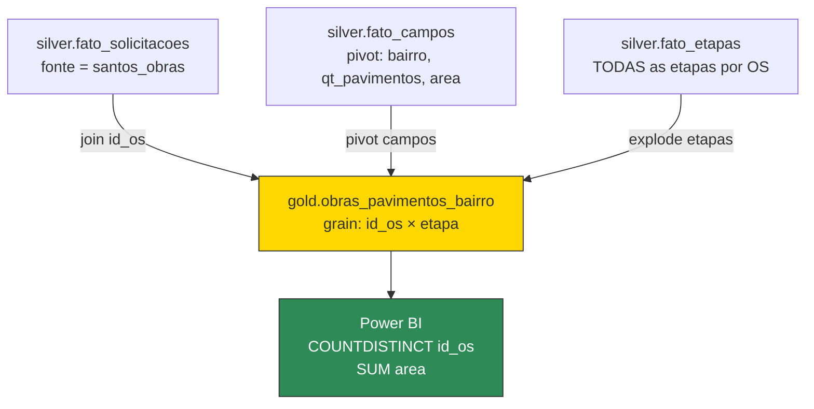

# Spec Drive — Novo Painel Obras: Aprovações por Bairro, Etapa e Pavimento

> **Objetivo:** Criar novo painel Power BI que permita analisar aprovações de obras por bairro, etapa de fluxo, quantidade de pavimentos e ano — com contagem distinta de OS e soma de área.
> **Fonte:** `santos_obras` — já ativa no Silver do módulo Acto (`lh_solicitacoes_acto`)
> **Notebook novo:** `nb_gold_santos_obras_pavimentos`
> **Tabela Gold nova:** `gold.obras_pavimentos_bairro`

---

## Roadmap de Progresso

```
[ ] Fase 0 — Exploração: confirmar campos EAV no Silver (pavimentos, area, bairro)
[ ] Fase 1 — Notebook Gold: nb_gold_santos_obras_pavimentos
[ ] Fase 2 — Orquestrador: adicionar %run ao _nb_gold_orquestracao
[ ] Fase 3 — Pipeline: adicionar RefreshSqlEndpoint + PBI refresh ao pl_ingest_acto
[ ] Fase 4 — Painel PBI: montar visual, validar com cliente
```

---

## Contexto e Requisitos

### Origem da Solicitação (OS #962592)

| Campo | Valor |
|---|---|
| Cliente | PM Santos – Aprova Santos |
| Criticidade | Média |
| Classificação | Requisição |
| Eixo | Configuração |

### Requisitos do Painel

| Dimensão | Detalhe |
|---|---|
| **Filtros** | Serviço; Etapa do fluxo; Quantidade de pavimentos (grade) |
| **Linhas** | Bairro |
| **Colunas** | Ano |
| **Métricas** | COUNT DISTINCT `id_os`; SUM `area` |

### Regra de Negócio Crítica — Deduplicação

> Uma OS pode passar **mais de uma vez** pela mesma etapa (erro operacional ou retrabalho). A aprovação é única. Portanto a contagem **deve usar `COUNT DISTINCT id_os`** — nunca `COUNT(*)`.
>
> Grain do Gold: **OS × Etapa** (uma linha por passagem). A deduplicação fica no Power BI com `DISTINCTCOUNT`.

### Exemplo de Análise

> "Quantos empreendimentos com mais de 10 pavimentos foram aprovados entre 2023 e 2026?"
> = `COUNTDISTINCT id_os` WHERE servico IN (plurifamiliar, comercial) AND etapa = "Emissão Alvará" AND qt_pavimentos > 10 AND ano BETWEEN 2023 AND 2026

---

## Arquitetura — Nova vs. Legado

Este painel é **novo** — não existe equivalente no legado. Segue 100% a nova arquitetura do módulo Acto.



### Diferença de Grain vs. Golds Existentes

| Gold existente (`nb_gold_santos_cet`) | Gold novo (`nb_gold_santos_obras_pavimentos`) |
|---|---|
| Grain: 1 linha por OS | Grain: 1 linha por **OS × Etapa** |
| etapa_atual = `spark_max("etapa")` | Todas as etapas com seus timestamps |
| COUNT(*) = número de OS | COUNT DISTINCT id_os = aprovações únicas |

---

## Fase 0 — Exploração de Campos EAV

> [!success] Bairro — lógica 100% pronta no legado
> O campo bairro nos painéis existentes vem de `TXT_IMOB_LOGRBAIRRO` ou `COB_IMOB_LOGRBAIRRO` (ambos com `tit: "Bairro"`). No Silver EAV novo, após `clean_col_name()`, o `campo` será algo como `txt_imob_logrbairro` ou `cob_imob_logrbairro`. A normalização (`NFC + upper + strip + correções de grafia`) e o join bairro → zona via `PMS_AuxiliarPDR.xlsx` já estão implementados em `nb_gold_acto_gestao_obras` células 9–10. **Reutilizar integralmente.**

> [!success] Zona — já mapeada no AuxiliarPDR
> 122 bairros de Santos já estão mapeados para Z1/Z2/Z3 na aba `Zona_Bairros`. 100 bairros únicos confirmados na execução do legado. Arquivo em `/lakehouse/default/Files/acto/PMS_AuxiliarPDR.xlsx`.

O que ainda precisa ser confirmado via exploração do Silver:

### Script de Exploração (rodar no Fabric)

```python
from pyspark.sql.functions import col

# Listar todos os campos de obras no Silver EAV
campos_obras = (
    spark.table("silver.fato_campos")
    .filter(col("fonte") == "santos_obras")
    .select("campo")
    .distinct()
    .orderBy("campo")
)
display(campos_obras)

# Buscar especificamente pavimentos e area
display(
    spark.table("silver.fato_campos")
    .filter(col("fonte") == "santos_obras")
    .filter(
        col("campo").rlike("(?i)(paviment|pav_|nrpav|area|m2|m²)")
    )
    .groupBy("campo")
    .count()
    .orderBy("campo")
)
```

### Campos a Confirmar

| Campo | Nomes Prováveis (API usa `TXT_IMOB_*`) | Status |
|---|---|---|
| Bairro | `txt_imob_logrbairro`, `cob_imob_logrbairro` | ✅ Lógica pronta — só confirmar nome pós-normalização |
| Quantidade de Pavimentos | `txt_imob_nrpavtos`, `nrpavtos`, `numero_de_pavimentos` | ⏳ confirmar nome exato |
| Área | `txt_imob_areatotal`, `txt_imob_areaconstruida`, `area` | ⏳ confirmar nome e unidade |

---

## Fase 1 — Notebook Gold

### Arquivo: `Acto/nbs/nbs_gold/nb_gold_santos_obras_pavimentos.ipynb`
### Tabela de saída: `gold.obras_pavimentos_bairro`

### O que já existe e pode ser reutilizado

| Componente | Origem | Status |
|---|---|---|
| Grain OS × Etapa | `nb_gold_acto_gestao_obras_etapas` (legado) | ✅ Portar para PySpark/Silver |
| Normalização de bairro (NFC + upper + correções) | `nb_gold_acto_gestao_obras` células 9–10 (legado) | ✅ Adaptar para EAV |
| Join bairro → zona via `PMS_AuxiliarPDR.xlsx` | `nb_gold_acto_gestao_obras` célula 10 (legado) | ✅ Reutilizar direto |
| `aux_setor_responsavel` por etapa | `nb_gold_acto_gestao_obras_etapas` (legado) | ✅ Reutilizar |
| `duracao_dias_preciso` / `duracao_dias_int` | `nb_gold_acto_gestao_obras_etapas` (legado) | ✅ Reutilizar |
| Campo `qt_pavimentos` | Silver EAV (`fato_campos`) | ⏳ Confirmar nome na Fase 0 |
| Campo `area` | Silver EAV (`fato_campos`) | ⏳ Confirmar nome na Fase 0 |

### Schema da Tabela Gold

| Coluna | Origem | Tipo | Notas |
|---|---|---|---|
| `id_os` | `fato_etapas.id_os` | string | PK composta com etapa |
| `etapa` | `fato_etapas.etapa` | string | Dimensão principal do painel |
| `servico` | `fato_solicitacoes.servico` | string | Slicer no PBI |
| `status_fluxo` | `fato_solicitacoes.status_fluxo` | string | — |
| `data_criacao` | `fato_solicitacoes.data_criacao` | timestamp | — |
| `ano` | derivado | int | `year(data_criacao)` — coluna do PBI |
| `data_inicio_etapa` | `fato_etapas.data_inicio_etapa` | timestamp | — |
| `data_fim_etapa` | `fato_etapas.data_fim_etapa` | timestamp | — |
| `status_etapa` | `fato_etapas.status` | string | EM ATENDIMENTO / FINALIZADA / CANCELADA |
| `executor` | `fato_etapas.executor` | string | — |
| `duracao_dias_preciso` | calculado | float | `datediff(fim, inicio)` |
| `duracao_dias_int` | calculado | int | `round(duracao_dias_preciso)` |
| `bairro_raw` | `fato_campos` pivot | string | Campo bruto pré-normalização |
| `bairro_consolidado` | normalizado | string | Após upper + correções de grafia |
| `zona` | join `PMS_AuxiliarPDR.xlsx` | string | Z1 / Z2 / Z3 |
| `zona_aplicavel` | derivado por serviço | int | 0 para inscrição/cadastro profissional |
| `aux_setor_responsavel` | join `PMS_AuxiliarPDR.xlsx` | string | Setor por etapa |
| `qt_pavimentos` | `fato_campos` pivot | string | ⏳ confirmar campo — cast int no PBI |
| `area` | `fato_campos` pivot | string | ⏳ confirmar campo — cast float no PBI |

### Código do Notebook (Template)

```python
# Célula 1 — Configuração
FONTE_OBRAS = "santos_obras"
AUX_PATH = "/lakehouse/default/Files/acto/PMS_AuxiliarPDR.xlsx"

# Atualizar após Fase 0 (confirmar nomes no Silver EAV)
CAMPO_BAIRRO     = "txt_imob_logrbairro"  # ← confirmar
CAMPO_PAVIMENTOS = "txt_imob_nrpavtos"    # ← confirmar
CAMPO_AREA       = "txt_imob_areatotal"   # ← confirmar

CAMPOS_PIVOT = [CAMPO_BAIRRO, CAMPO_PAVIMENTOS, CAMPO_AREA]

SERVICOS_SEM_ZONA = {
    "INSCRIÇÃO DE PROFISSIONAL (PESSOA FÍSICA)",
    "INSCRIÇÃO EMPRESA/PROFISSIONAL (PESSOA JURÍDICA)",
    "RENOVAÇÃO DE CADASTRO PROFISSIONAL PESSOA FÍSICA",
    "RENOVAÇÃO DE CADASTRO EMPRESA/PROFISSIONAL (PESSOA JURÍDICA)",
    "PROVIDÊNCIA",
}

# Correções de grafia de bairro — reutilizado do legado
MAPA_BAIRROS = {
    "BOQUEIRAO": "BOQUEIRÃO", "POMPEIA": "POMPÉIA",
    "MARAPE": "MARAPÉ", "EMBARE": "EMBARÉ",
    "ESTUARIO": "ESTUÁRIO", "PAQUETA": "PAQUETÁ",
    "SABOO": "SABOÓ", "ITARARE": "ITARARÉ",
    "PONTA PRAIA": "PONTA DA PRAIA",
    "VILA MATIAS": "VILA MATHIAS",
    "RADIO CLUBE": "RÁDIO CLUBE", "RADIO CLUB": "RÁDIO CLUBE",
    "JOSE MENINO": "JOSÉ MENINO",
    "CHICO PAUL": "CHICO DE PAULA", "CHICO PAULA": "CHICO DE PAULA",
}
```

```python
# Célula 2 — Carregar Silver
import pandas as pd
from pyspark.sql.functions import col, year, datediff, first

df_sol = (
    spark.table("silver.fato_solicitacoes")
    .filter(col("fonte") == FONTE_OBRAS)
    .select("id_os", "servico", "status_fluxo", "data_criacao", "data_finalizacao")
)

# Grain: OS × Etapa (todas as etapas, não só a última)
df_etapas = (
    spark.table("silver.fato_etapas")
    .filter(col("fonte") == FONTE_OBRAS)
    .select("id_os", "etapa", "status", "data_inicio_etapa", "data_fim_etapa", "executor")
    .withColumnRenamed("status", "status_etapa")
    .withColumn(
        "duracao_dias_preciso",
        datediff(col("data_fim_etapa"), col("data_inicio_etapa")).cast("float")
    )
    .withColumn("duracao_dias_int", col("duracao_dias_preciso").cast("int"))
)

# Pivot de campos EAV — bairro, pavimentos, area
df_campos = (
    spark.table("silver.fato_campos")
    .filter(col("fonte") == FONTE_OBRAS)
    .filter(col("campo").isin(CAMPOS_PIVOT))
    .groupBy("id_os")
    .pivot("campo", CAMPOS_PIVOT)
    .agg(first("valor"))
    .withColumnRenamed(CAMPO_BAIRRO, "bairro_raw")
    .withColumnRenamed(CAMPO_PAVIMENTOS, "qt_pavimentos")
    .withColumnRenamed(CAMPO_AREA, "area")
)
```

```python
# Célula 3 — Normalização de bairro e join zona (reutilizado do legado)
import re, unicodedata

def norm_bairro(s):
    if not s or str(s).upper() in ("NONE", "NAN", ""):
        return None
    b = unicodedata.normalize("NFC", str(s)).upper().strip()
    b = re.sub(r"[.,;:/\-]", " ", b)
    b = re.sub(r"\s+", " ", b).strip()
    b = re.sub(r"^(MR|MR\.|MOR\.)\s*", "MORRO ", b)
    return MAPA_BAIRROS.get(b, b)

# Carregar AuxiliarPDR
aux_zona = pd.read_excel(AUX_PATH, sheet_name="Zona_Bairros")
aux_zona["bairro_pad"] = aux_zona["BAIRRO"].astype(str).str.upper().str.strip()
aux_zona["bairro_pad"] = aux_zona["bairro_pad"].replace(MAPA_BAIRROS)
aux_zona = aux_zona[["bairro_pad", "ZONA"]].rename(columns={"ZONA": "zona"}).drop_duplicates("bairro_pad")

aux_etapas = pd.read_excel(AUX_PATH, sheet_name="Etapas")
aux_etapas["etapa_pad"] = aux_etapas["Etapa"].fillna("").str.upper().str.strip()
aux_etapas = (
    aux_etapas[["etapa_pad", "AuxSetorResponsável"]]
    .rename(columns={"AuxSetorResponsável": "aux_setor_responsavel"})
    .drop_duplicates("etapa_pad")
)

# Broadcast pandas → Spark
aux_zona_spark   = spark.createDataFrame(aux_zona)
aux_etapas_spark = spark.createDataFrame(aux_etapas)
```

```python
# Célula 4 — Montar Gold
from pyspark.sql.functions import udf, upper, trim, regexp_replace, lit, when
from pyspark.sql.types import StringType

norm_udf = udf(norm_bairro, StringType())

df_gold = (
    df_etapas
    .join(df_sol,    "id_os", "left")
    .join(df_campos, "id_os", "left")
    .withColumn("ano", year(col("data_criacao")))
    .withColumn("bairro_consolidado", norm_udf(col("bairro_raw")))
    .withColumn("etapa_pad", upper(trim(col("etapa"))))
    .join(aux_zona_spark,   col("bairro_consolidado") == aux_zona_spark["bairro_pad"], "left")
    .join(aux_etapas_spark, col("etapa_pad") == aux_etapas_spark["etapa_pad"], "left")
    .withColumn(
        "zona_aplicavel",
        when(col("servico").isin(list(SERVICOS_SEM_ZONA)), lit(0)).otherwise(lit(1))
    )
    .drop("bairro_pad", "etapa_pad")
)

assert df_gold.count() > 0, "Gold vazio antes de gravar"

df_gold.write.mode("overwrite").format("delta").saveAsTable("gold.obras_pavimentos_bairro")
print(f"✓ gold.obras_pavimentos_bairro salva — {df_gold.count():,} linhas")
```

---

## Fase 2 — Orquestrador

Em `_nb_gold_orquestracao.ipynb`, adicionar após `%run ./nb_gold_santos_obras_acompanhamento`:

```python
%run ./nb_gold_santos_obras_pavimentos
```

---

## Fase 3 — Pipeline

No `pl_ingest_acto`, adicionar após o `RefreshSqlEndpoint` existente:

| Atividade nova | Tipo | Detalhes |
|---|---|---|
| `Refresh_PBI_obras_pavimentos` | PBISemanticModelRefresh | Dataset do novo painel após criação no PBI |

> [!note] Pendência P3 da pipeline
> Já estava registrado como pendência que CET/SEPREF não têm refresh no pipeline. Este painel deve ser adicionado junto com os demais pendentes. Ver [[DOCUMENTACAO_TECNICA_ACTO#Pendências na pipeline]].

---

## Fase 4 — Painel Power BI

### Estrutura Visual

```
[ Slicer: Serviço ] [ Slicer: Etapa ] [ Slicer: Qt Pavimentos (≥ N) ]

┌─────────────────────────────────────────────────────────────────┐
│                    Aprovações por Bairro × Ano                  │
│  Bairro           │ 2023 │ 2024 │ 2025 │ 2026 │ Total          │
│─────────────────────────────────────────────────────────────────│
│  Centro           │   12 │   18 │  22  │   8  │   60           │
│  Gonzaga          │    5 │    9 │  11  │   4  │   29           │
│  ...              │  ... │  ... │ ...  │  ... │  ...           │
└─────────────────────────────────────────────────────────────────┘

[ Cartão: Total OS Aprovadas ] [ Cartão: Área Total (m²) ]
```

### Medidas DAX

```dax
// Contagem única de aprovações (deduplicada)
Qtd OS Aprovadas = DISTINCTCOUNT(obras_pavimentos_bairro[id_os])

// Soma de área (campo area pode ter nulos)
Area Total m2 = SUMX(
    obras_pavimentos_bairro,
    VALUE(obras_pavimentos_bairro[area])
)
```

> [!warning] Cast de área e pavimentos
> Os campos `area` e `qt_pavimentos` chegam como `string` do EAV. No Power BI, criar colunas calculadas com `VALUE()` ou `INT()` para permitir filtros numéricos (ex: "mais de 10 pavimentos").

---

## Dependências e Pré-Requisitos

| Pré-requisito | Status | Ação |
|---|---|---|
| `silver.fato_etapas` com fonte `santos_obras` | ✅ Confirmado (91.003 etapas) | — |
| `silver.fato_campos` com fonte `santos_obras` | ✅ Confirmado (54.504 campos) | — |
| Nomes exatos dos campos EAV | ⏳ **Pendente** | Rodar script da Fase 0 |
| `nb_gold_santos_obras_acompanhamento` no orquestrador | ❌ Pendente (Bloco 1 do SPEC_DRIVE_MIGRACAO_OBRAS) | Resolver junto |

> [!info] Sem bloqueadores de pipeline
> Diferente dos painéis legados, este painel **não depende da correção do HTTP 401**. O novo pipeline (`pl_ingest_acto`) já funciona com OAuth2 automático. Os dados já estão no Silver.

---

## Checklist de Execução

```
Fase 0 — Exploração
[ ] 0.1 Rodar script de listagem de campos no Fabric
[ ] 0.2 Confirmar nome do campo bairro
[ ] 0.3 Confirmar nome do campo pavimentos
[ ] 0.4 Confirmar nome do campo area
[ ] 0.5 Verificar se area tem valores numéricos ou texto livre

Fase 1 — Notebook Gold
[ ] 1.1 Criar nb_gold_santos_obras_pavimentos.ipynb com código do template
[ ] 1.2 Atualizar CAMPO_BAIRRO, CAMPO_PAVIMENTOS, CAMPO_AREA com nomes reais
[ ] 1.3 Rodar notebook manualmente — confirmar rowcount > 0
[ ] 1.4 Validar sample: display(df_gold.limit(10)) — checar nulos em campos-chave
[ ] 1.5 Confirmar que COUNT DISTINCT id_os bate com o esperado (~11.729 OS max)

Fase 2 — Orquestrador
[ ] 2.1 Adicionar %run no _nb_gold_orquestracao.ipynb
[ ] 2.2 Rodar orquestrador completo — confirmar que não quebra outros Golds

Fase 3 — Pipeline
[ ] 3.1 Adicionar refresh do novo PBI ao pl_ingest_acto (após criação do dataset)

Fase 4 — PBI
[ ] 4.1 Criar arquivo .pbix conectado em gold.obras_pavimentos_bairro
[ ] 4.2 Criar colunas calculadas para area (float) e qt_pavimentos (int)
[ ] 4.3 Montar matriz bairro × ano com DISTINCTCOUNT
[ ] 4.4 Adicionar slicers: serviço, etapa, qt_pavimentos (≥ N)
[ ] 4.5 Validar exemplo da OS com Kelly: empreendimentos > 10 pav aprovados 2023-2026
[ ] 4.6 Publicar e reconectar ao workspace
```

---

## Referências

- [[DOCUMENTACAO_TECNICA_ACTO]] — arquitetura completa do módulo Acto
- [[SPEC_DRIVE_MIGRACAO_OBRAS]] — migração dos 4 painéis legados (contexto paralelo)
- [[SCHEMA_LAKEHOUSE_ACTO]] — schema de todas as tabelas Silver/Gold
- [[Tarefas/Tarefa — Novo Painel Obras BI (OS por Bairro, Etapa e Pavimento)]] — OS de origem
