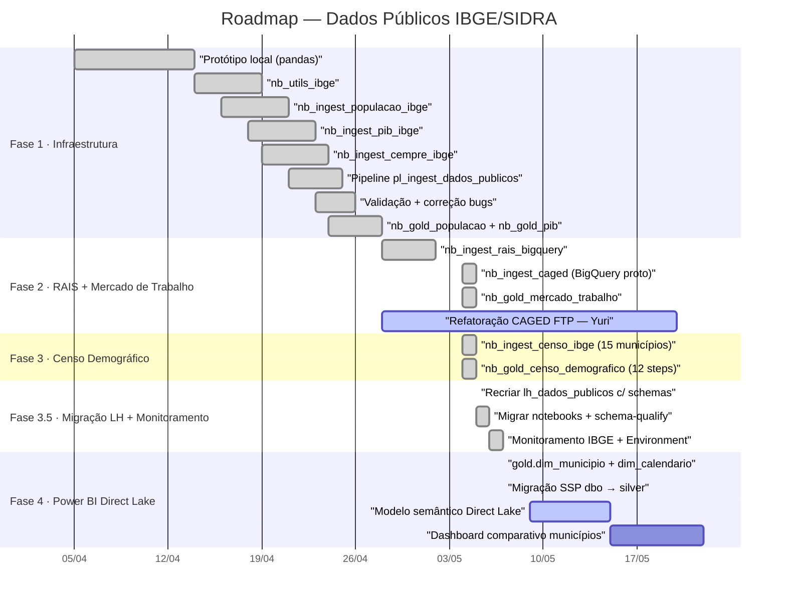

# Spec Drive — Semana de Trabalho (04/05/2026)
## Projeto: Painel de Dados Públicos (Santos · Osasco · Mauá)

**Contexto:** Finalizamos com sucesso a migração técnica para a arquitetura **Schema-Aware (v3.0)**. O Lakehouse `lh_dados_publicos` agora está organizado em schemas funcionais (`bronze`, `silver`, `gold`, `monitoramento`). A Fase 3.5 foi concluída com a entrega de dimensões auxiliares e a ingestão completa da Segurança Pública (SSP).

---

## 📊 Estado Atual do Lakehouse (07/05/2026)

| Schema | Status | Conteúdo Principal |
|---|---|---|
| `bronze` | ✅ | Tabelas brutas IBGE, RAIS e CAGED. |
| `silver` | ✅ | **SSP (491k linhas)** · População · PIB · RAIS · Caged · Censo · **dim_municipio** · **dim_calendario**. |
| `gold` | ✅ | 12 tabelas Censo (incluindo paridade) · PIB per capita · Mercado Trabalho (RAIS+CAGED). |
| `monitoramento`| ✅ | Pipeline `pl_monitoramento_ingest` com agendamento diário ativo. |
| `dbo` | 🗑️ | Tabelas antigas (silver_ssp_*) removidas após migração bem-sucedida. |

---

## 📅 Roadmap Detalhado — Estado em 07/05/2026

---

## 📋 Tabela de Status de Fases

| Fase | Nome | Status | Entregáveis Principais |
|---|---|---|---|
| 1 | Infraestrutura | ✅ | Lakehouse c/ Schemas, Utils IBGE, Clusters. |
| 2 | Mercado de Trabalho | ✅ | Ingestão RAIS/CAGED, Gold Mercado Trabalho. |
| 3 | Censo Demográfico | ✅ | Ingestão SIDRA, Gold Censo com 12 visões. |
| **3.5** | **Migração & Monitoramento**| ✅ | **Schemas migrados**, Monitoramento IBGE ativo. |
| 4 | Power BI / Semântica | 🔵 | dim_municipio/calendario (✅), SSP (✅), Modelo Direct Lake (Semana 12/05). |
| 5 | Dashboards Especializados | 🔲 | `nb_gold_osasco_seguranca_publica`. |

---

## 🏛️ Regras de Governança e Semântica

### 📅 Dimensão Calendário (`silver.dim_calendario`)
- **Regra de Join:** Para fatos mensais (CAGED, SSP), utilizar a coluna `ano_mes`. Para fatos anuais (PIB, População), utilizar a coluna `ano`.
- **Granularidade:** Mensal (1970–2030). Contempla `decada` e `periodo_label` para filtros históricos.

### 📍 Dimensão Município (`silver.dim_municipio`)
- **Filtro de Aplicação:** Utilize a coluna `papel` para distinguir entre "Cliente Core" e "Benchmark".
- **Join:** Sempre via `id_municipio` (7 dígitos IBGE).

---

## 📂 Catálogo de Tabelas Gold (Consumo BI)

| Tabela | Domínio | Descrição |
|---|---|---|
| `gold.populacao` | Demografia | População total e variação anual. |
| `gold.pib` | Economia | PIB Total e Per Capita. |
| `gold.mercado_trabalho` | Trabalho | Estoque (RAIS) e Fluxo (CAGED). |
| `gold.censo_piramide_populacao` | Censo | Estrutura etária por sexo. |
| `gold.censo_territorio` | Território | Área e Densidade Demográfica. |
| `gold.censo_renda` | Social | Renda domiciliar comparativa. |

---

## 🔵 Próximos Passos (Fase 4 & 5)
1. 🔵 Criar modelo semântico Direct Lake no Power BI Service (Semana 12/05).
2. 🔵 Desenvolver `nb_gold_osasco_seguranca_publica` para análise de criminalidade.
3. 🔲 Cruzamento de dados de Renda (Censo) com Segurança (SSP) por território.

---

## Links Rápidos

| O que precisar | Onde encontrar |
|---|---|
| Spec mestre (roadmap completo) | [[spec_drive_dados_publicos\|Spec Drive Dados Públicos]] |
| Spec semana seguinte | [[spec_drive_semana_11_05_2026\|Spec 11/05/2026]] |
| Mapeamento técnico tabelas | [[Documentação_Fabric/Dados Públicos/Mapeamento_Tecnico_Dados_Publicos\|Mapeamento Técnico]] |

---
*Spec Drive · Acto Cidade Inteligente · Atualizado em 07/05/2026*
