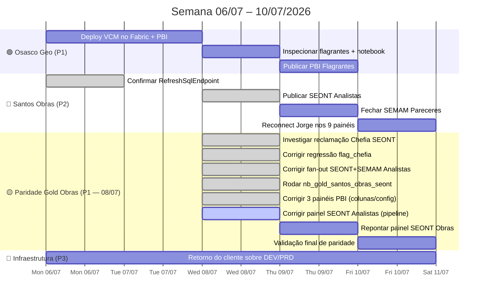

# Spec Drive — Semana 06/07/2026

**Contexto geral:** Semana de consolidação dos entregáveis herdados da sprint anterior. As frentes ativas seguem concentradas em Osasco Geo, nos painéis de Santos (SEONT/SEMAM/Pareceres e migração PBI) e no radar de infraestrutura DEV/PRD. Não há novas demandas mapeadas no vault além das pendências já abertas; o objetivo desta semana é reduzir o backlog operacional e fechar publicação/pipeline onde já existe Gold validado.

**Alinhamento 06/07:** prioridade prática nesta semana é concluir o que já está tecnicamente pronto ou quase pronto: VCM Osasco no Fabric/PBI, Flagrantes Osasco como próximo mapa SSP, e os painéis de Santos que dependem de refresh/publicação. Frentes bloqueadas por API ou por decisão de cliente permanecem estacionadas.

**Atualização 08/07:** dia dominado por uma reclamação de cliente sobre OS pendentes na Chefia SEONT ausentes do painel de Analistas, que puxou uma investigação grande: descobrimos e corrigimos **2 regressões reais** causadas pela própria correção de paridade Gold Obras (coluna removida quebrando notebook downstream + fan-out silencioso inflando contagens em 2 painéis, um deles já publicado), rodamos pela primeira vez o `nb_gold_santos_obras_seont` (parte do Bloco 4 da paridade), e destravamos 3 dos 4 painéis PBI de obras que falhavam na pipeline (2 por colunas órfãs no Power Query, 1 por nome de tabela errado hardcoded na atividade de refresh). Ver [[SPEC_DRIVE_PARIDADE_GOLD_OBRAS]] para o detalhe técnico completo e a Frente 7 abaixo para o resumo do dia.

**Atualização 10/07:** frente **SSP Criminais Geo (Osasco) fechada de ponta a ponta** — levantamento dos pontos fora do mapa entregue à cliente, Gold `gold.osasco_ssp_criminais_geo` reestruturada no Fabric com flag `dentro_mapa` + `natureza_apurada`, painel atualizado e publicado com tooltip de cobertura, e comunicação enviada no Teams com relatório HTML + Excel. Ver Frente 8 abaixo. No mesmo dia, fechamento da paridade obras (pipeline 9/9 verde, chamado 994650 da Kelly em homologação — Frente 7).

---

## 📍 Estado Atual (08/07/2026)

| Projeto | Status | Próxima ação |
|---|---|---|
| **Osasco — Violência Contra Mulher** | 🟢 Teste local validado · deploy Fabric pendente | Upload geojson → importar notebook → publicar pipeline → criar aba Azure Maps |
| **Osasco — Flagrantes SSP** | 🔵 Template pronto · dados amostrados pendentes | Inspecionar CSV de amostra → criar notebook Fabric → publicar PBI |
| **Osasco — SSP Criminais Geo (fora do mapa + tooltip)** | ✅ **Concluído 10/07** · Gold `dentro_mapa` no Fabric · painel publicado com tooltip · cliente comunicada (Teams) | Reexecutar `nb_analise_comparativa_gold_geo` local com filtro `dentro_mapa=1` |
| **Paridade Gold Obras (Santos)** | 🟢 4 notebooks corrigidos e validados · 2 regressões achadas e corrigidas · **`pl_refresh_acto` 100% verde (9/9)** | Repontar painel SEONT Obras para `gold.santos_obras_seont_os` → validação final de paridade → revalidar `confbi2.csv` do cliente |
| **PBI SEONT Analistas** | 🟢 Publicado com fix (942 OS, sem fan-out) · pipeline corrigida e validada (10/07) | Revalidar `confbi2.csv` do cliente |
| **PBI SEMAM Analistas** | 🟡 Publicado, mas contagem pode estar inflada por fan-out (bug encontrado e corrigido hoje) | Reexecutar e republicar para consolidar a correção |
| **SEMAM Pareceres** | 🔵 Gold pronto · decisão de escopo/SLA ainda aberta | Confirmar escopo com Kelly → fechar DAX/visual → publicar → pipeline |
| **Migração PBI Santos (9 painéis)** | 🟡 3/4 painéis de obras já corrigidos e publicados hoje (`acomp_solicitacoes`, `seman_acomp_solicitacoes`, `pdr`) | Fechar o 4º (SEONT Analistas) → seguir reconexão dos demais 5 com Jorge |
| **Ambientes Fabric DEV/PRD** | 📡 Radar · aguardando retorno do cliente | Confirmar opção de criação dos workspaces |
| **OS #962592 — Aprovações Santos** | 🔴 Bloqueado por subformulários da API | Manter em espera |
| **OS #971002 — Mauá Meio Ambiente** | 🔴 Bloqueado por subformulários da API | Manter em espera |
| **bi_osasco_atendimento_cras** | 🔴 Falha na pipeline (`demanda_programa_bolsa_familia_pbf` ausente em `gold_atendimento_cras`) — descoberto hoje, não relacionado a obras | Investigar separadamente (fora do escopo da paridade obras) |

---

## 🗓️ Roadmap Visual da Semana

---

## 🟢 Frente 1 — Osasco Geo · Violência Contra Mulher

**Spec técnico:** [[spec_mapa_geo_violencia_mulher_osasco]]  
**Lakehouse:** `lh_cidade_inteligente_osasco`

### Estado atual

Teste local já validou a parte geoespacial. O que falta agora é apenas o deploy no Fabric e a publicação do PBI com Azure Maps.

### Tarefas

- [ ] **O1** Upload de `bairros_osasco.json` em `Files/geo/` no lakehouse
- [ ] **O2** Criar `nb_utils_geo_osasco` no Fabric e executar o utilitário
- [ ] **O3** Importar `nb_gold_osasco_violencia_mulher_mapa.ipynb` no Fabric e validar rowcount
- [ ] **O4** Preencher `notebookId` no `pl_violencia_mulher_osasco.json` e publicar pipeline
- [ ] **O5** Criar aba do mapa no PBI com Azure Maps, cor por `Rubrica` e filtros de período/tipo/fonte
- [ ] **O6** Publicar o PBI e comunicar o analista de BI

> [!note] Critérios de aceite
> Cobertura lat/long validada, `bairro_geo` preenchido, pipeline executável no Fabric e mapa funcionando com a legenda correta.

---

## 🔵 Frente 2 — Osasco Geo · Flagrantes SSP

**Spec de referência:** [[spec_arquitetura_geo_osasco]]

### Estado atual

O levantamento já mostrou a arquitetura. O próximo passo útil é usar o template de Flagrantes para dar o primeiro corte operacional do mapa nativo.

### Tarefas

- [ ] **G1** Inspecionar `geo_osasco/output/amostra_silver_tb_flagrantes.csv` e selecionar colunas de interesse para o PBI
- [ ] **G2** Criar `nb_gold_osasco_flagrantes_mapa` no Fabric
- [ ] **G3** Executar o notebook e validar volume recortado em Osasco
- [ ] **G4** Publicar PBI Flagrantes com Azure Maps e cor por `natureza_apurada`

> [!note] Estratégia
> Primeiro fechar Flagrantes como prova de conceito do cenário SSP, depois escalar para os demais datasets da arquitetura geo.

---

## 🔵 Frente 3 — SEONT Analistas · Publicação e Pipeline

**Spec técnico:** [[spec_painel_seont_analista_tecnico]]

### Tarefas

- [ ] **B1** Confirmar que `dias_analise` e `etapa_analise_label` aparecem no endpoint SQL após RefreshSqlEndpoint
- [ ] **B2** Publicar o PBI `pbi_santos_obras_seont_analistas`
- [ ] **B3** Adicionar `PBISemanticModelRefresh` ao `pl_ingest_acto`
- [ ] **B4** Validar o painel publicado com Kelly

> [!warning] Dependência crítica
> Se o refresh do endpoint não expuser as colunas novas, não avançar com a publicação final antes de corrigir o schema.

---

## 🟡 Frente 4 — SEMAM Pareceres · Fechamento

**Spec técnico:** [[spec_painel_semam_pareceres]]

### Tarefas

- [ ] **P1** Confirmar com Kelly se o card de OS atrasadas usa SLA fixo ou se será removido
- [ ] **P2** Confirmar se Reforma/Legalização e Alterações Diversas entram no escopo
- [ ] **P3** Se houver expansão de escopo, reexecutar o Gold e validar o rowcount
- [ ] **P4** Ajustar a medida DAX ou o visual conforme a decisão
- [ ] **P5** Publicar o PBI e adicionar o refresh no `pl_ingest_acto`
- [ ] **P6** Comunicar a entrega

---

## 🟡 Frente 5 — SEMAM Analistas · Integração Pipeline

**Spec técnico:** [[spec_painel_semam_analista_tecnico]]

### Tarefas

- [ ] **M1** Confirmar que `gold.santos_semam_analista_tecnico` aparece no SQL Endpoint
- [ ] **M2** Adicionar o refresh do painel SEMAM Analistas no `pl_ingest_acto`
- [ ] **M3** Validar a atualização automática do painel

---

## 🟡 Frente 7 — Paridade Gold Obras + Correção de Regressões (08/07/2026)

**Spec técnico completo:** [[SPEC_DRIVE_PARIDADE_GOLD_OBRAS]] · **Ferramentas:** `Acto Cidade Inteligente/exploracao_obras_sql/`

### Contexto — como começou

Cliente reportou (anexando `confbi2.csv`, comparativo manual vs. BI) que "o relatório de solicitações pendentes para a chefia SEONT segue com problemas". A investigação partiu daí e revelou uma cadeia de achados muito maior que o relatado inicialmente.

### O que foi corrigido hoje

**1. Gap real no painel SEONT Analistas (causa raiz do relatório do cliente)**
`nb_gold_santos_seont_analista_tecnico` filtrava a tabela de análise técnica **antes** de qualquer outra lógica — OS que nunca chegaram a ter um analista atribuído (paradas na fila da Chefia) ficavam 100% fora da tabela, mesmo pendentes há tempo. Fix: nova célula que identifica essas OS via `left_anti` join contra `gold.santos_obras_acompanhamento` e as mescla no bucket "Não Atribuído" já existente. Resultado: 846 → 942 OS.

**2. Regressão real #1 — `flag_chefia` quebrando o Gold orchestrator**
A correção de paridade em `gold.santos_obras_acompanhamento` (remover colunas para bater com o legado) **quebrou** `nb_gold_santos_seont_analista_tecnico`, que dependia de `flag_chefia` — coluna removida sem checar consumidores downstream. Isso derrubava `_nb_gold_orquestracao` inteiro desde a correção. Descoberto ao ler o log de falha real da pipeline (`pl_ingest_acto`), não por suposição.

**3. Regressão real #2 — fan-out silencioso (sem erro, números errados)**
Depois de corrigir o `flag_chefia`, o notebook rodou limpo mas com contagem inflada: 846 OS viraram 1.011 linhas sem nenhuma exceção. Causa: `gold.santos_obras_acompanhamento` agora tem N linhas por OS (paridade com múltiplas etapas abertas do legado), mas o notebook assumia 1 linha/OS. Fix: dedup por `Window` antes do join + assert de regressão (`n_final == n_ultima`). **O mesmo bug existia em `nb_gold_santos_semam_analista_tecnico` — painel já publicado ao cliente, corrigido antes de causar mais estrago.**

**4. `nb_gold_santos_obras_seont` rodado pela primeira vez**
Bloco 4 da spec de paridade (tabela `gold.santos_obras_seont_os`, réplica do `gold_obras_seont_os` legado). Resultado inicial: 221 linhas vs. referência de 354 — investigado a fundo via `set difference` de IDs entre legado e novo. **Conclusão: não é bug.** `gold_obras_seont_os` (legado) não tem pipeline automatizada — roda manualmente, é um snapshot congelado. Comparação linha-a-linha de uma OS de exemplo mostrou dados **idênticos** nas duas tabelas; a diferença de contagem é só porque o legado ficou parado no tempo enquanto o novo reflete o fluxo real e atual.

**5. Três painéis PBI destravados na pipeline**
`pl_ingest_acto` estava falhando em 3 dos 4 painéis de obras:
- `pbi_obras_santos_acomp_solicitacoes` e `pbi_obras_santos_seman_acomp_solicitacoes`: Power Query com colunas órfãs (`numero_licenca`, `deliberacao`, `analista_responsavel`, `executor_responsavel`, `flag_chefia`, `flag_etapa_aprov` — todas removidas na paridade). Corrigido recriando a etapa de navegação da fonte (schema em cache desatualizado). **Publicados e validados na pipeline.**
- `pbi_santos_obras_pdr`: mesmo padrão, coluna órfã `tempo_execucao` (resolvido em sessão anterior do mesmo dia) — repontado para `duracao_dias_int`/`duracao_dias_preciso`. **Publicado.**
- `pbi_obras_santos_seont_acomp_analistas`: causa **diferente** — não é dado nem schema, é **configuração de pipeline**. A atividade `PBISemanticModelRefresh` no `pl_refresh_acto` tinha o nome da tabela hardcoded errado (`gold_obras_seont_os`, de outro painel) em vez do nome real (`gold santos_seont_analista_tecnico`). JSON corrigido, aguardando reexecução para confirmar.

**6. Achado à parte, não relacionado**: `bi_osasco_atendimento_cras` também falha na mesma pipeline (`demanda_programa_bolsa_familia_pbf` ausente em `gold_atendimento_cras`) — domínio Osasco CRAS/Bolsa Família, sem relação com obras. Registrado para investigação futura separada.

### Fechamento (10/07/2026)

`pl_refresh_acto` rodou **100% verde** (9/9 atividades) — todos os 4 painéis de obras (`acomp_solicitacoes`, `seman_acomp_solicitacoes`, `pdr`, `seont_acomp_analistas`) e os demais painéis Osasco/Gier confirmados sem erro. Dois problemas adicionais surgiram e foram fechados no caminho:
- `pbi_obras_santos_seman_acomp_solicitacoes` voltou a falhar 2 dias depois do fix (10/07) — revelou que existem **2 cópias do mesmo relatório em workspaces diferentes** ("Acto Cidade Inteligente" e "Acto Cidade Inteligente Santos"); a cópia de "...Santos" nunca tinha recebido a correção. Corrigida separadamente.
- `pbi_obras_santos_seont_acomp_analistas` falhava por **nome de tabela hardcoded errado** na atividade `PBISemanticModelRefresh` do `pl_refresh_acto` (`gold_obras_seont_os`, de outro painel, em vez de `gold santos_seont_analista_tecnico`) — corrigido direto no JSON da atividade via editor de configurações (o "Exibir código JSON" é somente leitura).

> [!warning] Risco de recorrência do cache de schema
> O erro de coluna órfã no Power Query (`numero_licenca` etc.) já teve que ser corrigido **duas vezes** no mesmo painel. Causa exata da recorrência ainda não identificada — pode ser reabertura/republicação de cópia desatualizada do `.pbix`, ou comportamento do próprio conector Fabric/SQL cacheando schema. Fica como risco monitorado, não uma correção definitiva.

### Pendências abertas

- [x] ~~Repontar o painel SEONT Obras para `gold.santos_obras_seont_os`~~ — **não aplicável**. Confirmado 10/07: o `pl_refresh_acto` deve conter só painéis do modelo EAV — `gold.santos_obras_seont_os` fica só como referência técnica de paridade, sem painel próprio.

### Fechamento final — os 6 painéis de obras (10/07/2026)

Mapeamento completo dos painéis de obras/SEMAM registrados no CMS do Acto Web (menus **SEOBE – DECONTE** e **SEMAM**), confrontado com a pipeline `pl_refresh_acto`:

| # | Painel (legenda no menu) | Arquivo `.pbix` | Status final |
|---|---|---|---|
| 1 | Acompanhamento de PDR | `pbi_obras_santos_pdr` | ✅ Na pipeline |
| 2 | Solicitações de Obras | `pbi_obras_santos_acomp_solicitacoes` | ✅ Na pipeline |
| 3 | *(sem item de menu próprio — provável subtab)* | `pbi_obras_santos_seman_acomp_solicitacoes` | ✅ Na pipeline |
| 4 | Solicitações por Analista (SEONT) | `pbi_obras_santos_seont_acomp_analistas` | ✅ Na pipeline |
| 5 | Pareceres Diversos *(nome interno CMS: "DEPCAM I SEMAM")* | `pbi_obras_santos_seman_pareceres` | ✅ Na pipeline — **adicionado 10/07** |
| 6 | Solicitações por Analista (SEMAM) *(nome interno CMS cadastrado errado como "Solicitações de Meio Ambiente")* | `pbi_obras_santos_semam_acomp_analistas` | ✅ Na pipeline — **adicionado 10/07** |

**Report ID `439b7f77-320f-453d-8643-eb4ef515a8de` identificado (10/07):** é o próprio `pbi_obras_santos_seman_acomp_solicitacoes` (item 3 da tabela acima), aparecendo no menu **SEMAM** com a legenda "Solicitações de Meio Ambiente" — não é painel novo, é o mesmo arquivo com entrada de menu duplicada/adicional no CMS. Nome já está correto, nada a corrigir. **Mapeamento dos 6 painéis de obras fechado, sem pendências.**

**Achado operacional — credenciais resetadas em republish:** os erros `Premium_ASWL_Error` / `DMTS_MonikerWithUnboundDataSources` em `seman_pareceres` e `seont_acomp_analistas` foram causados por **outro analista abrir e republicar** esses `.pbix` do Desktop — republicar reseta a credencial explícita da fonte de dados de volta para "conexão padrão", quebrando o refresh agendado/via pipeline (mesmo que o refresh manual do dono continue funcionando). Fix: Configurações do dataset → Credenciais da fonte de dados → reconfigurar explicitamente.
> [!warning] Risco recorrente para o time
> Qualquer republish de um `.pbix` de obras por alguém que não seja o dono original da credencial pode quebrar o refresh automatizado silenciosamente até a próxima tentativa da pipeline. Vale alinhar com o time: sempre reconfigurar credenciais após republish, ou usar uma conta de serviço/gateway compartilhado para evitar essa dependência de sessão pessoal.
- [ ] Investigar as 5 OS com lacuna real de ingestão (985986, 987197, 988460, 989399, 993840 — únicas do set difference que realmente não existem no Silver novo)
- [ ] Entender por que `MAX(data_criacao)` de `silver.fato_solicitacoes` (fonte `santos_obras`) segue travado em 24/06 mesmo após pipeline completa rodar com sucesso — mistério ainda em aberto, não bloqueia o restante
- [x] ~~Recontar `confbi2.csv` do cliente contra o painel corrigido para fechar a reclamação original~~ — **feito 10/07**, ver seção abaixo
- [ ] Reexecutar e republicar `pbi_obras_santos_seman_acomp_analistas` (SEMAM) para consolidar a correção do fan-out no dataset já publicado
- [ ] Rodar `02_comparar_gold_obras.ipynb` para o checklist final de paridade

### ✅ Chamado 994650 (Kelly) — reclamação original fechada (10/07/2026)

Reconciliação completa das 88 OS do `confbi2.csv` contra o estado atual dos dados (detalhe técnico em [[spec_painel_seont_analista_tecnico]]): das OS apontadas como ausentes, a maioria já saiu naturalmente da fila da Chefia SEONT desde que o relatório foi gerado (avançou de etapa ou mudou de setor); as únicas 3 que ainda estavam realmente paradas na Chefia hoje já aparecem corretamente no painel após o fix desta semana. Resolução registrada no chamado.

**Chamado avançou no Acto Web:** OS 994650 (SUPORTE TÉCNICO ACTO PM SANTOS) passou da etapa 2 (Desenvolvimento) para a etapa 3 (**Homologação**), executor atual reatribuído para a própria Kelly Araujo Simões — aguardando validação/homologação dela sobre a resolução enviada.

> [!important] Lição para o resto da migração
> Mudar o schema de uma tabela Gold compartilhada (`gold.santos_obras_acompanhamento`) sem grep prévio nos consumidores downstream quebrou 2 notebooks e inflou silenciosamente um painel já publicado. Antes de fechar a paridade como concluída, vale grep em todo `Acto/nbs/` por essa tabela para achar outros consumidores não mapeados.

---

## ✅ Frente 8 — Osasco Geo · SSP Criminais: pontos fora do mapa + tooltip (concluída 10/07/2026)

**Specs técnicos:** [[spec_arquitetura_geo_osasco]] (seção "Atualização 10/07") · pasta local `geo_osasco/levantamento_fora_mapa/`

### O que foi entregue

**1. Levantamento local — por que pontos somem do mapa (demanda da cliente de 06/07)**
`levantamento_pontos_fora_mapa.ipynb` lendo `silver.ssp_criminais` **direto do OneLake via `deltalake`** — o SQL endpoint é inutilizável para essa tabela (NaN gravado no parquet da coluna `longitude` → erro 24762 em qualquer query que toque a coluna; `CASE`/`WHERE` não contornam). Funil fechado: **85.986 marcados OSASCO → 63.620 no mapa (74,0%) → 22.366 excluídos**, sendo **~97% sem coordenada na origem** (`COORD_NULA`/`COORD_ZERO` — irrecuperável por filtro) e 744 fora do perímetro. Ajustes possíveis (buffer borda + reescala de decimal perdido + lat/long invertido) recuperam só **695 pontos (3,1%)**. Recorte jan–mai/2026 = **7.671, bate exato com o dash**. Relatório HTML + Excel + CSV detalhe com mapas, ganho por ajuste ano a ano e composição por motivo.

**2. Gold reestruturada — `gold.osasco_ssp_criminais_geo` (Fabric)**
`nb_gold_osasco_ssp_criminais_geo` passou a gravar **todos** os registros OSASCO com `dentro_mapa` (1/0) e `motivo_fora_mapa` (`SEM_COORDENADA`/`FORA_DO_PERIMETRO`), sem alterar a `filtrar_para_osasco()` compartilhada. Executado e validado: números idênticos ao levantamento local. Na sequência, **`natureza_apurada` + `rubrica` adicionadas ao SELECT** (28 naturezas, 100% preenchida) — a coluna sempre existiu na Silver mas não era selecionada, e o filtro "Natureza do delito" do PBI depende dela (`descr_conduta` não serve: modalidade/texto livre).

**3. Painel PBI atualizado e publicado**
Filtro `dentro_mapa = 1` no visual Azure Maps, medidas DAX de cobertura (`REMOVEFILTERS` em `dentro_mapa` para o total real) e **tooltip HTML** (visual HTML Content em página-tooltip) mostrando: % cobertura com barra, ocorrências no recorte, plotadas, fora do mapa por motivo — responde dinamicamente aos filtros de ano/natureza.

**4. Comunicação à cliente (Teams, 10/07)**
Mensagem enviada com os números-chave, relatório HTML + Excel anexados e prints do tooltip (74,0% histórico · 77,7% em 2026).

> [!important] Aprendizados registrados
> (a) `silver.ssp_criminais` precisa de saneamento de NaN em lat/long no notebook Silver do Fabric — destravaria o SQL endpoint para todos os consumidores; (b) a completude de coordenada da fonte SSP é estável em ~74% (problema estrutural da origem), mas a *precisão* de quem tem coordenada melhorou muito após 2022 (erro de decimal perdido praticamente eliminado).

### Pendência

- [ ] Reexecutar `nb_analise_comparativa_gold_geo.ipynb` local com filtro `dentro_mapa=1` (a referência de 62.322 registros muda com a Gold nova)

---

## 🟡 Frente 6 — Migração PBI Santos

**Base de contexto:** [[spec_drive_semana_29_06_2026]]

### Tarefas

- [ ] **S1** Disparar o `RefreshSqlEndpoint` se ele ainda não estiver habilitado para os novos schemas
- [ ] **S2** Avisar Jorge para reconectar os 9 painéis priorizados
- [ ] **S3** Validar rowcounts e medidas após reconexão
- [ ] **S4** Confirmar refresh diário nos workspaces afetados

---

## 📡 Radar — Ambientes Fabric DEV/PRD

### Tarefas

- [ ] **I1** Confirmar com o cliente se a criação dos workspaces será feita por ele ou via acesso ao Azure Portal
- [ ] **I2** Se necessário, levantar permissões mínimas para criação dos workspaces
- [ ] **I3** Definir estratégia de deploy quando os ambientes estiverem disponíveis

> [!note] Risco estrutural
> Enquanto DEV não existir, qualquer mudança de schema continua sendo testada em produção.

---

## 🔴 Bloqueados

- **OS #962592 — Aprovações Santos:** bloqueado por campos de subformulários da API.
- **OS #971002 — Mauá Meio Ambiente:** mesmo bloqueio da API.

---

## ⚠️ Riscos da Semana

| Risco | Impacto | Mitigação |
|---|---|---|
| RefreshSqlEndpoint não expor as colunas novas | Painel SEONT não fecha publicação | Validar schema antes do deploy final |
| Kelly não responder sobre SEMAM Pareceres | Painel continua com card/escopo em aberto | Trabalhar o que já está validado e estacionar a decisão |
| Deploy geográfico no Fabric falhar por notebookId incorreto | Pipeline VCM não publica | Validar notebookId antes de salvar o JSON |
| Ambientes DEV não serem criados | Testes seguem em produção | Escalar o pedido e documentar a dependência |
| **Mudança de schema em tabela Gold compartilhada sem checar consumidores downstream** (materializado 08/07 — quebrou 2 notebooks + inflou 1 painel publicado) | Regressões silenciosas em painéis já em produção, sem erro visível até alguém comparar números | Grep no `Acto/nbs/` por toda tabela Gold antes de remover/renomear coluna; adicionar assert de contagem em notebooks que fazem join contra tabelas com grain N-linhas/OS |
| Atividades `PBISemanticModelRefresh` com nome de tabela hardcoded no JSON (não pelo nome do dataset) | Falha silenciosa/confusa quando o parâmetro é copiado de outra atividade (aconteceu com `seont_acomp_analistas` 08/07) | Revisar os `objects.table` de todas as atividades de refresh de obras contra o nome real de cada dataset |

---

## 🔗 Referências

- [[spec_drive_semana_29_06_2026]] — base herdada da sprint anterior
- [[spec_mapa_geo_violencia_mulher_osasco]] — mapa VCM Osasco
- [[spec_arquitetura_geo_osasco]] — arquitetura geo SSP Osasco
- [[spec_painel_seont_analista_tecnico]] — painel SEONT Analistas (achado/fix do fan-out e da lacuna Chefia, 08/07)
- [[spec_painel_semam_pareceres]] — painel SEMAM Pareceres
- [[spec_painel_semam_analista_tecnico]] — painel SEMAM Analistas (mesma correção de fan-out, 08/07)
- [[SPEC_DRIVE_PARIDADE_GOLD_OBRAS]] — spec técnico completo da paridade Gold Obras e das regressões corrigidas em 08/07
- `Acto Cidade Inteligente/exploracao_obras_sql/` — pasta de exploração SQL (notebooks 01–03, evidências das investigações de 07–08/07)

---

*Spec Drive · Acto Cidade Inteligente · Criado em 06/07/2026 · Atualizado em 10/07/2026*