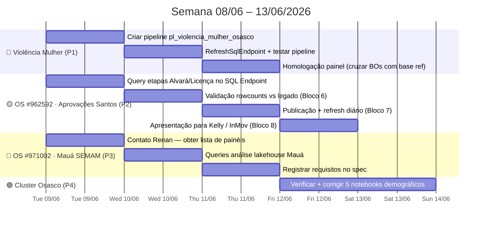

# Spec Drive — Semana 08/06/2026

**Contexto geral:** Semana com quatro frentes ativas. Violência Mulher Osasco está quase na linha de chegada (Bronze/Silver/Gold prontos, PBI conectado — falta pipeline e homologação). Painel de Aprovações de Obras de Santos tem protótipo criado e entra na fase de validação + publicação. OS #971002 é nova (Mauá Meio Ambiente) — começa com levantamento de requisitos. Obras Santos está migrado e funcionando. CET/SEPREF e Refatoração Gold Acto ficam no backlog sem data.

---

## 📍 Estado Atual (08/06/2026)

| Projeto                                           | Status                                                                | Próxima ação                                     |
| ------------------------------------------------- | --------------------------------------------------------------------- | ------------------------------------------------ |
| **Violência Mulher Osasco**                       | 🟡 Bronze/Silver/Gold ✅ · PBI conectado ✅ · Pipeline ❌                | Criar `pl_violencia_mulher_osasco` + homologação |
| **OS #962592 — Painel Aprovações Santos (Kelly)** | ✅ Protótipo validado 08/06 · Aguardando pavimentos (API)              | A7 → perguntar Deconte sobre origem campo        |
| **OS #971002 — Mauá Meio Ambiente (Renan)**       | 🟡 Em desenvolvimento · Payload base capturado · 4 payloads pendentes | M6–M11: Bronze → Silver → Gold → PBI             |
| **Obras Santos — 4 painéis migrados**             | ✅ Concluído                                                           | —                                                |
| **Refatoração Gold Acto**                         | 📋 Backlog                                                            | Sem previsão                                     |
| **Migração Santos CET/SEPREF**                    | 📋 Backlog · Última prioridade                                        | Sem previsão                                     |
| **Cluster Osasco Demográfico**                    | ⚠️ Estado incerto no Fabric                                           | Verificar + corrigir se necessário               |

---

## 🗓️ Roadmap Visual da Semana

---

## ✅ Frente 1 — Finalizar Violência Mulher Osasco — CONCLUÍDA 08/06/2026

**Prazo Fase 4 (pipeline + PBI):** 18/06/2026

### Estado final

| Asset | Status | Detalhe |
|---|---|---|
| `nb_ingest_osasco_violencia_mulher` | ✅ | notebookId: `562f9390-29f3-4773-8abc-b7cf3f894e07` |
| `nb_silver_osasco_violencia_mulher` | ✅ | notebookId: `31ff1300-a0e2-4317-91fd-aabf59212d22` |
| `nb_gold_osasco_violencia_mulher` | ✅ | notebookId: `b7fae68b-b796-4065-b962-fa5ba1db0b9b` · fix `Via_Denuncia` aplicado |
| `gold_osasco_violencia_mulher` | ✅ Populado | Arquivos PC 2024/01–2026/01 carregados |
| PBI modelo semântico | ✅ Conectado | Tabelas: `fato_ocorrencias`, `dim_rubricas`, `dim_local`, `dim_ibge`, `Dim_calendario` |
| `pl_violencia_mulher_osasco` | ✅ Criada e validada | objectId: `1a5e1c15-6772-4539-b4ba-320f3d7b37aa` |
| Gatilho agendado | ✅ Configurado | Diariamente 07:00h · Brasília |
| Arquivos PM (Polícia Militar) | ⚠️ Pendente homologação | Só Civil confirmado no controle — verificar antes da entrega ao cliente |

### Tarefas

- [x] **V1** Arquivos PC confirmados no controle — PM a verificar antes da homologação
- [x] **V2** Pipeline criada: Bronze → IfCondition → (Silver → Gold → RefreshSqlEndpoint)
- [x] **V3** Pipeline executada com sucesso ponta a ponta (08/06/2026 12:14–12:25)
- [ ] **V4** Homologação: cruzar 10 BOs com `Base_REF_Painel_Violencia_Mulher_*.xlsx` — verificar `Flag_Incluir`, `Tipo_Regra`, `Periodo_Final`, `Via_Denuncia`
- [x] **V5** `recreateTables: false` — configurado desde o início

### Notas técnicas da implementação

> [!note] `output.result.exitValue` — caminho correto para exit de notebook no Fabric
> Em pipelines Fabric, `mssparkutils.notebook.exit(valor)` fica em `activity('nome').output.result.exitValue` (não em `.output.runOutput` nem `.output.result` direto).
> Expression correta no IfCondition: `@not(equals(activity('nb_ingest_violencia_mulher').output.result.exitValue, 'sem_novos_arquivos'))`
> Na pipeline atual foi usado `contains(string(output.result), ...)` — equivalente e mais robusto.

> [!note] Trigger de Storage Event via Activator — evitar
> O gatilho de evento de armazenamento no Fabric usa Data Activator (requer Eventstream separado). Para arquivos mensais com Bronze idempotente, agendamento diário às 07:00h é suficiente e muito mais simples.

---

## ✅ Frente 2 — OS #962592 · Painel Aprovações de Obras Santos — PROTÓTIPO VALIDADO 08/06/2026

**Solicitante:** Kelly Araujo Simões · PM Santos – Aprova Santos · Aberto 25/05/2026

**Estado atual:** Protótipo validado contra SQL Analytics Endpoint. Todas as medidas DAX conferem com a referência SQL. Publicação aguarda campo `pavimentos` da API — Deconte/InMov devem confirmar a origem antes da entrega final.

**Dados confirmados (08/06/2026):**

| Métrica | SQL (ref) | PBI | Status |
|---|---|---|---|
| Total OS | 12.024 | 12.023 | ✅ |
| Processos Aprovados | 375 | 375 | ✅ |
| Licenças Emitidas | 227 | 227 | ✅ |
| Taxa de Aprovação | 3,1% | 3,1% | ✅ |
| Aprovações 2024 | 79 | 79 | ✅ |
| Aprovações 2025 | 199 | 199 | ✅ |
| Aprovações 2026 | 107 | 107 | ✅ |

**Etapas confirmadas:**

| Tipo | Nome exato | Ocorrências |
|---|---|---|
| Alvará | EMISSÃO ALVARÁ | 269 |
| Alvará | EMISSÃO DA LICENÇA | 232 |
| Alvará | EMISSÃO DO ALVARÁ | 173 |
| Alvará | ALVARÁ/LICENÇA DOC | 116 |
| Licença | EMISSÃO DA LICENÇA | 232 |
| Licença | LICENÇA/ PRORROGAÇÃO DE PRAZO 12 MESES | 18 |
| Licença | EMISSÃO DA LICENÇA DE INSTALAÇÃO | 9 |

**Rowcounts vs legado:**
- `gold.santos_obras_acompanhamento`: 12.024 linhas · 12.024 OS distintas (legado ref ~11.303 — +6%, crescimento esperado)
- `gold.santos_obras_tempo_etapa`: 94.224 linhas · 12.023 OS distintas (legado ref ~71.500 — +32%)

### Tarefas

- [x] **A1** Nomes exatos das etapas confirmados via SQL Analytics Endpoint
- [x] **A2** Rowcounts validados vs legado — diferença dentro do esperado (crescimento de dados)
- [ ] **A3** Publicar `.pbix` no workspace — **BLOQUEADO: aguardando campo pavimentos**
- [ ] **A4** Agendar refresh diário (07:00h) — pendente publicação
- [ ] **A5** Adicionar `PBISemanticModelRefresh` na `pl_ingest_acto` — pendente publicação
- [ ] **A6** Apresentar para Kelly/InMov — pendente publicação
- [ ] **A7** Bloco 0 (pavimentos) — perguntar Deconte/InMov: "De onde vem o número de pavimentos — formulário Acto ou sistema externo (IPTU/CAF)?"

> [!note] Próximo passo
> A3–A6 estão prontos tecnicamente mas aguardam o desbloqueio de pavimentos. Assim que Deconte confirmar a origem do campo, retomar por A7 → A3 → A4 → A5 → A6.

---

## 🟡 Frente 3 — OS #971002 · Mauá Meio Ambiente — EM DESENVOLVIMENTO

**Solicitante:** Matheus Arsenes (TecnoGroup) · Contato cliente: Renan Destefano Tavares · Aberto 03/06/2026  
**Decisão 08/06:** Migrar para padrão EAV do módulo Acto — dados virão de `lh_solicitacoes_acto`, não das tabelas legadas `gold_maua_*`

### Accomplishments 08/06

- [x] **M1** Requisitos recebidos de Renan — 8 relatórios mapeados (R1–R8), tabela de serviços × etapas confirmada
- [x] **M2** Arquitetura definida: padrão EAV, 5 fontes (`maua_meio_ambiente` + 4 especializadas)
- [x] **M3** Protótipos visuais criados para as 8 páginas do PBI
- [x] **M4** Spec técnico completo criado em [[SPEC_DRIVE_MAUA_MEIO_AMBIENTE_BI]]
- [x] **M5** Payload base capturado: `payload_maua_meio_ambiente.json` (`nome: "bi_meio_ambiente"`, 15 catálogos, salvo em `Mauá/payload/`)

### Pendências ontem → tarefas 09/06

- [ ] **M6** Capturar os 4 payloads restantes no Acto (Relatórios Diversos):
  - [ ] `Meio ambiente - Documentos emitidos x serviço` → `payload_maua_ma_documentos.json`
  - [ ] `Meio Ambiente - Licenças - Solicitações x CNAE` → `payload_maua_ma_cnae.json`
  - [ ] `Meio ambiente - Número total de árvores autorizadas` → `payload_maua_ma_arvores.json`
  - [ ] `Meio ambiente - Solicitações x Região de Planejamento` → `payload_maua_ma_regiao.json`
- [ ] **M7** Subir os 5 payloads para `/lakehouse/default/Files/payloads/` no Fabric
- [ ] **M8** Adicionar as 5 fontes no `nb_bronze_orquestracao`
- [ ] **M9** Adicionar os 5 `id_fonte` no `nb_silver_acto_gestao`
- [ ] **M10** Criar os 4 notebooks Gold (`nb_gold_maua_meio_ambiente*`)
- [ ] **M11** Rodar pipeline ponta a ponta e validar rowcounts

> [!note] Referência técnica completa
> Ver [[SPEC_DRIVE_MAUA_MEIO_AMBIENTE_BI]] para checklist detalhado por Bloco (0→6), protótipos de todas as 8 páginas e inventário de medidas DAX.

---

## 🟢 Frente 4 — Cluster Osasco Demográfico

Correto em definição, mas estado no Fabric incerto. 5 notebooks precisam ter o cluster substituído.

| Notebook | Tabela de saída | Prioridade |
|---|---|---|
| `nb_ingest_populacao_sidra` | `gold_osasco_populacao_ibge` | Alta — upstream |
| `nb_ingest_pib_sidra` | `gold_osasco_pib_*` | Alta — depende do acima |
| `nb_gold_populacao_densidade` | CSV densidade | Média |
| `nb_ingest_censo` | 10 CSVs censo | Média |
| `nb_gold_pbf` | `gold_pbf_municipios_selecionados` | Baixa |

- [ ] **C1** Verificar no Fabric se `gold_osasco_populacao_ibge` ainda contém São Bernardo do Campo — se sim, execução necessária
- [ ] **C2** Corrigir e executar na ordem: `nb_ingest_populacao_sidra` → `nb_ingest_pib_sidra` → demais

---

## ⚠️ Riscos da Semana

| Risco | Impacto | Mitigação |
|---|---|---|
| Arquivos PM não carregados em bronze (violência mulher) | Painel incompleto — só dados PC | Verificar `bronze_ctrl` antes da homologação |
| Nomes de etapa com acentos (Alvará) quebram SEARCH no DAX | Medidas de aprovação retornam 0 | Usar `EtapaNorm = UPPER(SUBSTITUTE(...))` ou normalizar no Gold |
| Renan/Matheus não respondem a tempo (OS #971002) | Desenvolvimento Mauá atrasa | Aguardar sem iniciar dev — spec documenta bloqueio |
| `recreateTables: true` na pipeline de violência mulher | Cria tabelas duplicadas se executado mais de uma vez | Reverter para `false` imediatamente após a 1ª execução com sucesso |

---

## 📋 Backlog (sem data)

| Item | Spec de referência |
|---|---|
| Refatoração Gold Acto — função factory `build_gold_fato_solicitacoes()` | [[SPEC_DRIVE_REFATORACAO_GOLD_ACTO]] |
| Migração Santos CET/SEPREF → PBI novo | [[SPEC_DRIVE_ROADMAP_MIGRACAO]] |
| Pavimentos Aprovações Santos v1.1 | [[SPEC_DRIVE_PAINEL_APROVACOES_OBRAS]] — Bloco 0 |
| Dados Públicos — modelo semântico PBI + CAGED (Yuri) | [[spec_drive_dados_publicos]] |

---

## 🔗 Referências

- [[SPEC_DRIVE_PAINEL_APROVACOES_OBRAS]] — spec técnico completo da OS #962592
- [[SPEC_DRIVE_MAUA_MEIO_AMBIENTE_BI]] — spec técnico da OS #971002
- [[spec_drive_violencia_mulher_osasco]] — spec completo violência mulher
- [[SPEC_DRIVE_MIGRACAO_OBRAS]] — migração obras Santos (concluída)
- [[SPEC_DRIVE_REFATORACAO_GOLD_ACTO]] — backlog refatoração Gold

---

*Spec Drive · Acto Cidade Inteligente · Criado em 08/06/2026*
