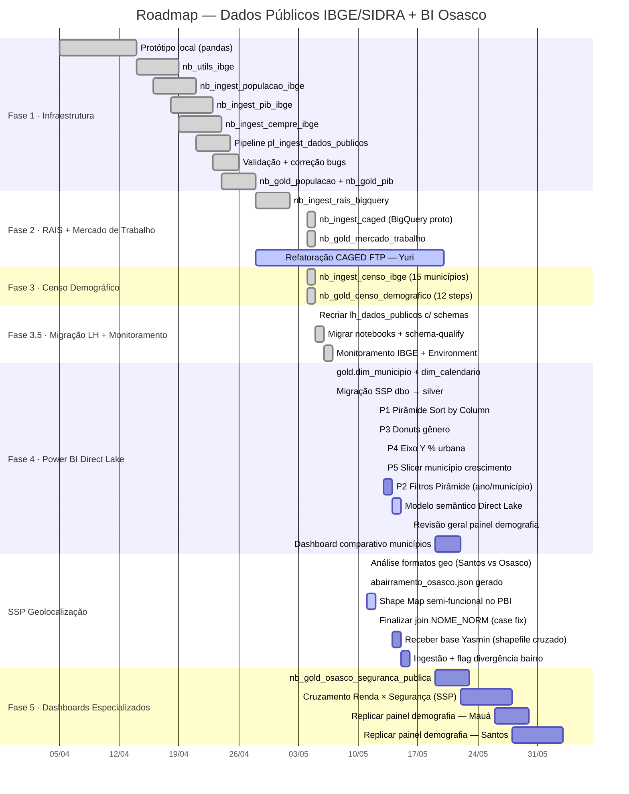

# Spec Drive — BI Osasco: Status + Planejamento de Semana (11/05/2026)

**Contexto geral:** Encerramos a semana passada com a Fase 4 iniciada — `gold.dim_municipio`, `gold.dim_calendario` entregues e SSP migrada de `dbo` para `silver` (491k linhas). Esta semana focamos em dois eixos paralelos: **(1)** corrigir os visuais do painel de demografia/população de Osasco e **(2)** incorporar a demanda de geolocalização SSP trazida pela Yasmin.

---

## 📍 Onde Paramos (07/05/2026)

| Item | Status |
|---|---|
| Fases 1–3.5 (`lh_dados_publicos`) | ✅ Completas |
| `gold.dim_municipio` + `gold.dim_calendario` | ✅ Entregues 07/05 |
| Migração `silver.ssp_*` (491k linhas) | ✅ Entregue 07/05 |
| Modelo semântico Direct Lake | 🔵 Pendente — inicia essa semana |
| `nb_gold_osasco_seguranca_publica` | 🔲 Pendente |
| Dashboard comparativo municípios | 🔲 Pendente |
| Refatoração CAGED FTP (Yuri) | 🔄 Em andamento — prazo 20/05 |
| `abairramento_osasco.json` — GeoJSON padrão Santos | ✅ Gerado 11/05 |
| Shape Map Osasco no Power BI | ⚠️ Semi-funcional 11/05 — finalizar join |

---

## 📊 Projeto BI Osasco — Painel de Demografia e População

**Arquivo principal:** `bi_osasco_demografia_populacao_prototipo.pbix`
**Objetivo:** Protótipo replicável para Mauá e Santos. Referência visual: Pirâmide etária IBGE.

### ✅ O Que Já Está Feito

| Item | Status |
|---|---|
| Tabela `censo_piramide_populacao` (672 linhas · 16 municípios × 2 sexos × 21 faixas) | ✅ Carregada |
| Coluna `ordem_idade` criada via Power Query (1–21, ordem correta das faixas) | ✅ Criada |
| Coluna DAX `ordem_idade` conflitante removida | ✅ Removida |
| Demais tabelas do modelo (`censo_genero`, `gold_censo_populacao`, Medidas, etc.) | ✅ No modelo |

### ⚠️ Visuais — Estado Atual

| Visual | Status | Problema pendente |
|---|---|---|
| Pirâmide etária | ⚠️ Estrutura OK | Eixo Y em ordem alfabética — sort não aplicado |
| Evolução populacional (linha) | ✅ Visível | Não verificado em detalhe |
| Crescimento populacional (barras) | ✅ Visível | Falta slicer de município |
| Proporção gênero — donuts 2000/2010/2022 | ⚠️ Visível | Aparece 4 segmentos em vez de 2 |
| Proporção população urbana (linha) | ⚠️ Visível | Eixo Y em decimal (0,90) em vez de % (90%) |
| Crescimento demográfico (linha/área) | ✅ Visível | Não verificado |

---

## 🔴 Correções Prioritárias — Painel de Demografia

### [P1] Pirâmide — Ordenação do Eixo Y

**Problema:** Eixo Y em ordem alfabética. `"0 a 4 anos"` aparece no topo em vez de na base.
**Causa raiz:** Campo `idade` não está configurado para ordenar por `ordem_idade` no modelo. Sort visual-level está em `idade` crescente.

**Solução (em dois passos):**
1. `Data view` → selecionar coluna `idade` → **Ferramentas de coluna** → **Classificar por coluna** → `ordem_idade`
2. Visual → `"..."` → **Classificar por** → `idade` → **Decrescente**

> [!tip] Referência
> A imagem de referência mostra `"100 anos ou mais"` no topo e `"0 a 4 anos"` na base — exatamente o resultado esperado após aplicar a ordenação decrescente com `Sort by Column`.

---

### [P2] Pirâmide — Escala e Filtro de Ano

**Problema:** Valores exibidos em Mi (milhões) somando todos os municípios e anos.
**Investigar:** Verificar se o filtro de página/visual para `ano = 2022` e `municipio = Osasco` está ativo.

> [!note]
> A imagem de referência também mostra escala em Mi — pode ser comportamento esperado se o painel for comparativo entre municípios. Validar com o restante do layout antes de aplicar filtro fixo.

---

### [P3] Donuts — Proporção de Gênero (4 segmentos em vez de 2)

**Problema:** Cada donut mostra 4 segmentos em vez de 2 (Masculino / Feminino).
**Causa provável:** Campo extra (ex: `municipio` ou `ano`) incluído em Legenda ou Detalhes além de `sexo`.
**Solução:** Inspecionar os campos do visual → remover qualquer campo que não seja `sexo` do campo de Legenda/Detalhe.

---

### [P4] Eixo Y — Proporção População Urbana

**Problema:** Exibe `0,90` em vez de `90%`.
**Solução:** Painel Formato → **Eixo Y** → **Formato** → selecionar **Porcentagem**.

---

### [P5] Crescimento Populacional — Slicer de Município

**Problema:** Falta dropdown para seleção de município.
**Solução:** Adicionar visual `Segmentação de dados` com campo `municipio`, estilo **Lista suspensa (dropdown)**.

---

## 🟡 Nova Demanda — SSP / Geolocalização (Yasmin / Time da Clara)

### Contexto

Ocorrências de crime de Osasco da base da SSP estão sendo geolocalizadas **fora do perímetro de Osasco**, porém com `municipio = Osasco`. Isso gera inconsistência geográfica nos dados — um ponto plotado em São Paulo mas com label "Osasco".

### O Que a Yasmin Entregou

- Shapefile `geo_div_bairro_mascara` (`.shp`, `.dbf`, `.prj`, `.shx`, `.cst`)
- Cruzamento da base SSP com o shapefile via **QGIS**
- Resultado esperado: base SSP enriquecida com colunas `bairro` e `municipio` derivadas do shapefile

### Objetivo do Cruzamento

Comparar `bairro_SSP` (campo textual da fonte) vs `bairro_shapefile` (resultado do join geoespacial), sinalizando divergências com um flag para análise.

### Escopo Estimado

| Etapa | Responsável | Ferramenta |
|---|---|---|
| Receber base SSP enriquecida | Yasmin | QGIS |
| Ingestão no Power BI / Python | BI | Power Query ou Python |
| Criar coluna `flag_divergencia_bairro` | BI | Power Query / DAX |
| Visual de mapa ou tabela comparativa | BI | Power BI |

> [!warning] Dependência
> Esta demanda está bloqueada até receber a base SSP cruzada da Yasmin. Confirmar prazo na reunião de quarta.

---

## 🗺️ SSP Geolocalização — Progresso 11/05/2026

### O que foi feito hoje

Investigação da estrutura dos arquivos geográficos de Osasco e geração do GeoJSON compatível com o Power BI, no mesmo padrão do Santos.

#### Problema identificado no JSON original (`geo_div_bairro_mascara (3).json`)

O arquivo entregue via shapefile da Yasmin foi exportado como `GeometryCollection` — tipo incompatível com o Shape Map do Power BI. Além disso, não tinha propriedades de nome e as coordenadas estavam em EPSG:3857 (metros) em vez de EPSG:4326 (graus):

| Problema | Impacto |
|---|---|
| Tipo `GeometryCollection` | Shape Map não carrega |
| Sem `properties` (sem nome de bairro) | Join com dados impossível |
| Coordenadas EPSG:3857 | Polígonos fora do mapa |

#### Solução — `abairramento_osasco.json`

Gerado via point-in-polygon (Python + Shapely + PyProj):
- Centroides dos 60 bairros do CSV projetados para EPSG:3857
- Testados contra os 60 polígonos do shapefile → **100% match sem ambiguidade**
- Coordenadas convertidas para EPSG:4326
- Montado como `FeatureCollection` idêntico ao Santos (campo `NOME` + extras `NOME_NORM` e `MUNICIPIO`)

#### Status no Power BI após as mudanças

> [!success] Mapa semi-funcional
> Shape Map carregou os polígonos de Osasco corretamente. Join via `NOME` funcionando. Bairros inválidos da SSP (`"-"`, `"06851-000"`, `"AREA RURAL"`) aparecem na tabela mas não no mapa — comportamento esperado.

**Próximo passo:** validar normalização dos nomes na coluna de dados vs GeoJSON (case sensitivity). Usar `NOME_NORM` (uppercase) como chave de join é mais robusto.

#### Documentação gerada

- `Mapas_SSP_Osasco/Estrutura_Dados_Geo_PowerBI.md` — diferenças técnicas entre formatos e guia de configuração no Power BI
- [[Documentação_Fabric/Dados Públicos/geo_mapa_bairros_osasco|Nota Obsidian: Geo Mapa Bairros Osasco]] — decisões e status

---

## 📅 Planejamento da Semana (11–16/05/2026)

| Dia | Tarefa | Prioridade | Est. | Status |
|---|---|---|---|---|
| Dom 11/05 | Analisar formatos geo Osasco vs Santos | 🔴 Alta | 1h | ✅ Feito |
| Dom 11/05 | Gerar `abairramento_osasco.json` (padrão Santos) | 🔴 Alta | 1h | ✅ Feito |
| Dom 11/05 | Shape Map Osasco semi-funcional no Power BI | 🔴 Alta | — | ⚠️ Semi-feito |
| Dom 11/05 | Documentação `Estrutura_Dados_Geo_PowerBI.md` | 🟡 Média | 30min | ✅ Feito |
| Seg 12/05 | **[P1]** Sort by Column + visual descending na Pirâmide | 🔴 Alta | 1h | 🔲 |
| Seg 12/05 | **[P3]** Inspecionar e corrigir donuts de gênero | 🔴 Alta | 30min | 🔲 |
| Seg 12/05 | Finalizar Shape Map Osasco — normalizar join `NOME_NORM` | 🔴 Alta | 30min | 🔲 |
| Ter 13/05 | **[P4]** Corrigir eixo Y de proporção urbana para `%` | 🟡 Média | 15min | 🔲 |
| Ter 13/05 | **[P5]** Adicionar slicer de município no gráfico de crescimento | 🟡 Média | 30min | 🔲 |
| Ter 13/05 | **[P2]** Revisar filtros da Pirâmide — ano/município vs referência | 🟡 Média | 1h | 🔲 |
| Qua 14/05 | Criar modelo semântico **Direct Lake** no Fabric Service | 🔵 Fase 4 | 3h | 🔲 |
| Qua 14/05 | Alinhar com Yasmin: receber base SSP cruzada com shapefile | 🟡 Reunião | — | 🔲 |
| Qui 15/05 | Ingestão e modelagem da base SSP geolocalizada (se entregue) | 🟡 Média | 2–3h | 🔲 |
| Sex 16/05 | Revisão geral do painel + validação com imagem de referência | 🟡 Qualidade | 1h | 🔲 |

---

## 🔗 Dependências e Riscos

| Risco | Impacto | Mitigação |
|---|---|---|
| Base SSP da Yasmin ainda não entregue | Bloqueia join espacial para flag divergência | ⚠️ Parcialmente contornado: `abairramento_osasco.json` já resolve o Shape Map independente; o flag ainda depende da Yasmin |
| Shape Map Osasco — case sensitivity no join `NOME` | Bairros sem cor no mapa silenciosamente | Migrar chave de join para `NOME_NORM` (uppercase) — tarefa Seg 12/05 |
| `Sort by Column` difícil de encontrar na UI do PBI | Bloqueia P1 | Navegar via teclado no dropdown; confirmar que está em Data View (não Report View) |
| `gold.mercado_trabalho` depende do CAGED do Yuri | Bloqueia painel de Emprego no Direct Lake | Construir modelo sem essa tabela por ora; inserir depois |
| Dados de Mauá/Santos para replicação do protótipo | Bloqueia expansão do painel | Confirmar disponibilidade de `censo_piramide_populacao` filtrado por cluster |

---

## 📅 Roadmap Completo do Projeto — Atualizado em 11/05/2026

---

## 📋 Tabela de Status de Fases (Projeto Dados Públicos)

| Fase  | Nome                                       | Status          |
| ----- | ------------------------------------------ | --------------- |
| 1     | Infraestrutura                             | ✅ Completa      |
| 2     | Mercado de Trabalho                        | ✅ Completa      |
| 3     | Censo Demográfico                          | ✅ Completa      |
| 3.5   | Migração Lakehouse + Monitoramento         | ✅ Completa      |
| **4** | **Power BI Direct Lake**                   | 🔵 Em andamento |
| 5     | Dashboards Especializados (SSP, Segurança) | 🔲 Pendente     |

---

## 🔗 Links Rápidos

| O que precisar | Onde encontrar |
|---|---|
| Spec semana anterior | [[spec_drive_semana_04_05_2026\|Spec 04/05/2026]] |
| Spec master (roadmap completo) | [[spec_drive_dados_publicos\|Spec Drive Dados Públicos]] |
| Diagnóstico painéis Osasco | [[Documentação_Fabric/Dados Públicos/diagnostico_paineis_osasco_publicos\|Diagnóstico Painéis Osasco]] |
| Mapeamento técnico tabelas | [[Documentação_Fabric/Dados Públicos/Mapeamento_Tecnico_Dados_Publicos\|Mapeamento Técnico]] |
| Índice Osasco | [[Documentação_Fabric/Osasco/00_INDEX_OSASCO\|00 Index Osasco]] |
| **Geo — Mapa Bairros Osasco (SSP)** | [[Documentação_Fabric/Dados Públicos/geo_mapa_bairros_osasco\|Geo Mapa Bairros Osasco]] |

---

*Spec Drive · Acto Cidade Inteligente · Criado em 11/05/2026*

---

> [!note] Notas de reunião 18/05/2026
> Extração grid, relatórios gestão, indicadores, números de pavimentos, quantos processos aprovados, tempo etapa, emissão de alvará > aprovação e licença. Quantos edifícios com 10 pavimentos foram implantados no bairro X. Quantidades de aprovados por bairro (baseado na etapa), quantidades de pavimentos, contagem distinta, visão por ano, todos os serviços (filtros). Construções novas, mapas por bairro, quando o documento foi disponibilizado.
