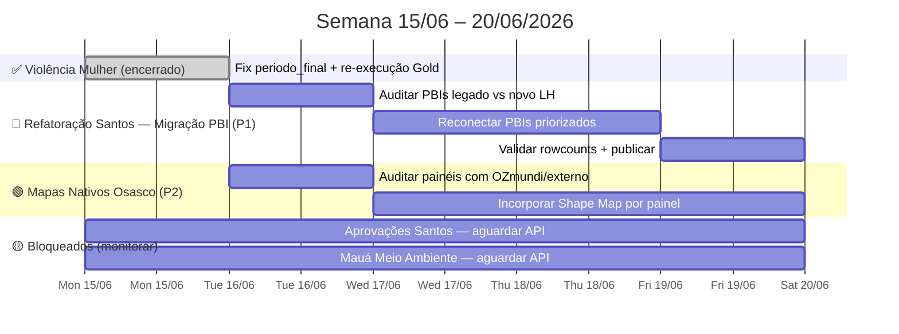

# Spec Drive — Semana 15/06/2026

**Contexto geral:** Semana de transição. Violência Mulher Osasco encerrada do lado de engenharia de dados — analista de BI deu sequência. Aprovações Santos e Mauá Meio Ambiente bloqueados pelo mesmo problema: campos que vêm de subformulários da API e não chegam via payload padrão. Duas novas frentes entram: refatoração Santos (migrar PBIs do legado) e inclusão de mapas nativos nos painéis embarcados de Osasco (substituir OZmundi/externos por Shape Map nativo com `abairramento_osasco.json`).

---

## 📍 Estado Atual (16/06/2026)

| Projeto | Status | Próxima ação |
|---|---|---|
| **Violência Mulher Osasco** | ✅ Concluído (engenharia) | V6 pendente: propagar fix `.py` local |
| **OS #962592 — Aprovações Santos (Kelly)** | 🔴 Bloqueado — API não retorna campos de subformulários | Aguardar resolução API; Kelly informada e aguardando |
| **OS #971002 — Mauá Meio Ambiente (Renan)** | 🔴 Bloqueado — mesmo problema de subformulários | Gold criada + PBI conectado; shapefile área planejamento em validação |
| **Refatoração Santos — Migração PBI** | 🟡 Não iniciado — aguardando mapas Osasco | S1: levantar inventário PBIs legado vs novo |
| **Mapas Nativos Osasco (PBIs embarcados)** | 🔵 Em andamento — Vulnerabilidade ✅ + Loteamento/Zoneamento ✅ publicados | Replicar para Seg. Pública, Seg. Viária, Violência Mulher |
| **OS #977764 — Pluri ausente painel SEONT Analistas (Kelly)** | ✅ Concluído 16/06/2026 | Painel atualizado — cliente informada |
| **Cluster Osasco Demográfico** | ✅ Encerrado | — |
| **Refatoração Gold Acto** | 📋 Backlog | Sem previsão |
| **Migração Santos CET/SEPREF** | 📋 Backlog — Última prioridade | Sem previsão |

---

## 🗓️ Roadmap Visual da Semana



---

## ✅ Frente 0 — OS #977764 · Painel SEONT Analistas — Pluri ausente — CONCLUÍDA 16/06/2026

**Solicitante:** Kelly Araujo Simões
**Serviço:** Suporte Técnico Acto PM Santos

**Problema:** OS do tipo "ALVARÁ DE CONSTRUÇÃO PLURI-HABITACIONAL VERTICAL" não apareciam no painel `pbi_obras_santos_seont_acomp_analistas`. Kelly identificou as 15 OS afetadas e sinalizou via chamado.

**Causa raiz:** o notebook `nb_gold_santos_obras_acompanhamento` selecionava a etapa atual por `data_inicio_etapa DESC`. O sistema Acto gera automaticamente a etapa **ETAPA RESUMO** (executor: ADMINISTRAACTO) com timestamp do dia corrente — sempre a mais recente em OS com múltiplas etapas abertas. Isso classificava as OS no setor "Sistema" em vez do setor SEONT, removendo-as do filtro do painel.

**Fix aplicado** (`nb_gold_santos_obras_acompanhamento`):

```python
# Constante adicionada
ETAPAS_SISTEMA = {"ETAPA RESUMO", "FINALIZAR FLUXO"}

# Window com prioridade: etapas reais > etapas de sistema
w_priority = Window.partitionBy("id_os").orderBy(
    F.when(F.upper(F.col("etapa")).isin([e.upper() for e in ETAPAS_SISTEMA]), 1).otherwise(0),
    F.col("data_inicio_etapa").desc(),
)
```

Também corrigido `executor_responsavel` que aceitava string vazia como valor válido (bug secundário — ETAPA RESUMO frequentemente tem `executor = ""`).

**Resultado:**

| Métrica | Antes | Depois |
|---|---|---|
| OS Pluri com setor SEONT no novo Gold | 0 | 30 |
| ETAPA RESUMO como etapa vigente | ~3.100 OS | 1 OS |
| Das 15 OS sinalizadas por Kelly | 0 aparecem | 14 aparecem |

> OS 861403 aparece com setor Pareceres-SEMAM-DEPCAM — etapa DEPCAM mais recente que SEONT (parecer em andamento). Comportamento correto; OS não está ativa no SEONT no momento.

### Tarefas

- [x] Diagnóstico e identificação da causa raiz
- [x] Fix `nb_gold_santos_obras_acompanhamento` (célula `etapa atual` + célula `executor_responsavel`)
- [x] Re-execução Gold + atualização modelo semântico PBI
- [x] Verificação das 15 OS (`investigar_obras_pluri_seont.ipynb`)
- [x] Cliente informada

---

## ✅ Frente 1 — Violência Mulher Osasco — CONCLUÍDA 15/06/2026

Entregue do lado de engenharia de dados. Gold populada, PBI conectado, pipeline `pl_violencia_mulher_osasco` funcionando com trigger diário às 07:00h. Painel (Power BI) delegado a outro analista — escopo de engenharia encerrado após ingestão e tratamento.

### Fix aplicado em 15/06

**Problema:** coluna `Periodo_Final` tinha duas grafias para o mesmo período — `"a tarde"` / `"À tarde"` e `"a noite"` / `"À noite"` — causando split nos visuais de matriz do PBI.

**Causa raiz:** a função `periodo_final` no Gold tinha dois caminhos: quando `Hora Ocorrência` era conhecida retornava string canônica com `"À"` acentuado; quando caía no fallback `Periodo Estimado`, retornava o valor cru da API sem normalizar.

**Fix aplicado** (`nb_gold_osasco_violencia_mulher` · cell 4):

```python
_NORM_PERIODO = {
    "a tarde":         "À tarde",
    "à tarde":         "À tarde",
    "a noite":         "À noite",
    "à noite":         "À noite",
    "pela manha":      "Pela manhã",
    "pela manhã":      "Pela manhã",
    "de madrugada":    "De madrugada",
    "em hora incerta": "Em hora incerta",
}

def periodo_final(row) -> str:
    h = row["Hora Ocorrência"]
    p = row["Periodo Estimado"]
    if pd.notna(h) and isinstance(h, str) and len(h) >= 5:
        if   h < "06:00:00": return "De madrugada"
        elif h < "12:00:00": return "Pela manhã"
        elif h < "18:00:00": return "À tarde"
        else:                return "À noite"
    if pd.notna(p):
        return _NORM_PERIODO.get(str(p).strip().lower(), str(p).strip())
    return "Em hora incerta"
```

### Tarefas

- [x] **V1–V3** Pipeline criada, executada e validada (08/06/2026)
- [x] **V4** Gold conectada ao PBI — analista de BI assumiu continuidade
- [x] **V5** Fix `periodo_final` aplicado e re-executado no Fabric (15/06/2026)
- [x] **V6** Fix propagado para `.py` local — 19/06/2026 ✅

---

## 🔴 Frente 2 — OS #962592 · Painel Aprovações Santos — BLOQUEADO

**Bloqueio:** campos originados em subformulários da API (ex.: `pavimentos`) não chegam via payload padrão. Mesmo problema que bloqueia Mauá.

**Estado:**
- Protótipo apresentado para Kelly ✅
- Kelly ciente do bloqueio e aguardando resolução
- Dados técnicos validados — rowcounts conferem

### Tarefas pendentes (aguardam desbloqueio)

- [ ] **A3** Publicar `.pbix` no workspace
- [ ] **A4** Agendar refresh diário 07:00h
- [ ] **A5** Adicionar `PBISemanticModelRefresh` na `pl_ingest_acto`
- [ ] **A6** Apresentar versão final para Kelly/InMov
- [ ] **A7** Confirmar com Deconte/InMov origem do campo `pavimentos` (Acto ou IPTU/CAF)

> [!note] Desbloqueio
> Assim que a API puder retornar campos de subformulários, retomar por A7 → A3 → A4 → A5 → A6.

---

## 🔴 Frente 3 — OS #971002 · Mauá Meio Ambiente — BLOQUEADO

**Estado:**
- Gold criada e conectada ao PBI ✅
- Shapefile de área de planejamento criado e em validação de visões ✅
- Bloqueado: campos de subformulários não retornam via API — mesmo padrão de Santos Aprovações

**Estratégia de payload** (definida em 10/06/2026): payload unificado com todos os 7 catálogos num único POST elimina as 3 fontes especializadas originalmente planejadas. Ver [[project_maua_payload_unificado]].

### Tarefas pendentes (aguardam desbloqueio)

- [ ] **M6'** Capturar payload unificado (7 catálogos + todas as colunas) via DevTools no Acto Gestão Mauá
- [ ] **M7** Subir `payload_maua_meio_ambiente.json` atualizado no Fabric (`/Files/payloads/`)
- [ ] **M8** Bronze orchestrator: manter só `maua_meio_ambiente` (remover `_cnae`, `_arvores`, `_regiao`)
- [ ] **M9** Silver: remover `maua_meio_ambiente_cnae`, `_arvores`, `_regiao` do dicionário de FONTES
- [ ] **M10** Criar notebooks Gold (padrão Pattern A, fonte única `FONTE = "maua_meio_ambiente"`)
- [ ] **M11** Rodar pipeline ponta a ponta + validar rowcounts

---

## 🟡 Frente 4 — Refatoração Santos — Migração PBI (NOVA)

**Objetivo:** migrar os painéis de Power BI de Santos que ainda apontam para o Lakehouse legado para as tabelas Gold no novo schema (`gold.santos_*`). Jorge executa a reconexão; a engenharia prepara a lista priorizada e valida compatibilidade de schema.

### Tarefas

- [ ] **S1** Levantar inventário de PBIs de Santos — identificar quais apontam para LH legado vs novo
- [ ] **S2** Para cada PBI priorizado: validar que a tabela Gold equivalente existe e tem schema compatível
- [ ] **S3** Reconectar PBIs (RefreshSqlEndpoint + troca de fonte no modelo semântico)
- [ ] **S4** Validar rowcounts e medidas DAX após reconexão
- [ ] **S5** Publicar e agendar refresh diário

> [!note] Referência
> Ver [[SPEC_DRIVE_ROADMAP_MIGRACAO]] para lista de tabelas migradas e status de cada painel.

---

## 🔵 Frente 5 — Mapas Nativos nos Painéis Embarcados de Osasco — EM ANDAMENTO

**Objetivo:** identificar quais painéis embarcados de Osasco usam OZmundi ou outros mapas externos e substituir por Shape Map nativo do Power BI.

### Contexto técnico — atualizado 16/06

Todos os shapefiles foram baixados via WFS do OZmundi e convertidos para GeoJSON EPSG:4326 em `Mapas_SSP_Osasco/shape_osasco_oficial_bi/`:

| Arquivo | Status | Campo de join | Uso |
|---|---|---|---|
| `bairros_osasco.json` | ✅ Pronto | `NOME_NORM` | Shape Map bairros (Abas 1–4 vulnerabilidade) |
| `assistencia_cras_osasco.json` | ✅ Pronto | `BAIRRO_NORM` / `CRAS` | Vulnerabilidade + CRAS |
| `territorios_cras_osasco.json` | ✅ Pronto (dissolved) | `CRAS_NORM` | Aba 5 — territórios CRAS |
| `loteamento_osasco.json` | ✅ Pronto | `NOME_LOTEAMENTO` | Painel Loteamento |
| `macrozoneamento_osasco.json` | ✅ Pronto | `SIGLA` | Painel Zoneamento |
| `mancha_zoneamento_osasco.json` | ✅ Pronto | `ZONA_2024` | Painel Zoneamento detalhe |
| `overlays/rodovias_osasco.json` | ✅ Pronto | — | Overlay linha |
| `overlays/rios_osasco.json` | ✅ Pronto | — | Overlay linha |
| `overlays/div_bairro_labels_osasco.json` | ✅ Pronto | — | Labels de bairro |

Dados do DBF carregados via Power Query M direto do GeoJSON (sem CSV auxiliar).
DAX corrigido documentado em `shape_osasco_oficial_bi/DAX_vulnerabilidade_osasco.md` — thresholds em % (não 0–1).

### Painéis candidatos — status atualizado

| Painel | Shape Map | Dados | Status PBI |
|---|---|---|---|
| **Mapas Vulnerabilidade Social** | `assistencia_cras_osasco.json` | DBF embutido (cadunico, pobreza, bolsa_familia, vulnerabilidade, cras_vul) | 🔵 **Montando** — 5 abas criadas no Desktop, visuais em configuração |
| **Mapas Loteamento / Zoneamento** | `loteamento_osasco.json` + `mancha_zoneamento_osasco.json` | DBF embutido | ⬜ Não iniciado |
| **Segurança Pública** | `bairros_osasco.json` | `gold_seg_publica_dados_criminais` (join `BAIRRO_NORM`) | ⬜ Não iniciado |
| **Segurança Viária** | `bairros_osasco.json` | `gold_infosiga_sinistros_*` (join bairro) | ⬜ Não iniciado |
| **Violência contra a Mulher** | `bairros_osasco.json` | Gold `Bairro_Normalizado` (já normalizado) | ⬜ Não iniciado |

### Tarefas

- [x] **O1** Auditoria confirmada: painéis usam OZmundi (WFS tiles + shapefiles externos) — 16/06
- [x] **O1b** Todos os shapefiles baixados via WFS OZmundi e convertidos para GeoJSON EPSG:4326 — 16/06
- [x] **O1c** Power Query M gerado + DAX corrigido documentado — 16/06
- [x] **O2a** Vulnerabilidade Social: 5 abas criadas no PBI Desktop com Shape Map nativo — 16/06
- [x] **O2b** Vulnerabilidade Social: paletas aplicadas — 17/06
- [x] **O2c** Vulnerabilidade Social: publicado no workspace Osasco — 17/06 ✅
- [x] **O2d** Loteamento/Zoneamento: PBI com Azure Maps, 6 sub-abas via bookmarks — publicado 2026-06-18 ✅
- [x] **O3** Violência Mulher: delegado a outro analista — escopo de engenharia encerrado ✅
- [ ] **O4** Segurança Pública e Viária: configurar Shape Map com Gold tables do Lakehouse
- [ ] **O5** Publicar todas as versões atualizadas no workspace Osasco

> [!note] Padrão de configuração Shape Map no PBI
> `Shape Map → Formato → Adicionar mapa → abairramento_osasco.json`
> `Campo Localização → coluna bairro normalizada (uppercase, sem acento) — bater com NOME_NORM`
> `Campo Saturação de cor → métrica de interesse`
>
> Join é case-sensitive — sempre usar `NOME_NORM` como chave, não `NOME`.

---

## ⚠️ Riscos da Semana

| Risco | Impacto | Mitigação |
|---|---|---|
| Campos de subformulários da API não resolvidos (Santos + Mauá) | Dois projetos ficam parados indefinidamente | Monitorar com Deconte/InMov; documentar bloqueio nas OS |
| PBI legado Santos com schema incompatível (coluna renomeada ou removida) | Reconexão quebra DAX | Validar schema antes de reconectar — passo S2 obrigatório |
| Join de bairro nos painéis de Osasco com cobertura baixa | Mapa com bairros sem cor / dados perdidos | Rodar validação `validacao_bairros_ssp_shapefile.py` por domínio antes de publicar |
| Violência Mulher — arquivos PM ainda não verificados em Bronze | Painel incompleto (só dados PC) | Checar `bronze_ctrl` antes de homologar com o cliente |

---

## 📋 Backlog (sem data)

| Item | Spec de referência |
|---|---|
| Refatoração Gold Acto — função factory `build_gold_fato_solicitacoes()` | [[SPEC_DRIVE_REFATORACAO_GOLD_ACTO]] |
| Migração Santos CET/SEPREF → PBI novo | [[SPEC_DRIVE_ROADMAP_MIGRACAO]] |
| Dados Públicos — modelo semântico PBI + CAGED (Yuri) | [[spec_drive_dados_publicos]] |

---

## 🔗 Referências

- [[spec_drive_semana_08_06_2026]] — spec semana anterior (pendências de origem)
- [[SPEC_DRIVE_PAINEL_APROVACOES_OBRAS]] — spec técnico OS #962592
- [[SPEC_DRIVE_MAUA_MEIO_AMBIENTE_BI]] — spec técnico OS #971002
- [[spec_drive_violencia_mulher_osasco]] — spec completo violência mulher
- [[geo_mapa_bairros_osasco]] — GeoJSON Osasco + documentação Shape Map
- [[mapas-ssp-osasco]] — pipeline geoespacial SSP × shapefile Osasco

---

*Spec Drive · Acto Cidade Inteligente · Criado em 15/06/2026*
