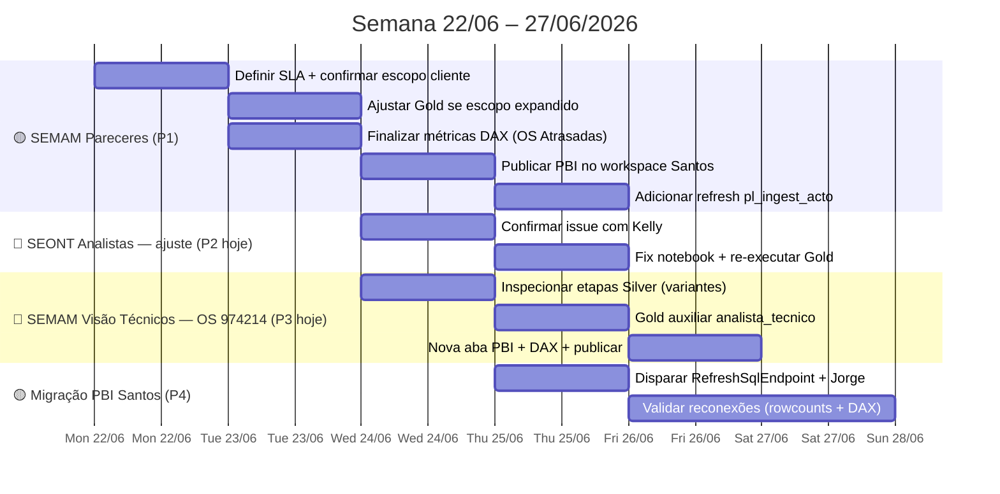

# Spec Drive — Semana 22/06/2026

**Contexto geral:** Semana focada na finalização do painel DEPCAM-SEMAM Pareceres Diversos (OS #977435) — Gold já criada (219 registros), estrutura PBI montada. Pendências: métricas DAX finais, confirmação de escopo com cliente, publicação e integração no pipeline. Em paralelo, disparar reconexão PBI Santos com Jorge (9 painéis prontos). Aprovações Santos e Mauá permanecem bloqueados por subformulários da API.

**Atualização 24/06:** Duas novas demandas entram hoje — ajuste no painel SEONT Analistas e nova OS de melhoria (#974214) para o painel Acompanhamento de Solicitações da SEMAM (visão produtividade por técnico).

**Atualização 25/06 (manhã):** OS #974214 concluída em engenharia — dois Gold novos criados e validados (`gold.santos_semam_analista_tecnico` 187 OS · `gold.santos_seont_analista_tecnico` 842 OS). Specs de painel criados para ambos. SEMAM analistas em construção no PBI. **Pendências críticas restantes desta semana:** `nb_gold_santos_semam_pareceres` ainda fora do Gold Orquestrador no Fabric (local OK) + refresh do painel Pareceres Diversos ainda fora do `pl_ingest_acto`.

**Atualização 25/06 (tarde):** Gold SEONT re-executado com whitelist final de 7 etapas (incluindo `SEONT - CONFÊRENCIA DOCUMENTAL`) → **846 OS** escritas. PBI SEMAM Analistas publicado e funcionando (187 OS · 52 em andamento · 135 finalizadas · 4 não atribuídas). PBI SEONT em construção. **Pendência crítica para os dois painéis:** adicionar modelos semânticos SEMAM e SEONT Analistas ao `pl_ingest_acto` (RefreshSqlEndpoint necessário antes — vai registrar `dias_analise` e `etapa_analise_label` no endpoint SEONT).

---

## 📍 Estado Atual (24/06/2026)

| Projeto                                     | Status                                                        | Próxima ação                                                                               |
| ------------------------------------------- | ------------------------------------------------------------- | ------------------------------------------------------------------------------------------ |
| **OS #977435 — SEMAM Pareceres Diversos**   | 🟡 Em andamento — Gold ✅, PBI estruturado, métricas pendentes | ⚠️ `nb_gold_santos_semam_pareceres` fora do orquestrador Fabric · refresh fora do pipeline |
| **OS #974214 — SEMAM Analistas Técnicos**   | ✅ PBI publicado 25/06 — Gold ✅ (187 OS) · PBI ✅               | ⚠️ Modelo semântico fora do `pl_ingest_acto`                                               |
| **OS #974214 — SEONT Analistas Técnicos**   | 🔵 Gold ✅ (846 OS · 7 etapas) · PBI em construção             | ⚠️ RefreshSqlEndpoint pendente · modelo semântico fora do `pl_ingest_acto`                 |
| **Migração PBI Santos (S2–S5)**             | 🟡 S1 concluído (19/06) — 9 painéis prontos                   | Disparar reconexão com Jorge; pré-req: RefreshSqlEndpoint                                  |
| **OS #962592 — Aprovações Santos**          | 🔴 Bloqueado — subformulários API                             | Aguardando InMov/Deconte                                                                   |
| **OS #971002 — Mauá Meio Ambiente**         | 🔴 Bloqueado — subformulários API                             | Aguardando InMov/Deconte                                                                   |
| **Mapas Osasco O4 — Seg. Pública + Viária** | ⬜ Não iniciado                                                | Baixa prioridade — pós SEMAM                                                               |
| **Violência Mulher Osasco**                 | ✅ Encerrado (engenharia)                                      | —                                                                                          |
| **Mapas Loteamento/Zoneamento Osasco**      | ✅ Publicado 18/06                                             | —                                                                                          |

---

## 🗓️ Roadmap Visual da Semana



---

## 🟡 Frente 1 — OS #977435 · DEPCAM-SEMAM Pareceres Diversos (PRIORIDADE)

**Solicitante:** Kelly Araujo Simões  
**Secretaria:** SEMAM — Secretaria Municipal do Meio Ambiente  
**Spec técnico:** [[spec_painel_semam_pareceres]]

### Estado atual (22/06)

| Entrega                                                | Status                                               |
| ------------------------------------------------------ | ---------------------------------------------------- |
| Gold `gold.santos_semam_pareceres`                     | ✅ 219 registros (218 Finalizadas + 1 Em Atendimento) |
| Notebook `nb_gold_santos_semam_pareceres`              | ✅ Criado e `%run` no orquestrador                    |
| Estrutura PBI (visuais, filtros, tabela detalhada)     | ✅ Montada — confirmado no PDF                        |
| Métrica **OS Atrasadas**                               | ⚠️ Mostra `--` — SLA não definido                    |
| Serviços **Reforma/Legalização + Alterações Diversas** | ⚠️ Fora da Gold atual — aguarda confirmação cliente  |
| Publicação no workspace                                | ⬜ Pendente                                           |
| Refresh no `pl_ingest_acto`                            | ⬜ Pendente — depende da publicação                   |

### Decisão pendente — OS Atrasadas

O card mostra `--` porque não há SLA formal definido para SEMAM. Opções:

**Opção A — SLA fixo provisório:** usar 30 dias corridos como limiar. Medida DAX:
```dax
OS Atrasadas =
COUNTROWS(
    FILTER(
        'gold santos_semam_pareceres',
        ISBLANK('gold santos_semam_pareceres'[dt_saida]) &&
        'gold santos_semam_pareceres'[dias_na_etapa] > 30
    )
)
```

**Opção B — Remover o card:** substituir por visual "Top pareceres mais antigos em aberto" na tabela detalhada (ordenar por `dias_na_etapa` DESC com filtro `situacao = "Em Atendimento"`).

→ **Confirmar com cliente qual opção adotar.**

### Decisão pendente — Escopo Reforma/Legalização

Serviços "Reforma e/ou Legalização" e "Alterações Diversas em Projetos Aprovados" têm etapas `PARECER TECNICO DIVERSOS` mas o nome da etapa no Silver não contém "DEPCAM" → não estão na Gold atual (219 registros).

Se o cliente confirmar que esses pareceres são de responsabilidade da SEMAM:
1. Expandir filtro no notebook para incluir `etapa LIKE '%PARECER TECNICO DIVERSOS%'` (além do filtro DEPCAM/SEMAM atual)
2. Re-executar Gold e validar rowcount (espera-se aumento de ~30%)

### Tarefas

- [ ] **P1** Confirmar com cliente: OS Atrasadas → SLA fixo ou remover card?
- [ ] **P2** Confirmar com cliente: Reforma/Legalização e Alterações Diversas entram no escopo?
- [ ] **P3** Se P2 = sim: expandir filtro Gold e re-executar notebook
- [ ] **P4** Implementar medida DAX `OS Atrasadas` (conforme decisão P1)
- [ ] **P5** Publicar `pbi_obras_santos_semam_pareceres` no workspace Santos
- [ ] **P6** Adicionar `%run ./nb_gold_santos_semam_pareceres` no `_nb_gold_orquestracao` **no Fabric** (local já tem — upload pendente)
- [ ] **P7** Adicionar `PBISemanticModelRefresh` do painel Pareceres Diversos no `pl_ingest_acto`
- [ ] **P8** Comunicar entrega para Kelly

---

## 🟡 Frente 2 — Migração PBI Santos (S2–S5)

**Objetivo:** reconectar 9 painéis de Santos que apontam para o LH legado para o novo schema `gold.santos_*`.  
**Executor da reconexão:** Jorge  
**Pré-requisito técnico:** `RefreshSqlEndpoint` com `recreateTables:true` antes de qualquer reconexão.

### Painéis prontos para reconectar (inventário S1 — 19/06)

| Painel                       | Tabela Gold nova | Validado? |
| ---------------------------- | ---------------- | --------- |
| SEGOV                        | `gold.santos_*`  | ⬜         |
| SEINFRA                      | `gold.santos_*`  | ⬜         |
| CET                          | `gold.santos_*`  | ⬜         |
| CET C&D                      | `gold.santos_*`  | ⬜         |
| SEPREF                       | `gold.santos_*`  | ⬜         |
| Ouvidoria Operacional        | `gold.santos_*`  | ⬜         |
| Ouvidoria Manifestações (×5) | `gold.santos_*`  | ⬜         |
| Curso Motorista              | `gold.santos_*`  | ⬜         |

### Painéis bloqueados (não reconectar agora)

| Painel               | Motivo                                    |
| -------------------- | ----------------------------------------- |
| Avaliação Sentimento | Tabela não existe no novo LH              |
| Carta de Serviços    | Fora do escopo atual                      |
| Obras                | Aguardar Kelly — pipeline R5 ainda parado |

### Tarefas

- [ ] **S2** Executar `RefreshSqlEndpoint` com `recreateTables:true`
- [ ] **S3** Jorge reconecta modelo semântico dos 9 painéis priorizados
- [ ] **S4** Validar rowcounts e medidas DAX após reconexão (por painel)
- [ ] **S5** Publicar e confirmar agendamento de refresh diário

---

## 🔵 Frente 3 — SEONT Analistas — Ajuste (24/06)

**Solicitante:** Kelly Araujo Simões  
**Painel:** `pbi_santos_obras_seont_os`  
**Notebook principal:** `nb_gold_santos_obras_acompanhamento`  
**Gold:** `gold.santos_obras_acompanhamento` (também alimenta `gold_obras_seont_os`)

### Contexto

O painel SEONT Analistas exibe a carga de trabalho por analista técnico da SEONT, com filtro `aux_setor_responsavel ∈ {SEONT, SEONT-Chefia, SEONT-Chefia D.O}`. O último ajuste (OS #977764, concluído 16/06) corrigiu o desaparecimento de OS Pluri-Habitacional causado pela "ETAPA RESUMO" ter timestamp mais recente e sobrescrever a etapa SEONT no `partitionBy`.

### Escopo do ajuste de hoje

> ⚠️ Confirmar com Kelly o issue específico antes de iniciar codificação.

Opções prováveis baseadas no histórico:
- **Opção A:** Novo tipo de OS não aparecendo — mesma causa raiz (etapa sistema sobrescrevendo etapa SEONT)
- **Opção B:** Analista atribuído errado — falha na cascata `executor_atual → analista_responsavel`
- **Opção C:** Serviço RLO/LPI (vinculados à SEMAM) sendo contado no SEONT erroneamente

### Tarefas

- [ ] **A1** Confirmar com Kelly o que está errado (OS específicas + serviço)
- [ ] **A2** Reproduzir localmente: filtrar Gold por OS afetadas e inspecionar `etapa_atual`, `aux_setor_responsavel`, `executor_responsavel`
- [ ] **A3** Aplicar fix no `nb_gold_santos_obras_acompanhamento`
- [ ] **A4** Re-executar Gold e validar rowcount SEONT (esperado: ~263 OS)
- [ ] **A5** Confirmar painel atualizado com Kelly

---

## 🔵 Frente 4 — OS #974214 · SEMAM Acomp. Solicitações — Visão Produtividade Técnicos (24/06)

**Solicitante:** Ricardo Martins da Silva / Kelly  
**Secretaria:** SEMAM — Secretaria Municipal do Meio Ambiente  
**Painel alvo:** `pbi_obras_santos_seman_acomp_solicitacoes`  
**Gold base:** `gold_pdr_acompanhamentos_os` (fonte atual do painel SEMAN)

### O que foi solicitado

Adicionar ao painel SEMAM uma visão gerencial de **produtividade por técnico**: quantos processos cada analista tem vinculados, mesmo quando a etapa atual do processo não é mais de análise técnica (ex.: processo foi para Comunique-se mas o analista original deve ser mantido).

**Serviços em escopo:** LP, LI, LO, MTA, RLO, LPI  
**Etapas que qualificam a vinculação:** Análise Documental · Análise Técnica 1 · Análise Técnica 2 · Análise Técnica 3

**Regra de negócio crítica:** o `analista_tecnico_responsavel` é o executor da **última** das etapas qualificadas que o processo passou. Esse vínculo NÃO muda quando o processo avança para Comunique-se ou outras etapas — permanece para fins gerenciais.

### Visões desejadas no PBI

**Visão Consolidada (nova aba ou seção):**
- Indicador por serviço: total em andamento → distribuição por técnico
- Filtros: Técnico (individual / todos), Serviço, Situação (Pendente / Em atendimento / Finalizada / Todos), Período (dt_ini, dt_fim)

**Visão Detalhada:**
- Tabela: `Técnico | Serviço | Quantidade`

### Análise de engenharia

O painel atual mostra `executor_atual` (executor da etapa presente). Para o novo requisito precisamos de `analista_tecnico_responsavel` = executor da última etapa "Análise Técnica X" ou "Análise Documental" que o processo passou.

**Opção A — Adicionar coluna na Gold existente `gold_pdr_acompanhamentos_os`:**
- No notebook `nb_gold_santos_obras_acompanhamento`, ao construir o gold, fazer um join com `df_etapas` filtrando etapas qualificadas → pegar o executor mais recente dessas etapas por OS
- Pro: sem nova tabela, aproveitamento do modelo PBI existente
- Con: aumenta a complexidade do notebook já denso

**Opção B — Gold auxiliar `gold.santos_semam_analista_tecnico`:**
- Nova tabela pequena: `id_os | analista_tecnico_responsavel | dt_ultima_analise`
- Join no modelo PBI com a tabela Gold principal
- Pro: isolado, fácil de manter, não quebra outras frentes
- Con: novo notebook/tabela + refresh adicional

> → **Recomendação:** Opção B. A Gold principal já é usada por 3 outros painéis; adicionar uma join de etapas qualificadas é risco de regressão.

### Tarefas

- [ ] **S1** Inspecionar `df_etapas` no Silver: confirmar nomes exatos das etapas ("Análise Documental", "Análise Técnica 1/2/3") — verificar variantes/encoding
- [ ] **S2** Criar `nb_gold_santos_semam_analista_tecnico` — Gold auxiliar com `id_os`, `analista_tecnico_responsavel`, `servico`, `situacao`, `dt_abertura`, `dt_ultima_analise`
- [ ] **S3** Validar regra Comunique-se: garantir que `analista_tecnico_responsavel` persiste mesmo quando `etapa_atual = "Comunique-se"`
- [ ] **S4** Adicionar nova aba "Visão Técnicos" no PBI SEMAM com visuais: gráfico por técnico, tabela técnico×serviço×qtd, filtros solicitados
- [ ] **S5** Adicionar medidas DAX: `[Processos por Técnico]`, `[Total por Serviço]`
- [ ] **S6** Publicar e comunicar Kelly

### Riscos

| Risco | Impacto | Mitigação |
|---|---|---|
| Nomes das etapas variam no Silver (encoding, espaços) | Etapas não encontradas → analista_tecnico nulo | S1 obrigatório antes de S2 — mapear variantes exatas |
| OS com múltiplas etapas de análise abertas em paralelo | Analista duplicado por OS | Usar `max(dt_inicio_etapa)` como desempate |
| Comunique-se abre nova etapa com timestamp mais recente | Sobrescreve analista real | Filtrar apenas etapas qualificadas — nunca `MAX()` sem filtro |

---

## 🔵 Frente 5 — OS #974214 · SEMAM + SEONT Analistas — Integração Pipeline (25/06)

### Estado atual

| Entrega | SEMAM | SEONT |
|---|---|---|
| Gold no lakehouse | ✅ 187 OS | ✅ 846 OS (7 etapas) |
| Spec de painel | ✅ | ✅ |
| PBI publicado | ✅ `pbi_obras_santos_seman_acomp_analistas` | 🔵 Em construção |
| `%run` no `_nb_gold_orquestracao` | ✅ | ✅ |
| Modelo semântico no `pl_ingest_acto` | ⬜ | ⬜ |
| `RefreshSqlEndpoint` pós-overwriteSchema | ⬜ (não crítico) | ⚠️ **Necessário** — registra `dias_analise` + `etapa_analise_label` |

### Tarefas

- [ ] **R1** Rodar `RefreshSqlEndpoint` no Fabric (SEONT precisa para registrar as colunas novas)
- [ ] **R2** Concluir PBI SEONT Analistas e publicar no workspace Santos
- [ ] **R3** Adicionar `PBISemanticModelRefresh` do painel **SEMAM Analistas** no `pl_ingest_acto`
- [ ] **R4** Adicionar `PBISemanticModelRefresh` do painel **SEONT Analistas** no `pl_ingest_acto`
- [ ] **R5** Testar pipeline end-to-end e confirmar atualização automática dos dois painéis

---

## 🔴 Bloqueados (monitorar — sem ação esta semana)

### OS #962592 — Aprovações Santos (Kelly)
Aguardando API retornar campos de subformulários (`pavimentos`, etc). Protótipo apresentado para Kelly.

### OS #971002 — Mauá Meio Ambiente (Renan)
Mesmo bloqueio. Gold conectada ao PBI; shapefile em validação. Payload unificado definido — aguarda desbloqueio API para executar M6'–M11.

---

## ⚠️ Riscos da Semana

| Risco | Impacto | Mitigação |
|---|---|---|
| Cliente não responde sobre SLA SEMAM | Card `OS Atrasadas` fica `--` no painel entregue | Usar Opção B (remover card) como fallback |
| Reconexão PBI Santos com schema incompatível | Medidas DAX quebram | S2 obrigatório antes de S3 — não pular |
| Reforma/Legalização fora do escopo expandir rowcount muito | Retrabalho no painel (visuais mudam) | Confirmar antes de re-executar Gold |

---

## 📋 Backlog (sem data)

| Item | Referência |
|---|---|
| Mapas Osasco — Seg. Pública e Viária (O4) | [[spec_drive_semana_15_06_2026]] |
| Refatoração Gold Acto — função factory | Backlog |
| Dados Públicos CAGED (Yuri) | [[spec_drive_dados_publicos]] |

---

## 🔗 Referências

- [[spec_drive_semana_15_06_2026]] — spec semana anterior
- [[spec_painel_semam_pareceres]] — spec técnico OS #977435
- [[SPEC_DRIVE_PAINEL_APROVACOES_OBRAS]] — spec OS #962592
- [[SPEC_DRIVE_MAUA_MEIO_AMBIENTE_BI]] — spec OS #971002
- [[project_maua_payload_unificado]] — estratégia payload unificado Mauá

---

*Spec Drive · Acto Cidade Inteligente · Criado em 22/06/2026*
