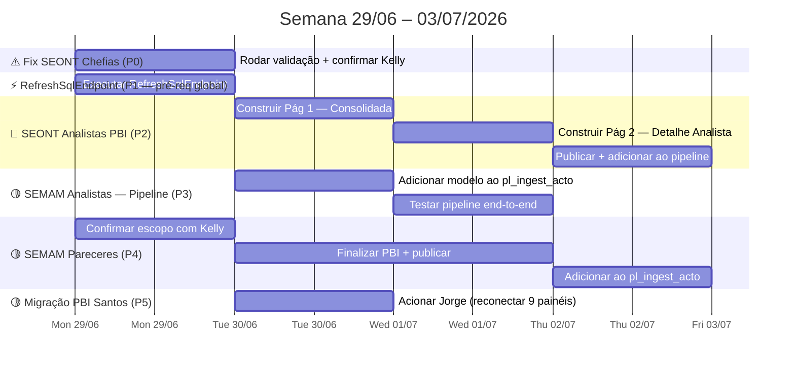

# Spec Drive — Semana 29/06/2026

**Contexto geral:** Semana de fechamento e integração — três entregáveis prontos tecnicamente aguardam publicação e pipeline: PBI SEONT Analistas (Gold ✅, construção em andamento), SEMAM Analistas (PBI ✅, fora do pipeline), e SEMAM Pareceres (Gold ✅, PBI pendente confirmação de escopo). Pendência de alta prioridade: validar o fix de SEONT Chefias no painel Obras Acompanhamento (notebook de validação criado 25/06, resultado ainda não confirmado). RefreshSqlEndpoint é pré-requisito compartilhado por três frentes — executar antes de qualquer outra ação de pipeline ou PBI.

**Atualização 29/06 (prioridades revisadas):** Fix SEONT Chefias ✅ validado (119/121 OK). Foco da semana redefinido: (1) concluir e publicar PBIs de Santos Obras (SEONT Analistas + SEMAM Pareceres) e integrá-los ao pipeline; (2) iniciar mapas Osasco com lat/long usando dados públicos de Violência Contra Mulher; (3) radar de infraestrutura — solicitar ao cliente criação de 7 ambientes Fabric (DEV/PRD por workspace). Migração PBI Santos com Jorge e SEMAM Analistas pipeline ficam como item secundário.

---

## 📍 Estado Atual (29/06/2026)

| Projeto                                               | Status                                                       | Próxima ação                                                                            |     |
| ----------------------------------------------------- | ------------------------------------------------------------ | --------------------------------------------------------------------------------------- | --- |
| **Fix SEONT Chefias — obras acompanhamento**          | ✅ Validado 29/06 — 119/121 OK · Z1/Z2/Z3 100%                | ~~Comunicar Kelly (V4)~~                                                                |     |
| **PBI SEONT Analistas**                               | 🔵 P1 — Gold ✅ (846 OS) · PBI em construção                  | RefreshSqlEndpoint → concluir → publicar → pipeline                                     |     |
| **SEMAM Pareceres (OS #977435)**                      | 🔵 P1 — Gold ✅ (219 OS) · escopo pendente com Kelly          | Confirmar SLA + Reforma/Legalização → finalizar PBI → pipeline                          |     |
| **Mapas Osasco — Violência Contra Mulher (lat/long)** | 🟢 P2 — Validado localmente · 15.938 BOs · PBI Azure Maps OK | Fazer upload GeoJSON → criar nb no Fabric → conectar PBI                                |     |
| **Mapas Osasco — Arquitetura geo SSP (11 tabelas)**   | 🔵 P2 — Levantamento ✅ · arquitetura decidida                | Implantar `nb_utils_geo_osasco` → Gold individuais por domínio                          |     |
| **Ambientes Fabric DEV/PRD**                          | 📡 Radar — aguardando cliente                                | Solicitar 7 workspaces (Acto DEV/PRD · Dados Públicos DEV/PRD · Osasco · Santos · Mauá) |     |
| **SEMAM Analistas (OS #974214)**                      | 🟡 PBI ✅ publicado — fora do pipeline                        | Pós-SEONT: adicionar ao `pl_ingest_acto`                                                |     |
| **Migração PBI Santos (S2–S5)**                       | 🟡 9 painéis prontos — RefreshSqlEndpoint pendente           | Secundário — acionar Jorge quando RefreshSqlEndpoint rodar                              |     |
| **OS #962592 — Aprovações Santos**                    | 🔴 Bloqueado — subformulários API                            | Aguardando InMov/Deconte                                                                |     |
| **OS #971002 — Mauá Meio Ambiente**                   | 🔴 Bloqueado — subformulários API                            | Aguardando InMov/Deconte                                                                |     |

---

## 🗓️ Roadmap Visual da Semana



---

## ⚠️ Frente 0 — Fix SEONT Chefias · Validação (PRIORIDADE IMEDIATA)

**Contexto:** Final da semana 22/06, Kelly reportou OS do painel Obras Acompanhamento (SEONT/Chefias) que não apareciam corretamente. O fix aplicado foi filtrar por `data_fim_etapa IS NULL` no `nb_gold_santos_obras_acompanhamento` para evitar que "ETAPA RESUMO" (com timestamp mais recente) sobrescrevesse a etapa SEONT no `partitionBy`. O notebook de validação `validar_os_chefias_seont.ipynb` foi criado em 25/06 com 125 OS do `BI_CHEFIAS.csv` do cliente.

**O que precisa ser confirmado:**

| Checagem | Esperado | Critério de aprovação |
|---|---|---|
| OS encontradas no Gold | 123 de 125 (2 provavelmente encerradas/ausentes) | ≥ 120 |
| `flag_seont = 1` | Todas as OS encontradas | 0 com `flag_seont = 0` |
| OS 850380 — `etapa_atual` | `DELIBERAÇÃO SEONT` | Confirmado |
| `flag_multiplas_etapas = 1` | Expressivamente menor que 3.261 (antes do fix) | < 1.000 |

### Tarefas

- [x] **V1** Rodar `validar_os_chefias_seont.ipynb` — 119/121 OK · Z1 49/49 · Z2 56/56 · Z3 13/13 · 2 ausentes esperados (910321, 983577 sem zona)
- [x] **V2** Fix confirmado — todas as OS zonadas aparecem corretamente com `flag_seont=1`
- [ ] **V4** Comunicar Kelly: OS chefias validadas — fechar OS da semana 22/06

---

## ⚡ Pré-requisito global — RefreshSqlEndpoint

> **Executar antes de qualquer ação de PBI ou pipeline esta semana.** Um único `RefreshSqlEndpoint` com `recreateTables:false` serve para todas as frentes — registra `dias_analise` e `etapa_analise_label` no SEONT, atualiza schema das demais tabelas Gold, e habilita a reconexão Jorge.

- [ ] **R0** Executar `RefreshSqlEndpoint` no Fabric (pipeline `pl_ingest_acto` ou avulso)

---

## 🔵 Frente 1 — PBI SEONT Analistas · Conclusão e Publicação

**Gold:** `gold.santos_seont_analista_tecnico` · 846 OS · 7 etapas de análise  
**Spec técnico:** [[spec_painel_seont_analista_tecnico]]

### Estado das colunas no Gold

| Coluna | Status | Observação |
|---|---|---|
| `dias_analise` | ⚠️ Precisa de RefreshSqlEndpoint | Calculado no notebook, schema não registrado ainda |
| `etapa_analise_label` | ⚠️ Precisa de RefreshSqlEndpoint | 6 rótulos limpos mapeados no spec |
| `analista_tecnico` | ✅ | Normalizado (contas sistema → "Não Atribuído") |
| `aux_setor_responsavel` | ✅ | Gargalo pós-análise |
| `zona` | ✅ 98.7% preenchido | — |

### Referência rápida — etapas de análise (whitelist Gold)

| Rótulo PBI (`etapa_analise_label`) | Etapa raw (Bronze) |
|---|---|
| Análise Técnica — Conf. Dados | `SEONT - ANÁLISE TECNICA - CONFERÊNCIA DOS DADOS` |
| Análise Técnica | `SEONT - ANÁLISE TECNICA` |
| Pré-Análise | `SEONT - PRÉ  ANÁLISE TECNICA` *(duplo espaço)* |
| Pré-Análise | `SEONT - PRÉ ANÁLISE TECNICA` |
| Conferência Final | `SEONT CONFERENCIA FINAL - ANÁLISE TECNICA` |
| Conferência Documental | `SEONT - CONFÊRENCIA DOCUMENTAL` |

### Tarefas

- [ ] **B1** Pós-RefreshSqlEndpoint: confirmar que `dias_analise` e `etapa_analise_label` aparecem no semantic model
- [ ] **B2** Construir Página 1 — Consolidada (conforme protótipo no spec): 5 slicers · 4 cards KPI · barras por analista · barras por serviço · tabela por tipo de análise · bloco gargalo pós-análise · cards média/mediana dias
- [ ] **B3** Construir Página 2 — Detalhe por Analista: filtro analista + tabela OS + histograma `Faixa Dias Análise`
- [ ] **B4** Ocultar no modelo: `flag_chefia` · `analista_raw` · `status_etapa_analise` · `etapa_analise` (expor só `etapa_analise_label`)
- [ ] **B5** Sincronizar filtros `analista_tecnico` · `servico` · `status` entre páginas
- [ ] **B6** Cor primária: `#1f77b4` (azul obras) — consistência com layout SEMAM Analistas
- [ ] **B7** Publicar `pbi_santos_obras_seont_analistas` no workspace Santos
- [ ] **B8** Adicionar `PBISemanticModelRefresh` do painel SEONT Analistas no `pl_ingest_acto`
- [ ] **B9** Comunicar Kelly entrega do painel

> [!warning] Checklist antes de publicar
> - `05-DEMOLIÇÃO` ausente no servico? Confirmar normalização
> - `dias_analise` com cobertura ≥ 85% (esperado 89.8%)
> - "Sistema"/"Usuário" em `aux_setor_responsavel` exibidos como "Em trâmite" no canvas
> - Validar consistência visual com painel SEMAM Analistas (mesma estrutura)

---

## 🟡 Frente 2 — SEMAM Analistas · Integração Pipeline

**PBI:** `pbi_obras_santos_seman_acomp_analistas` — publicado 25/06  
**Gold:** `gold.santos_semam_analista_tecnico` · 187 OS  
**`%run` no orquestrador:** ✅ já adicionado

### Tarefas

- [ ] **M1** Pós-RefreshSqlEndpoint: confirmar que `gold.santos_semam_analista_tecnico` aparece no endpoint SQL
- [ ] **M2** Adicionar `PBISemanticModelRefresh` do painel SEMAM Analistas no `pl_ingest_acto`
- [ ] **M3** Executar pipeline completo e verificar que o painel atualiza automaticamente

---

## 🟡 Frente 3 — SEMAM Pareceres (OS #977435) · Conclusão

**Solicitante:** Kelly Araujo Simões · SEMAM  
**Gold:** `gold.santos_semam_pareceres` · 219 OS (218 Finalizadas + 1 Em Atendimento)  
**Spec técnico:** [[spec_painel_semam_pareceres]]

### Decisões pendentes com o cliente

> [!important] Confirmar com Kelly antes de avançar
> Estas duas questões definem o escopo final do painel.

**Decisão A — OS Atrasadas:**
- **Opção A1:** Usar SLA fixo de 30 dias corridos (card mostra número de OS abertas há mais de 30 dias)
- **Opção A2:** Remover card e substituir por tabela "Top OS mais antigas em aberto" (ordenadas por `dias_na_etapa` DESC)

**Decisão B — Reforma/Legalização e Alterações Diversas:**
- Esses serviços têm etapa `PARECER TECNICO DIVERSOS` no Silver mas sem "DEPCAM" no nome → **não estão** na Gold atual (219 registros)
- Se Kelly confirmar que são SEMAM: expandir filtro e re-executar (esperado +~30% no rowcount)

### Tarefas

- [ ] **P1** Confirmar com Kelly: card OS Atrasadas → opção A1 (SLA 30 dias) ou A2 (remover card)?
- [ ] **P2** Confirmar com Kelly: Reforma/Legalização e Alterações Diversas entram no escopo?
- [ ] **P3** Se P2 = sim: expandir filtro no notebook (`etapa LIKE '%PARECER TECNICO DIVERSOS%'`), re-executar Gold no Fabric, validar rowcount
- [ ] **P4** Implementar medida DAX `OS Atrasadas` (conforme decisão P1) ou ajustar visual conforme opção A2
- [ ] **P5** Publicar `pbi_obras_santos_semam_pareceres` no workspace Santos
- [ ] **P6** Fazer upload do `nb_gold_santos_semam_pareceres` no Fabric (local OK — Fabric desatualizado)
- [ ] **P7** Adicionar `PBISemanticModelRefresh` do painel Pareceres Diversos no `pl_ingest_acto`
- [ ] **P8** Comunicar entrega para Kelly

---

## 🟡 Frente 4 — Migração PBI Santos (S2–S5)

**Objetivo:** reconectar 9 painéis que apontam para o LH legado ao novo schema `gold.santos_*`  
**Executor da reconexão:** Jorge  
**Pré-requisito:** `RefreshSqlEndpoint` (compartilhado com Frente 0 — executar apenas uma vez)

### Painéis prontos para reconectar

| Painel | Validado? |
|---|---|
| SEGOV | ⬜ |
| SEINFRA | ⬜ |
| CET | ⬜ |
| CET C&D | ⬜ |
| SEPREF | ⬜ |
| Ouvidoria Operacional | ⬜ |
| Ouvidoria Manifestações (×5) | ⬜ |
| Curso Motorista | ⬜ |

### Painéis bloqueados (não reconectar agora)

| Painel | Motivo |
|---|---|
| Avaliação Sentimento | Tabela não existe no novo LH |
| Carta de Serviços | Fora do escopo atual |
| Obras | Aguardar Kelly — pipeline R5 ainda parado |

### Tarefas

- [ ] **S2** Comunicar Jorge que RefreshSqlEndpoint foi executado — pode iniciar reconexões
- [ ] **S3** Jorge reconecta modelo semântico dos 9 painéis priorizados
- [ ] **S4** Validar rowcounts e medidas DAX após reconexão (por painel)
- [ ] **S5** Confirmar agendamento de refresh diário no workspace Santos

---

## 🗺️ Frente 5 — Mapas Osasco · Violência Contra Mulher + Arquitetura SSP

**Spec VCM:** [[spec_mapa_geo_violencia_mulher_osasco]]  
**Spec arquitetura:** [[spec_arquitetura_geo_osasco]]  
**Lakehouse:** `lh_cidade_inteligente_osasco`

### 5A — Violência Contra Mulher · resultado do teste local (29/06)

> [!success] Validado localmente em 29/06
> Script `gerar_mapa_vcm.py` rodado com ODBC direto no lakehouse. Resultado:
> - Cobertura lat/long: **84.9%** dos BOs com `Flag_Incluir=1` têm coordenada (16.074 / 18.924)
> - CRS: ✅ EPSG:4326 (WGS84 confirmado — lat entre -23.x e -27.x, sem valores em metros)
> - Filtro ponto-em-polígono: **99.2% de retenção** (15.938 dentro / 136 fora de Osasco)
> - `bairro_geo`: 15.938 / 15.938 preenchidos via spatial join
> - PBI Azure Maps testado com CSV → mapa e legenda `bairro_geo` corretos ✅

**Arquivos criados:**

| Arquivo | Status |
|---|---|
| `violencias_mulher_osasc/mapa/output/vcm_mapa.csv` | ✅ 15.938 linhas |
| `violencias_mulher_osasc/gold/nb_gold_osasco_violencia_mulher_mapa.ipynb` | ✅ pronto para deploy |
| `violencias_mulher_osasc/pipelines/pl_violencia_mulher_osasco.json` | ✅ atualizado (falta `notebookId`) |

**Tarefas restantes (deploy Fabric):**

- [x] **O1** Levantamento de cobertura — 84.9% · CRS WGS84 ✅
- [x] **O1b** Filtro ponto-em-polígono validado localmente — 99.2% retenção
- [x] **O1c** PBI Azure Maps testado com CSV — mapa e `bairro_geo` corretos
- [x] **O2a** `nb_gold_osasco_violencia_mulher_mapa.ipynb` criado localmente
- [x] **O2b** `pl_violencia_mulher_osasco.json` atualizado com nova atividade
- [ ] **O3** Upload de `bairros_osasco.json` → `Files/geo/` no `lh_cidade_inteligente_osasco` (Fabric UI)
- [ ] **O4** Criar `nb_utils_geo_osasco` no Fabric (pasta `utils/`) · executar · validar 60 bairros
- [ ] **O5** Importar `nb_gold_osasco_violencia_mulher_mapa.ipynb` no Fabric · executar · verificar rowcount
- [ ] **O6** Copiar `notebookId` gerado → preencher em `pl_violencia_mulher_osasco.json` · publicar pipeline
- [ ] **O7** Criar aba de mapa no PBI VCM: Azure Maps · `Latitude`/`Longitude` · cor por `Rubrica` · filtros `Periodo_Final`/`Tipo Local`/`_fonte`
- [ ] **O8** Publicar PBI · comunicar analista BI Osasco

---

### 5B — Arquitetura geo SSP — levantamento e decisão (29/06)

> [!info] Descoberta do levantamento
> O lakehouse tem **13 tabelas com lat/long** — além da VCM, 10 tabelas Silver da SSP-SP (dados estaduais) com coordenadas. Todas em EPSG:4326. Todas precisam de filtro ponto-em-polígono para recorte em Osasco.

**Tabelas identificadas (Silver SSP-SP — dados estaduais):**

| Tabela | Linhas | Cobertura | Prioridade |
|---|---|---|---|
| `silver_tb_presos_apreendidos` | 349k | 73% | a definir (overlap prisoes?) |
| `silver_tb_prisoes` | 291k | 73% | P3 |
| `silver_tb_entorpecentes` | 239k | 77% | P4 |
| `silver_tb_flagrantes` | 174k | 69% | P2 |
| `silver_tb_apreensao_intorpecentes` | 98k | 80% | a definir (overlap entorpecentes?) |
| `silver_tb_veiculos_recuperados` | 90k | 89% | P5 |
| `silver_tb_armas_apreendidas` | 24k | 58% | P6 |
| `silver_tb_art173` | 14k | 80% | baixo volume — avaliar |
| `silver_infosiga_sinistros` | — | ⚠️ varchar | P7 — requer `pd.to_numeric()` |
| `silver_tb_dados_criminais` | — | ⚠️ varchar | investigar |

**Arquitetura aprovada — Cenário B (Gold individuais + utilitário compartilhado):**

```
nb_utils_geo_osasco  ← %run por cada notebook de mapa
    ↑
nb_gold_osasco_flagrantes_mapa   → gold_osasco_flagrantes_mapa
nb_gold_osasco_prisoes_mapa      → gold_osasco_prisoes_mapa
... (um notebook por domínio)
```

**Arquivos criados:**

| Arquivo | Status |
|---|---|
| `geo_osasco/nb_utils_geo_osasco.ipynb` | ✅ utilitário geo — pronto para deploy |
| `geo_osasco/nb_gold_osasco_flagrantes_mapa.ipynb` | ✅ template P2 |
| `geo_osasco/levantamento_geo_lakehouse.py` | ✅ script de descoberta |
| `geo_osasco/output/levantamento_geo.xlsx` | ✅ resultado levantamento |
| `geo_osasco/output/amostra_<tabela>.csv` | ✅ amostras para inspeção de colunas |

**Tarefas desta semana (apenas P2 — flagrantes):**

- [x] **G1** Levantamento de tabelas com lat/long — 13 tabelas encontradas
- [x] **G2** Arquitetura decidida e documentada em [[spec_arquitetura_geo_osasco]]
- [x] **G3** `nb_utils_geo_osasco` criado localmente
- [x] **G4** Template `nb_gold_osasco_flagrantes_mapa` criado localmente
- [ ] **G5** Inspecionar `geo_osasco/output/amostra_silver_tb_flagrantes.csv` — definir colunas relevantes para PBI
- [ ] **G6** Pós-O4 (utils no Fabric): criar `nb_gold_osasco_flagrantes_mapa` no Fabric · executar · verificar volume Osasco
- [ ] **G7** PBI flagrantes: Azure Maps · cor por `natureza_apurada` · publicar

> [!note] P3–P7 ficam no backlog
> Focar em VCM (O3–O8) e flagrantes (G5–G7) esta semana. Os demais datasets SSP entram nas próximas sprints conforme demanda do cliente Osasco.

---

## 📡 Radar — Ambientes Fabric DEV/PRD

**Contexto:** O cliente (Acto/InMov) precisa criar ambientes separados de desenvolvimento e produção nos workspaces Fabric para permitir o ciclo adequado de homologação antes de publicar em produção. A solicitação foi comunicada — aguardando resposta.

**Ambientes solicitados (7):**

| Ambiente | Tipo | Uso |
|---|---|---|
| Acto DEV | Desenvolvimento | Testes de pipeline e notebooks Acto |
| Acto PRD | Produção | Pipeline Acto em produção (atual workspace único) |
| Dados Públicos DEV | Desenvolvimento | Testes do lakehouse dados públicos |
| Dados Públicos PRD | Produção | Dados públicos em produção |
| Osasco | Produção | Workspace Osasco |
| Santos | Produção | Workspace Santos |
| Mauá | Produção | Workspace Mauá |

**Opções para avançar:**
- **A** — Cliente cria os workspaces e concede acesso ao time
- **B** — Cliente concede acesso ao Azure Portal e o time cria e configura os workspaces diretamente

> [!note] Impacto arquitetural
> Enquanto os ambientes DEV não existirem, qualquer teste de mudança estrutural (novo payload, refatoração Gold, schema change) é feito direto no workspace de produção — risco real de quebra do pipeline em horário de refresh.

- [ ] **I1** Aguardar retorno do cliente sobre qual opção (A ou B)
- [ ] **I2** Se opção B: levantar permissões mínimas necessárias no Azure Portal para criação de Fabric workspace
- [ ] **I3** Quando ambientes criados: definir estratégia de deploy (CI via Git sync ou deploy manual de notebooks)

---

## 🔴 Bloqueados (monitorar — sem ação esta semana)

### OS #962592 — Aprovações Santos (Kelly)
Aguardando API retornar campos de subformulários (`pavimentos`, etc). Protótipo apresentado.

### OS #971002 — Mauá Meio Ambiente (Renan)
Mesmo bloqueio. Gold conectada ao PBI; payload unificado definido — aguarda desbloqueio API para executar M6'–M11. Ver [[project_maua_payload_unificado]].

---

## ⚠️ Riscos da Semana

| Risco | Impacto | Mitigação |
|---|---|---|
| RefreshSqlEndpoint `recreateTables:false` não registra colunas novas | `dias_analise` e `etapa_analise_label` invisíveis no PBI SEONT | Se ocorrer, rodar uma vez com `recreateTables:true` |
| Kelly não responde sobre SLA SEMAM esta semana | Pareceres empaca na decisão SLA | Adotar fallback A2 (remover card OS Atrasadas) e comunicar |
| Lat/long de Violência Contra Mulher com baixa cobertura | Mapa com muitos pontos sem localização | Verificar em O1 antes de construir — se < 70%, usar mapa por bairro |
| Ambientes DEV não criados antes de mudança estrutural no pipeline | Risco de quebrar pipeline produção durante testes | Documentar e escalar para cliente (item I1) |

---

## 📋 Backlog (sem data)

| Item | Referência |
|---|---|
| Mapas Osasco — Flagrantes (P2) | [[spec_arquitetura_geo_osasco]] |
| Mapas Osasco — Prisões, Entorpecentes, Veículos (P3–P5) | [[spec_arquitetura_geo_osasco]] |
| Mapas Osasco — Seg. Pública e Viária | [[spec_drive_semana_15_06_2026]] |
| Dados Públicos CAGED (Yuri) | [[spec_drive_dados_publicos]] |
| Refatoração Gold Acto — função factory | Backlog |

---

## 🔗 Referências

- [[spec_drive_semana_22_06_2026]] — spec semana anterior
- [[spec_painel_seont_analista_tecnico]] — spec técnico painel SEONT Analistas
- [[spec_painel_semam_analista_tecnico]] — spec técnico painel SEMAM Analistas
- [[spec_painel_semam_pareceres]] — spec técnico OS #977435
- [[spec_mapa_geo_violencia_mulher_osasco]] — spec técnico mapa VCM Osasco
- [[spec_arquitetura_geo_osasco]] — arquitetura geo SSP Osasco · 11 tabelas · Cenário B
- [[project_maua_payload_unificado]] — estratégia payload unificado Mauá

---

*Spec Drive · Acto Cidade Inteligente · Criado em 29/06/2026*
