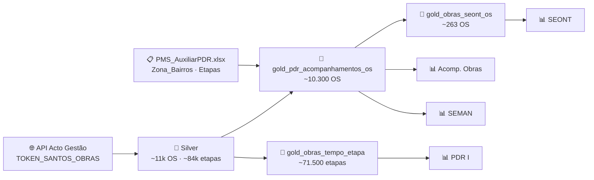

# F5 — Obras: Como os Painéis Funcionam

> [!map] Mapas visuais
> - [[diagramas/paineis_obras_fluxo|🔗 Mapa de Fluxo Técnico]] — API → Silver → Gold → Painéis
> - [[diagramas/paineis_obras_negocio|🔗 Mapa de Negócio]] — Foco, público e KPIs de cada painel

> [!danger] Pipeline parada desde 11/03/2025
> Todos os 4 painéis estão sem dados novos por erro HTTP 401 na API de Obras (issue R5 Crítico — `TOKEN_SANTOS_OBRAS` expirado). Dados congelados há mais de 14 meses. **Não usar para tomada de decisão até a correção.** Migração para a nova arquitetura Acto está em planejamento.

---

## Visão Geral da Família F5

A família F5 agrupa os painéis de acompanhamento de **Ordens de Serviço (OS) de obras civis e licenciamentos ambientais** do município de Santos. São quatro painéis com focos distintos e complementares.



| Painel | Arquivo Power BI | Foco | Abas | Fonte Gold |
|---|---|---|---|---|
| Acomp. Solicitações — Obras | `pbi_obras_santos_acomp_solicitacoes` | Volume e prazo por zona territorial | 3 | `gold_pdr_acompanhamentos_os` |
| Acomp. Solicitações — SEMAN | `pbi_obras_santos_seman_acomp` | Licenciamentos ambientais por tipo | 3 | `gold_pdr_acompanhamentos_os` |
| PDR I — Produtividade | `pbi_obras_santos_pdr` | Produtividade por executor e setor | 2 | `gold_obras_tempo_etapa` |
| SEONT — Analistas | `pbi_santos_obras_seont_os` | Carga individual dos analistas técnicos | 2 | `gold_obras_seont_os` |

> [!warning] Protótipo fora de produção
> `acomp_alvara_obras_santos_prototipo` — 5 abas, aba "Rascunho" visível, escala de fontes fora do padrão. **Não está em uso.**

---

## Painel 1 — Acompanhamento de Solicitações (Obras)

### O que é e para que serve

Visão gerencial do total de OS de obras em andamento e finalizadas, com distribuição por **zona territorial** (Z1, Z2, Z3) e controle de **prazo/SLA**. É o painel principal para gestores acompanharem o volume de demanda e a situação de prazo de cada região da cidade.

Diferença em relação aos painéis operacionais de outras secretarias (F1): o agrupamento geográfico é por **zona** (mapa por zona territorial), não por bairro individualmente.

### Público-alvo

Gestores da Secretaria de Obras e coordenadores de equipe.

### Estrutura de Navegação

**Aba 1 — Ordens em Aberto**
- Totalizadores: Total de OS · Em Atendimento · Pendentes
- Donut de SLA: % Prazo Vencido · % Dentro do Prazo · % Vence Hoje
- OS por serviço (barras horizontais)
- OS por zona territorial — Z1, Z2, Z3 (mapa visual por zona)
- Distribuição por etapa atual e executor responsável

**Aba 2 — Ordens Finalizadas**
- % finalizadas dentro do prazo vs fora do prazo
- Tempo médio de finalização por serviço
- Volume de OS finalizadas por período

**Aba 3 — Base de Dados**
- Tabela exportável: OS · Serviço · Status · Etapa Atual · Bairro · Zona · Data Criação · Data Finalização · Dias na Etapa

### KPIs

| KPI | O que mede |
|---|---|
| Total de OS abertas | Volume de demandas em andamento |
| % Prazo Vencido | OS abertas que já ultrapassaram o SLA |
| % Dentro do Prazo | OS abertas ainda dentro do prazo |
| % Vence Hoje | OS com vencimento do SLA no dia |
| % Finalizadas dentro do prazo | Eficiência histórica de cumprimento |
| Tempo médio de finalização (dias) | Velocidade média de resolução |

### Filtros

Status da OS · Etapa Atual · Nome do Serviço · Zona · Ano · Mês · Status do Prazo

### Origem dos dados

| Tabela | Registros | Lakehouse atual |
|---|---|---|
| `gold_pdr_acompanhamentos_os` | ~10.300 | `lh_cidade_inteligente_santos` |

**Migração:** `gold.obras_acompanhamentos_os` → `lh_solicitacoes_acto` (em implantação)

---

## Painel 2 — Acompanhamento de Solicitações (SEMAN)

### O que é e para que serve

Versão especializada do painel de Obras voltada exclusivamente para **licenciamentos ambientais**. A SEMAN (Secretaria de Meio Ambiente de Santos — *confirmar sigla, pois o header usa "SEMAM"*) gerencia processos de aprovação ambiental com fluxo distinto das OS de obras civis.

### Público-alvo

Equipe e gestores da Secretaria de Meio Ambiente (SEMAN/SEMAM).

### Tipos de Processo Monitorados

| Tipo | Descrição |
|---|---|
| **Licença Prévia (LP)** | Autorização de viabilidade do empreendimento |
| **Licença de Instalação (LI)** | Autorização para início das obras |
| **Licença de Operação (LO)** | Autorização para funcionamento |
| **Manifestação Técnica Ambiental (MTA)** | Pareceres técnicos pontuais |

### Estrutura de Navegação

Mesma estrutura de 3 abas do painel de Obras (Ordens em Aberto · Finalizadas · Base de Dados), com filtro adicional de **Tipo de Licença** em todas as abas.

O mapa por zona territorial (Z1/Z2/Z3) é mantido — a localização do empreendimento é o critério de distribuição.

### KPIs

Mesmos KPIs do painel de Obras, com contexto de licenciamento:

| KPI | Aplicação |
|---|---|
| Total de processos abertos | Licenciamentos em análise |
| % Prazo Vencido | Processos que ultrapassaram o prazo de análise |
| % Dentro do Prazo | Processos dentro do prazo |
| Tempo médio de finalização | Prazo médio por tipo de licença |

### Período de Dados

01/01/2024 – 09/03/2026 (último dado disponível antes do bloqueio)

> [!bug] Inconsistência de sigla
> Header do painel: "SEMAM" · Título principal: "SEMAN". Confirmar sigla correta com a secretaria.

### Origem dos dados

| Tabela | Observação |
|---|---|
| `gold_pdr_acompanhamentos_os` | Mesma tabela do Obras, filtrada por tipo de licença |

---

## Painel 3 — PDR I (Participação Direta nos Resultados)

### O que é e para que serve

Análise de **produtividade operacional** das equipes de obras. O PDR (*Participação Direta nos Resultados*) é o sistema de avaliação de desempenho da Prefeitura de Santos — este painel fornece a base de dados de produtividade de cada executor por etapa.

O foco aqui não é a OS como unidade, mas sim as **etapas individuais** de cada OS. Cada linha representa uma etapa executada, com data de início, fim e duração — permitindo calcular a produtividade real de cada setor.

### Público-alvo

Gestores de equipe, RH e coordenadores de setor para cálculo de produtividade e avaliação de desempenho.

### Estrutura de Navegação

**Aba 1 — Tabela de OS por Etapa**

Granular — uma linha por etapa executada:

| Coluna | Descrição |
|---|---|
| OS | Número da Ordem de Serviço |
| Serviço | Tipo de obra |
| Etapa | Nome da etapa do fluxo |
| Data Início | Data de início da etapa |
| Data Fim | Data de encerramento |
| Tempo de Execução | Duração calculada |
| Executor | Funcionário ou equipe responsável |
| Duração Dias | Número de dias inteiros |

**Aba 2 — Resumo por Aux Setor Responsável**

Visão agregada por setor:

| Métrica | Descrição |
|---|---|
| Total de OS | Quantidade de OS com etapa no setor |
| Duração Total (dias) | Soma de dias de todas as etapas |
| Média de Duração (dias) | Tempo médio por etapa no setor |

### KPIs

| KPI | O que mede |
|---|---|
| Total de etapas executadas | Volume de trabalho no período |
| Média de duração por etapa (dias) | Eficiência média de cada etapa |
| Duração total por setor (dias) | Carga acumulada por setor |
| Ranking de executor | Quem executou mais OS no período |

### Lógica técnica de referência

- Etapas em aberto: `duração = Hoje − Data Início`
- Etapas finalizadas: `duração = Data Fim − Data Início`
- `aux_setor_responsavel` vem de join com `PMS_AuxiliarPDR.xlsx` → cobertura **94%**
- `aux_pdr` (código PDR do especialista) → cobertura **~10%** (apenas etapas de especialistas)

> [!warning] DAX — contagem de OS
> Medidas DAX que usam `COUNTROWS` duplicam OS com `flag_multiplas_etapas = 1`.
> Usar `DISTINCTCOUNT(n_da_solicitacao)` nas medidas de contagem de OS.

### Origem dos dados

| Tabela | Registros |
|---|---|
| `gold_obras_tempo_etapa` | ~71.500 etapas |

**Migração:** `gold.obras_tempo_etapa` → `lh_solicitacoes_acto` (a criar)

---

## Painel 4 — SEONT — Analistas por Zona

### O que é e para que serve

Gestão da **carga de trabalho individual dos analistas técnicos da SEONT** (Seção de Obras — *confirmar sigla completa*), distribuída por zona territorial. É o painel mais operacional da família.

A SEONT é o setor técnico responsável pela análise e aprovação de obras específicas. Os analistas precisam ser acompanhados individualmente pela coordenação para evitar acúmulo de OS paradas.

### Público-alvo

Coordenadores da SEONT — monitorar carga por analista, identificar OS paradas e redistribuir demandas.

### Estrutura de Navegação

**Aba 1 — Analistas por Zona**

| Indicador | Descrição |
|---|---|
| OS abertas por analista | Ranking de carga por pessoa |
| Distribuição por zona | Z1, Z2, Z3 |
| **OS > 30 Dias** | Sinal de atenção — OS paradas |
| **OS > 60 Dias** | Acionamento de escalada |
| **Máximo de Dias** | Maior tempo de OS em aberto (analista mais sobrecarregado) |

**Aba 2 — Tabela Detalhada**

| Coluna | Descrição |
|---|---|
| OS | Número da Ordem de Serviço |
| Status | Em atendimento / Pendente / Finalizada |
| Serviço | Tipo de obra |
| Bairro | Bairro do imóvel/obra |
| Zona | Z1, Z2 ou Z3 |
| Etapa Atual | Etapa do fluxo atual |
| Analista Responsável | Nome do analista SEONT atribuído |
| Data Início da Etapa | Data de entrada na etapa atual |
| Dias na Etapa | Dias corridos desde o início |

### Regra de Atribuição de Analista

```
SEONT com executor atribuído  → usa executor_atual
SEONT sem executor            → usa analista_responsavel (por zona)
Etapa não-SEONT              → executor_atual (sem fallback)
```

> [!warning] Campo analista pouco preenchido
> `analista_responsavel` está preenchido em apenas ~4,4% das OS. É comportamento esperado — o campo é preenchido pela chefia SEONT após distribuição. OS sem analista ficam sem atribuição no painel.

### Filtro de Escopo (SEONT)

Trabalha com ~263 OS (subset de ~10.300 totais), onde `aux_setor_responsavel` ∈:
- `SEONT`
- `SEONT-Chefia`
- `SEONT-Chefia D.O`

### Origem dos dados

| Tabela | Registros | Observação |
|---|---|---|
| `gold_obras_seont_os` | ~263 OS | Deriva de `gold_pdr_acompanhamentos_os` |

**Migração:** `gold.obras_seont` → `lh_solicitacoes_acto` (a criar)

---

## Regras de Negócio Mapeadas

| Regra | Detalhe |
|---|---|
| Status "em aberto" | `statusFluxo` ∈ {"EM ATENDIMENTO", "PENDENTE"} |
| Dias na etapa (aberta) | `HOJE − data_etapa_inicio` (dias corridos) |
| Dias na etapa (finalizada) | `data_etapa_fim − data_etapa_inicio` (dias corridos) |
| Flag múltiplas etapas | OS com > 1 etapa aberta simultânea (~252 casos — mantidos, não deduplicados) |
| Normalização de bairro | 158 grafias → bairro normalizado (sem acento, maiúsculo, strip) |
| Mapeamento de zona | bairro normalizado → Z1 / Z2 / Z3 via `PMS_AuxiliarPDR.xlsx` |
| Setor responsável | Código de etapa → `aux_setor_responsavel` via `PMS_AuxiliarPDR.xlsx` |
| Analista SEONT | Executor da etapa SEONT (com fallback para campo analista) |

---

## Enriquecimento — PMS_AuxiliarPDR.xlsx

Ambas as tabelas Gold de Obras consomem o arquivo auxiliar:

| Sheet | Conteúdo | Cobertura |
|---|---|---|
| `Zona_Bairros` | 122 bairros → zona (Z1/Z2/Z3) | ~100% dos bairros reconhecidos |
| `Etapas` | 185 etapas → `aux_setor_responsavel` + `aux_pdr` | 94% setor · 10% PDR |

> [!warning] Ponto único de falha — R1
> Arquivo Excel no Lakehouse. Se movido ou deletado, os dois painéis de Obras e o SEONT perdem bairro/zona/setor silenciosamente. **Migração para Delta Table prevista como Etapa 4 do plano de migração.**

---

## Pendências e Alertas

> [!bug] Sigla inconsistente no SEMAN
> Header: "SEMAM" · Título: "SEMAN". Confirmar e padronizar.

> [!warning] Fonte tipográfica fora do padrão
> Painéis de Obras usam `SegoeUI-Semibold`; padrão InMov é `SegoeUI-Bold`.

> [!warning] Watermark InMov ausente
> Todos os 4 painéis estão sem rodapé "Desenvolvido por InMov".

> [!note] Glossário a validar com cliente
> PDR I, SEONT, SEMAN, Zonas Z1/Z2/Z3 e Aux Setor Responsável precisam de definição oficial validada pelos responsáveis de cada secretaria.

## Regras de Negócio dos Painéis de Obras — Resumo Completo

São **19 regras distintas**, organizadas por categoria:

---

### 1. Múltiplas Etapas Abertas (a mais crítica)

O Acto Gestão pode abrir N etapas em paralelo para a mesma OS sem fechar as anteriores (`dataEtapaFim = NULL` em várias ao mesmo tempo). O pipeline antigo usava `drop_duplicates`, mantendo só uma — se a etapa mantida não fosse SEONT, a OS **desaparecia silenciosamente do painel de analistas**.

**Regra atual:** preservar todas as etapas abertas (1 OS = N linhas). OS sem nenhuma etapa aberta (finalizadas) recebem fallback de 1 linha (última etapa fechada).

- `flag_multiplas_etapas = 1` sinaliza OS nessa condição (~252 casos)
- **Impacto DAX:** `COUNTROWS` duplica essas OS — obrigatório usar `DISTINCTCOUNT(n_da_solicitacao)` nas medidas de contagem de OS

---

### 2. Setores Responsáveis (`aux_setor_responsavel`)

Cada etapa é mapeada para um setor via join com `PMS_AuxiliarPDR.xlsx` (Sheet `Etapas`, 185 registros):

```
código de etapa → aux_setor_responsavel (ex: SEONT, SEONT-Chefia, SEALURB...)
```

Cobertura: **94%** das etapas (~67.477 de 71.500). Os 6% restantes ficam nulos — não há setor mapeado para aquela etapa.

---

### 3. `flag_seont` — Filtro do Painel SEONT

```python
SETORES_SEONT = {"SEONT", "SEONT-Chefia", "SEONT-Chefia (D.O)", "SEONT CHEFIA"}
flag_seont = aux_setor_responsavel.strip().isin(SETORES_SEONT)
```

Determina quais linhas entram no painel SEONT. Filtra de ~10.300 OS totais para ~263 OS. Calculado **linha a linha** — com múltiplas etapas, a mesma OS pode ter linhas com flag=1 e flag=0.

---

### 4. `flag_chefia` — Chefia vs Analistas no SEONT

Dentro do universo SEONT existe uma subdivisão:

```python
SETORES_CHEFIA = {"SEONT-Chefia", "SEONT-Chefia (D.O)"}
flag_chefia = aux_setor_responsavel.isin(SETORES_CHEFIA)
```

- `flag_chefia = 0` → etapas dos **analistas técnicos** (aparecem no painel de analistas)
- `flag_chefia = 1` → etapas da **chefia e publicação no D.O.** (excluídas do painel de analistas, mas ainda SEONT)

Sem essa distinção, as OS em etapa de publicação do Diário Oficial aparecem inflando a carga dos analistas.

---

### 5. Analista Responsável por Zona (Z1/Z2/Z3)

O formulário da OS tem o campo _"Esta solicitação deverá ser analisada por:"_ — existem 11 variantes dessa coluna no Silver (uma por etapa que populou o campo). A regra extrai o primeiro valor preenchido via bfill horizontal:

```python
cols_analista = [c for c in silver.columns if "ANALISADA POR" in normalizar(c)]
# → 11 colunas: 'Esta solicitação deverá ser analisada por:|385', '...|411', etc.

analista_responsavel = silver[cols_analista].bfill(axis=1).iloc[:, 0]
```

- Preenchido em apenas **3,4–4,4% das OS** — comportamento esperado. O campo só é preenchido **após** a chefia SEONT fazer a distribuição por zona.
- **Zerado para `flag_seont = 0`** — o conceito de analista por zona é exclusivo da SEONT. Etapas de outros setores não herdam esse valor.

---

### 6. `executor_responsavel` — 3 Regras de Cascata

O campo que aparece no painel como "responsável pela OS" segue hierarquia diferente dependendo do setor:

|Condição|`executor_responsavel`|
|---|---|
|Etapa SEONT **com** executor atribuído|`executor_atual`|
|Etapa SEONT **sem** executor atribuído|`analista_responsavel` (fallback zona)|
|Etapa **não-SEONT**|`executor_atual` (sem fallback para analista)|

A distinção do não-SEONT é crítica: sem ela, OS de outros setores herdariam o nome do analista SEONT — dado semanticamente errado.

Resultado: 99,4% preenchido após a regra (65 OS ficam nulas — casos sem executor nem analista atribuídos).

---

### 7. `flag_etapa_aprov` — Etapas de Aprovação/Finalização

Identifica se a OS chegou em uma etapa terminal/deliberativa. Comparação **sem acento** (normalização NFD → ASCII) para evitar divergências de encoding entre registros:

28 variantes mapeadas, incluindo:

- `DELIBERAÇÃO SEONT` / `DELIBERAÇÃO SEONT Z1`
- `REGISTRO DA PUBLICIDADE DO DIARIO OFICIAL`
- `DEFERIMENTO` / `INDEFERIMENTO`
- `EMISSÃO ALVARÁ`, `EMISSÃO DA LICENÇA`, `EMISSÃO DA LICENÇA HABITE-SE`
- `FIM DE FLUXO`, `FINALIZAR FLUXO`, `ETAPA RESULTADO FINAL`
- `SEONT CONFERÊNCIA FINAL - ANÁLISE TÉCNICA` (e variante sem acento)
- `SEONT - ANÁLISE TÉCNICA - CONFERÊNCIA DOS DADOS` (e variante sem acento)

Etapas SEONT que ficam com `flag=0` e precisam ser monitoradas: `SEONT CHEFIA - DISTRIBUIÇÃO`, `SEONT - PRÉ ANÁLISE TECNICA`, `SEONT Z1/Z2/Z3 CHEFIA - DISTRIBUIÇÃO`.

---

### 8. Zona Territorial (Z1/Z2/Z3)

```
bairro_pad (normalizado) → zona via PMS_AuxiliarPDR.xlsx (Sheet Zona_Bairros, 122 bairros)
```

Normalização do bairro antes do join: NFC unicode + uppercase + strip + correções de grafia (158 variantes distintas na API). Se o bairro não constar no de-para, `zona = NULL`.

Cobertura geral: ~43% preenchida (56,5% nulos na tabela mestre). No painel SEONT: ~88% preenchida (12% nulos).

---

### 9. `zona_aplicavel` — Dois Padrões de `zona = NULL`

Nem todo `zona = NULL` é um gap de qualidade. Há dois padrões distintos:

**Padrão A — Comportamento esperado (`zona_aplicavel = 0`):** Serviços sem localização física — não têm endereço de obra:

- INSCRIÇÃO DE PROFISSIONAL (PESSOA FÍSICA / JURÍDICA)
- RENOVAÇÃO DE CADASTRO PROFISSIONAL (PESSOA FÍSICA / JURÍDICA)
- PROVIDÊNCIA

**Padrão B — Gap real (`zona_aplicavel = 1`, `zona = NULL`):**

- REFORMA E/OU LEGALIZAÇÃO sem bairro mapeado no `AuxiliarPDR.xlsx` (16 OS identificadas)
- Ação: verificar `bairro_consolidado` e atualizar a planilha

Sem essa distinção, alertas de qualidade de dados disparam para serviços que nunca terão zona.

---

### 10. Campo Bairro — Dois Tipos no Payload

A API retorna o bairro em campos diferentes dependendo do tipo de serviço:

|Campo API|Serviços|
|---|---|
|`TXT_IMOB_LOGRBAIRRO`|NOVAS EDIFICAÇÕES, HABITE-SE, DEMOLIÇÃO, ACOMPANHAMENTO DE OBRAS|
|`COB_IMOB_LOGRBAIRRO`|MANUTENÇÃO DE FACHADAS, ASSUNÇÃO DE RESP. TÉCNICA, REFORMA E/OU LEGALIZAÇÃO|

Ambos têm `"tit": "Bairro"` no payload — o Gold captura via `df.filter(like="Bairro")`, então os dois tipos são lidos sem distinção.

---

### 11. Bfill Horizontal — 375 Colunas

A API retorna formulários com uma coluna por etapa preenchida. Um campo como "Bairro" aparece como `Bairro|1`, `Bairro|2`, `Bairro|3`... A consolidação usa bfill horizontal para pegar o primeiro valor preenchido:

```python
def aplicar_bfill(df, coluna):
    colunas_match = [c for c in df.columns if c.startswith(coluna)]
    return df[colunas_match].bfill(axis=1).iloc[:, 0]
```

O mesmo padrão é usado para analista_responsavel (11 variantes) e para o número da solicitação (26 variantes).

---

### 12. Dias na Etapa — Cálculo Dinâmico

Calculado **por linha de etapa** (não por OS):

```python
# Etapa em aberto
dias = HOJE - data_etapa_inicio

# Etapa finalizada
dias = data_etapa_fim - data_etapa_inicio
```

Status em aberto: `statusFluxo ∈ {"EM ATENDIMENTO", "PENDENTE"}`

---

### 13. `adicionar_etapa_atual_2()` — Não `adicionar_etapa_atual()`

Obras usa a variante `_2`, que faz join por `'Nº Solicitação'` (sem sufixo `|1`). A versão base usa `'Nº Solicitação|1'`. Trocar uma pela outra produz erro **silencioso** — todas as colunas de etapa ficam `NaN` sem lançar exceção.

---

### 14. `etapa_atual` — Normalização de Espaço

A etapa `"SEONT - PRÉ ANÁLISE TECNICA"` aparecia com duas variantes no sistema (espaço extra ou encoding diferente), gerando duplicata lógica nos agrupamentos. Regra: `str.strip()` em `etapa_atual` antes do write.

---

### 15. Colunas Artefato

As colunas `Executor` e `Etapa` (capitalizadas, 99% nulas) são resíduo de versão anterior do pipeline. Não são consumidas por nenhum painel. Removidas antes do write com `drop(columns=["Executor", "Etapa"], errors="ignore")`.

---

### 16. Título Profissional

Coalesce de dois campos do formulário:

```python
titulo_profissional = coalesce(Titulo_Profissional_PF, Titulo_Profissional_PJ)
```

82,5% nulo — esperado, pois só serviços de cadastro/habilitação profissional preenchem esse campo.

---

### 17. `aux_pdr` — Código do Especialista (PDR)

Mapeado via `PMS_AuxiliarPDR.xlsx` (Sheet `Etapas`). Cobertura ~10% — apenas etapas executadas por especialistas com código PDR registrado recebem esse valor. A baixa cobertura é esperada e não indica problema de dados.

---

### 18. Nulos Esperados vs Gaps Reais

|Campo|Cobertura|Status|
|---|---|---|
|`aux_setor_responsavel`|94%|Esperado — 6% de etapas não mapeadas|
|`analista_responsavel`|3,4–4,4%|Esperado — preenchido só pós-distribuição|
|`executor_responsavel`|99,4%|OK após regra de cascata|
|`executor_atual`|~1%|OK — maioria das OS tem executor|
|`zona` (geral)|43%|Misto: Padrão A (esperado) + Padrão B (gap real)|
|`titulo_profissional`|17,5%|Esperado — só serviços de cadastro profissional|
|`aux_pdr`|~10%|Esperado — só etapas de especialistas|

---

### 19. Regra de Contagem DAX

`COUNTROWS` na tabela `gold_pdr_acompanhamentos_os` produz resultado inflado para OS com `flag_multiplas_etapas = 1`. **Toda medida de "total de OS" no Power BI deve usar:**

```dax
Total OS = DISTINCTCOUNT(gold_pdr_acompanhamentos_os[n_da_solicitacao])
```

---

## Regras de Negócio dos Painéis de Obras — Resumo Completo

São **19 regras distintas**, organizadas por categoria:

---

### 1. Múltiplas Etapas Abertas (a mais crítica)

O Acto Gestão pode abrir N etapas em paralelo para a mesma OS sem fechar as anteriores (`dataEtapaFim = NULL` em várias ao mesmo tempo). O pipeline antigo usava `drop_duplicates`, mantendo só uma — se a etapa mantida não fosse SEONT, a OS **desaparecia silenciosamente do painel de analistas**.

**Regra atual:** preservar todas as etapas abertas (1 OS = N linhas). OS sem nenhuma etapa aberta (finalizadas) recebem fallback de 1 linha (última etapa fechada).

- `flag_multiplas_etapas = 1` sinaliza OS nessa condição (~252 casos)
- **Impacto DAX:** `COUNTROWS` duplica essas OS — obrigatório usar `DISTINCTCOUNT(n_da_solicitacao)` nas medidas de contagem de OS

---

### 2. Setores Responsáveis (`aux_setor_responsavel`)

Cada etapa é mapeada para um setor via join com `PMS_AuxiliarPDR.xlsx` (Sheet `Etapas`, 185 registros):

```
código de etapa → aux_setor_responsavel (ex: SEONT, SEONT-Chefia, SEALURB...)
```

Cobertura: **94%** das etapas (~67.477 de 71.500). Os 6% restantes ficam nulos — não há setor mapeado para aquela etapa.

---

### 3. `flag_seont` — Filtro do Painel SEONT

```python
SETORES_SEONT = {"SEONT", "SEONT-Chefia", "SEONT-Chefia (D.O)", "SEONT CHEFIA"}
flag_seont = aux_setor_responsavel.strip().isin(SETORES_SEONT)
```

Determina quais linhas entram no painel SEONT. Filtra de ~10.300 OS totais para ~263 OS. Calculado **linha a linha** — com múltiplas etapas, a mesma OS pode ter linhas com flag=1 e flag=0.

---

### 4. `flag_chefia` — Chefia vs Analistas no SEONT

Dentro do universo SEONT existe uma subdivisão:

```python
SETORES_CHEFIA = {"SEONT-Chefia", "SEONT-Chefia (D.O)"}
flag_chefia = aux_setor_responsavel.isin(SETORES_CHEFIA)
```

- `flag_chefia = 0` → etapas dos **analistas técnicos** (aparecem no painel de analistas)
- `flag_chefia = 1` → etapas da **chefia e publicação no D.O.** (excluídas do painel de analistas, mas ainda SEONT)

Sem essa distinção, as OS em etapa de publicação do Diário Oficial aparecem inflando a carga dos analistas.

---

### 5. Analista Responsável por Zona (Z1/Z2/Z3)

O formulário da OS tem o campo _"Esta solicitação deverá ser analisada por:"_ — existem 11 variantes dessa coluna no Silver (uma por etapa que populou o campo). A regra extrai o primeiro valor preenchido via bfill horizontal:

```python
cols_analista = [c for c in silver.columns if "ANALISADA POR" in normalizar(c)]
# → 11 colunas: 'Esta solicitação deverá ser analisada por:|385', '...|411', etc.

analista_responsavel = silver[cols_analista].bfill(axis=1).iloc[:, 0]
```

- Preenchido em apenas **3,4–4,4% das OS** — comportamento esperado. O campo só é preenchido **após** a chefia SEONT fazer a distribuição por zona.
- **Zerado para `flag_seont = 0`** — o conceito de analista por zona é exclusivo da SEONT. Etapas de outros setores não herdam esse valor.

---

### 6. `executor_responsavel` — 3 Regras de Cascata

O campo que aparece no painel como "responsável pela OS" segue hierarquia diferente dependendo do setor:

|Condição|`executor_responsavel`|
|---|---|
|Etapa SEONT **com** executor atribuído|`executor_atual`|
|Etapa SEONT **sem** executor atribuído|`analista_responsavel` (fallback zona)|
|Etapa **não-SEONT**|`executor_atual` (sem fallback para analista)|

A distinção do não-SEONT é crítica: sem ela, OS de outros setores herdariam o nome do analista SEONT — dado semanticamente errado.

Resultado: 99,4% preenchido após a regra (65 OS ficam nulas — casos sem executor nem analista atribuídos).

---

### 7. `flag_etapa_aprov` — Etapas de Aprovação/Finalização

Identifica se a OS chegou em uma etapa terminal/deliberativa. Comparação **sem acento** (normalização NFD → ASCII) para evitar divergências de encoding entre registros:

28 variantes mapeadas, incluindo:

- `DELIBERAÇÃO SEONT` / `DELIBERAÇÃO SEONT Z1`
- `REGISTRO DA PUBLICIDADE DO DIARIO OFICIAL`
- `DEFERIMENTO` / `INDEFERIMENTO`
- `EMISSÃO ALVARÁ`, `EMISSÃO DA LICENÇA`, `EMISSÃO DA LICENÇA HABITE-SE`
- `FIM DE FLUXO`, `FINALIZAR FLUXO`, `ETAPA RESULTADO FINAL`
- `SEONT CONFERÊNCIA FINAL - ANÁLISE TÉCNICA` (e variante sem acento)
- `SEONT - ANÁLISE TÉCNICA - CONFERÊNCIA DOS DADOS` (e variante sem acento)

Etapas SEONT que ficam com `flag=0` e precisam ser monitoradas: `SEONT CHEFIA - DISTRIBUIÇÃO`, `SEONT - PRÉ ANÁLISE TECNICA`, `SEONT Z1/Z2/Z3 CHEFIA - DISTRIBUIÇÃO`.

---

### 8. Zona Territorial (Z1/Z2/Z3)

```
bairro_pad (normalizado) → zona via PMS_AuxiliarPDR.xlsx (Sheet Zona_Bairros, 122 bairros)
```

Normalização do bairro antes do join: NFC unicode + uppercase + strip + correções de grafia (158 variantes distintas na API). Se o bairro não constar no de-para, `zona = NULL`.

Cobertura geral: ~43% preenchida (56,5% nulos na tabela mestre). No painel SEONT: ~88% preenchida (12% nulos).

---

### 9. `zona_aplicavel` — Dois Padrões de `zona = NULL`

Nem todo `zona = NULL` é um gap de qualidade. Há dois padrões distintos:

**Padrão A — Comportamento esperado (`zona_aplicavel = 0`):** Serviços sem localização física — não têm endereço de obra:

- INSCRIÇÃO DE PROFISSIONAL (PESSOA FÍSICA / JURÍDICA)
- RENOVAÇÃO DE CADASTRO PROFISSIONAL (PESSOA FÍSICA / JURÍDICA)
- PROVIDÊNCIA

**Padrão B — Gap real (`zona_aplicavel = 1`, `zona = NULL`):**

- REFORMA E/OU LEGALIZAÇÃO sem bairro mapeado no `AuxiliarPDR.xlsx` (16 OS identificadas)
- Ação: verificar `bairro_consolidado` e atualizar a planilha

Sem essa distinção, alertas de qualidade de dados disparam para serviços que nunca terão zona.

---

### 10. Campo Bairro — Dois Tipos no Payload

A API retorna o bairro em campos diferentes dependendo do tipo de serviço:

|Campo API|Serviços|
|---|---|
|`TXT_IMOB_LOGRBAIRRO`|NOVAS EDIFICAÇÕES, HABITE-SE, DEMOLIÇÃO, ACOMPANHAMENTO DE OBRAS|
|`COB_IMOB_LOGRBAIRRO`|MANUTENÇÃO DE FACHADAS, ASSUNÇÃO DE RESP. TÉCNICA, REFORMA E/OU LEGALIZAÇÃO|

Ambos têm `"tit": "Bairro"` no payload — o Gold captura via `df.filter(like="Bairro")`, então os dois tipos são lidos sem distinção.

---

### 11. Bfill Horizontal — 375 Colunas

A API retorna formulários com uma coluna por etapa preenchida. Um campo como "Bairro" aparece como `Bairro|1`, `Bairro|2`, `Bairro|3`... A consolidação usa bfill horizontal para pegar o primeiro valor preenchido:

```python
def aplicar_bfill(df, coluna):
    colunas_match = [c for c in df.columns if c.startswith(coluna)]
    return df[colunas_match].bfill(axis=1).iloc[:, 0]
```

O mesmo padrão é usado para analista_responsavel (11 variantes) e para o número da solicitação (26 variantes).

---

### 12. Dias na Etapa — Cálculo Dinâmico

Calculado **por linha de etapa** (não por OS):

```python
# Etapa em aberto
dias = HOJE - data_etapa_inicio

# Etapa finalizada
dias = data_etapa_fim - data_etapa_inicio
```

Status em aberto: `statusFluxo ∈ {"EM ATENDIMENTO", "PENDENTE"}`

---

### 13. `adicionar_etapa_atual_2()` — Não `adicionar_etapa_atual()`

Obras usa a variante `_2`, que faz join por `'Nº Solicitação'` (sem sufixo `|1`). A versão base usa `'Nº Solicitação|1'`. Trocar uma pela outra produz erro **silencioso** — todas as colunas de etapa ficam `NaN` sem lançar exceção.

---

### 14. `etapa_atual` — Normalização de Espaço

A etapa `"SEONT - PRÉ ANÁLISE TECNICA"` aparecia com duas variantes no sistema (espaço extra ou encoding diferente), gerando duplicata lógica nos agrupamentos. Regra: `str.strip()` em `etapa_atual` antes do write.

---

### 15. Colunas Artefato

As colunas `Executor` e `Etapa` (capitalizadas, 99% nulas) são resíduo de versão anterior do pipeline. Não são consumidas por nenhum painel. Removidas antes do write com `drop(columns=["Executor", "Etapa"], errors="ignore")`.

---

### 16. Título Profissional

Coalesce de dois campos do formulário:

```python
titulo_profissional = coalesce(Titulo_Profissional_PF, Titulo_Profissional_PJ)
```

82,5% nulo — esperado, pois só serviços de cadastro/habilitação profissional preenchem esse campo.

---

### 17. `aux_pdr` — Código do Especialista (PDR)

Mapeado via `PMS_AuxiliarPDR.xlsx` (Sheet `Etapas`). Cobertura ~10% — apenas etapas executadas por especialistas com código PDR registrado recebem esse valor. A baixa cobertura é esperada e não indica problema de dados.

---

### 18. Nulos Esperados vs Gaps Reais

|Campo|Cobertura|Status|
|---|---|---|
|`aux_setor_responsavel`|94%|Esperado — 6% de etapas não mapeadas|
|`analista_responsavel`|3,4–4,4%|Esperado — preenchido só pós-distribuição|
|`executor_responsavel`|99,4%|OK após regra de cascata|
|`executor_atual`|~1%|OK — maioria das OS tem executor|
|`zona` (geral)|43%|Misto: Padrão A (esperado) + Padrão B (gap real)|
|`titulo_profissional`|17,5%|Esperado — só serviços de cadastro profissional|
|`aux_pdr`|~10%|Esperado — só etapas de especialistas|

---

### 19. Regra de Contagem DAX

`COUNTROWS` na tabela `gold_pdr_acompanhamentos_os` produz resultado inflado para OS com `flag_multiplas_etapas = 1`. **Toda medida de "total de OS" no Power BI deve usar:**

```dax
Total OS = DISTINCTCOUNT(gold_pdr_acompanhamentos_os[n_da_solicitacao])
```

---

**Em resumo:** a complexidade de Obras vem de três fontes principais — (1) o modelo de etapas paralelas do Acto Gestão que força N linhas por OS, (2) a lógica de responsabilidade por zona geográfica exclusiva da SEONT, e (3) a dependência de uma planilha Excel externa para enriquecer zona e setor que não vêm na API. Tudo isso não existe nos outros painéis (SEGOV, SEINFRA, CET, etc.) que seguem o padrão simples de 1 OS = 1 linha

---

## Ver Também

- [[Documentação_Fabric/Santos/obras/Processo Obras Santos|Processo Obras Santos]] — arquitetura técnica completa do pipeline
- [[paineis_negocio/f5_obras_pdr|F5 — Obras / PDR I]] — rascunho anterior (pendente analista de negócio)
- [[diagramas/paineis_obras_fluxo|Mapa de Fluxo Técnico]] — canvas visual do fluxo de dados
- [[diagramas/paineis_obras_negocio|Mapa de Negócio dos Painéis]] — canvas visual dos painéis
